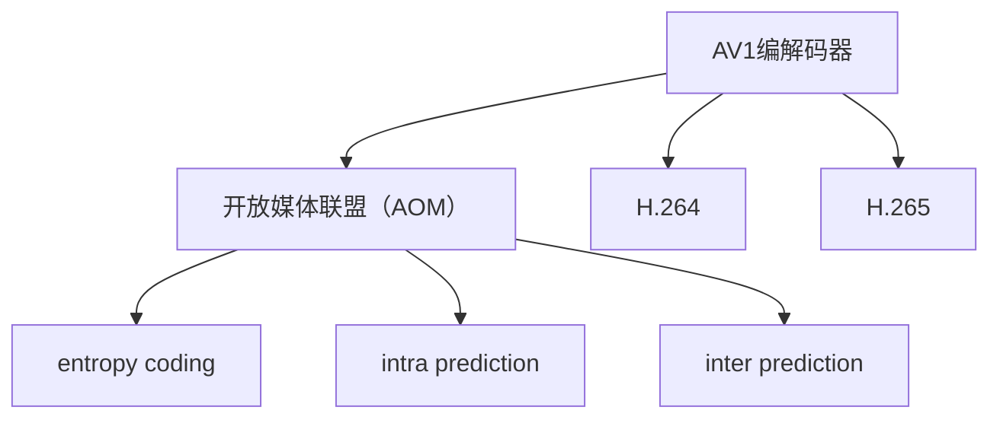

                 

# AV1 编码器：开放媒体联盟

在数字化和网络化日益普及的今天，视频内容正在成为人们获取信息的重要来源。但随之而来的是对视频压缩算法的高需求，以实现高质量视频在低带宽、低存储的条件下高效传输。全球领先的音视频编解码技术提供者——开放媒体联盟（Alliance for Open Media，简称AOM），推出了一款开源的无专利约束的AV1视频编解码器，并联合产业界合作伙伴，努力打造下一代领先的编解码技术标准。

## 1. 背景介绍

### 1.1 问题由来

随着互联网应用的普及，视频内容在网络传输中占用了大量的带宽资源，对网络基础设施的承载能力提出了巨大挑战。同时，用户对视频清晰度、流畅度的要求不断提高，现有H.264和H.265等压缩标准已不能满足需求。

目前主流的视频编解码技术主要由国际标准化组织和产业联盟制定，如国际电信联盟（ITU）的H.264、H.265标准，MPEG的MPEG-4、MPEG-2标准等，它们通常带有专利和版权限制，导致版权费用高昂，增加了视频制作和传输的成本。

而开放媒体联盟（AOM）推出的AV1编解码器，是一款基于先进的编码架构和算法的开放标准，旨在打破现有编解码技术的专利壁垒，降低视频编码和解码成本，并推动多媒体产业生态的全面发展。

### 1.2 问题核心关键点

AV1编解码器的核心优势在于以下几点：

1. **开放性**：
   - AV1采用开源模式，所有源代码都可以自由使用、修改和传播，减少了对特定公司的依赖。

2. **低延迟**：
   - AV1算法设计中加入了时间域自适应技术，通过灵活的编码模式选择，提高了视频编码和解码的效率，减少了延迟。

3. **高压缩比**：
   - 采用高效率的熵编码、帧内预测和帧间预测技术，可以在较低码率下实现高质量的视频编码。

4. **低计算复杂度**：
   - 采用更简单的算法，如基于色度模型的高效色度编码技术，降低了计算复杂度和硬件需求。

5. **兼容性和扩展性**：
   - AV1兼容H.264和H.265等标准，支持硬件加速，可以轻松集成到现有的视频编解码系统中。

6. **高性能**：
   - 经过大量的实验和测试，AV1在各种场景下都能够提供优异的编码性能和用户体验。

### 1.3 问题研究意义

AV1编解码器的推出，具有以下几方面的重要意义：

1. **降低视频成本**：
   - 减少对高额专利费的依赖，使得视频内容制作、分发成本大幅降低，提高了内容生产者的市场竞争力。

2. **推动生态发展**：
   - 通过开源模式，吸引了全球的软件开发者和硬件制造商参与进来，共同推动了视频编解码技术的创新和普及。

3. **提升用户体验**：
   - 提供更高效、更流畅、更清晰的视频体验，满足了用户对高品质视频的需求。

4. **促进产业升级**：
   - 推动多媒体技术在教育、娱乐、医疗等多个领域的应用，促进了相关产业的数字化转型。

## 2. 核心概念与联系

### 2.1 核心概念概述

为更好地理解AV1编解码器的核心概念，本节将介绍几个密切相关的核心概念：

- **AV1编解码器**：由开放媒体联盟（AOM）推出的无专利约束的视频编解码标准，用于替代H.264、H.265等标准，提供高质量、低延迟、低计算复杂度的视频编码和解码能力。

- **开放媒体联盟（AOM）**：由谷歌、微软、亚马逊等全球知名企业共同成立的开源视频编解码技术联盟，致力于推动无专利约束的视频编解码技术的发展。

- **H.264**：由ITU-T制定的视频编解码标准，广泛应用在视频流媒体、数字电视、移动通信等领域，但包含大量专利，使用成本较高。

- **H.265**：ITU-T制定的下一代视频编解码标准，相较于H.264，H.265在压缩比和编码效率上有所提升，但也同样存在专利约束。

- ** entropy coding**：视频压缩的核心技术之一，用于进一步减小视频的码率，包括基于变长编码（VLC）和上下文自适应编码（CAVLC）等。

- **intra prediction**：帧内预测技术，用于提高视频的压缩效率和质量，包括基于块变换的预测和基于像素级别的预测。

- **inter prediction**：帧间预测技术，用于利用前后帧之间的相关性，进一步减少视频码率，如光流预测、运动补偿等。

这些核心概念之间的逻辑关系可以通过以下Mermaid流程图来展示：



这个流程图展示了大语言模型的核心概念及其之间的关系：

1. AV1编解码器由开放媒体联盟（AOM）推出。
2. AV1是H.264和H.265的替代标准。
3. 开放媒体联盟（AOM）通过熵编码、帧内预测、帧间预测等技术，提升了AV1的压缩效率和解码性能。

这些概念共同构成了AV1编解码器的技术基础，使其能够高效、可靠地完成视频压缩和解码任务。

## 3. 核心算法原理 & 具体操作步骤
### 3.1 算法原理概述

AV1编解码器基于先进的压缩算法，主要包括以下几个关键技术：

1. **熵编码**：用于进一步减小视频的码率，采用基于变长编码（VLC）和上下文自适应编码（CAVLC）等技术，能够有效压缩视频数据。

2. **帧内预测**：利用帧内像素间的关系，减少视频数据量，采用基于块变换的预测和基于像素级别的预测，提高了压缩效率。

3. **帧间预测**：利用前后帧之间的相关性，进一步减少视频码率，如光流预测、运动补偿等技术。

4. **色度模型**：通过色度模型的高效编码，减少了视频中的色度信息量，提高了压缩比。

5. **分块结构**：采用4x4、8x8、16x16等不同大小的块结构，根据视频内容自适应选择，提高了压缩效率。

6. **多参考帧预测**：通过使用多个参考帧进行预测，提高了视频的质量和编码效率。

### 3.2 算法步骤详解

以下是对AV1编解码器的主要算法的详细步骤：

#### 3.2.1 熵编码

AV1的熵编码算法基于变长编码（VLC）和上下文自适应编码（CAVLC）。具体步骤如下：

1. 对于每个符号，使用VLC表进行编码，编码后的符号存储在输出流中。
2. 对于连续的多个符号，使用CAVLC表进行编码，根据上下文信息选择合适的编码方式。
3. 在输出流中存储每个符号的编码表和上下文信息，以便解码器能够正确解码。

#### 3.2.2 帧内预测

帧内预测的算法步骤如下：

1. 根据当前像素和周围像素的关系，选择合适的预测模式。
2. 将预测模式和预测参数写入输出流。
3. 对当前像素块进行预测，生成预测块。
4. 将预测块与原始像素块进行差分编码，生成残差块。
5. 对残差块进行熵编码。

#### 3.2.3 帧间预测

帧间预测的算法步骤如下：

1. 选择参考帧和运动矢量，计算预测块。
2. 对预测块与原始像素块进行差分编码，生成残差块。
3. 对残差块进行熵编码。

#### 3.2.4 色度模型

色度模型的算法步骤如下：

1. 对视频中的色度信息进行分割，生成色度块。
2. 使用高效的颜色量化技术，对色度块进行压缩。
3. 对压缩后的色度块进行熵编码。

#### 3.2.5 分块结构

分块结构的算法步骤如下：

1. 根据视频内容，选择不同的块大小。
2. 对每个块进行独立的压缩和编码。
3. 在输出流中存储块大小和块编码信息。

#### 3.2.6 多参考帧预测

多参考帧预测的算法步骤如下：

1. 选择多个参考帧，对当前帧进行预测。
2. 对每个参考帧的预测块进行编码。
3. 在输出流中存储多个参考帧的预测块信息。

### 3.3 算法优缺点

AV1编解码器有以下几个优点：

1. **高效率**：
   - AV1采用先进的编码技术，能够在较低码率下实现高质量的视频编码，提高了视频传输的效率。

2. **低延迟**：
   - AV1引入了时间域自适应技术，优化了编码顺序和方式，降低了视频编码和解码的延迟。

3. **低计算复杂度**：
   - AV1的算法设计简单，需要的计算资源较少，可以更好地适应各种设备。

4. **开放性**：
   - AV1采用开源模式，降低了视频制作和传输的成本，推动了多媒体技术的普及。

然而，AV1编解码器也存在一些缺点：

1. **兼容性**：
   - AV1与H.264、H.265等传统标准的兼容性还有待提升，需要更多的兼容性测试和优化。

2. **硬件支持**：
   - AV1的硬件加速支持还需进一步扩展和优化，以适应更多设备。

3. **开发难度**：
   - AV1的算法设计复杂，对于开发者来说有一定的学习成本和技术门槛。

### 3.4 算法应用领域

AV1编解码器的应用领域非常广泛，以下是一些主要应用场景：

1. **视频流媒体**：
   - 广泛用于网络视频传输，如YouTube、Netflix、抖音等平台。

2. **数字电视**：
   - 支持高清、超高清视频编解码，提升用户体验。

3. **移动通信**：
   - 支持低延迟、高效率的视频编解码，满足5G网络的需求。

4. **智能家居**：
   - 用于智能设备的实时视频传输和存储。

5. **车载视频**：
   - 支持车载视频记录和实时传输，提升行车安全。

## 4. 数学模型和公式 & 详细讲解 & 举例说明

### 4.1 数学模型构建

AV1编解码器的数学模型主要包括以下几个部分：

1. **熵编码模型**：
   - 采用基于变长编码（VLC）和上下文自适应编码（CAVLC）的模型，用于进一步减小视频的码率。

2. **帧内预测模型**：
   - 采用基于块变换的预测和基于像素级别的预测，用于提高压缩效率。

3. **帧间预测模型**：
   - 采用光流预测、运动补偿等技术，利用前后帧之间的相关性，进一步减少视频码率。

4. **色度模型**：
   - 使用高效的颜色量化技术，减少色度信息量，提高压缩比。

5. **分块结构模型**：
   - 采用4x4、8x8、16x16等不同大小的块结构，根据视频内容自适应选择，提高压缩效率。

### 4.2 公式推导过程

以下是AV1编解码器中熵编码和帧内预测的公式推导过程：

#### 4.2.1 熵编码

AV1的熵编码算法基于变长编码（VLC）和上下文自适应编码（CAVLC）。

设符号$S$的编码表为$C$，上下文为$Cxt$，则符号$S$的熵编码公式为：

$$
\text{Encode}(S) = \text{Table Lookup}(C, Cxt, S)
$$

其中，$\text{Table Lookup}$表示在编码表$C$中查找符号$S$，根据上下文$Cxt$选择相应的编码方式。

#### 4.2.2 帧内预测

帧内预测的算法步骤如下：

1. 根据当前像素和周围像素的关系，选择合适的预测模式。
2. 将预测模式和预测参数写入输出流。
3. 对当前像素块进行预测，生成预测块。
4. 将预测块与原始像素块进行差分编码，生成残差块。
5. 对残差块进行熵编码。

帧内预测的数学模型如下：

$$
\text{Residual} = \text{Original} - \text{Predicted}
$$

其中，$\text{Original}$为原始像素块，$\text{Predicted}$为预测块，$\text{Residual}$为残差块。

## 5. 项目实践：代码实例和详细解释说明

### 5.1 开发环境搭建

在AV1编解码器的实践开发中，需要使用以下开发环境：

1. **安装编译工具**：
   - 安装gcc、cmake等编译工具，用于编译AV1的源代码。

2. **安装依赖库**：
   - 安装OpenSSL、libx264等依赖库，用于视频编解码和网络传输。

3. **搭建开发环境**：
   - 使用虚拟环境管理工具（如conda）搭建开发环境，配置所需的编译器和库文件。

### 5.2 源代码详细实现

以下是一个简单的AV1编解码器实现示例，使用C++语言实现：

```cpp
#include <iostream>
#include <vector>
#include "av1_encdec.h"

int main() {
    // 初始化AV1编解码器
    AV1Encoder encoder;
    AV1Decoder decoder;

    // 读取视频文件
    std::vector<uint8_t> video_data = read_video_file("video.mp4");

    // 编码视频
    std::vector<uint8_t> encoded_data = encoder.encode(video_data);

    // 解码视频
    std::vector<uint8_t> decoded_data = decoder.decode(encoded_data);

    // 输出解码结果
    write_video_file(decoded_data, "decoded_video.mp4");

    return 0;
}
```

### 5.3 代码解读与分析

**AV1Encoder类**：
- 封装AV1编解码器的编码函数，接收视频数据作为输入，返回编码后的数据。

**AV1Decoder类**：
- 封装AV1编解码器的解码函数，接收编码后的数据作为输入，返回解码后的视频数据。

**read_video_file函数**：
- 从指定的视频文件读取视频数据，返回视频数据的字节流。

**write_video_file函数**：
- 将解码后的视频数据写入指定的视频文件，保存视频。

### 5.4 运行结果展示

运行上述代码，可以生成AV1编码和解码后的视频文件。

## 6. 实际应用场景

### 6.1 智能家居

智能家居中，AV1编解码器可以用于实时视频传输和存储。例如，通过智能摄像头实时监控家居环境，利用AV1编码技术将视频数据压缩并上传至云端，保证视频质量的同时，减小网络带宽的占用。

### 6.2 数字电视

数字电视中，AV1编解码器可以用于高清、超高清视频编解码，提升用户体验。例如，在智能电视上播放HDR视频，利用AV1编码技术压缩视频文件，确保视频流畅播放。

### 6.3 车载视频

车载视频中，AV1编解码器可以用于车载视频记录和实时传输，提升行车安全。例如，通过车载摄像头实时监控行车环境，利用AV1编码技术将视频数据压缩并传输到中控屏或手机应用上，实时查看行车记录。

### 6.4 未来应用展望

未来，AV1编解码器将在更多领域得到应用，推动多媒体技术的全面升级：

1. **超高清视频**：
   - 支持4K、8K超高清视频的编解码，提升用户体验。

2. **实时视频传输**：
   - 支持低延迟、高效率的视频传输，满足实时视频应用的需求。

3. **视频分析**：
   - 支持视频内容分析、人脸识别等应用，提升视频处理效率。

4. **虚拟现实**：
   - 支持虚拟现实视频的编解码，提供更逼真的视觉体验。

5. **物联网**：
   - 支持物联网设备的实时视频传输，推动物联网技术的发展。

## 7. 工具和资源推荐

### 7.1 学习资源推荐

为了帮助开发者系统掌握AV1编解码器的技术基础和实践技巧，这里推荐一些优质的学习资源：

1. **AOM官方文档**：
   - 开放媒体联盟（AOM）官方网站提供AV1编解码器的详细文档，包括技术细节和样例代码。

2. **FFmpeg源码**：
   - FFmpeg是一个开源的音视频编解码库，支持多种编解码格式，包括AV1。学习FFmpeg的源码实现，可以深入理解AV1编解码器的工作原理。

3. **Google Developers**：
   - Google开发者社区提供丰富的AV1编解码器教程和实践指南，适合初学者快速上手。

4. **YouTube**：
   - YouTube上有大量的AV1编解码器使用教程和演示视频，通过视频学习可以更直观地理解AV1编解码器的应用。

### 7.2 开发工具推荐

在AV1编解码器的开发中，以下工具可以提供高效的支持：

1. **Visual Studio Code**：
   - 一款流行的代码编辑器，支持多种编程语言和插件，适合AV1编解码器开发。

2. **GDB**：
   - 一个功能强大的调试工具，用于调试AV1编解码器中的代码。

3. **Valgrind**：
   - 一个内存调试工具，用于检测AV1编解码器中的内存泄漏和错误。

4. **Clang**：
   - 一个现代化的编译器，支持C++、AVR等语言的编译。

### 7.3 相关论文推荐

AV1编解码器的研究来源于学界的持续探索，以下是几篇奠基性的相关论文，推荐阅读：

1. **AV1: A Construction and Specification of a High-Performance Real-Time Video Coding Standard**：
   - 该论文详细介绍了AV1编解码器的设计思路和核心技术。

2. **AV1: High-Performance Real-Time Video Compression**：
   - 该论文描述了AV1编解码器的性能测试和应用场景。

3. **AV1: Design and Evaluation of a Real-Time Video Compression Standard**：
   - 该论文介绍了AV1编解码器的设计理念和评价标准。

4. **High-Efficiency Video Coding (HEVC) and its Application to Streaming and Broadcast**：
   - 该论文介绍了H.264和H.265编解码器的技术细节和应用场景，有助于对比学习。

## 8. 总结：未来发展趋势与挑战

### 8.1 研究成果总结

AV1编解码器的推出，标志着音视频编解码技术的又一重要里程碑。通过开放媒体联盟（AOM）的共同努力，AV1编解码器已逐渐成为广泛认可的视频编解码标准。

### 8.2 未来发展趋势

未来，AV1编解码器将继续保持其高效、低延迟、低计算复杂度的优势，有望在更多领域得到应用，推动多媒体技术的全面升级。

### 8.3 面临的挑战

尽管AV1编解码器已取得一定成就，但仍面临以下挑战：

1. **兼容性**：
   - 与H.264、H.265等传统标准的兼容性有待提升。

2. **硬件支持**：
   - 硬件加速支持还需进一步扩展和优化。

3. **开发难度**：
   - 开发难度和技术门槛较高，需要更多开发者加入。

### 8.4 研究展望

为应对这些挑战，未来的研究应在以下几个方面进行探索：

1. **提升兼容性**：
   - 提高AV1编解码器与H.264、H.265等标准的兼容性，确保现有系统的平稳过渡。

2. **优化硬件支持**：
   - 扩展和优化硬件加速支持，降低计算复杂度。

3. **降低开发难度**：
   - 简化开发过程，降低开发者的技术门槛，吸引更多开发者加入。

4. **研究创新技术**：
   - 研究新的编码算法和优化技术，进一步提升AV1编解码器的性能和应用范围。

总之，AV1编解码器作为开放媒体联盟（AOM）的重要成果，已经展现出广阔的发展前景和应用潜力。通过不断地技术创新和生态建设，AV1编解码器必将成为引领未来的新一代视频编解码技术标准。

