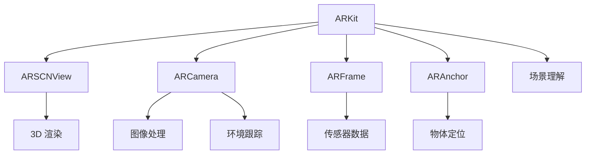

                 

# Apple ARKit：在 iOS 上的增强现实

> 关键词：增强现实 (AR)、ARKit、iOS、场景理解、图形处理、机器学习、数据跟踪、开发者工具、应用场景、交互设计、安全性

## 1. 背景介绍

### 1.1 问题由来

随着移动设备的普及和计算能力的提升，增强现实 (AR) 技术在教育、娱乐、医疗、工业等领域得到了广泛应用。苹果公司于 2017 年推出了 ARKit，成为推动 AR 发展的重要力量。ARKit 提供了一整套平台工具和框架，使得开发者能够轻松创建具有沉浸式体验的 AR 应用程序。

### 1.2 问题核心关键点

ARKit 的核心在于利用设备的传感器和摄像头，通过计算机视觉和机器学习技术，实现对现实世界的理解、物体识别、用户交互等。ARKit 集成了多种硬件和软件组件，包括视频捕捉、图像处理、手势识别、场景理解等，使得开发者可以更专注于应用逻辑的实现，而非底层技术细节。

ARKit 框架的关键组件包括：
- **ARSCNView**：用于渲染 3D 场景和物体，支持多视角和多帧渲染。
- **ARCamera**：提供摄像头和传感器数据，用于环境跟踪和姿态估计算法。
- **ARFrame**：表示 AR 环境中的具体时刻和位置，包括相机位置、旋转、光强等。
- **ARAnchor**：基于环境中的物理对象创建锚点，支持物体定位和跟踪。

## 2. 核心概念与联系

### 2.1 核心概念概述

ARKit 是苹果公司推出的增强现实开发框架，基于 iOS 平台，支持 AR 应用开发者进行跨平台开发。ARKit 依赖于设备传感器和摄像头，通过计算机视觉和机器学习技术，实现对现实世界的理解和交互。

ARKit 的核心概念包括：
- **增强现实 (AR)**：在现实世界之上叠加虚拟信息，实现虚拟物体与真实世界的互动。
- **ARKit**：苹果公司提供的增强现实开发框架，提供丰富的组件和工具。
- **计算机视觉 (CV)**：利用摄像头和传感器数据，进行图像识别、场景理解、物体追踪等。
- **场景理解 (SLAM)**：实现对环境的实时跟踪和重建，支持动态场景变化。
- **物体识别 (OI)**：识别现实世界中的物体，并对其进行分类、定位、追踪等。

这些概念之间的逻辑关系可以通过以下 Mermaid 流程图来展示：



这个流程图展示了几大核心概念之间的联系：
1. ARKit 框架中的组件。
2. ARKit 如何利用计算机视觉和机器学习技术实现环境跟踪、物体识别、场景理解等。
3. 各组件之间的协作关系。

## 3. 核心算法原理 & 具体操作步骤
### 3.1 算法原理概述

ARKit 的核心算法主要涉及计算机视觉和机器学习两个领域。其工作原理可以概括为以下几个步骤：

1. **环境跟踪**：通过摄像头和传感器数据，实时跟踪设备在现实世界中的位置和姿态。
2. **物体识别**：对环境中的物体进行分类和定位，支持动态变化。
3. **场景理解**：构建环境的 3D 模型，实现对场景的实时重建和动态变化。
4. **物体交互**：利用手势、触觉、语音等输入方式，实现与虚拟物体的互动。

ARKit 的算法原理主要基于以下几个技术：
- **SLAM (Simultaneous Localization and Mapping)**：同时定位与地图构建算法，用于实时跟踪设备和环境变化。
- **视觉SLAM**：通过摄像头捕捉图像，利用特征匹配和深度学习技术进行环境跟踪。
- **物体检测与跟踪**：利用深度学习模型对物体进行分类和定位，支持动态场景变化。
- **深度学习**：利用卷积神经网络等深度学习模型，实现对环境的快速理解和渲染。

### 3.2 算法步骤详解

以下是 ARKit 的算法步骤详细步骤：

**Step 1: 初始化 AR 环境**
- 创建 ARSCNView，设置设备传感器和相机属性。
- 初始化 ARCamera，获取设备传感器数据（如陀螺仪、加速度计）。
- 设置 ARFrame 的初始位置和旋转，以及光强和环境光照。

**Step 2: 环境跟踪**
- 在 ARCamera 中使用视觉 SLAM 算法，实时跟踪设备的位置和姿态。
- 利用传感器数据进行姿态估计算法，校正视觉 SLAM 的偏差。
- 更新 ARFrame 的位置和旋转，以便后续渲染和计算。

**Step 3: 物体识别**
- 利用卷积神经网络等深度学习模型，对环境中的物体进行分类和定位。
- 根据物体类别和位置，创建 ARAnchor，用于支持物体的定位和跟踪。
- 动态更新 ARAnchor 的位置和旋转，适应物体的移动。

**Step 4: 场景理解**
- 利用点云和深度学习技术，实时重建环境 3D 模型。
- 对环境进行纹理贴图和光照调整，增强场景的真实感。
- 支持动态场景变化，如建筑物拆除、物体移动等。

**Step 5: 物体交互**
- 使用手势识别和触觉反馈技术，实现与虚拟物体的互动。
- 通过语音识别技术，实现语音交互。
- 利用自然语言处理技术，理解用户意图并生成自然语言回复。

**Step 6: 渲染和显示**
- 在 ARSCNView 中使用 3D 渲染技术，将虚拟物体叠加到现实环境中。
- 支持多视角和多帧渲染，增强用户体验。
- 优化渲染性能，提高帧率和图像质量。

### 3.3 算法优缺点

ARKit 在 AR 应用开发中具有以下优点：
1. **跨平台支持**：基于 iOS 平台，支持多设备无缝协作，提高开发效率。
2. **易用性**：提供丰富的组件和工具，降低开发者技术门槛。
3. **性能优化**：支持多线程和 GPU 加速，提高渲染性能。
4. **丰富的 API**：提供多种 API，支持复杂交互和动态场景变化。

同时，ARKit 也存在一些缺点：
1. **依赖硬件**：高度依赖设备传感器和摄像头，设备性能和环境光照对应用效果影响较大。
2. **复杂性**：对环境跟踪和物体识别等算法的依赖性较强，算法实现较为复杂。
3. **扩展性**：对特定场景和物体支持有限，需针对不同应用进行定制化开发。
4. **交互限制**：手势识别和语音识别等交互方式对用户操作习惯和设备响应速度有一定要求。

### 3.4 算法应用领域

ARKit 的应用领域非常广泛，涵盖以下几个主要方面：

**教育领域**：利用 AR 技术创建虚拟教室和实验室，增强教学互动和实践体验。

**娱乐领域**：开发 AR 游戏和虚拟体验，如《Pokémon GO》和《AR扩展现实应用》。

**医疗领域**：利用 AR 技术进行手术模拟和培训，提高医疗技能。

**工业领域**：支持 AR 设备维修和维护，增强设备管理效率。

**房地产领域**：创建虚拟房间和场景，支持用户进行虚拟看房。

**营销领域**：利用 AR 技术增强品牌互动，如 AR 广告和虚拟展示。

## 4. 数学模型和公式 & 详细讲解  
### 4.1 数学模型构建

ARKit 的数学模型主要基于计算机视觉和深度学习技术。以下将介绍其中几个关键的数学模型：

**3D 变换矩阵**：用于表示设备在现实世界中的位置和姿态，包括平移和旋转。

**透视投影**：用于将 3D 场景转换为 2D 图像，增强场景的透视效果和空间感。

**卷积神经网络 (CNN)**：用于对图像进行分类和定位，支持物体识别和场景理解。

**深度学习框架**：用于训练卷积神经网络等深度学习模型，实现对环境的快速理解和渲染。

### 4.2 公式推导过程

以下是几个关键数学公式的推导过程：

**3D 变换矩阵**：

设设备在现实世界中的位置为 $(x,y,z)$，旋转矩阵为 $R$，则 3D 变换矩阵 $T$ 可以表示为：

$$
T = \begin{bmatrix}
R & \mathbf{t} \\
0 & 1
\end{bmatrix}
$$

其中 $R$ 表示旋转矩阵，$\mathbf{t}$ 表示平移向量。

**透视投影**：

设设备的投影矩阵为 $P$，图像尺寸为 $(w,h)$，则透视投影公式为：

$$
P = \frac{1}{z} \begin{bmatrix}
f & 0 & 0 & 0 \\
0 & f & 0 & 0 \\
0 & 0 & f & 0 \\
0 & 0 & 0 & 1
\end{bmatrix}
$$

其中 $f$ 表示焦距，$z$ 表示深度。

**卷积神经网络 (CNN)**：

卷积神经网络由多个卷积层、池化层和全连接层组成，用于对图像进行特征提取和分类。

**深度学习框架**：

深度学习框架如 TensorFlow 和 PyTorch，提供了丰富的 API 和工具，用于训练和优化深度学习模型。

### 4.3 案例分析与讲解

以一个简单的 AR 应用为例，说明其工作原理和数学模型的应用：

**应用场景**：创建一个简单的 AR 应用，将虚拟玩具叠加到现实环境中。

**实现步骤**：
1. 创建 ARSCNView，设置设备传感器和相机属性。
2. 初始化 ARCamera，获取设备传感器数据。
3. 在 ARCamera 中使用视觉 SLAM 算法，实时跟踪设备的位置和姿态。
4. 利用卷积神经网络对图像进行分类和定位，创建 ARAnchor。
5. 利用透视投影将 3D 场景转换为 2D 图像，增强场景的透视效果和空间感。
6. 在 ARSCNView 中使用 3D 渲染技术，将虚拟玩具叠加到现实环境中。

## 5. 项目实践：代码实例和详细解释说明
### 5.1 开发环境搭建

要进行 ARKit 应用开发，首先需要准备好开发环境。以下是使用 Xcode 和 Swift 进行 ARKit 应用开发的流程：

1. 安装 Xcode：从官网下载并安装 Xcode，创建新的 iOS 项目。
2. 选择 AR 应用程序模板：选择 ARKit 应用程序模板，并设置应用名称和界面。
3. 引入 ARKit 框架：在 Xcode 项目中添加 ARKit 框架。
4. 导入模型和资源：导入 3D 模型和纹理资源，用于场景渲染和虚拟物体展示。
5. 配置相机和传感器：在 Xcode 中设置相机属性和传感器数据，用于环境跟踪和姿态估计算法。

完成上述步骤后，即可在 Xcode 中进行 ARKit 应用开发。

### 5.2 源代码详细实现

下面我们以一个简单的 AR 应用为例，给出使用 Swift 和 ARKit 进行虚拟玩具叠加的代码实现。

```swift
import UIKit
import ARKit

class ViewController: UIViewController, ARSCNViewDelegate {
    var sceneView: ARSCNView!
    
    override func viewDidLoad() {
        super.viewDidLoad()
        sceneView = ARSCNView(frame: view.bounds)
        sceneView.delegate = self
        // 设置场景环境
        let camera = ARCamera()
        let frame = ARFrame(position: CGPoint(x: 0.0, y: 0.0), orientation: Quaternion(0, 0, 0, 1), light: ARLightColorTemperature(whiteBalance: 2000.0, timeOfDay: 10.0))
        // 创建虚拟玩具
        let toy = createToy()
        // 将虚拟玩具添加到场景
        sceneView.scene.rootNode.addChildNode(toy)
    }
    
    func createToy() -> SCNNode {
        // 加载 3D 模型
        let model = SCNScene(url: Bundle.main.resourceURL(forResource: "toy", ofType: "dae")!)
        let rootNode = model.rootNode
        // 设置虚拟玩具的位置和旋转
        rootNode.position = CGPoint(x: 0.0, y: 0.0, z: 0.0)
        rootNode.rotation = Quaternion(w: 0, x: 0, y: 0, z: 1)
        return rootNode
    }
    
    func sceneView(_ sceneView: ARSCNView, frame: ARFrame) {
        // 更新相机和传感器数据
        sceneView.camera = camera
        sceneView.scene.pointOfView = camera
    }
}

// 应用入口
@UIApplicationMain
func applicationMain(_ argc: Int32, argv: [String]) {
    Application.run(new: ViewController())
}
```

以上是使用 Swift 和 ARKit 进行虚拟玩具叠加的完整代码实现。可以看到，通过简单的代码，即可在 iOS 设备上创建虚拟玩具，并将其叠加到现实环境中。

### 5.3 代码解读与分析

让我们再详细解读一下关键代码的实现细节：

**ViewController 类**：
- `viewDidLoad`方法：初始化 ARSCNView，设置相机和场景环境，创建虚拟玩具，并将其添加到场景中。
- `createToy`方法：加载 3D 模型，并设置虚拟玩具的位置和旋转。

**ARKit 框架**：
- `ARSCNView`：用于渲染 3D 场景和物体，支持多视角和多帧渲染。
- `ARCamera`：提供摄像头和传感器数据，用于环境跟踪和姿态估计算法。
- `ARFrame`：表示 AR 环境中的具体时刻和位置，包括相机位置、旋转、光强等。
- `ARAnchor`：基于环境中的物理对象创建锚点，支持物体定位和跟踪。

**Swift 语言**：
- 通过 Swift 语言，利用 ARKit 框架提供的组件和工具，实现虚拟玩具的叠加和交互。

## 6. 实际应用场景
### 6.1 智能教育

在教育领域，ARKit 可以用于创建虚拟教室和实验室，增强教学互动和实践体验。例如，利用 AR 技术创建虚拟实验，学生可以在虚拟环境中进行科学实验，并通过触觉和语音交互，获取实时反馈和指导。

**应用场景**：
- 虚拟化学实验：学生可以在虚拟实验室中进行操作，观察实验结果，记录实验过程。
- 虚拟解剖实验：学生可以通过触觉交互，探索人体结构和功能，增强学习效果。
- 虚拟物理实验：学生可以模拟物理实验，验证物理定律和原理。

**技术实现**：
- 创建虚拟实验场景，支持 3D 模型和纹理渲染。
- 利用手势识别和触觉反馈技术，实现实验操作和交互。
- 使用语音识别技术，记录学生的操作和反馈，提供实时指导。

### 6.2 娱乐游戏

在娱乐游戏领域，ARKit 可以用于开发 AR 游戏和虚拟体验，提升玩家沉浸感和互动体验。例如，利用 AR 技术创建虚拟角色和场景，玩家可以在虚拟世界中自由探索和互动。

**应用场景**：
- 虚拟角色扮演游戏：玩家可以在虚拟世界中扮演不同角色，完成任务和挑战。
- 虚拟冒险游戏：玩家可以在虚拟环境中探索未知领域，解开谜题和谜语。
- 虚拟运动游戏：玩家可以通过体感控制器，进行虚拟运动和冒险。

**技术实现**：
- 创建虚拟角色和场景，支持 3D 模型和纹理渲染。
- 利用手势识别和体感控制器，实现角色操作和交互。
- 使用自然语言处理技术，提供任务和谜语提示，增强互动性。

### 6.3 医疗诊断

在医疗诊断领域，ARKit 可以用于辅助手术模拟和培训，提高医疗技能和手术效果。例如，利用 AR 技术创建虚拟手术室，医生可以在虚拟环境中进行手术操作，并通过反馈系统进行技能训练和评估。

**应用场景**：
- 虚拟手术室：医生可以在虚拟手术室中进行手术操作，学习手术技巧和流程。
- 手术模拟培训：医生可以通过虚拟手术操作，提高手术技能和准确性。
- 手术效果评估：医生可以通过虚拟手术操作，评估手术效果和风险。

**技术实现**：
- 创建虚拟手术室场景，支持 3D 模型和纹理渲染。
- 利用手势识别和体感控制器，实现手术操作和反馈。
- 使用深度学习技术，评估手术效果和风险，提供实时指导。

### 6.4 工业制造

在工业制造领域，ARKit 可以用于支持 AR 设备维修和维护，增强设备管理效率。例如，利用 AR 技术创建虚拟设备模型，工程师可以在虚拟环境中进行维修操作，并通过反馈系统进行技能培训和评估。

**应用场景**：
- 虚拟设备维修：工程师可以在虚拟环境中进行设备维修，学习维修技巧和流程。
- 设备维护培训：工程师可以通过虚拟设备维修，提高设备维护技能和准确性。
- 设备状态评估：工程师可以通过虚拟维修操作，评估设备状态和故障。

**技术实现**：
- 创建虚拟设备模型，支持 3D 模型和纹理渲染。
- 利用手势识别和体感控制器，实现维修操作和反馈。
- 使用深度学习技术，评估设备状态和故障，提供实时指导。

### 6.5 房地产销售

在房地产销售领域，ARKit 可以用于创建虚拟房间和场景，支持用户进行虚拟看房。例如，利用 AR 技术创建虚拟房产模型，用户可以在虚拟环境中自由浏览和互动，增强购房体验和决策效果。

**应用场景**：
- 虚拟房产展示：用户可以在虚拟环境中浏览房产模型，了解房屋布局和功能。
- 虚拟房间漫游：用户可以在虚拟环境中自由漫游，感受房屋环境和氛围。
- 虚拟房产咨询：用户可以通过语音交互，咨询房产信息和问题。

**技术实现**：
- 创建虚拟房产模型，支持 3D 模型和纹理渲染。
- 利用手势识别和语音识别技术，实现房间漫游和咨询。
- 使用自然语言处理技术，提供房产信息和咨询服务，增强用户体验。

## 7. 工具和资源推荐
### 7.1 学习资源推荐

为了帮助开发者系统掌握 ARKit 的理论基础和实践技巧，这里推荐一些优质的学习资源：

1. **ARKit 官方文档**：苹果公司提供的 ARKit 官方文档，详细介绍了 ARKit 框架的使用方法和 API。
2. **ARKit 视频教程**：Udemy 和 Coursera 等平台提供的 ARKit 视频教程，适合初学者快速上手。
3. **ARKit 书籍**：《苹果 ARKit 实战指南》等书籍，提供详细的 ARKit 开发实践和案例分析。
4. **ARKit 社区论坛**：Stack Overflow 和 GitHub 等社区论坛，提供开发者交流和分享的平台。

通过对这些资源的学习实践，相信你一定能够快速掌握 ARKit 的开发技术和应用场景。

### 7.2 开发工具推荐

高效的开发离不开优秀的工具支持。以下是几款用于 ARKit 开发常用的工具：

1. **Xcode**：苹果公司提供的开发环境，支持 iOS 应用程序开发，支持 ARKit 框架的集成。
2. **Swift Playgrounds**：苹果公司提供的 Swift 开发工具，支持 ARKit 框架的快速原型开发。
3. **Unity 引擎**：支持 ARKit 框架的 3D 渲染和场景构建，适合复杂应用开发。
4. **Vision Framework**：苹果公司提供的计算机视觉框架，支持图像处理和物体识别。

合理利用这些工具，可以显著提升 ARKit 应用的开发效率，加快创新迭代的步伐。

### 7.3 相关论文推荐

ARKit 技术的发展源于学界的持续研究。以下是几篇奠基性的相关论文，推荐阅读：

1. **ARKit 官方论文**：苹果公司发布的 ARKit 框架技术白皮书，详细介绍 ARKit 的实现原理和应用场景。
2. **计算机视觉与 AR 技术综述**：综述计算机视觉和 AR 技术的发展历程和应用场景，提供全面的理论基础。
3. **深度学习与 AR 技术结合**：探讨深度学习技术在 AR 应用中的融合应用，提升 AR 应用的智能化水平。

这些论文代表了大语言模型微调技术的发展脉络。通过学习这些前沿成果，可以帮助研究者把握学科前进方向，激发更多的创新灵感。

## 8. 总结：未来发展趋势与挑战

### 8.1 总结

本文对 ARKit 进行了全面系统的介绍。首先阐述了 ARKit 在 iOS 平台上的应用背景和核心关键点，明确了 AR 技术在教育、娱乐、医疗等领域的独特价值。其次，从原理到实践，详细讲解了 ARKit 的算法步骤和关键技术，给出了 AR 应用开发的完整代码实例。同时，本文还广泛探讨了 ARKit 在多个行业领域的应用前景，展示了 ARKit 框架的强大潜力和广泛应用场景。

通过本文的系统梳理，可以看到，ARKit 技术正在成为推动 AR 应用发展的重要力量，极大地拓展了 AR 应用在各个领域的应用边界，为传统行业带来了变革性影响。未来，伴随 ARKit 技术的不断演进和深度学习技术的持续进步，AR 技术必将在更广阔的应用领域大放异彩，深刻影响人类的生产生活方式。

### 8.2 未来发展趋势

展望未来，ARKit 技术将呈现以下几个发展趋势：

1. **跨平台支持**：支持更多设备和平台，实现跨设备和跨系统的无缝协作。
2. **增强现实体验**：提升用户的沉浸感和交互体验，增强虚拟物体和现实环境的互动。
3. **个性化应用**：根据用户需求和偏好，提供个性化和定制化的 AR 应用。
4. **实时计算优化**：优化计算性能和资源利用，提升渲染速度和系统响应。
5. **多模态融合**：结合语音、体感、触觉等多种交互方式，提供全面的用户交互体验。

以上趋势凸显了 ARKit 技术的广阔前景。这些方向的探索发展，必将进一步提升 AR 应用系统的性能和用户体验，为人类认知智能的进化带来深远影响。

### 8.3 面临的挑战

尽管 ARKit 技术已经取得了瞩目成就，但在迈向更加智能化、普适化应用的过程中，它仍面临着诸多挑战：

1. **硬件依赖性**：高度依赖设备传感器和摄像头，设备性能和环境光照对应用效果影响较大。
2. **算法复杂性**：对环境跟踪和物体识别等算法的依赖性较强，算法实现较为复杂。
3. **扩展性限制**：对特定场景和物体支持有限，需针对不同应用进行定制化开发。
4. **用户交互限制**：手势识别和语音识别等交互方式对用户操作习惯和设备响应速度有一定要求。
5. **安全性问题**：AR 应用可能面临数据隐私和安全风险，需要加强数据保护和用户隐私保护。

正视 ARKit 面临的这些挑战，积极应对并寻求突破，将是大语言模型微调走向成熟的必由之路。相信随着学界和产业界的共同努力，这些挑战终将一一被克服，ARKit 技术必将在构建人机协同的智能时代中扮演越来越重要的角色。

### 8.4 研究展望

面对 ARKit 技术所面临的种种挑战，未来的研究需要在以下几个方面寻求新的突破：

1. **多传感器融合**：结合摄像头、传感器、GPS 等多种设备，提升环境跟踪和姿态估计算法的准确性。
2. **智能渲染优化**：优化渲染算法和纹理贴图技术，提高虚拟物体的真实感和渲染性能。
3. **用户交互创新**：探索更多交互方式和设备，增强用户互动体验，支持多模态交互。
4. **安全性和隐私保护**：加强数据保护和用户隐私保护，确保 AR 应用的安全性和可信度。
5. **跨领域融合**：结合自然语言处理、计算机视觉、增强现实等多种技术，实现多领域应用的协同创新。

这些研究方向的探索，必将引领 ARKit 技术迈向更高的台阶，为构建安全、可靠、可解释、可控的智能系统铺平道路。面向未来，ARKit 技术还需要与其他人工智能技术进行更深入的融合，如知识表示、因果推理、强化学习等，多路径协同发力，共同推动增强现实技术的进步。只有勇于创新、敢于突破，才能不断拓展增强现实技术的边界，让智能技术更好地造福人类社会。

## 9. 附录：常见问题与解答

**Q1：ARKit 是否支持跨平台开发？**

A: ARKit 是基于 iOS 平台的技术，目前主要支持 iOS 设备，不支持跨平台开发。但可以通过模拟和虚拟现实等技术，将 ARKit 应用移植到其他平台。

**Q2：ARKit 是否支持多设备协作？**

A: ARKit 支持多设备协作，可以通过多设备之间的通信和协作，实现更加复杂和互动的 AR 应用。

**Q3：ARKit 如何处理动态场景变化？**

A: ARKit 利用 SLAM 算法，实时跟踪设备的位置和姿态，支持动态场景变化。同时，利用卷积神经网络等深度学习模型，对动态环境进行快速理解和渲染。

**Q4：ARKit 如何提升用户体验？**

A: ARKit 提供多种交互方式，如手势识别、触觉反馈、语音识别等，提升用户的沉浸感和交互体验。同时，支持多视角和多帧渲染，增强虚拟物体和现实环境的互动。

**Q5：ARKit 如何保护用户隐私和数据安全？**

A: ARKit 利用差分隐私、加密传输等技术，保护用户隐私和数据安全。同时，加强对用户数据的控制和访问权限管理，确保数据使用的透明性和合规性。

通过本文的系统梳理，可以看到，ARKit 技术正在成为推动 AR 应用发展的重要力量，极大地拓展了 AR 应用在各个领域的应用边界，为传统行业带来了变革性影响。未来，伴随 ARKit 技术的不断演进和深度学习技术的持续进步，AR 技术必将在更广阔的应用领域大放异彩，深刻影响人类的生产生活方式。

