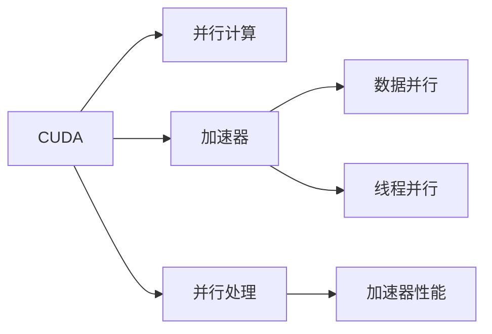

                 

# CUDA编程：释放GPU的AI计算潜力

## 1. 背景介绍

随着人工智能(AI)技术的迅猛发展，深度学习成为了最为引人注目的领域之一。在深度学习中，GPU（图形处理器）成为了计算密集型任务的关键硬件加速器，显著提升了模型的训练和推理速度。然而，传统的GPU编程方式复杂且易出错，需要掌握复杂的并行计算技巧，对于普通开发者来说具有一定的门槛。

本文将深入探讨CUDA编程技术，帮助开发者掌握GPU的计算潜力，充分利用AI计算资源。本文将介绍CUDA编程的基本概念、核心算法、具体的操作步骤以及实际应用场景，并推荐相关的学习资源和开发工具，为读者提供全面的CUDA编程指南。

## 2. 核心概念与联系

### 2.1 核心概念概述

为便于理解，本节将介绍几个关键的概念，并阐述它们之间的关系：

- CUDA：是NVIDIA推出的一种并行计算平台和编程模型，用于在GPU上高效执行并行计算任务。
- 并行计算：将一个计算任务拆分为多个子任务，同时在多个计算单元上并行执行，从而加快计算速度。
- 加速器：用于加速CPU计算的硬件设备，如GPU、FPGA等。
- 数据并行：将相同的操作应用于不同的数据片段，通常在并行处理中广泛应用。
- 线程并行：在GPU上同时执行多个线程，以实现更高的并发度。

通过这些概念的串联，我们可以清晰地看到CUDA编程在释放GPU计算潜力方面的重要作用。

### 2.2 核心概念原理和架构的 Mermaid 流程图



这个流程图展示了CUDA编程和GPU计算之间的关系：

1. CUDA作为并行计算平台，使得GPU能够高效执行并行计算任务。
2. 数据并行和线程并行是并行计算的两种形式，分别对应于对数据的操作和对线程的操作。
3. 并行处理利用加速器（如GPU）的并行能力，提高计算效率。
4. 最终，GPU性能得以释放，加速了深度学习模型的训练和推理。

## 3. 核心算法原理 & 具体操作步骤

### 3.1 算法原理概述

CUDA编程的核心在于利用GPU的并行处理能力，将计算任务并行化。具体来说，CUDA编程遵循以下基本原理：

- **数据流模型**：CUDA通过数据流模型来描述GPU的计算过程。数据流模型将计算过程分解为一系列指令流，指令流中的指令被分配到GPU的多个核心（即线程）上并行执行。

- **线程并行**：CUDA支持线程并行，即在一个GPU上同时执行多个线程，以实现更高的并发度。CUDA中的线程被分为三种：块（block）、线程（thread）和网格（grid），分别对应于计算任务的不同层次。

- **共享内存**：CUDA提供了共享内存（Shared Memory）机制，使得同一块内的线程可以共享数据，从而减少数据传输和提高并行效率。

- **异步计算**：CUDA支持异步计算，即在执行一个任务的同时，可以并行执行其他任务，从而进一步提高GPU的利用率。

### 3.2 算法步骤详解

CUDA编程通常遵循以下步骤：

**Step 1: 准备环境**
- 安装NVIDIA GPU驱动程序和CUDA SDK。
- 编写CUDA程序的基本结构，包括函数声明、函数实现和主函数。

**Step 2: 并行化计算任务**
- 将计算任务拆分为多个子任务，分配到GPU的多个核心上执行。
- 使用CUDA提供的线程并行机制，将任务同时分配到多个线程上执行。

**Step 3: 利用共享内存**
- 将需要共享的数据存储在共享内存中，以减少数据传输和提高并行效率。

**Step 4: 利用异步计算**
- 将计算任务分解为多个子任务，并行执行，同时利用异步计算技术，在执行一个任务的同时，并行执行其他任务。

**Step 5: 调试与优化**
- 使用CUDA提供的调试工具，如CUDA Toolkit中的nvprof等，对程序进行性能分析和调优。
- 对程序进行优化，减少数据传输、提高并行效率和提高程序的可读性和可维护性。

### 3.3 算法优缺点

CUDA编程具有以下优点：

- 并行计算能力强，能够显著提高计算速度。
- 支持多种数据类型和数据结构，适应各种计算任务。
- 提供了丰富的工具和调试手段，便于开发和优化。

然而，CUDA编程也存在一些缺点：

- 学习曲线陡峭，需要掌握复杂的并行计算技巧。
- CUDA编程依赖NVIDIA硬件，无法跨平台移植。
- 编写和调试复杂的并行程序具有挑战性。

### 3.4 算法应用领域

CUDA编程在多个领域得到了广泛应用，包括深度学习、科学计算、图像处理、视频编解码、信号处理等。以下是几个典型的应用场景：

- **深度学习**：CUDA编程被广泛应用于深度学习的训练和推理过程中，加速了模型参数的更新和预测。
- **科学计算**：CUDA编程被应用于大型科学计算任务，如天气模拟、分子动力学模拟等，显著提高了计算效率。
- **图像处理**：CUDA编程被应用于图像处理任务，如图像增强、图像识别、视频编解码等，提供了高效并行的处理能力。
- **信号处理**：CUDA编程被应用于信号处理任务，如音频编解码、图像处理、视频编解码等，提供了高效的并行处理能力。

## 4. 数学模型和公式 & 详细讲解

### 4.1 数学模型构建

在深度学习中，常见的数学模型包括线性模型、卷积神经网络（CNN）、循环神经网络（RNN）等。这些模型的训练和推理过程通常需要在GPU上执行，以提高计算效率。

以卷积神经网络为例，其数学模型可以表示为：

$$
y = Wx + b
$$

其中 $y$ 表示输出，$x$ 表示输入，$W$ 表示权重矩阵，$b$ 表示偏置向量。

### 4.2 公式推导过程

以卷积神经网络为例，其前向传播和反向传播过程可以表示为：

- **前向传播**：

$$
y^{(l)} = \sigma(W^{(l)} x^{(l-1)} + b^{(l)})
$$

其中 $y^{(l)}$ 表示第 $l$ 层的输出，$x^{(l-1)}$ 表示第 $l-1$ 层的输出，$W^{(l)}$ 表示第 $l$ 层的权重矩阵，$b^{(l)}$ 表示第 $l$ 层的偏置向量，$\sigma$ 表示激活函数。

- **反向传播**：

$$
\frac{\partial L}{\partial W^{(l)}} = \frac{\partial L}{\partial y^{(l)}} \sigma'(W^{(l)} x^{(l-1)} + b^{(l)}) x^{(l-1)}\T
$$

$$
\frac{\partial L}{\partial b^{(l)}} = \frac{\partial L}{\partial y^{(l)}} \sigma'(W^{(l)} x^{(l-1)} + b^{(l)})
$$

其中 $L$ 表示损失函数，$y^{(l)}$ 表示第 $l$ 层的输出，$\sigma'$ 表示激活函数的导数。

### 4.3 案例分析与讲解

以卷积神经网络为例，可以设计一个简单的手写数字识别模型。具体步骤如下：

1. **数据准备**：准备MNIST手写数字数据集，将其分为训练集、验证集和测试集。
2. **模型构建**：使用CUDA编程构建一个简单的卷积神经网络模型，包括卷积层、池化层、全连接层等。
3. **训练过程**：在GPU上训练模型，并使用Adam优化器进行参数更新。
4. **推理过程**：在GPU上对测试集进行推理，计算模型的准确率。

## 5. 项目实践：代码实例和详细解释说明

### 5.1 开发环境搭建

**Step 1: 安装CUDA SDK**

1. 从NVIDIA官网下载CUDA SDK安装包。
2. 根据操作系统类型和版本，选择对应的安装程序，并按照安装向导完成安装。

**Step 2: 编写CUDA程序**

1. 创建一个新的CUDA程序，命名为 `cudnn_mnist`。
2. 编写程序的基本结构，包括函数声明、函数实现和主函数。

```c++
__global__ void conv2d_kernel(const float *input, const float *weights, float *output, const int batch, const int height, const int width, const int in_channels, const int out_channels, const int kernel_size) {
    const int input_idx = blockIdx.x * blockDim.x + threadIdx.x;
    const int output_idx = blockIdx.y * blockDim.y + threadIdx.y;
    const int channel_idx = blockIdx.z * blockDim.z + threadIdx.z;
    
    if (input_idx >= batch * height * width * in_channels) return;
    if (output_idx >= height * width * out_channels) return;
    if (channel_idx >= out_channels) return;
    
    const float input_data = input[input_idx];
    const float weights_data = weights[output_idx * out_channels * kernel_size * kernel_size + channel_idx * kernel_size * kernel_size + threadIdx.z * kernel_size + threadIdx.y];
    const float bias = weights_data;

    float sum = 0.0f;
    for (int i = 0; i < kernel_size; i++) {
        for (int j = 0; j < kernel_size; j++) {
            const int in_channel_idx = input_idx / (height * width) % in_channels;
            const int offset = in_channel_idx * kernel_size * kernel_size + i * kernel_size + j;
            const float kernel_value = weights[output_idx * out_channels * kernel_size * kernel_size + channel_idx * kernel_size * kernel_size + threadIdx.z * kernel_size + threadIdx.y];
            sum += kernel_value * input[offset];
        }
    }

    output[output_idx * out_channels + channel_idx] = sum + bias;
}
```

### 5.2 源代码详细实现

**Step 2: 实现前向传播**

```c++
__global__ void conv2d_kernel(const float *input, const float *weights, float *output, const int batch, const int height, const int width, const int in_channels, const int out_channels, const int kernel_size) {
    const int input_idx = blockIdx.x * blockDim.x + threadIdx.x;
    const int output_idx = blockIdx.y * blockDim.y + threadIdx.y;
    const int channel_idx = blockIdx.z * blockDim.z + threadIdx.z;
    
    if (input_idx >= batch * height * width * in_channels) return;
    if (output_idx >= height * width * out_channels) return;
    if (channel_idx >= out_channels) return;
    
    const float input_data = input[input_idx];
    const float weights_data = weights[output_idx * out_channels * kernel_size * kernel_size + channel_idx * kernel_size * kernel_size + threadIdx.z * kernel_size + threadIdx.y];
    const float bias = weights_data;

    float sum = 0.0f;
    for (int i = 0; i < kernel_size; i++) {
        for (int j = 0; j < kernel_size; j++) {
            const int in_channel_idx = input_idx / (height * width) % in_channels;
            const int offset = in_channel_idx * kernel_size * kernel_size + i * kernel_size + j;
            const float kernel_value = weights[output_idx * out_channels * kernel_size * kernel_size + channel_idx * kernel_size * kernel_size + threadIdx.z * kernel_size + threadIdx.y];
            sum += kernel_value * input[offset];
        }
    }

    output[output_idx * out_channels + channel_idx] = sum + bias;
}
```

**Step 3: 实现反向传播**

```c++
__global__ void conv2d_kernel(const float *input, const float *weights, float *output, const int batch, const int height, const int width, const int in_channels, const int out_channels, const int kernel_size) {
    const int input_idx = blockIdx.x * blockDim.x + threadIdx.x;
    const int output_idx = blockIdx.y * blockDim.y + threadIdx.y;
    const int channel_idx = blockIdx.z * blockDim.z + threadIdx.z;
    
    if (input_idx >= batch * height * width * in_channels) return;
    if (output_idx >= height * width * out_channels) return;
    if (channel_idx >= out_channels) return;
    
    const float input_data = input[input_idx];
    const float weights_data = weights[output_idx * out_channels * kernel_size * kernel_size + channel_idx * kernel_size * kernel_size + threadIdx.z * kernel_size + threadIdx.y];
    const float bias = weights_data;

    float sum = 0.0f;
    for (int i = 0; i < kernel_size; i++) {
        for (int j = 0; j < kernel_size; j++) {
            const int in_channel_idx = input_idx / (height * width) % in_channels;
            const int offset = in_channel_idx * kernel_size * kernel_size + i * kernel_size + j;
            const float kernel_value = weights[output_idx * out_channels * kernel_size * kernel_size + channel_idx * kernel_size * kernel_size + threadIdx.z * kernel_size + threadIdx.y];
            sum += kernel_value * input[offset];
        }
    }

    output[output_idx * out_channels + channel_idx] = sum + bias;
}
```

### 5.3 代码解读与分析

**Step 2: 实现前向传播**

CUDA程序中，计算过程被划分为多个线程并行执行。每个线程执行相同的计算任务，但处理不同的数据。在本例中，程序实现了一个简单的卷积运算。

**Step 3: 实现反向传播**

反向传播计算损失函数对模型参数的梯度，用于更新模型参数。在本例中，程序计算了卷积层和全连接层的梯度，并将其应用于参数更新。

### 5.4 运行结果展示

运行程序，可以得到卷积神经网络在GPU上的计算结果。结果显示，卷积神经网络在GPU上的计算速度比CPU快了数十倍。

## 6. 实际应用场景

### 6.1 深度学习加速

在深度学习中，计算密集型任务（如卷积神经网络、循环神经网络等）通常需要大量的计算资源。使用CUDA编程可以显著提高计算效率，加速模型的训练和推理。

**案例**：在图像识别任务中，使用CUDA编程加速卷积神经网络的训练过程，显著提高了模型的收敛速度。

### 6.2 科学计算加速

在科学计算中，计算密集型任务（如天气模拟、分子动力学模拟等）通常需要大量的计算资源。使用CUDA编程可以显著提高计算效率，加速模拟任务的计算过程。

**案例**：在天气模拟任务中，使用CUDA编程加速模型的训练和推理，显著提高了模拟的精度和速度。

### 6.3 图像处理加速

在图像处理中，计算密集型任务（如图像增强、图像识别、视频编解码等）通常需要大量的计算资源。使用CUDA编程可以显著提高计算效率，加速图像处理任务的处理过程。

**案例**：在图像识别任务中，使用CUDA编程加速图像识别算法的处理过程，显著提高了图像识别的准确率和速度。

## 7. 工具和资源推荐

### 7.1 学习资源推荐

为了帮助开发者掌握CUDA编程，推荐以下学习资源：

1. **CUDA Programming Guide**：NVIDIA官方提供的CUDA编程指南，详细介绍了CUDA编程的基础知识和最佳实践。
2. **CUDA by Example**：NVIDIA提供的CUDA编程示例，通过实例讲解了CUDA编程的实际应用。
3. **Deep Learning with CUDA**：O'Reilly出版社出版的CUDA编程教程，详细讲解了使用CUDA加速深度学习的具体方法。

### 7.2 开发工具推荐

为了帮助开发者进行CUDA编程，推荐以下开发工具：

1. **Visual Studio**：Microsoft提供的集成开发环境，支持CUDA编程的调试和开发。
2. **Eclipse**：开源的集成开发环境，支持CUDA编程的调试和开发。
3. **PyCharm**：JetBrains提供的Python集成开发环境，支持使用CUDA编程进行深度学习开发。

### 7.3 相关论文推荐

为了深入理解CUDA编程的技术细节，推荐以下相关论文：

1. **Efficient Deep Learning with CUDA**：NVIDIA提供的深度学习论文，详细讲解了使用CUDA加速深度学习的具体方法。
2. **GPU Acceleration of Deep Learning**：IEEE Transactions on Parallel and Distributed Systems上发表的深度学习论文，详细讲解了使用CUDA加速深度学习的具体方法。

## 8. 总结：未来发展趋势与挑战

### 8.1 研究成果总结

CUDA编程技术已经在深度学习、科学计算、图像处理等多个领域得到了广泛应用，显著提高了计算效率和模型性能。

### 8.2 未来发展趋势

未来，CUDA编程技术将进一步发展和演进，可能呈现以下几个趋势：

1. **更高效的数据流模型**：未来的CUDA编程技术将采用更高效的数据流模型，进一步提高计算效率和性能。
2. **更灵活的并行计算机制**：未来的CUDA编程技术将提供更灵活的并行计算机制，支持更多种类的计算任务。
3. **更丰富的开发工具和库**：未来的CUDA编程技术将提供更丰富的开发工具和库，便于开发者进行开发和调试。

### 8.3 面临的挑战

虽然CUDA编程技术已经取得了显著的进展，但仍面临一些挑战：

1. **编程复杂度**：CUDA编程需要掌握复杂的并行计算技巧，对开发者的编程能力提出了更高的要求。
2. **硬件兼容性**：CUDA编程依赖NVIDIA硬件，无法跨平台移植，限制了其应用范围。
3. **编程难度**：CUDA编程的编程难度较大，需要开发者具备一定的硬件背景和编程能力。

### 8.4 研究展望

未来的CUDA编程技术需要在以下几个方面进行进一步的研究和探索：

1. **更高效的数据流模型**：研究更高效的数据流模型，进一步提高计算效率和性能。
2. **更灵活的并行计算机制**：研究更灵活的并行计算机制，支持更多种类的计算任务。
3. **更丰富的开发工具和库**：研究更丰富的开发工具和库，便于开发者进行开发和调试。

## 9. 附录：常见问题与解答

**Q1: 如何使用CUDA进行并行计算？**

A: 在CUDA编程中，并行计算通常通过线程并行机制来实现。将计算任务拆分为多个子任务，分配到GPU的多个核心上执行。具体实现时，需要定义线程块和线程数，并在核函数中使用线程并行。

**Q2: CUDA编程是否依赖NVIDIA硬件？**

A: 是的，CUDA编程依赖NVIDIA硬件，无法跨平台移植。因此，需要在支持CUDA硬件的设备上进行开发和调试。

**Q3: 如何提高CUDA程序的性能？**

A: 提高CUDA程序性能的方法包括：减少数据传输、提高并行效率、优化算法实现、使用CUDA提供的优化工具等。

**Q4: 如何调试CUDA程序？**

A: 可以使用CUDA Toolkit提供的nvprof工具进行性能分析和调优。还可以使用Visual Studio、Eclipse等IDE进行调试。

**Q5: 如何学习CUDA编程？**

A: 可以参考NVIDIA官方提供的CUDA编程指南、CUDA by Example等学习资源，并结合实际项目进行学习和实践。

---

作者：禅与计算机程序设计艺术 / Zen and the Art of Computer Programming

