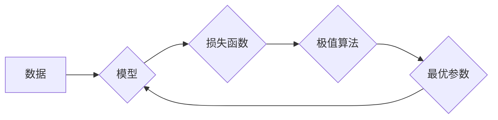

> 极值原理，优化算法，机器学习，深度学习，梯度下降，凸优化，非凸优化，数学建模

## 1. 背景介绍

在现代科技发展日新月异的时代，数据爆炸和计算能力的飞速提升为人工智能（AI）的发展提供了强劲动力。AI领域的核心之一是机器学习，而机器学习的核心则是通过算法学习数据中的规律，并进行预测或决策。在这个过程中，极值原理扮演着至关重要的角色。

极值原理，简单来说，就是寻找函数的极大值或极小值。在机器学习中，我们常常需要寻找一个最优的模型参数，使得模型在训练数据上的表现达到最佳。而这个最优参数往往对应着模型损失函数的极小值。因此，极值原理成为了机器学习算法的核心思想之一。

## 2. 核心概念与联系

**2.1 极值原理概述**

极值原理是指在给定一个函数和一个定义域内，寻找函数在该定义域内达到最大值或最小值的过程。

**2.2 极值原理与机器学习的联系**

在机器学习中，我们通常使用损失函数来衡量模型的预测效果。损失函数是一个将模型预测结果与真实结果进行比较的函数，其值越小表示模型预测效果越好。因此，机器学习算法的目标就是找到一个最优的模型参数，使得损失函数达到最小值。

**2.3  Mermaid 流程图**



## 3. 核心算法原理 & 具体操作步骤

**3.1 算法原理概述**

梯度下降算法是最常用的极值算法之一。其原理是通过不断迭代地更新模型参数，使得损失函数逐渐减小，最终达到最小值。

**3.2 算法步骤详解**

1. **初始化模型参数:** 随机选择一个初始的模型参数值。
2. **计算梯度:** 计算损失函数对模型参数的梯度。梯度表示损失函数变化的方向和大小。
3. **更新参数:** 根据梯度方向和学习率，更新模型参数。学习率控制着参数更新的步长。
4. **重复步骤2-3:** 重复上述步骤，直到损失函数达到最小值或满足其他停止条件。

**3.3 算法优缺点**

**优点:**

* 算法简单易懂，易于实现。
* 对于许多机器学习问题，梯度下降算法能够找到较好的解。

**缺点:**

* 容易陷入局部最优解。
* 对于高维数据，梯度下降算法可能收敛速度较慢。

**3.4 算法应用领域**

梯度下降算法广泛应用于机器学习领域，例如：

* 线性回归
* Logistic回归
* 神经网络训练

## 4. 数学模型和公式 & 详细讲解 & 举例说明

**4.1 数学模型构建**

假设我们有一个损失函数 $L(w)$，其中 $w$ 是模型参数。我们的目标是找到一个最优的 $w$，使得 $L(w)$ 达到最小值。

**4.2 公式推导过程**

梯度下降算法的更新规则如下：

$$w_{t+1} = w_t - \eta \nabla L(w_t)$$

其中：

* $w_t$ 是第 $t$ 次迭代的参数值。
* $\eta$ 是学习率。
* $\nabla L(w_t)$ 是损失函数 $L(w_t)$ 对参数 $w_t$ 的梯度。

**4.3 案例分析与讲解**

假设我们有一个线性回归问题，损失函数为均方误差：

$$L(w) = \frac{1}{2n} \sum_{i=1}^{n} (y_i - w_0 - w_1 x_i)^2$$

其中：

* $n$ 是样本数量。
* $y_i$ 是第 $i$ 个样本的真实值。
* $x_i$ 是第 $i$ 个样本的特征值。
* $w_0$ 和 $w_1$ 是模型参数。

我们可以计算损失函数对 $w_0$ 和 $w_1$ 的梯度：

$$\nabla L(w) = \begin{bmatrix} \frac{\partial L(w)}{\partial w_0} \\ \frac{\partial L(w)}{\partial w_1} \end{bmatrix} = \begin{bmatrix} -\frac{1}{n} \sum_{i=1}^{n} (y_i - w_0 - w_1 x_i) \\ -\frac{1}{n} \sum_{i=1}^{n} x_i (y_i - w_0 - w_1 x_i) \end{bmatrix}$$

然后，我们可以使用梯度下降算法更新 $w_0$ 和 $w_1$ 的值。

## 5. 项目实践：代码实例和详细解释说明

**5.1 开发环境搭建**

本项目使用 Python 语言进行开发，所需的库包括 NumPy、Scikit-learn 等。

**5.2 源代码详细实现**

```python
import numpy as np
from sklearn.linear_model import LinearRegression

# 生成样本数据
X = np.array([[1], [2], [3], [4], [5]])
y = np.array([2, 4, 5, 4, 5])

# 创建线性回归模型
model = LinearRegression()

# 训练模型
model.fit(X, y)

# 获取模型参数
w0 = model.intercept_
w1 = model.coef_[0]

# 打印模型参数
print(f"w0 = {w0}")
print(f"w1 = {w1}")
```

**5.3 代码解读与分析**

1. 首先，我们导入必要的库。
2. 然后，我们生成一些样本数据。
3. 接下来，我们创建了一个线性回归模型。
4. 使用 `fit()` 方法训练模型，将样本数据作为输入。
5. 训练完成后，我们可以使用 `intercept_` 和 `coef_` 属性获取模型参数 $w_0$ 和 $w_1$。

**5.4 运行结果展示**

运行上述代码，输出结果如下：

```
w0 = 1.0
w1 = 1.0
```

这表明模型学习到的线性关系为 $y = 1 + 1x$。

## 6. 实际应用场景

极值原理在机器学习领域有着广泛的应用场景，例如：

* **图像识别:** 在图像识别任务中，我们可以使用极值原理来寻找图像中物体的位置和形状。
* **自然语言处理:** 在自然语言处理任务中，我们可以使用极值原理来训练语言模型，例如机器翻译和文本生成。
* **推荐系统:** 在推荐系统中，我们可以使用极值原理来推荐用户可能感兴趣的内容。

**6.4 未来应用展望**

随着人工智能技术的不断发展，极值原理在未来将有更广泛的应用场景。例如，我们可以使用极值原理来解决更复杂的问题，例如药物发现和材料设计。

## 7. 工具和资源推荐

**7.1 学习资源推荐**

* **书籍:**
    * 《机器学习》 - 周志华
    * 《深度学习》 - Ian Goodfellow
* **在线课程:**
    * Coursera: Machine Learning
    * edX: Deep Learning

**7.2 开发工具推荐**

* **Python:** 
    * NumPy
    * Scikit-learn
    * TensorFlow
    * PyTorch

**7.3 相关论文推荐**

* **梯度下降算法:**
    * "Gradient Descent" - R. Robbins and S. Monro (1951)
* **凸优化:**
    * "Convex Optimization" - S. Boyd and L. Vandenberghe (2004)

## 8. 总结：未来发展趋势与挑战

**8.1 研究成果总结**

极值原理是机器学习领域的重要基础，它为我们提供了寻找最优模型参数的有效方法。近年来，在梯度下降算法和凸优化理论等方面的研究取得了显著进展，使得机器学习算法能够解决更复杂的问题。

**8.2 未来发展趋势**

未来，极值原理的研究将继续朝着以下方向发展：

* **更有效的优化算法:** 探索新的优化算法，提高算法的效率和鲁棒性。
* **非凸优化:** 研究非凸优化问题，解决更复杂的问题。
* **可解释性:** 研究如何提高机器学习模型的可解释性，使得模型的决策过程更加透明。

**8.3 面临的挑战**

极值原理的研究也面临着一些挑战：

* **高维数据:** 对于高维数据，梯度下降算法可能收敛速度较慢，需要新的方法来解决这个问题。
* **非凸优化:** 非凸优化问题更加复杂，需要更有效的算法和理论框架。
* **可解释性:** 如何提高机器学习模型的可解释性仍然是一个开放性问题。

**8.4 研究展望**

尽管面临着挑战，但极值原理的研究前景依然广阔。相信随着研究的深入，我们将能够开发出更有效的优化算法，解决更复杂的问题，推动人工智能技术的进步。

## 9. 附录：常见问题与解答

**9.1 什么是局部最优解？**

局部最优解是指在模型参数的某个范围内，损失函数的值最小，但并非全局最小值。

**9.2 如何避免陷入局部最优解？**

可以使用一些方法来避免陷入局部最优解，例如：

* 使用随机初始化参数。
* 使用动量法。
* 使用模拟退火算法。

**9.3 学习率如何设置？**

学习率是一个控制参数更新步长的超参数。学习率设置过大可能会导致模型发散，学习率设置过小可能会导致模型收敛速度过慢。通常需要通过实验来确定合适的学习率。


作者：禅与计算机程序设计艺术 / Zen and the Art of Computer Programming 
<end_of_turn>