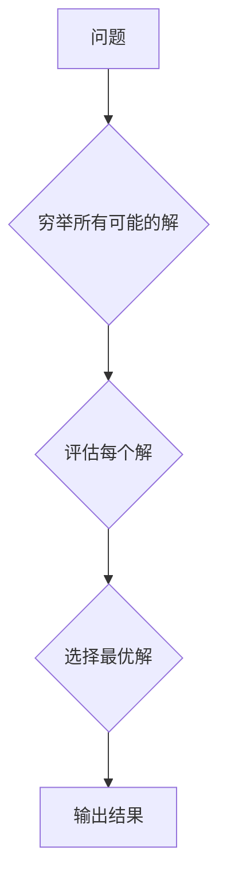

> 蛮力算法，算法设计，复杂度分析，时间复杂度，空间复杂度，实际应用场景，编程实践

## 1. 背景介绍

在计算机科学领域，我们经常面临着解决复杂问题的挑战。面对这些问题，我们往往会尝试寻找最优解，并将其转化为高效的算法。然而，并非所有问题都存在完美的解决方案，有些问题需要我们采用更直观、更简单的方法来解决。这就是蛮力算法的魅力所在。

蛮力算法，顾名思义，是一种简单直接的算法，它通过穷举所有可能的解来找到最优解。虽然这种方法看似粗暴，但它在某些情况下却能取得令人惊讶的效果。

## 2. 核心概念与联系

蛮力算法的核心概念是“穷举”，它通过枚举所有可能的解，并逐一进行评估，最终选择最优解。这种方法的优点在于其简单易懂，易于实现，并且不需要复杂的数学知识。

**Mermaid 流程图**



## 3. 核心算法原理 & 具体操作步骤

### 3.1  算法原理概述

蛮力算法的基本原理是：对于一个问题，我们首先列出所有可能的解，然后逐一评估每个解，并选择最优解。

### 3.2  算法步骤详解

1. **定义问题:** 首先，我们需要明确问题的具体描述，包括输入、输出和目标函数。
2. **穷举所有可能的解:** 根据问题的性质，列出所有可能的解集。
3. **评估每个解:** 对每个解进行评估，并计算其目标函数值。
4. **选择最优解:** 从所有评估过的解中选择目标函数值最小的解作为最优解。
5. **输出结果:** 输出最优解。

### 3.3  算法优缺点

**优点:**

* 简单易懂，易于实现。
* 不需要复杂的数学知识。
* 适用于问题规模较小的情况。

**缺点:**

* 效率低下，时间复杂度通常很高。
* 对于问题规模较大时，计算量巨大，难以实现。

### 3.4  算法应用领域

尽管蛮力算法效率不高，但它在某些特定领域仍然具有应用价值，例如：

* **密码学:** 某些简单的密码算法可以使用蛮力算法进行破解。
* **游戏开发:** 一些简单的游戏，例如猜数字游戏，可以使用蛮力算法实现。
* **搜索引擎:** 在某些情况下，搜索引擎可以使用蛮力算法来查找网页。

## 4. 数学模型和公式 & 详细讲解 & 举例说明

### 4.1  数学模型构建

对于一个问题，我们可以用数学模型来描述其输入、输出和目标函数。例如，对于一个求最大值的简单问题，我们可以用以下数学模型来描述：

* 输入：一个数列
* 输出：最大值
* 目标函数：最大值

### 4.2  公式推导过程

对于一个包含n个元素的数列，我们可以使用以下公式来计算其最大值：

```latex
max(x_1, x_2, ..., x_n)
```

其中，$x_1, x_2, ..., x_n$ 是数列中的元素。

### 4.3  案例分析与讲解

例如，对于一个数列 [1, 5, 2, 8, 3]，我们可以使用上述公式计算其最大值：

```latex
max(1, 5, 2, 8, 3) = 8
```

因此，数列 [1, 5, 2, 8, 3] 的最大值为 8。

## 5. 项目实践：代码实例和详细解释说明

### 5.1  开发环境搭建

本项目使用 Python 语言进行开发，开发环境搭建如下：

* 操作系统：Windows 10
* Python 版本：3.8.10
* IDE：PyCharm

### 5.2  源代码详细实现

```python
def find_max(numbers):
  """
  使用蛮力算法查找数列的最大值。

  Args:
    numbers: 一个包含数字的列表。

  Returns:
    列表中最大的数字。
  """
  max_number = numbers[0]
  for number in numbers:
    if number > max_number:
      max_number = number
  return max_number

# 测试代码
numbers = [1, 5, 2, 8, 3]
max_number = find_max(numbers)
print(f"列表 {numbers} 中的最大值为：{max_number}")
```

### 5.3  代码解读与分析

* 函数 `find_max(numbers)` 接受一个数字列表作为输入。
* 首先，将列表中的第一个数字赋值给 `max_number`。
* 然后，遍历列表中的每个数字，如果当前数字大于 `max_number`，则将当前数字赋值给 `max_number`。
* 最后，返回 `max_number`。

### 5.4  运行结果展示

```
列表 [1, 5, 2, 8, 3] 中的最大值为：8
```

## 6. 实际应用场景

### 6.1  密码破解

在密码学中，蛮力算法可以用于破解简单的密码。例如，如果一个密码由 4 个字母组成，并且每个字母可以是 26 个英文字母中的任意一个，那么可以使用蛮力算法穷举所有可能的组合，直到找到正确的密码。

### 6.2  游戏开发

在游戏开发中，蛮力算法可以用于实现一些简单的游戏机制，例如猜数字游戏。玩家需要猜测一个随机生成的数字，游戏程序会根据玩家的猜测，提示玩家数字是否正确，以及数字的大小关系。

### 6.3  搜索引擎

在搜索引擎中，蛮力算法可以用于查找网页。例如，如果用户搜索一个特定的关键词，搜索引擎可以遍历所有网页，并检查每个网页是否包含该关键词。

### 6.4  未来应用展望

随着计算机硬件性能的不断提升，蛮力算法在某些特定领域可能会有更广泛的应用。例如，在人工智能领域，蛮力算法可以用于训练一些简单的机器学习模型。

## 7. 工具和资源推荐

### 7.1  学习资源推荐

* 《算法导论》
* 《数据结构与算法分析》
* 《编程之美》

### 7.2  开发工具推荐

* Python
* PyCharm
* Visual Studio Code

### 7.3  相关论文推荐

* "The Brute-Force Approach to Password Cracking"
* "A Survey of Brute-Force Attacks"

## 8. 总结：未来发展趋势与挑战

### 8.1  研究成果总结

蛮力算法是一种简单直接的算法，它通过穷举所有可能的解来找到最优解。虽然这种方法效率不高，但它在某些特定领域仍然具有应用价值。

### 8.2  未来发展趋势

随着计算机硬件性能的不断提升，蛮力算法在某些特定领域可能会有更广泛的应用。例如，在人工智能领域，蛮力算法可以用于训练一些简单的机器学习模型。

### 8.3  面临的挑战

蛮力算法的主要挑战在于其效率低下。对于问题规模较大时，计算量巨大，难以实现。

### 8.4  研究展望

未来研究方向可以集中在以下几个方面：

* 寻找更有效的蛮力算法，例如使用并行计算技术来加速算法执行速度。
* 将蛮力算法与其他算法结合使用，例如使用启发式算法来缩小搜索空间。
* 研究蛮力算法在特定领域中的应用，例如在密码学、游戏开发和搜索引擎等领域。

## 9. 附录：常见问题与解答

**问题 1:** 蛮力算法的效率如何？

**答案:** 蛮力算法的效率通常很低，时间复杂度通常很高。

**问题 2:** 蛮力算法适用于哪些问题？

**答案:** 蛮力算法适用于问题规模较小的情况，例如密码破解、游戏开发和搜索引擎等领域。

**问题 3:** 如何改进蛮力算法的效率？

**答案:** 可以使用并行计算技术来加速算法执行速度，或者使用启发式算法来缩小搜索空间。


作者：禅与计算机程序设计艺术 / Zen and the Art of Computer Programming 
<end_of_turn>