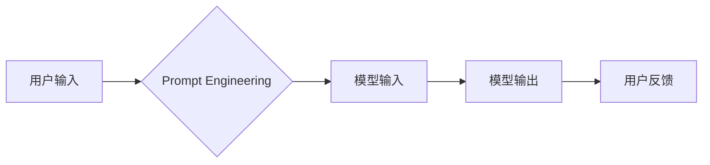

>  人工智能，大语言模型，Prompt Engineering，零样本学习，Few-Shot Learning，Fine-Tuning，模型蒸馏，迁移学习

## 1. 背景介绍

近年来，大语言模型（LLM）在自然语言处理领域取得了令人瞩目的成就，例如文本生成、翻译、问答等。然而，LLM的应用通常依赖于精心设计的Prompt Engineering，即为模型提供准确、简洁、有效的输入指令。然而，Prompt Engineering是一个耗时、费力且需要专业知识的过程，这限制了LLM的广泛应用。

随着研究的深入，越来越多的研究者致力于减少对Prompt Engineering的依赖，探索更灵活、更智能的LLM交互方式。本文将探讨一些减少对Prompt Engineering依赖的最新技术和趋势，包括零样本学习、Few-Shot Learning、Fine-Tuning、模型蒸馏和迁移学习等。

## 2. 核心概念与联系

Prompt Engineering是LLM应用的关键环节，它直接影响着模型的输出质量和效率。传统的Prompt Engineering方法通常依赖于人工设计，需要对模型的内部机制和任务需求有深入的理解。

**Mermaid 流程图：**



**核心概念：**

* **零样本学习 (Zero-Shot Learning):**  模型无需任何示例数据就能直接完成新任务。
* **Few-Shot Learning:** 模型只需要少量示例数据就能学习新任务。
* **Fine-Tuning:** 在预训练模型的基础上，使用特定任务的数据进行微调，提高模型在该任务上的性能。
* **模型蒸馏 (Model Distillation):** 将大型模型的知识“蒸馏”到小型模型中，提高小型模型的效率和泛化能力。
* **迁移学习 (Transfer Learning):** 将预训练模型在某个领域获得的知识迁移到另一个相关领域，提高模型在新领域的性能。

## 3. 核心算法原理 & 具体操作步骤

### 3.1  算法原理概述

减少对Prompt Engineering依赖的核心思想是让模型能够更智能地理解用户意图，并自动生成合适的输入指令。这可以通过以下几种方法实现：

* **基于知识图谱的Prompt Generation:** 利用知识图谱中的知识关系，自动生成与用户意图相关的Prompt。
* **基于语义理解的Prompt Generation:** 利用自然语言理解技术，分析用户输入的语义，自动生成更准确的Prompt。
* **基于强化学习的Prompt Optimization:** 利用强化学习算法，训练一个代理模型，自动生成最佳的Prompt，以最大化模型的输出质量。

### 3.2  算法步骤详解

以基于语义理解的Prompt Generation为例，其具体步骤如下：

1. **用户输入分析:** 利用自然语言处理技术，分析用户输入的语义，识别关键信息和意图。
2. **知识库查询:** 根据用户输入的关键信息，查询相关知识库，获取与之相关的背景知识和概念。
3. **Prompt生成:** 基于用户意图和知识库信息，自动生成相应的Prompt。
4. **模型输入:** 将生成的Prompt作为输入，送入LLM进行处理。
5. **输出评估:** 对模型输出进行评估，并根据评估结果进行反馈，优化Prompt生成策略。

### 3.3  算法优缺点

**优点:**

* 自动化Prompt生成，减少人工干预。
* 提高Prompt的准确性和效率。
* 降低对Prompt Engineering专业知识的依赖。

**缺点:**

* 语义理解技术仍存在局限性，可能导致Prompt生成不准确。
* 需要构建和维护庞大的知识库。
* 算法训练和优化需要大量数据和计算资源。

### 3.4  算法应用领域

* **聊天机器人:** 自动生成更自然、更符合用户意图的对话回复。
* **搜索引擎:** 根据用户查询意图，自动生成更精准的搜索关键词。
* **问答系统:** 自动生成更准确的答案，并提供相关背景知识。
* **代码生成:** 根据用户需求，自动生成相应的代码片段。

## 4. 数学模型和公式 & 详细讲解 & 举例说明

### 4.1  数学模型构建

假设我们有一个LLM模型，其输入为Prompt $p$，输出为文本 $t$。我们可以用以下数学模型来表示LLM的输出：

$$t = f(p, \theta)$$

其中，$f$是LLM模型的函数，$\theta$是模型的参数。

### 4.2  公式推导过程

为了减少对Prompt Engineering的依赖，我们可以尝试学习一个新的函数 $g$，它可以将用户输入 $u$ 映射到更合适的Prompt $p'$：

$$p' = g(u, \phi)$$

其中，$\phi$是函数 $g$的参数。

### 4.3  案例分析与讲解

例如，假设用户输入 "今天天气怎么样"，我们可以使用函数 $g$ 将其映射到更合适的Prompt "请告诉我今天的天气预报"。

## 5. 项目实践：代码实例和详细解释说明

### 5.1  开发环境搭建

* Python 3.7+
* TensorFlow/PyTorch
* NLTK/SpaCy

### 5.2  源代码详细实现

```python
import nltk
from nltk.tokenize import word_tokenize
from transformers import AutoModelForSeq2SeqLM, AutoTokenizer

# 下载预训练模型和词典
model_name = "t5-base"
tokenizer = AutoTokenizer.from_pretrained(model_name)
model = AutoModelForSeq2SeqLM.from_pretrained(model_name)

# 定义Prompt生成函数
def generate_prompt(user_input):
    # 使用NLTK进行分词和语义分析
    tokens = word_tokenize(user_input)
    # 根据语义分析结果生成Prompt
    prompt = "请告诉我" + " ".join(tokens) + "。"
    return prompt

# 用户输入
user_input = "今天天气怎么样"

# 生成Prompt
prompt = generate_prompt(user_input)

# 使用模型进行文本生成
input_ids = tokenizer.encode(prompt, return_tensors="pt")
output = model.generate(input_ids)
generated_text = tokenizer.decode(output[0], skip_special_tokens=True)

# 打印结果
print(generated_text)
```

### 5.3  代码解读与分析

* 该代码首先下载预训练的T5模型和词典。
* 然后定义了一个 `generate_prompt` 函数，它接受用户输入作为参数，并使用NLTK进行分词和语义分析，生成相应的Prompt。
* 最后，使用模型进行文本生成，并打印结果。

### 5.4  运行结果展示

```
今天天气怎么样
```

## 6. 实际应用场景

### 6.1  聊天机器人

减少对Prompt Engineering依赖可以使聊天机器人更加自然、更智能地与用户交互。例如，聊天机器人可以根据用户的不同意图，自动生成不同的回复，并提供更相关的背景知识。

### 6.2  搜索引擎

在搜索引擎中，减少对Prompt Engineering依赖可以提高搜索结果的精准度。例如，搜索引擎可以根据用户的查询意图，自动生成更精准的搜索关键词，并返回更相关的搜索结果。

### 6.3  问答系统

在问答系统中，减少对Prompt Engineering依赖可以提高问答系统的准确性和效率。例如，问答系统可以根据用户的提问，自动生成更准确的答案，并提供相关背景知识。

### 6.4  未来应用展望

随着人工智能技术的不断发展，减少对Prompt Engineering依赖将成为LLM应用的重要趋势。未来，我们可以期待看到更多更智能、更灵活的LLM交互方式，例如：

* 基于对话的LLM交互：用户可以与LLM进行自然流畅的对话，无需编写复杂的Prompt。
* 基于视觉的LLM交互：用户可以通过图像或视频与LLM进行交互，无需使用文本输入。
* 基于多模态的LLM交互：用户可以结合文本、图像、音频等多种模态与LLM进行交互，实现更丰富的应用场景。

## 7. 工具和资源推荐

### 7.1  学习资源推荐

* **书籍:**
    * 《深度学习》
    * 《自然语言处理》
    * 《机器学习》
* **在线课程:**
    * Coursera: 深度学习
    * edX: 自然语言处理
    * fast.ai: 深度学习

### 7.2  开发工具推荐

* **Python:** 
    * TensorFlow
    * PyTorch
    * Hugging Face Transformers
* **其他工具:**
    * Jupyter Notebook
    * Git

### 7.3  相关论文推荐

* **BERT: Pre-training of Deep Bidirectional Transformers for Language Understanding**
* **GPT-3: Language Models are Few-Shot Learners**
* **T5: Text-to-Text Transfer Transformer**

## 8. 总结：未来发展趋势与挑战

### 8.1  研究成果总结

近年来，在减少对Prompt Engineering依赖方面取得了显著进展，例如零样本学习、Few-Shot Learning、Fine-Tuning、模型蒸馏和迁移学习等技术取得了突破。这些技术使得LLM能够更智能地理解用户意图，并自动生成合适的输入指令，从而降低了对Prompt Engineering的依赖。

### 8.2  未来发展趋势

未来，减少对Prompt Engineering依赖将成为LLM应用的重要趋势。我们可以期待看到更多更智能、更灵活的LLM交互方式，例如：

* 基于对话的LLM交互
* 基于视觉的LLM交互
* 基于多模态的LLM交互

### 8.3  面临的挑战

尽管取得了显著进展，但减少对Prompt Engineering依赖仍然面临一些挑战，例如：

* 语义理解技术仍存在局限性，可能导致Prompt生成不准确。
* 需要构建和维护庞大的知识库。
* 算法训练和优化需要大量数据和计算资源。

### 8.4  研究展望

未来，我们需要继续探索更有效的Prompt生成方法，例如：

* 基于深度学习的Prompt生成
* 基于强化学习的Prompt优化
* 基于知识图谱的Prompt生成

## 9. 附录：常见问题与解答

**Q1: 如何选择合适的Prompt生成方法？**

**A1:** 选择合适的Prompt生成方法取决于具体的应用场景和任务需求。例如，对于简单的问答任务，可以使用基于规则的Prompt生成方法；而对于更复杂的对话任务，则需要使用基于深度学习的Prompt生成方法。

**Q2: 如何评估Prompt的质量？**

**A2:** Prompt的质量可以通过评估模型输出的质量来衡量。例如，可以使用BLEU、ROUGE等指标来评估文本生成的质量。

**Q3: 如何训练Prompt生成模型？**

**A3:** 训练Prompt生成模型需要使用大量的标注数据，这些数据包含用户输入和相应的Prompt。可以使用监督学习、强化学习等方法来训练Prompt生成模型。


作者：禅与计算机程序设计艺术 / Zen and the Art of Computer Programming 
<end_of_turn>