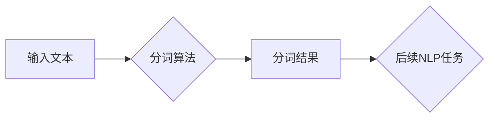

> 分词、自然语言处理、算法原理、代码实现、中文分词、词性标注、深度学习

## 1. 背景介绍

自然语言处理（NLP）是人工智能领域的重要分支，旨在使计算机能够理解、处理和生成人类语言。其中，分词是NLP的基础任务之一，它将文本分解成一个个独立的词语或短语，为后续的文本分析和理解奠定基础。

中文分词由于中文的特性，例如多音字、歧义词等，比其他语言的分词更加复杂。传统的中文分词方法主要依赖于规则和统计模型，近年来，深度学习技术也逐渐应用于中文分词领域，取得了显著的成果。

## 2. 核心概念与联系

**2.1  分词的定义**

分词是指将自然语言文本分割成独立的词语或短语的过程。

**2.2  分词的类型**

* **基于规则的分词:** 依赖于预先定义的语言规则，例如词典匹配、形态分析等。
* **基于统计的分词:** 利用文本语料库统计词语出现的频率和上下文关系，建立词语之间的概率模型，进行分词。
* **基于深度学习的分词:** 利用深度神经网络，例如循环神经网络（RNN）和卷积神经网络（CNN），学习文本的语义特征，进行分词。

**2.3  分词与其他NLP任务的关系**

分词是NLP任务的基础，它为后续的文本分析和理解任务提供数据支持。例如：

* **词性标注:** 分词后的词语可以进行词性标注，识别词语的语法功能。
* **句法分析:** 分词后的词语可以用于构建句子的语法结构。
* **文本分类:** 分词后的词语可以作为文本分类的特征。
* **机器翻译:** 分词可以帮助机器翻译更好地理解文本的语义。

**2.4  分词流程图**



## 3. 核心算法原理 & 具体操作步骤

### 3.1  算法原理概述

本文将介绍基于规则和统计模型的中文分词算法原理。

**3.1.1  基于规则的分词**

基于规则的分词算法依赖于预先定义的语言规则，例如词典匹配、形态分析等。

* **词典匹配:** 将文本中的词语与预定义的词典进行匹配，找到匹配的词语作为分词结果。
* **形态分析:** 分析词语的字形结构，例如是否为复数、动词过去式等，根据规则进行分词。

**3.1.2  基于统计的分词**

基于统计的分词算法利用文本语料库统计词语出现的频率和上下文关系，建立词语之间的概率模型，进行分词。

* **N-gram模型:** 统计词语序列的出现频率，例如二元语法（bigram）和三元语法（trigram）。
* **隐马尔可夫模型（HMM）:** 建立一个概率模型，描述词语序列的生成过程，利用维特比算法进行分词。

### 3.2  算法步骤详解

**3.2.1  基于规则的分词步骤**

1. 将文本转换为标准形式，例如去除标点符号、转换大小写等。
2. 使用词典匹配算法，将文本中的词语与预定义的词典进行匹配。
3. 使用形态分析算法，分析词语的字形结构，根据规则进行分词。
4. 合并匹配的词语和形态分析的结果，得到最终的分词结果。

**3.2.2  基于统计的分词步骤**

1. 收集大量的文本语料库，并进行预处理，例如去除停用词、分词等。
2. 使用N-gram模型或HMM模型，训练词语序列的概率模型。
3. 将待分词的文本输入到模型中，利用模型预测词语序列的概率分布。
4. 选择概率最高的词语序列作为分词结果。

### 3.3  算法优缺点

**3.3.1  基于规则的分词**

* **优点:** 速度快，准确率较高。
* **缺点:** 规则难以覆盖所有情况，容易出现错误。

**3.3.2  基于统计的分词**

* **优点:** 能够处理复杂的情况，准确率较高。
* **缺点:** 需要大量的语料库进行训练，训练时间长。

### 3.4  算法应用领域

* **搜索引擎:** 用于对用户查询进行分词，提高搜索结果的准确率。
* **机器翻译:** 用于将文本从一种语言翻译成另一种语言，需要对文本进行分词。
* **文本摘要:** 用于提取文本的关键信息，需要对文本进行分词。
* **聊天机器人:** 用于理解用户的自然语言输入，需要对文本进行分词。

## 4. 数学模型和公式 & 详细讲解 & 举例说明

### 4.1  数学模型构建

**4.1.1  N-gram模型**

N-gram模型假设一个词语的出现概率取决于其前N-1个词语的上下文。例如，二元语法（bigram）模型假设一个词语的出现概率取决于其前一个词语的上下文。

**4.1.2  隐马尔可夫模型（HMM）**

HMM是一个概率模型，用于描述一个时间序列的生成过程。在分词任务中，每个词语可以看作是一个状态，HMM可以用来预测词语序列的概率分布。

### 4.2  公式推导过程

**4.2.1  N-gram模型的概率公式**

$$P(w_i|w_{i-1}, w_{i-2}, ..., w_{i-n})$$

其中：

* $w_i$ 是第i个词语。
* $w_{i-1}, w_{i-2}, ..., w_{i-n}$ 是前n-1个词语。

**4.2.2  HMM的概率公式**

$$P(O|Q) = \prod_{t=1}^{T} P(o_t|q_t)$$

其中：

* $O$ 是观察序列，即文本。
* $Q$ 是隐藏状态序列，即词语序列。
* $o_t$ 是第t个观察值，即第t个词语。
* $q_t$ 是第t个隐藏状态，即第t个词语的类别。

### 4.3  案例分析与讲解

**4.3.1  N-gram模型案例**

假设我们有一个文本语料库，其中包含以下词语序列：

"我爱北京"

我们可以使用二元语法模型来计算 "爱" 这个词语的出现概率：

$$P(\text{爱}|\text{我}) = \frac{C(\text{我爱})}{C(\text{我})}$$

其中：

* $C(\text{我爱})$ 是 "我爱" 这个词语序列出现的次数。
* $C(\text{我})$ 是 "我" 这个词语出现的次数。

**4.3.2  HMM案例**

我们可以使用HMM模型来预测以下文本的词语序列：

"我爱北京天安门"

HMM模型会根据训练好的概率模型，预测每个词语的类别，并最终得到最可能的词语序列。

## 5. 项目实践：代码实例和详细解释说明

### 5.1  开发环境搭建

* 操作系统：Windows/Linux/macOS
* Python版本：3.6+
* 安装依赖库：

```bash
pip install jieba
```

### 5.2  源代码详细实现

```python
import jieba

# 文本
text = "我爱北京，北京是一个美丽的城市。"

# 分词
words = jieba.cut(text)

# 打印分词结果
print(" ".join(words))
```

### 5.3  代码解读与分析

* `jieba.cut(text)` 函数使用jieba分词库对文本进行分词。
* `print(" ".join(words))` 函数将分词后的词语连接成字符串，并打印输出。

### 5.4  运行结果展示

```
我 爱 北京 ， 北京 是 一个 美丽 的 城市 。
```

## 6. 实际应用场景

### 6.1  搜索引擎

搜索引擎使用分词技术来理解用户的查询意图，并返回相关的搜索结果。例如，用户搜索 "苹果手机"，搜索引擎会将 "苹果手机" 分词为 "苹果" 和 "手机"，并根据这两个词语的权重和相关性，返回相关的搜索结果。

### 6.2  机器翻译

机器翻译系统需要对文本进行分词，才能准确地理解文本的语义，并将其翻译成另一种语言。例如，将 "我爱北京" 翻译成英文，需要先将 "我爱北京" 分词为 "我"、"爱" 和 "北京"，然后才能将其翻译成 "I love Beijing"。

### 6.3  文本摘要

文本摘要系统需要提取文本的关键信息，并将其压缩成一个较短的摘要。分词技术可以帮助文本摘要系统识别文本中的重要词语，并将其用于生成摘要。

### 6.4  未来应用展望

随着人工智能技术的不断发展，分词技术将应用于更多领域，例如：

* **对话系统:** 分词技术可以帮助对话系统更好地理解用户的自然语言输入，并提供更准确的回复。
* **情感分析:** 分词技术可以帮助情感分析系统识别文本中的情感倾向，例如积极、消极或中性。
* **知识图谱构建:** 分词技术可以帮助知识图谱构建系统识别文本中的实体和关系，并将其添加到知识图谱中。

## 7. 工具和资源推荐

### 7.1  学习资源推荐

* **中文分词技术综述:** https://zhuanlan.zhihu.com/p/26897597
* **jieba分词库文档:** https://pypi.org/project/jieba/

### 7.2  开发工具推荐

* **jieba:** https://pypi.org/project/jieba/
* **Stanford CoreNLP:** https://stanfordnlp.github.io/CoreNLP/

### 7.3  相关论文推荐

* **A Survey of Chinese Word Segmentation Techniques:** https://arxiv.org/abs/1803.01977
* **Deep Learning for Chinese Word Segmentation:** https://arxiv.org/abs/1609.04737

## 8. 总结：未来发展趋势与挑战

### 8.1  研究成果总结

近年来，中文分词技术取得了显著的进展，特别是深度学习技术的应用，使得中文分词的准确率和效率得到了大幅提升。

### 8.2  未来发展趋势

* **更准确的分词算法:** 研究更准确、更鲁棒的分词算法，能够处理更复杂、更多样化的文本。
* **跨语言分词:** 研究跨语言分词技术，能够将不同语言的文本进行分词。
* **个性化分词:** 研究个性化分词技术，能够根据用户的语境和偏好进行分词。

### 8.3  面临的挑战

* **语义歧义:** 中文存在大量的语义歧义，这使得分词任务更加复杂。
* **新词发现:** 新词不断涌现，需要开发新的方法来识别和处理新词。
* **数据标注:** 高质量的中文分词数据标注非常耗时和费力。

### 8.4  研究展望

未来，中文分词技术将继续朝着更准确、更智能、更个性化的方向发展，并将应用于更多领域，为人工智能的发展做出更大的贡献。

## 9. 附录：常见问题与解答

**9.1  为什么分词很重要？**

分词是NLP任务的基础，它将文本分解成一个个独立的词语或短语，为后续的文本分析和理解任务提供数据支持。

**9.2  有哪些常见的中文分词算法？**

常见的中文