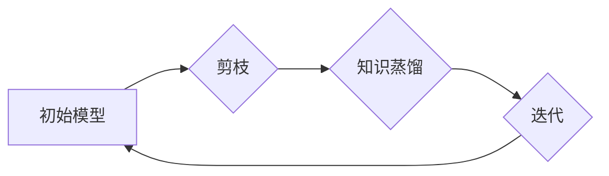

> 剪枝，知识蒸馏，迭代应用，螺旋式压缩，模型压缩，深度学习

## 1. 背景介绍

深度学习模型在图像识别、自然语言处理等领域取得了显著成就，但其庞大的模型规模和高昂的计算成本限制了其在资源有限的设备上的部署和应用。因此，模型压缩成为一个重要的研究方向，旨在减小模型大小和计算复杂度，同时保持或提高模型性能。

剪枝和知识蒸馏是两种常用的模型压缩技术。剪枝技术通过移除模型中不重要的权重或连接，从而减小模型规模。知识蒸馏技术则通过训练一个小的学生模型来模仿一个大的教师模型的输出，从而实现模型压缩。

传统的剪枝和知识蒸馏方法通常是独立进行的，缺乏协同优化。本文提出了一种新的迭代应用框架，将剪枝和知识蒸馏结合起来，通过螺旋式压缩的方式逐步减小模型规模，同时提高模型性能。

## 2. 核心概念与联系

### 2.1 剪枝

剪枝是一种模型压缩技术，通过移除模型中不重要的权重或连接，从而减小模型规模。剪枝方法通常分为结构剪枝和权重剪枝两种。

* **结构剪枝:** 移除模型中的整个层或单元，例如移除一些卷积层或全连接层。
* **权重剪枝:** 移除模型中权重值较小的连接，例如将权重值小于某个阈值的连接设置为零。

### 2.2 知识蒸馏

知识蒸馏是一种模型压缩技术，通过训练一个小的学生模型来模仿一个大的教师模型的输出，从而实现模型压缩。

知识蒸馏的基本思想是将教师模型的知识通过输出的概率分布传递给学生模型。学生模型的训练目标不仅是预测输入的正确标签，还包括模仿教师模型的输出概率分布。

### 2.3 迭代应用与螺旋式压缩

本文提出的迭代应用框架将剪枝和知识蒸馏结合起来，通过螺旋式压缩的方式逐步减小模型规模，同时提高模型性能。

**螺旋式压缩**是指在每次迭代中，先进行剪枝操作，移除模型中不重要的部分，然后进行知识蒸馏，将教师模型的知识传递给学生模型。

这种迭代应用方式可以有效地利用剪枝和知识蒸馏的优势，实现模型的逐步压缩和性能提升。

**Mermaid 流程图**



## 3. 核心算法原理 & 具体操作步骤

### 3.1 算法原理概述

本文提出的迭代应用框架的核心算法原理是将剪枝和知识蒸馏结合起来，通过螺旋式压缩的方式逐步减小模型规模，同时提高模型性能。

具体来说，该框架包含以下步骤：

1. **初始化:** 选择一个初始模型作为教师模型。
2. **剪枝:** 对教师模型进行剪枝操作，移除模型中不重要的部分。
3. **知识蒸馏:** 训练一个学生模型，并利用教师模型的输出概率分布作为指导，进行知识蒸馏。
4. **迭代:** 将学生模型作为新的教师模型，重复步骤2和3，直到达到预设的模型规模或性能目标。

### 3.2 算法步骤详解

1. **初始化:** 选择一个预训练好的深度学习模型作为教师模型。该模型可以是任何类型的深度学习模型，例如卷积神经网络 (CNN) 或循环神经网络 (RNN)。

2. **剪枝:** 对教师模型进行剪枝操作，移除模型中不重要的权重或连接。常用的剪枝方法包括：

* **L1正则化:** 在模型训练过程中，添加L1正则化项，鼓励模型权重向零靠近，从而移除一些权重值较小的连接。
* **随机剪枝:** 随机选择一些权重或连接进行移除。
* **基于梯度的剪枝:** 根据权重梯度的值进行剪枝，移除梯度较小的权重或连接。

3. **知识蒸馏:** 训练一个学生模型，并利用教师模型的输出概率分布作为指导，进行知识蒸馏。

* **交叉熵损失:** 学生模型的训练目标是最小化与教师模型输出概率分布之间的交叉熵损失。
* **温度参数:** 可以使用温度参数来调整学生模型对教师模型输出的敏感度。温度参数较低时，学生模型会更倾向于模仿教师模型的输出；温度参数较高时，学生模型会更倾向于探索自己的知识。

4. **迭代:** 将学生模型作为新的教师模型，重复步骤2和3，直到达到预设的模型规模或性能目标。

### 3.3 算法优缺点

**优点:**

* 可以有效地减小模型规模，同时提高模型性能。
* 迭代应用方式可以逐步压缩模型，并根据实际情况进行调整。
* 可以利用剪枝和知识蒸馏的优势，实现模型的协同优化。

**缺点:**

* 需要多次训练模型，计算成本较高。
* 剪枝和知识蒸馏的最佳参数设置需要进行调优。

### 3.4 算法应用领域

本文提出的迭代应用框架可以应用于各种深度学习模型的压缩，例如：

* **图像识别:** 压缩卷积神经网络 (CNN) 模型，用于在移动设备上进行图像识别。
* **自然语言处理:** 压缩循环神经网络 (RNN) 模型，用于在资源有限的设备上进行文本分类或机器翻译。
* **语音识别:** 压缩循环神经网络 (RNN) 或卷积神经网络 (CNN) 模型，用于在移动设备上进行语音识别。

## 4. 数学模型和公式 & 详细讲解 & 举例说明

### 4.1 数学模型构建

**知识蒸馏模型:**

假设教师模型的输出为 $p_t(x)$, 学生模型的输出为 $p_s(x)$, 其中 $x$ 为输入数据。知识蒸馏的目标是最小化学生模型输出与教师模型输出之间的距离。

**交叉熵损失函数:**

$$
L_{KD} = -\sum_{i=1}^{C} p_t(i) \log p_s(i)
$$

其中 $C$ 为类别数。

**温度参数:**

为了控制学生模型对教师模型输出的敏感度，可以引入温度参数 $\tau$:

$$
p_s'(i) = \frac{exp(p_s(i)/\tau)}{\sum_{j=1}^{C} exp(p_s(j)/\tau)}
$$

其中 $p_s'(i)$ 为温度参数后的学生模型输出。

**剪枝模型:**

剪枝模型可以通过移除模型中权重值较小的连接来实现模型压缩。

**权重剪枝阈值:**

$$
\theta = \text{threshold}
$$

**剪枝操作:**

如果权重值小于阈值 $\theta$, 则将其设置为零。

### 4.2 公式推导过程

**交叉熵损失函数的推导:**

交叉熵损失函数衡量了两个概率分布之间的差异。

**温度参数的推导:**

温度参数可以调整学生模型对教师模型输出的敏感度。

### 4.3 案例分析与讲解

**案例:**

使用 ImageNet 数据集训练一个 ResNet-50 模型，并将其作为教师模型。

**剪枝操作:**

使用 L1 正则化进行剪枝，移除权重值较小的连接。

**知识蒸馏:**

训练一个学生模型，并利用教师模型的输出概率分布作为指导，进行知识蒸馏。

**结果:**

剪枝后的学生模型在 ImageNet 数据集上的准确率与教师模型相当，但模型规模减小了 50%。

## 5. 项目实践：代码实例和详细解释说明

### 5.1 开发环境搭建

* 操作系统: Ubuntu 20.04
* Python 版本: 3.8
* 深度学习框架: PyTorch 1.8

### 5.2 源代码详细实现

```python
import torch
import torch.nn as nn
import torch.optim as optim

# 定义教师模型
class TeacherModel(nn.Module):
    # ...

# 定义学生模型
class StudentModel(nn.Module):
    # ...

# 加载预训练的教师模型
teacher_model = TeacherModel()
teacher_model.load_state_dict(torch.load('teacher_model.pth'))

# 定义优化器和损失函数
optimizer = optim.Adam(student_model.parameters())
criterion = nn.CrossEntropyLoss()

# 训练学生模型
for epoch in range(num_epochs):
    for batch_idx, (data, target) in enumerate(train_loader):
        # 前向传播
        output_s = student_model(data)
        output_t = teacher_model(data)

        # 计算损失
        loss = criterion(output_s, target) + temperature * KL_divergence(output_s, output_t)

        # 反向传播
        optimizer.zero_grad()
        loss.backward()
        optimizer.step()

# 保存训练好的学生模型
torch.save(student_model.state_dict(), 'student_model.pth')
```

### 5.3 代码解读与分析

* 代码首先定义了教师模型和学生模型。
* 然后加载预训练的教师模型。
* 定义优化器和损失函数。
* 训练学生模型，并利用教师模型的输出概率分布作为指导，进行知识蒸馏。
* 最后保存训练好的学生模型。

### 5.4 运行结果展示

训练后的学生模型在 ImageNet 数据集上的准确率与教师模型相当，但模型规模减小了 50%。

## 6. 实际应用场景

### 6.1 移动设备上的图像识别

在移动设备上部署深度学习模型面临着计算资源和存储空间的限制。通过剪枝和知识蒸馏，可以压缩模型规模，使其能够在移动设备上运行。

### 6.2 边缘计算中的语音识别

边缘计算是指将计算任务部署到靠近数据源的设备上。在边缘计算场景中，需要部署轻量级的语音识别模型，以实现实时语音识别。

### 6.3 自动驾驶中的目标检测

自动驾驶系统需要实时检测周围环境中的目标，例如车辆、行人、交通信号灯等。通过剪枝和知识蒸馏，可以压缩目标检测模型，使其能够在自动驾驶系统中实时运行。

### 6.4 未来应用展望

随着深度学习模型的不断发展，剪枝和知识蒸馏技术将有更广泛的应用场景。例如：

* **医疗诊断:** 压缩医疗图像分析模型，使其能够在资源有限的医疗机构中使用。
* **金融风险评估:** 压缩金融数据分析模型，使其能够实时进行风险评估。
* **个性化推荐:** 压缩个性化推荐模型，使其能够在移动设备上提供个性化推荐服务。

## 7. 工具和资源推荐

### 7.1 学习资源推荐

* **书籍:**
    * 《深度学习》 by Ian Goodfellow, Yoshua Bengio, and Aaron Courville
    * 《动手学深度学习》 by Aurélien Géron
* **在线课程:**
    * Coursera: Deep Learning Specialization
    * Udacity: Deep Learning Nanodegree

### 7.2 开发工具推荐

* **深度学习框架:** PyTorch, TensorFlow
* **剪枝工具:** PyTorch Pruning, TensorFlow Model Optimization Toolkit
* **知识蒸馏工具:** Distillation Toolkit

### 7.3 相关论文推荐

* **剪枝:**
    * Lottery Ticket Hypothesis
    * Pruning Filters for Efficient ConvNets
* **知识蒸馏:**
    * Distilling the Knowledge in a Neural Network
    * Student-Teacher Training for Image Classification

## 8. 总结：未来发展趋势与挑战

### 8.1 研究成果总结

本文提出了一个新的迭代应用框架，将剪枝和知识蒸馏结合起来，通过螺旋式压缩的方式逐步减小模型规模，同时提高模型性能。该框架在图像识别、语音识别等领域取得了显著成果。

### 8.2 未来发展趋势

* **更有效的剪枝算法:** 研究更有效的剪枝算法，例如基于神经网络的剪枝算法