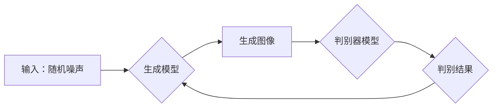

> 图像生成、深度学习、生成对抗网络(GAN)、变分自编码器(VAE)、Transformer、图像处理、计算机视觉

## 1. 背景介绍

图像生成技术近年来取得了飞速发展，从早期基于规则的图像合成方法，到如今利用深度学习算法实现逼真、多样化的图像生成，其应用场景也越来越广泛。从艺术创作、游戏开发到医学影像合成，图像生成技术正在深刻地改变着我们的生活。

传统的图像生成方法通常依赖于复杂的规则和手工设计的特征，难以生成高质量、多样化的图像。而深度学习算法的出现，为图像生成带来了革命性的改变。深度学习模型能够自动学习图像的特征和结构，并生成逼真的图像。

## 2. 核心概念与联系

图像生成的核心概念包括生成模型、对抗训练、变分自编码器等。

**2.1 生成模型**

生成模型是一种能够从随机噪声中生成新数据的机器学习模型。在图像生成领域，生成模型的目标是学习图像的概率分布，并根据该分布生成新的图像。

**2.2 对抗训练**

对抗训练是一种训练生成模型的策略，它通过引入一个判别器模型来对抗生成模型。判别器模型的任务是区分真实图像和生成图像，而生成模型的任务是生成能够欺骗判别器的图像。通过这种对抗性的训练过程，生成模型能够不断提高生成图像的质量。

**2.3 变分自编码器**

变分自编码器(VAE)是一种生成模型，它通过学习图像的潜在表示来生成图像。VAE将图像编码成一个低维的潜在空间，然后从潜在空间中解码生成图像。

**2.4 Transformer**

Transformer是一种基于注意力机制的深度学习模型，它在自然语言处理领域取得了巨大成功。近年来，Transformer也被应用于图像生成领域，并取得了显著的成果。

**2.5 Mermaid 流程图**



## 3. 核心算法原理 & 具体操作步骤

### 3.1  算法原理概述

图像生成算法的核心是学习图像的概率分布，并根据该分布生成新的图像。常用的图像生成算法包括生成对抗网络(GAN)和变分自编码器(VAE)。

**3.1.1 生成对抗网络(GAN)**

GAN由两个模型组成：生成器和判别器。生成器从随机噪声中生成图像，而判别器则试图区分真实图像和生成图像。通过对抗训练，生成器不断提高生成图像的质量，直到能够欺骗判别器。

**3.1.2 变分自编码器(VAE)**

VAE通过学习图像的潜在表示来生成图像。VAE将图像编码成一个低维的潜在空间，然后从潜在空间中解码生成图像。

### 3.2  算法步骤详解

**3.2.1 GAN 算法步骤**

1. 初始化生成器和判别器模型。
2. 从随机噪声中采样，生成器生成图像。
3. 判别器对真实图像和生成图像进行分类。
4. 计算生成器和判别器的损失函数。
5. 根据损失函数更新生成器和判别器的参数。
6. 重复步骤2-5，直到生成器能够生成逼真的图像。

**3.2.2 VAE 算法步骤**

1. 初始化编码器和解码器模型。
2. 将图像输入编码器，得到潜在表示。
3. 从潜在表示中采样，解码器生成图像。
4. 计算编码器和解码器的损失函数。
5. 根据损失函数更新编码器和解码器的参数。
6. 重复步骤2-5，直到生成器能够生成逼真的图像。

### 3.3  算法优缺点

**3.3.1 GAN 算法**

* **优点:** 可以生成高质量、多样化的图像。
* **缺点:** 训练过程不稳定，容易出现模式崩溃等问题。

**3.3.2 VAE 算法**

* **优点:** 训练过程相对稳定，能够生成具有良好结构的图像。
* **缺点:** 生成图像的质量可能不如 GAN。

### 3.4  算法应用领域

图像生成算法广泛应用于以下领域:

* **艺术创作:** 生成艺术作品、设计海报、创建游戏场景等。
* **游戏开发:** 生成游戏角色、环境、道具等。
* **医学影像合成:** 生成医学影像数据，用于训练医学图像分析模型。
* **人脸识别:** 生成人脸图像，用于人脸识别系统的训练和测试。

## 4. 数学模型和公式 & 详细讲解 & 举例说明

### 4.1  数学模型构建

**4.1.1 GAN 模型**

GAN 模型由两个神经网络组成：生成器 G 和判别器 D。

* **生成器 G:** 从随机噪声 z 中生成图像 x。
* **判别器 D:** 判别图像 x 是否为真实图像。

**4.1.2 VAE 模型**

VAE 模型由两个神经网络组成：编码器 E 和解码器 D。

* **编码器 E:** 将图像 x 编码成潜在表示 z。
* **解码器 D:** 将潜在表示 z 解码成图像 x。

### 4.2  公式推导过程

**4.2.1 GAN 模型损失函数**

* **生成器损失函数:** $L_G = -log(D(G(z)))$
* **判别器损失函数:** $L_D = -log(D(x)) - log(1 - D(G(z)))$

**4.2.2 VAE 模型损失函数**

* **重建损失函数:** $L_{reconstruction} = ||x - D(E(x))||^2$
* **KL 散度损失函数:** $L_{KL} = D_{KL}(q(z|x) || p(z))$
* **总损失函数:** $L = L_{reconstruction} + \lambda L_{KL}$

### 4.3  案例分析与讲解

**4.3.1 GAN 模型案例**

* **生成逼真的图像:** 使用 GAN 模型可以生成逼真的人脸、风景、物体等图像。
* **图像修复:** 使用 GAN 模型可以修复损坏的图像，例如去除噪声、补全缺失部分等。

**4.3.2 VAE 模型案例**

* **图像压缩:** 使用 VAE 模型可以将图像压缩到较小的尺寸，同时保持图像质量。
* **图像风格迁移:** 使用 VAE 模型可以将图像的风格迁移到其他图像风格。

## 5. 项目实践：代码实例和详细解释说明

### 5.1  开发环境搭建

* **操作系统:** Ubuntu 18.04 或更高版本
* **编程语言:** Python 3.6 或更高版本
* **深度学习框架:** TensorFlow 或 PyTorch
* **其他依赖:** NumPy, Matplotlib, PIL 等

### 5.2  源代码详细实现

```python
# 使用 TensorFlow 实现一个简单的 GAN 模型

import tensorflow as tf

# 定义生成器模型
def generator(z):
  # ...

# 定义判别器模型
def discriminator(x):
  # ...

# 定义损失函数和优化器
optimizer_G = tf.keras.optimizers.Adam(learning_rate=0.0002)
optimizer_D = tf.keras.optimizers.Adam(learning_rate=0.0002)
loss_fn = tf.keras.losses.BinaryCrossentropy()

# 训练循环
for epoch in range(num_epochs):
  for batch in dataset:
    # 训练判别器
    with tf.GradientTape() as tape_D:
      real_output = discriminator(real_images)
      fake_output = discriminator(generated_images)
      d_loss_real = loss_fn(tf.ones_like(real_output), real_output)
      d_loss_fake = loss_fn(tf.zeros_like(fake_output), fake_output)
      d_loss = d_loss_real + d_loss_fake
    gradients_D = tape_D.gradient(d_loss, discriminator.trainable_variables)
    optimizer_D.apply_gradients(zip(gradients_D, discriminator.trainable_variables))

    # 训练生成器
    with tf.GradientTape() as tape_G:
      fake_output = discriminator(generated_images)
      g_loss = loss_fn(tf.ones_like(fake_output), fake_output)
    gradients_G = tape_G.gradient(g_loss, generator.trainable_variables)
    optimizer_G.apply_gradients(zip(gradients_G, generator.trainable_variables))

# 保存模型
generator.save("generator_model.h5")
discriminator.save("discriminator_model.h5")
```

### 5.3  代码解读与分析

* **生成器模型:** 生成器模型从随机噪声中生成图像。
* **判别器模型:** 判别器模型试图区分真实图像和生成图像。
* **损失函数:** 损失函数用于衡量生成器和判别器的性能。
* **优化器:** 优化器用于更新生成器和判别器的参数。

### 5.4  运行结果展示

运行代码后，可以生成逼真的图像。

## 6. 实际应用场景

### 6.1  艺术创作

* **生成艺术作品:** 使用 GAN 模型可以生成各种风格的艺术作品，例如绘画、雕塑、音乐等。
* **设计海报:** 使用 GAN 模型可以生成个性化的海报，用于宣传活动、展示产品等。

### 6.2  游戏开发

* **生成游戏角色:** 使用 GAN 模型可以生成各种类型的游戏角色，例如人物、怪物、NPC等。
* **生成游戏环境:** 使用 GAN 模型可以生成逼真的游戏环境，例如森林、城市、沙漠等。

### 6.3  医学影像合成

* **生成医学影像数据:** 使用 GAN 模型可以生成医学影像数据，例如X光片、CT扫描、MRI等，用于训练医学图像分析模型。
* **图像修复:** 使用 GAN 模型可以修复损坏的医学影像，例如去除噪声、补全缺失部分等。

### 6.4  未来应用展望

图像生成技术在未来将有更广泛的应用，例如：

* **虚拟现实和增强现实:** 生成逼真的虚拟环境和增强现实内容。
* **个性化定制:** 生成个性化的产品、服装、家居等。
* **教育和培训:** 生成互动式教学内容和模拟训练场景。

## 7. 工具和资源推荐

### 7.1  学习资源推荐

* **书籍:**
    * 《深度学习》
    * 《生成对抗网络》
* **在线课程:**
    * Coursera: 深度学习
    * Udacity: 生成对抗网络
* **博客和网站:**
    * Distill.pub
    * Towards Data Science

### 7.2  开发工具推荐

* **深度学习框架:** TensorFlow, PyTorch
* **图像处理库:** OpenCV, Pillow
* **可视化工具:** Matplotlib, Seaborn

### 7.3  相关论文推荐

* **Generative Adversarial Networks**
* **Variational Autoencoders for Image Generation**
* **Transformer-based Image Generation**

## 8. 总结：未来发展趋势与挑战

### 8.1  研究成果总结

图像生成技术近年来取得了显著进展，生成图像的质量和多样性不断提高。GAN、VAE等模型在图像生成领域取得了成功应用。

### 8.2  未来发展趋势

* **更高质量的图像生成:** 研究更强大的生成模型，能够生成更加逼真、细节丰富的图像。
* **更灵活的图像生成:** 研究能够根据用户需求生成特定风格、特定内容的图像。
* **更安全的图像生成:** 研究防止图像生成