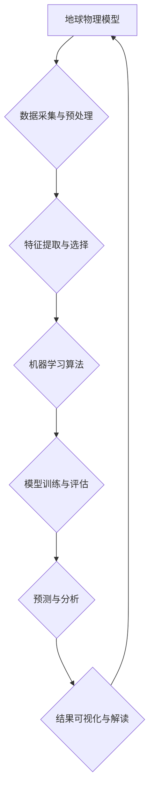

> 地球物理模型，人工智能，机器学习，深度学习，数据分析，预测建模，地球科学

## 1. 背景介绍

地球物理学作为一门研究地球内部结构、物质组成和物理性质的学科，一直以来都依赖于大量的观测数据和复杂的数学模型进行分析和预测。然而，随着地球科学研究的深入，数据量呈指数级增长，传统的分析方法已难以满足需求。人工智能（AI）技术的兴起为地球物理学带来了新的机遇，其强大的数据处理能力和模式识别能力能够有效地处理海量数据，揭示地球内部的复杂规律，并为预测地震、火山爆发等自然灾害提供新的思路。

## 2. 核心概念与联系

地球物理模型是描述地球物理现象的数学模型，它将地球的物理过程抽象为数学方程，并通过数值模拟或解析解来研究地球内部的结构和动力学过程。人工智能，特别是机器学习和深度学习，能够从海量数据中学习和识别模式，并将其应用于预测和决策。

**核心概念与联系流程图：**



## 3. 核心算法原理 & 具体操作步骤

### 3.1  算法原理概述

在应用于地球物理学领域的人工智能算法中，常用的算法包括：

* **回归算法:** 用于预测连续变量，例如地震波速度、地壳厚度等。常见的回归算法包括线性回归、支持向量回归、随机森林回归等。
* **分类算法:** 用于分类数据，例如识别不同类型的岩石、预测地震发生概率等。常见的分类算法包括逻辑回归、支持向量机、决策树、随机森林等。
* **聚类算法:** 用于将数据点分组，例如识别不同类型的矿床、分析地震波的传播路径等。常见的聚类算法包括k-means聚类、层次聚类等。

### 3.2  算法步骤详解

以地震波速度预测为例，使用线性回归算法的具体操作步骤如下：

1. **数据采集与预处理:** 收集地震波速度和相关特征数据，例如地层深度、岩石类型、地震波频率等。对数据进行清洗、缺失值处理、标准化等预处理操作。
2. **特征提取与选择:** 从原始数据中提取特征，例如地层深度、岩石类型、地震波频率等。使用特征选择方法，选择最相关的特征变量。
3. **模型训练:** 使用训练数据训练线性回归模型，学习地震波速度与特征变量之间的关系。
4. **模型评估:** 使用测试数据评估模型的预测精度，例如使用均方误差（MSE）或R-squared值来衡量模型的性能。
5. **模型优化:** 根据评估结果，调整模型参数或选择其他算法，提高模型的预测精度。
6. **预测与分析:** 使用训练好的模型预测新的地震波速度数据，并对预测结果进行分析和解释。

### 3.3  算法优缺点

**优点:**

* 能够处理海量数据，发现隐藏的模式。
* 预测精度高，能够提供准确的预测结果。
* 可解释性强，能够解释模型的预测结果。

**缺点:**

* 需要大量的训练数据，否则模型性能会下降。
* 对数据质量要求高，数据噪声会影响模型的预测精度。
* 难以处理复杂非线性问题。

### 3.4  算法应用领域

* **地震预测:** 利用地震波速度、地壳运动等数据，预测地震发生概率和震级。
* **火山爆发预测:** 利用火山气体排放、地表变形等数据，预测火山爆发时间和强度。
* **矿产资源勘探:** 利用地磁、地电、地震波等数据，识别和定位矿产资源。
* **地下水资源探测:** 利用地表沉降、水位变化等数据，探测地下水资源分布和含水量。

## 4. 数学模型和公式 & 详细讲解 & 举例说明

### 4.1  数学模型构建

地球物理模型通常基于物理定律和经验数据构建，常用的数学模型包括：

* **弹性波方程:** 描述地震波在弹性介质中的传播规律。
* **热传导方程:** 描述地球内部热量的传递过程。
* **流体动力学方程:** 描述地球内部流体的运动规律。

### 4.2  公式推导过程

以弹性波方程为例，其推导过程如下：

1. **假设弹性介质满足牛顿定律和欧拉定律。**
2. **将应力和应变联系起来，得到弹性常数。**
3. **将动量定律应用于弹性介质中的微元体，得到弹性波方程。**

**弹性波方程:**

$$
\rho \frac{\partial^2 u}{\partial t^2} = \lambda \nabla (\nabla \cdot u) + \mu \nabla \times (\nabla \times u)
$$

其中：

* $\rho$ 为介质密度
* $u$ 为位移矢量
* $t$ 为时间
* $\lambda$ 和 $\mu$ 为弹性常数

### 4.3  案例分析与讲解

利用弹性波方程可以模拟地震波在不同介质中的传播过程，例如模拟地震波在不同地层中的反射、折射和散射。通过分析地震波的传播路径和特征，可以推断出地层的结构和性质。

## 5. 项目实践：代码实例和详细解释说明

### 5.1  开发环境搭建

* 操作系统：Linux
* 编程语言：Python
* 库依赖：NumPy、SciPy、Matplotlib、TensorFlow/PyTorch

### 5.2  源代码详细实现

```python
import numpy as np
from scipy.io import loadmat
from sklearn.model_selection import train_test_split
from sklearn.linear_model import LinearRegression
from sklearn.metrics import mean_squared_error

# 加载地震波速度数据
data = loadmat('seismic_data.mat')
X = data['features']
y = data['seismic_velocity']

# 数据分割
X_train, X_test, y_train, y_test = train_test_split(X, y, test_size=0.2, random_state=42)

# 创建线性回归模型
model = LinearRegression()

# 模型训练
model.fit(X_train, y_train)

# 模型预测
y_pred = model.predict(X_test)

# 模型评估
mse = mean_squared_error(y_test, y_pred)
print(f'Mean Squared Error: {mse}')

# 可视化预测结果
import matplotlib.pyplot as plt
plt.scatter(y_test, y_pred)
plt.xlabel('Actual Seismic Velocity')
plt.ylabel('Predicted Seismic Velocity')
plt.title('Seismic Velocity Prediction')
plt.show()
```

### 5.3  代码解读与分析

* 代码首先加载地震波速度数据和相关特征数据。
* 使用 `train_test_split` 函数将数据分割为训练集和测试集。
* 创建线性回归模型并使用 `fit` 方法训练模型。
* 使用 `predict` 方法预测测试集数据。
* 使用 `mean_squared_error` 函数评估模型的预测精度。
* 使用 `matplotlib` 库可视化预测结果。

### 5.4  运行结果展示

运行代码后，会输出模型的均方误差值，并生成一个散点图，展示实际地震波速度与预测地震波速度之间的关系。

## 6. 实际应用场景

### 6.1  地震预测

利用地震波速度、地壳运动等数据，预测地震发生概率和震级。

### 6.2  火山爆发预测

利用火山气体排放、地表变形等数据，预测火山爆发时间和强度。

### 6.3  矿产资源勘探

利用地磁、地电、地震波等数据，识别和定位矿产资源。

### 6.4  未来应用展望

* **更精准的自然灾害预测:** 利用更先进的机器学习算法和更丰富的传感器数据，提高自然灾害预测的精度和时效性。
* **更深入的地球内部结构研究:** 利用人工智能技术分析地球物理模型，揭示地球内部的复杂结构和动力学过程。
* **更有效的资源勘探和开发:** 利用人工智能技术辅助矿产资源勘探和开发，提高资源利用效率。

## 7. 工具和资源推荐

### 7.1  学习资源推荐

* **书籍:**
    * 《机器学习》 - 周志华
    * 《深度学习》 - Ian Goodfellow
* **在线课程:**
    * Coursera: Machine Learning
    * edX: Deep Learning

### 7.2  开发工具推荐

* **Python:** 
    * NumPy
    * SciPy
    * Matplotlib
    * TensorFlow/PyTorch

### 7.3  相关论文推荐

* **Seismic Wave Velocity Prediction Using Machine Learning**
* **Deep Learning for Earthquake Prediction**
* **Artificial Intelligence in Geoscience**

## 8. 总结：未来发展趋势与挑战

### 8.1  研究成果总结

人工智能技术在地球物理学领域取得了显著的成果，例如地震预测、火山爆发预测、矿产资源勘探等方面取得了突破。

### 8.2  未来发展趋势

* **更强大的模型:** 开发更强大的机器学习和深度学习模型，提高预测精度和泛化能力。
* **更丰富的传感器数据:** 利用更先进的传感器技术获取更丰富的地球物理数据，为模型训练提供更充足的数据支撑。
* **更深入的理论研究:** 深入研究人工智能技术与地球物理学之间的关系，建立更完善的理论框架。

### 8.3  面临的挑战

* **数据质量问题:** 地球物理数据往往存在噪声、缺失值等问题，需要进行有效的数据清洗和预处理。
* **模型解释性问题:** 一些深度学习模型的决策过程难以解释，需要开发更可解释的模型。
* **计算资源问题:** 训练大型机器学习模型需要大量的计算资源，需要开发更有效的训练算法和硬件平台。

### 8.4  研究展望

未来，人工智能技术将继续推动地球物理学的发展，为我们更好地理解地球内部结构和动力学过程，预测和应对自然灾害，开发和利用地球资源提供新的思路和方法。

## 9. 附录：常见问题与解答

**Q1: 如何选择合适的机器学习算法？**

**A1:** 选择合适的机器学习算法需要根据具体问题和数据特点进行选择。例如，如果需要预测连续变量，可以使用回归算法；如果需要分类数据，可以使用分类算法。

**Q2: 如何处理地球物理数据中的噪声和缺失值？**

**A2:** 可以使用数据清洗和预处理方法处理数据中的噪声和缺失值。例如，可以使用滑动平均滤波器去除噪声，可以使用插值方法填充缺失值。

**Q3: 如何评估机器学习模型的性能？**

**A3:** 可以使用各种指标来评估机器学习模型的性能，例如均方误差、R-squared值、准确率、召回率等。

**作者：禅与计算机程序设计艺术 / Zen and the Art of Computer Programming**


<end_of_turn>