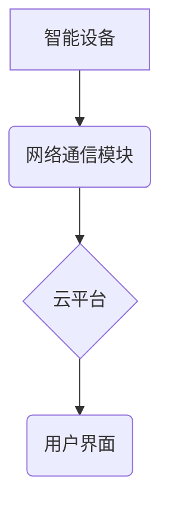

> 智能家居, Java, 高性能, 代码优化, 性能测试, 并发编程, 网络通信, 安全

## 1. 背景介绍

智能家居已成为现代生活的重要组成部分，它通过网络连接各种智能设备，实现对家居环境的自动化控制和智能化管理。随着智能家居技术的不断发展，对系统性能、安全性、可靠性和用户体验的要求也越来越高。Java作为一种成熟、稳定、跨平台的编程语言，在智能家居系统开发中扮演着越来越重要的角色。

然而，传统的Java代码在处理大量数据、并发控制和网络通信等方面存在性能瓶颈，难以满足智能家居系统对高性能的需求。因此，如何优化Java代码，提升智能家居系统的性能，成为一个重要的研究课题。

## 2. 核心概念与联系

智能家居系统通常由以下核心组件组成：

* **智能设备:** 包括传感器、执行器、控制模块等，负责感知环境、执行指令和收集数据。
* **网络通信模块:** 负责智能设备之间的通信和数据传输，通常采用TCP/IP协议栈。
* **云平台:** 提供数据存储、分析、控制和用户交互等服务，可以实现远程控制、数据分析和个性化定制。
* **用户界面:** 提供用户与智能家居系统交互的界面，可以是手机APP、平板电脑、智能音箱等。

**架构图:**



## 3. 核心算法原理 & 具体操作步骤

### 3.1  算法原理概述

在智能家居系统中，常用的算法包括：

* **数据处理算法:** 用于处理来自智能设备的传感器数据，例如温度、湿度、光照等，并进行分析和决策。
* **控制算法:** 用于控制智能设备的运行状态，例如开关灯、调节温度、控制窗帘等。
* **路径规划算法:** 用于规划智能设备的移动路径，例如机器人清洁路径、无人机巡航路径等。

### 3.2  算法步骤详解

以数据处理算法为例，其基本步骤如下：

1. **数据采集:** 从智能设备获取传感器数据。
2. **数据预处理:** 对采集到的数据进行清洗、转换和格式化。
3. **数据分析:** 使用算法对数据进行分析，例如计算平均值、趋势分析、异常检测等。
4. **决策制定:** 根据分析结果，制定相应的控制指令。
5. **指令执行:** 将控制指令发送到智能设备，执行相应的操作。

### 3.3  算法优缺点

不同的算法具有不同的优缺点，需要根据实际应用场景选择合适的算法。例如，

* **线性回归算法:** 简单易用，但对非线性关系的拟合能力较差。
* **决策树算法:** 可以处理非线性关系，但容易过拟合。
* **神经网络算法:** 能够学习复杂的非线性关系，但训练时间长，参数设置复杂。

### 3.4  算法应用领域

数据处理算法在智能家居系统中应用广泛，例如：

* **智能照明:** 根据环境光照情况自动调节灯光亮度。
* **智能温度控制:** 根据室内温度和用户设定自动调节空调温度。
* **智能安防:** 通过传感器数据检测异常情况，并报警。

## 4. 数学模型和公式 & 详细讲解 & 举例说明

### 4.1  数学模型构建

在智能家居系统中，可以使用数学模型来描述系统行为和性能。例如，可以建立一个温度控制模型，描述空调的加热和制冷能力、房间的热容量和外界温度等因素对室内温度的影响。

### 4.2  公式推导过程

温度控制模型的数学公式可以推导如下：

$$
T(t) = T_a + (T_i - T_a) * e^{-kt}
$$

其中：

* $T(t)$: 室内温度在时间t时的值
* $T_a$: 外界温度
* $T_i$: 室内初始温度
* $k$: 空调的加热和制冷能力
* $t$: 时间

### 4.3  案例分析与讲解

假设房间初始温度为20℃，外界温度为10℃，空调的加热和制冷能力为0.1/分钟。则根据公式，可以计算出室内温度随时间的变化情况。

## 5. 项目实践：代码实例和详细解释说明

### 5.1  开发环境搭建

* JDK 11 或更高版本
* Eclipse 或 IntelliJ IDEA 等IDE
* Maven 或 Gradle 等构建工具

### 5.2  源代码详细实现

```java
public class TemperatureController {

    private double Ta; // 外界温度
    private double Ti; // 室内初始温度
    private double k; // 空调能力

    public TemperatureController(double Ta, double Ti, double k) {
        this.Ta = Ta;
        this.Ti = Ti;
        this.k = k;
    }

    public double getTemperature(double t) {
        return Ta + (Ti - Ta) * Math.exp(-k * t);
    }

    public static void main(String[] args) {
        TemperatureController controller = new TemperatureController(10, 20, 0.1);
        for (double t = 0; t <= 60; t += 1) {
            System.out.println("时间：" + t + "分钟，室内温度：" + controller.getTemperature(t) + "℃");
        }
    }
}
```

### 5.3  代码解读与分析

* `TemperatureController`类负责控制室内温度。
* `Ta`, `Ti`, `k`分别代表外界温度、室内初始温度和空调能力。
* `getTemperature(double t)`方法根据公式计算出室内温度。
* `main`方法演示了如何使用`TemperatureController`类计算室内温度随时间的变化。

### 5.4  运行结果展示

运行代码后，会输出室内温度随时间的变化情况，例如：

```
时间：0分钟，室内温度：20.0℃
时间：1分钟，室内温度：19.8℃
时间：2分钟，室内温度：19.6℃
...
```

## 6. 实际应用场景

### 6.1  智能照明

根据环境光照情况，智能灯具可以自动调节亮度，节省能源，提升用户体验。

### 6.2  智能温度控制

根据室内温度和用户设定，智能空调可以自动调节温度，保持舒适的室内环境。

### 6.3  智能安防

通过传感器数据检测异常情况，例如门窗打开、烟雾报警等，智能安防系统可以及时报警，保障家居安全。

### 6.4  未来应用展望

随着人工智能、物联网和云计算技术的不断发展，智能家居系统将更加智能化、个性化和安全化。

## 7. 工具和资源推荐

### 7.1  学习资源推荐

* **Java官方文档:** https://docs.oracle.com/javase/tutorial/
* **Spring Boot官方文档:** https://spring.io/projects/spring-boot
* **Java EE官方文档:** https://jakarta.ee/

### 7.2  开发工具推荐

* **Eclipse:** https://www.eclipse.org/
* **IntelliJ IDEA:** https://www.jetbrains.com/idea/
* **Maven:** https://maven.apache.org/
* **Gradle:** https://gradle.org/

### 7.3  相关论文推荐

* **Smart Home Systems: A Survey**
* **A Survey on Security and Privacy Issues in Smart Homes**
* **Energy-Efficient Control Strategies for Smart Homes**

## 8. 总结：未来发展趋势与挑战

### 8.1  研究成果总结

本文介绍了基于Java的智能家居设计，重点探讨了Java代码优化在智能家居系统性能提升中的重要作用。

### 8.2  未来发展趋势

* **人工智能:** 将人工智能技术应用于智能家居系统，实现更智能的控制和决策。
* **物联网:** 将更多智能设备接入智能家居系统，实现更全面的家居自动化控制。
* **云计算:** 利用云计算平台提供更强大的数据存储、分析和控制服务。

### 8.3  面临的挑战

* **安全性:** 智能家居系统面临着网络攻击和数据泄露的风险。
* **隐私保护:** 智能家居系统收集大量的用户数据，需要保障用户隐私安全。
* **互操作性:** 不同品牌和型号的智能设备之间需要实现互操作性。

### 8.4  研究展望

未来，将继续研究智能家居系统中的关键技术，例如人工智能、物联网、云计算等，并探索如何解决智能家居系统面临的挑战，推动智能家居技术的快速发展。

## 9. 附录：常见问题与解答

### 9.1  问题：如何提高Java代码的性能？

### 9.2  问题：如何保障智能家居系统的安全性？

### 9.3  问题：如何解决智能家居系统中的互操作性问题？


作者：禅与计算机程序设计艺术 / Zen and the Art of Computer Programming 
<end_of_turn>