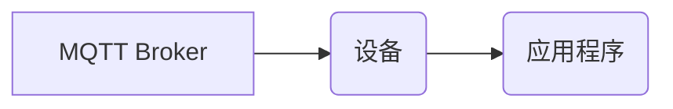
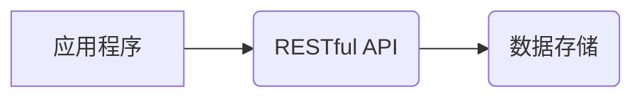

> MQTT, RESTful API, 智能家居, 设备互操作性, 物联网, 协议标准, 安全性

## 1. 背景介绍

随着物联网技术的快速发展，智能家居已成为现代生活的重要组成部分。智能家居系统通过网络连接各种智能设备，例如智能灯泡、智能门锁、智能空调等，实现对家居环境的自动化控制和智能化管理。然而，现有的智能家居系统存在着设备互操作性问题，不同品牌和型号的设备难以相互通信和协作，限制了智能家居系统的功能和用户体验。

MQTT协议和RESTful API作为两种主流的通信协议，在物联网领域得到了广泛应用。MQTT协议是一种轻量级、低功耗的消息传输协议，特别适用于资源受限的设备，而RESTful API是一种基于HTTP协议的资源访问接口，提供了一种灵活、可扩展的应用程序接口。

基于MQTT协议和RESTful API的智能家居设备互操作性研究旨在解决智能家居系统中的设备互操作性问题，实现不同品牌和型号的设备之间无缝通信和协作。

## 2. 核心概念与联系

### 2.1 MQTT协议

MQTT（Message Queuing Telemetry Transport）是一种轻量级、低功耗的发布/订阅消息传输协议，特别适用于物联网场景。

* **特点:**
    * 轻量级：协议本身非常简洁，占用资源少，适合资源受限的设备。
    * 低功耗：MQTT协议采用断线重连机制，减少数据传输，降低功耗。
    * 发布/订阅模式：消息发布者将消息发布到主题，订阅者根据主题订阅消息，实现点对多、多对多的消息传递。
    * 可靠性：MQTT协议提供消息确认机制，确保消息可靠传输。

* **架构:**



### 2.2 RESTful API

RESTful API（Representational State Transfer Application Programming Interface）是一种基于HTTP协议的资源访问接口，提供了一种灵活、可扩展的应用程序接口。

* **特点:**
    * 基于HTTP协议：RESTful API利用HTTP协议的标准方法（GET、POST、PUT、DELETE）进行资源操作。
    * 资源导向：RESTful API将数据视为资源，每个资源都有唯一的标识符（URI）。
    * 状态转移：RESTful API通过状态转移来描述资源的变化。
    * 层次结构：RESTful API通常采用层次结构来组织资源，方便资源管理和访问。

* **架构:**



### 2.3 MQTT与RESTful API的结合

MQTT协议和RESTful API可以相互补充，实现智能家居设备的互操作性。

* **MQTT协议用于设备间通信:** 设备之间通过MQTT协议发布和订阅消息，实现实时数据交换。
* **RESTful API用于设备与应用程序交互:** 应用程序可以通过RESTful API访问设备的数据和控制设备的功能。

这种结合方式可以实现智能家居系统的灵活性和扩展性，同时保证设备之间的可靠通信。

## 3. 核心算法原理 & 具体操作步骤

### 3.1  算法原理概述

基于MQTT协议和RESTful API的智能家居设备互操作性研究主要涉及以下核心算法：

* **消息路由算法:** 根据设备的主题订阅信息，将消息路由到相应的设备。
* **数据转换算法:** 将不同设备之间使用不同的数据格式的数据进行转换，实现数据互通。
* **安全认证算法:** 对设备和应用程序进行身份验证，确保数据安全传输。

### 3.2  算法步骤详解

1. **设备注册:** 设备连接到MQTT Broker，并注册自己的主题订阅信息和设备标识符。
2. **应用程序连接:** 应用程序连接到RESTful API，并获取设备列表和数据接口信息。
3. **消息发布:** 设备通过MQTT协议发布数据消息，消息包含设备标识符、数据内容和主题信息。
4. **消息路由:** MQTT Broker根据主题订阅信息，将消息路由到相应的设备。
5. **数据转换:** 设备接收消息后，根据数据格式进行转换，并将数据发送到RESTful API。
6. **数据访问:** 应用程序通过RESTful API访问设备数据，并控制设备功能。

### 3.3  算法优缺点

* **优点:**
    * 灵活性和扩展性强：可以支持多种设备和应用程序。
    * 性能高：MQTT协议轻量级，低功耗，适合大规模设备连接。
    * 安全性高：可以使用TLS/SSL加密协议保障数据安全。
* **缺点:**
    * 复杂度高：需要对MQTT协议和RESTful API有深入了解。
    * 开发成本高：需要开发复杂的设备驱动程序和应用程序接口。

### 3.4  算法应用领域

* 智能家居
* 工业自动化
* 物联网传感器网络
* 可穿戴设备

## 4. 数学模型和公式 & 详细讲解 & 举例说明

### 4.1  数学模型构建

为了描述智能家居设备互操作性系统中的消息传递过程，我们可以使用以下数学模型：

* **状态转移图:** 使用状态转移图来表示设备的状态变化和消息传递过程。
* **概率模型:** 使用概率模型来描述消息传递的成功率和失败率。

### 4.2  公式推导过程

* **消息传递成功率:**

$$
P_{success} = \frac{N_{success}}{N_{total}}
$$

其中：

* $P_{success}$：消息传递成功率
* $N_{success}$：成功传递的消息数量
* $N_{total}$：总的消息数量

* **消息丢失率:**

$$
P_{loss} = \frac{N_{loss}}{N_{total}}
$$

其中：

* $P_{loss}$：消息丢失率
* $N_{loss}$：丢失的消息数量
* $N_{total}$：总的消息数量

### 4.3  案例分析与讲解

假设一个智能家居系统中，有三个设备：智能灯泡、智能门锁和智能空调。

* 智能灯泡通过MQTT协议发布灯光状态信息，主题为“/home/light”。
* 智能门锁通过MQTT协议发布门锁状态信息，主题为“/home/door”。
* 智能空调通过MQTT协议发布空调状态信息，主题为“/home/airconditioner”。

应用程序可以通过RESTful API访问这些设备的数据，并控制设备的功能。例如，应用程序可以获取智能灯泡的灯光状态，并通过RESTful API控制智能灯泡的开关状态。

## 5. 项目实践：代码实例和详细解释说明

### 5.1  开发环境搭建

* 操作系统：Ubuntu 20.04
* 编程语言：Python 3.8
* MQTT Broker：Mosquitto 1.6
* RESTful API框架：Flask 2.0

### 5.2  源代码详细实现

```python
# mqtt_client.py
import paho.mqtt.client as mqtt

# MQTT Broker地址
MQTT_BROKER = "mqtt.example.com"
# MQTT Broker端口
MQTT_PORT = 1883
# 设备主题
DEVICE_TOPIC = "/home/device"

def on_connect(client, userdata, flags, rc):
    if rc == 0:
        print("Connected to MQTT Broker!")
        client.subscribe(DEVICE_TOPIC)
    else:
        print("Connection failed!")

def on_message(client, userdata, msg):
    print(f"Received message: {msg.payload.decode()}")

client = mqtt.Client()
client.on_connect = on_connect
client.on_message = on_message
client.connect(MQTT_BROKER, MQTT_PORT)
client.loop_forever()

# rest_api.py
from flask import Flask, request, jsonify

app = Flask(__name__)

# 设备数据
devices = {
    "light": {"status": "off"},
    "door": {"status": "locked"},
    "airconditioner": {"temperature": 25}
}

@app.route("/devices", methods=["GET"])
def get_devices():
    return jsonify(devices)

@app.route("/devices/<device_name>/<key>", methods=["PUT"])
def update_device(device_name, key):
    data = request.get_json()
    devices[device_name][key] = data["value"]
    return jsonify({"message": "Device updated successfully"})

if __name__ == "__main__":
    app.run(debug=True)
```

### 5.3  代码解读与分析

* `mqtt_client.py`：实现MQTT客户端连接MQTT Broker，订阅主题，接收消息。
* `rest_api.py`：实现RESTful API，提供设备数据访问和控制接口。

### 5.4  运行结果展示

* 启动MQTT Broker和RESTful API服务。
* 使用MQTT客户端发布设备数据消息。
* 使用浏览器访问RESTful API接口，获取设备数据和控制设备功能。

## 6. 实际应用场景

### 6.1 智能家居场景

* **场景一:** 用户通过手机应用程序控制智能灯泡的开关状态。
* **场景二:** 智能门锁通过MQTT协议发布门锁状态信息，应用程序可以实时监控门锁状态。
* **场景三:** 智能空调根据用户设置的温度，通过MQTT协议发布空调状态信息，应用程序可以实时监控空调运行状态。

### 6.2 工业自动化场景

* **场景一:** 工厂设备通过MQTT协议发布设备状态信息，应用程序可以实时监控设备运行状态。
* **场景二:** 工厂设备通过MQTT协议控制其他设备，实现自动化生产流程。

### 6.3 物联网传感器网络场景

* **场景一:** 温度、湿度、光照等传感器通过MQTT协议发布传感器数据，应用程序可以实时监控环境数据。
* **场景二:** 应用程序根据传感器数据，控制其他设备，实现智能环境控制。

### 6.4 可穿戴设备场景

* **场景一:** 智能手表通过MQTT协议发布用户健康数据，应用程序可以实时监控用户健康状况。
* **场景二:** 应用程序根据用户健康数据，提供个性化的健康建议。

### 6.4 未来应用展望

随着物联网技术的不断发展，基于MQTT协议和RESTful API的智能家居设备互操作性研究将有更广泛的应用场景和发展前景。

* **智能城市:** 实现城市基础设施的互联互通，提高城市管理效率。
* **智慧医疗:** 实现医疗设备的互联互通，提高医疗服务质量。
* **智慧农业:** 实现农业设备的互联互通，提高农业生产效率。

## 7. 工具和资源推荐

### 7.1 学习资源推荐

* **MQTT协议:**
    * [MQTT官网](https://mqtt.org/)
    * [MQTT协议规范](https://docs.oasis-open.org/mqtt/mqtt/v3.1.1/mqtt-v3.1.1-spec.html)
* **RESTful API:**
    * [RESTful API规范](https://www.restapitutorial.com/rest-api-tutorial-introduction)
    * [RESTful API设计原则](https://restfulapi.net/rest-api-design-principles/)

### 7.2 开发工具推荐

* **MQTT Broker:**
    * Mosquitto
    * HiveMQ
* **RESTful API框架:**
    * Flask
    * Django
    * Spring Boot

### 7.3 相关论文推荐

* [MQTT协议在物联网中的应用](https://ieeexplore.ieee.org/document/8876772)
* [基于MQTT协议的智能家居系统设计](https://www.researchgate.net/publication/331931334_Design_of_a_Smart_Home_System_Based_on_MQTT_Protocol)

## 8. 总结：未来发展趋势与挑战

### 8.1  研究成果总结

基于MQTT协议和RESTful API