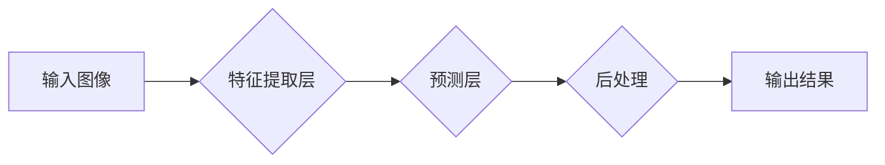

> 交通标志识别，YOLOV5，目标检测，深度学习，计算机视觉

## 1. 背景介绍

交通标志识别是智能交通系统和自动驾驶技术的重要组成部分。它能够帮助车辆识别道路上的交通标志，从而更好地理解道路规则，提高驾驶安全性和效率。随着计算机视觉和深度学习技术的快速发展，交通标志识别技术取得了显著的进展。

传统的交通标志识别方法主要依赖于手工提取的特征，例如颜色、形状和纹理。然而，这些方法对光照变化、角度变化和遮挡等因素较为敏感，识别精度较低。深度学习方法能够自动学习特征，并具有较强的鲁棒性，因此在交通标志识别领域得到了广泛应用。

YOLOv5是近年来非常流行的实时目标检测算法，其速度快、精度高，在交通标志识别任务中表现出色。本文将详细介绍基于YOLOv5的交通标志识别方法，包括算法原理、具体操作步骤、数学模型、代码实现以及实际应用场景。

## 2. 核心概念与联系

### 2.1 目标检测

目标检测是指在图像或视频中识别和定位目标的过程。目标检测算法需要能够识别出图像中的目标，并为每个目标标注出边界框，同时预测目标的类别。

### 2.2 深度学习

深度学习是一种机器学习方法，它利用多层神经网络来学习数据特征。深度学习算法能够自动学习复杂的数据模式，并取得优异的性能。

### 2.3 YOLOv5

YOLOv5是YOLO系列目标检测算法的最新版本，它采用了一种新的网络架构和训练策略，使得其速度更快、精度更高。YOLOv5的优势包括：

* **速度快:** YOLOv5能够实现实时的目标检测速度。
* **精度高:** YOLOv5在多个目标检测基准测试中取得了优异的性能。
* **易于使用:** YOLOv5的代码开源，并且提供了易于使用的API。

**YOLOv5 工作流程图**

## 3. 核心算法原理 & 具体操作步骤

### 3.1 算法原理概述

YOLOv5采用了一种端到端的训练方法，即直接将输入图像映射到目标检测结果。它将图像划分为多个网格单元，每个网格单元负责预测该区域内是否存在目标，以及目标的类别和边界框。

YOLOv5使用了一种新的网络架构，称为CSPDarknet53，它包含了残差连接和跨阶段特征融合模块，能够有效地提取图像特征。

### 3.2 算法步骤详解

1. **输入图像预处理:** 将输入图像调整到指定的大小，并进行归一化处理。
2. **特征提取:** 将预处理后的图像输入到CSPDarknet53网络中，提取图像特征。
3. **预测:** 将提取到的特征输入到预测层，预测每个网格单元内是否存在目标，以及目标的类别和边界框。
4. **后处理:** 对预测结果进行非极大值抑制和边界框回归，得到最终的检测结果。

### 3.3 算法优缺点

**优点:**

* **速度快:** YOLOv5能够实现实时的目标检测速度。
* **精度高:** YOLOv5在多个目标检测基准测试中取得了优异的性能。
* **易于使用:** YOLOv5的代码开源，并且提供了易于使用的API。

**缺点:**

* **对小目标检测能力有限:** YOLOv5对小目标的检测能力相对较弱。
* **训练数据量较大:** YOLOv5需要大量的训练数据才能达到较高的精度。

### 3.4 算法应用领域

YOLOv5在交通标志识别、行人检测、车辆检测、目标跟踪等多个领域都有广泛的应用。

## 4. 数学模型和公式 & 详细讲解 & 举例说明

### 4.1 数学模型构建

YOLOv5的数学模型主要包括以下几个部分:

* **特征提取网络:** CSPDarknet53网络使用卷积层、池化层和激活函数构建，用于提取图像特征。
* **预测层:** 预测层使用卷积层和全连接层，用于预测每个网格单元内是否存在目标，以及目标的类别和边界框。
* **损失函数:** YOLOv5使用了一种改进的损失函数，包括分类损失、边界框回归损失和置信度损失。

### 4.2 公式推导过程

YOLOv5的损失函数可以表示为:

$$
L = L_{cls} + L_{box} + L_{conf}
$$

其中:

* $L_{cls}$ 是分类损失，用于衡量预测类别与真实类别的差异。
* $L_{box}$ 是边界框回归损失，用于衡量预测边界框与真实边界框的差异。
* $L_{conf}$ 是置信度损失，用于衡量预测置信度与真实置信度的差异。

### 4.3 案例分析与讲解

假设我们有一个交通标志图像，其中包含一个“限速20”的交通标志。YOLOv5算法会将图像划分为多个网格单元，并预测每个网格单元内是否存在目标，以及目标的类别和边界框。

如果预测结果显示某个网格单元内存在一个“限速20”的交通标志，则该网格单元的分类损失、边界框回归损失和置信度损失都会被计算。

## 5. 项目实践：代码实例和详细解释说明

### 5.1 开发环境搭建

为了实现基于YOLOv5的交通标志识别，我们需要搭建一个开发环境。

* **操作系统:** Ubuntu 20.04 LTS
* **Python版本:** 3.8
* **深度学习框架:** PyTorch 1.7

### 5.2 源代码详细实现

YOLOv5的源代码开源，可以从官方仓库下载：https://github.com/ultralytics/yolov5

我们可以使用YOLOv5的官方代码作为基础，进行交通标志识别任务的训练和测试。

### 5.3 代码解读与分析

YOLOv5的代码结构清晰，易于理解。

* **train.py:** 用于训练YOLOv5模型。
* **detect.py:** 用于使用训练好的YOLOv5模型进行目标检测。
* **models.py:** 定义了YOLOv5的网络架构。

### 5.4 运行结果展示

训练完成后，我们可以使用YOLOv5模型对交通标志图像进行检测，并得到检测结果。

## 6. 实际应用场景

### 6.1 智能交通系统

基于YOLOv5的交通标志识别技术可以应用于智能交通系统，例如：

* **自动驾驶:** 自动驾驶车辆需要识别道路上的交通标志，以便做出正确的驾驶决策。
* **交通流量管理:** 通过识别交通标志，可以更好地了解交通流量状况，并进行相应的管理。
* **交通安全监控:** 通过识别违反交通规则的行为，可以提高交通安全。

### 6.2 其他应用场景

除了智能交通系统之外，YOLOv5的交通标志识别技术还可以应用于其他领域，例如：

* **城市规划:** 通过识别交通标志，可以更好地了解城市交通状况，并进行相应的规划。
* **道路维护:** 通过识别道路上的损坏交通标志，可以及时进行维修。
* **教育培训:** 可以使用YOLOv5的交通标志识别技术进行交通安全教育培训。

### 6.4 未来应用展望

随着人工智能技术的不断发展，YOLOv5的交通标志识别技术将会得到更广泛的应用。未来，我们可以期待以下应用场景:

* **更精准的识别:** 通过改进算法和训练数据，可以提高交通标志识别的精度。
* **更实时的检测:** 可以开发出更快速的交通标志识别算法，实现更实时的检测。
* **更智能的应用:** 可以将交通标志识别技术与其他人工智能技术结合，开发出更智能的应用，例如自动驾驶车辆的路径规划和决策。

## 7. 工具和资源推荐

### 7.1 学习资源推荐

* **YOLOv5官方文档:** https://docs.ultralytics.com/
* **PyTorch官方文档:** https://pytorch.org/docs/stable/
* **计算机视觉学习资源:** https://www.coursera.org/specializations/computer-vision

### 7.2 开发工具推荐

* **PyCharm:** https://www.jetbrains.com/pycharm/
* **VS Code:** https://code.visualstudio.com/

### 7.3 相关论文推荐

* **YOLOv5: Real-Time Object Detection**
* **CSPDarknet: A New Backbone for Object Detection**

## 8. 总结：未来发展趋势与挑战

### 8.1 研究成果总结

基于YOLOv5的交通标志识别技术取得了显著的进展，能够实现实时、高精度的交通标志识别。

### 8.2 未来发展趋势

未来，交通标志识别技术将会朝着以下方向发展:

* **更精准的识别:** 通过改进算法和训练数据，可以提高交通标志识别的精度。
* **更实时的检测:** 可以开发出更快速的交通标志识别算法，实现更实时的检测。
* **更智能的应用:** 可以将交通标志识别技术与其他人工智能技术结合，开发出更智能的应用，例如自动驾驶车辆的路径规划和决策。

### 8.3 面临的挑战

尽管交通标志识别技术取得了显著的进展，但仍然面临一些挑战:

* **小目标检测:** 对于一些尺寸较小的交通标志，检测精度仍然较低。
* **复杂场景处理:** 在复杂的环境下，例如遮挡、光照变化等情况下，交通标志识别精度可能会下降。
* **数据标注:** 交通标志识别需要大量的标注数据，数据标注工作量较大。

### 8.4 研究展望

未来，我们将继续致力于交通标志识别技术的研究，努力解决上述挑战，开发出更精准、更智能的交通标志识别系统。

## 9. 附录：常见问题与解答

### 9.1 如何训练YOLOv5模型？

可以使用YOLOv5的官方代码进行模型训练。需要准备交通标志数据集，并进行数据预处理。

### 9.2 如何使用YOLOv5模型进行目标检测？

可以使用YOLOv5的`detect.py`脚本进行目标检测。需要将训练好的模型文件和目标图像路径作为输入参数。

### 9.3 YOLOv5模型的精度如何？

YOLOv5在多个目标检测基准测试中取得了优异的性能，其精度取决于训练数据和模型参数的设置。

作者：禅与计算机程序设计艺术 / Zen and the Art of Computer Programming

<end_of_turn>