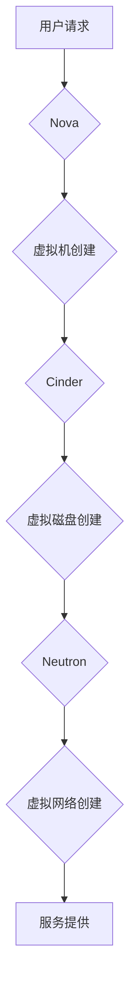

> OpenStack, 云计算, IaaS, PaaS, SaaS,虚拟化,云服务平台

## 1. 背景介绍

云计算作为一种新型的计算模式，以其弹性、可扩展性和按需付费的特点，迅速成为现代企业数字化转型的重要驱动力。OpenStack作为开源的云计算平台，凭借其强大的功能和灵活的架构，在云计算领域占据着重要的地位。

随着云计算技术的不断发展，对云服务平台的需求也越来越高。企业需要构建更加安全、可靠、高效的云服务平台，以满足其业务发展需求。基于OpenStack构建的云服务平台，凭借其开源、可定制和易于扩展的特点，成为企业构建云服务平台的理想选择。

## 2. 核心概念与联系

### 2.1 云计算模型

云计算模型通常分为三种服务模式：

* **IaaS (Infrastructure as a Service):** 提供基础设施资源，如虚拟机、存储和网络，用户可以根据需要配置和管理这些资源。
* **PaaS (Platform as a Service):** 提供开发和部署应用程序的平台，用户可以专注于应用程序开发，而无需关心底层基础设施。
* **SaaS (Software as a Service):** 提供完整的软件应用程序，用户可以通过网络访问和使用这些应用程序。

### 2.2 OpenStack 架构

OpenStack是一个开源的云计算平台，由多个独立的组件组成，每个组件负责特定的功能，例如虚拟化、存储、网络和身份验证。

OpenStack的架构可以概括为以下几个核心组件：

* **Nova (计算服务):** 负责虚拟机创建、管理和调度。
* **Cinder (存储服务):** 提供块存储服务，用户可以创建和管理虚拟磁盘。
* **Neutron (网络服务):** 提供虚拟网络服务，用户可以创建和管理虚拟网络和子网。
* **Keystone (身份认证服务):** 提供身份认证和授权服务，管理用户和资源的访问权限。

**OpenStack 架构流程图**

## 3. 核心算法原理 & 具体操作步骤

### 3.1 算法原理概述

OpenStack平台的核心算法主要涉及虚拟化、存储和网络管理等方面。

* **虚拟化算法:** OpenStack平台使用KVM（Kernel-based Virtual Machine）作为虚拟化引擎，通过将物理资源虚拟化成多个虚拟机，实现资源共享和隔离。

* **存储算法:** OpenStack平台使用Cinder提供块存储服务，采用RAID技术提高存储可靠性和性能。

* **网络算法:** OpenStack平台使用Neutron提供虚拟网络服务，采用软件定义网络（SDN）技术实现网络虚拟化和自动化。

### 3.2 算法步骤详解

**虚拟化算法步骤:**

1. **物理机资源检测:** Nova组件检测物理机的CPU、内存、硬盘等资源。
2. **虚拟机配置:** 用户通过Nova界面配置虚拟机的CPU、内存、硬盘等资源。
3. **虚拟机创建:** Nova组件根据用户配置创建虚拟机镜像，并分配虚拟机资源。
4. **虚拟机启动:** Nova组件启动虚拟机，并将其连接到虚拟网络。

**存储算法步骤:**

1. **存储池创建:** 用户通过Cinder界面创建存储池，并指定存储类型和容量。
2. **虚拟磁盘创建:** 用户通过Cinder界面创建虚拟磁盘，并指定存储池和大小。
3. **虚拟磁盘挂载:** 用户通过虚拟机操作系统挂载虚拟磁盘，并使用虚拟磁盘存储数据。

**网络算法步骤:**

1. **虚拟网络创建:** 用户通过Neutron界面创建虚拟网络，并指定网络类型和子网。
2. **虚拟机网络连接:** 用户通过Nova界面将虚拟机连接到虚拟网络。
3. **网络流量转发:** Neutron组件负责虚拟网络流量的转发和路由。

### 3.3 算法优缺点

**虚拟化算法:**

* **优点:** 资源共享、隔离、弹性、可扩展性。
* **缺点:** 性能损耗、管理复杂度。

**存储算法:**

* **优点:** 数据可靠性、数据备份、数据恢复。
* **缺点:** 存储成本、存储性能。

**网络算法:**

* **优点:** 网络虚拟化、网络自动化、网络安全。
* **缺点:** 网络复杂度、网络管理。

### 3.4 算法应用领域

OpenStack平台的算法应用领域广泛，包括：

* **企业级云计算:** 企业可以使用OpenStack平台构建私有云，提供内部应用和服务的部署和管理。
* **公共云服务:** 云服务提供商可以使用OpenStack平台构建公共云，提供各种云计算服务给用户。
* **大数据分析:** OpenStack平台可以用于构建大数据分析平台，提供大数据存储、处理和分析服务。
* **物联网:** OpenStack平台可以用于构建物联网平台，提供物联网设备的连接、管理和数据分析服务。

## 4. 数学模型和公式 & 详细讲解 & 举例说明

### 4.1 数学模型构建

OpenStack平台的资源调度和虚拟机放置问题可以建模为一个优化问题，目标是最大化资源利用率，同时满足虚拟机的资源需求。

**资源利用率模型:**

$$
Utilization = \frac{Total Resource Used}{Total Available Resource}
$$

**虚拟机资源需求模型:**

$$
Resource_{VM} = CPU_{VM} + Memory_{VM} + Storage_{VM}
$$

### 4.2 公式推导过程

为了最大化资源利用率，可以采用贪婪算法或遗传算法等优化算法进行虚拟机放置。

**贪婪算法:**

1. 从待放置的虚拟机列表中选择资源需求最小的虚拟机。
2. 在所有可用的物理机中选择资源最充足的物理机。
3. 将虚拟机放置到选择的物理机上。
4. 重复步骤1-3，直到所有虚拟机都被放置。

**遗传算法:**

1. 创建一个虚拟机放置方案的种群。
2. 计算每个方案的适应度值，即资源利用率。
3. 选择适应度值最高的方案进行交叉和变异操作。
4. 重复步骤2-3，直到找到最优的虚拟机放置方案。

### 4.3 案例分析与讲解

假设有5个虚拟机需要放置，每个虚拟机的资源需求如下：

* 虚拟机1: CPU=1, Memory=2GB, Storage=10GB
* 虚拟机2: CPU=2, Memory=4GB, Storage=20GB
* 虚拟机3: CPU=1, Memory=2GB, Storage=10GB
* 虚拟机4: CPU=2, Memory=4GB, Storage=20GB
* 虚拟机5: CPU=1, Memory=2GB, Storage=10GB

假设有3个物理机，每个物理机的资源如下：

* 物理机1: CPU=4, Memory=8GB, Storage=40GB
* 物理机2: CPU=2, Memory=4GB, Storage=20GB
* 物理机3: CPU=2, Memory=4GB, Storage=20GB

可以使用贪婪算法或遗传算法将虚拟机放置到物理机上，以最大化资源利用率。

## 5. 项目实践：代码实例和详细解释说明

### 5.1 开发环境搭建

* 操作系统: Ubuntu 20.04 LTS
* 虚拟化软件: KVM
* OpenStack 版本: Rocky

### 5.2 源代码详细实现

OpenStack平台的源代码可以在官方网站上下载：https://docs.openstack.org/

### 5.3 代码解读与分析

OpenStack平台的源代码主要由以下几个部分组成:

* **Nova:** 负责虚拟机创建、管理和调度。
* **Cinder:** 提供块存储服务。
* **Neutron:** 提供虚拟网络服务。
* **Keystone:** 提供身份认证和授权服务。

### 5.4 运行结果展示

OpenStack平台的运行结果可以查看控制台日志和监控页面。

## 6. 实际应用场景

### 6.1 企业级云计算

企业可以使用OpenStack平台构建私有云，提供内部应用和服务的部署和管理。

### 6.2 公共云服务

云服务提供商可以使用OpenStack平台构建公共云，提供各种云计算服务给用户。

### 6.3 大数据分析

OpenStack平台可以用于构建大数据分析平台，提供大数据存储、处理和分析服务。

### 6.4 未来应用展望

OpenStack平台在未来将继续发展，并应用于更多领域，例如：

* **边缘计算:** OpenStack可以用于构建边缘计算平台，提供边缘设备的连接、管理和数据处理服务。
* **人工智能:** OpenStack可以用于构建人工智能平台，提供人工智能模型的训练和部署服务。
* **区块链:** OpenStack可以用于构建区块链平台，提供区块链节点的管理和数据存储服务。

## 7. 工具和资源推荐

### 7.1 学习资源推荐

* OpenStack官方文档: https://docs.openstack.org/
* OpenStack官方博客: https://blog.openstack.org/
* OpenStack社区论坛: https://discuss.openstack.org/

### 7.2 开发工具推荐

* OpenStack CLI: https://docs.openstack.org/newton/install-guide/cli.html
* OpenStack Dashboard: https://docs.openstack.org/newton/admin-guide/dashboard.html

### 7.3 相关论文推荐

* OpenStack: A Cloud Computing Platform for the Enterprise
* OpenStack: A Survey of Architecture, Components, and Applications
* OpenStack: A Scalable and Flexible Cloud Computing Platform

## 8. 总结：未来发展趋势与挑战

### 8.1 研究成果总结

OpenStack平台已经成为云计算领域的重要开源项目，其强大的功能和灵活的架构，为企业和云服务提供商提供了构建云服务平台的理想选择。

### 8.2 未来发展趋势

OpenStack平台将继续朝着以下方向发展:

* **更强的虚拟化能力:** 支持更先进的虚拟化技术，例如容器化和微服务化。
* **更完善的自动化功能:** 提供更强大的自动化工具，简化云平台的管理和运维。
* **更丰富的服务生态:** 扩展OpenStack平台的服务生态，提供更多类型的云计算服务。

### 8.3 面临的挑战

OpenStack平台也面临着一些挑战:

* **社区参与度:** 需要吸引更多开发者和贡献者参与到OpenStack平台的开发和维护中。
* **技术复杂度:** OpenStack平台的架构和功能比较复杂，需要专业的技术人员进行管理和运维。
* **商业模式:** 需要探索更合理的商业模式，以支持OpenStack平台的持续发展。

### 8.4 研究展望

未来，OpenStack平台将继续发展壮大，并成为云计算领域的主流平台。

## 9. 附录：常见问题与解答

### 9.1 如何安装OpenStack平台?

OpenStack平台的安装过程比较复杂，需要参考官方文档进行操作。

### 9.2 如何管理OpenStack平台?

OpenStack平台可以使用CLI、Dashboard和API进行管理。

### 9.3 如何使用OpenStack平台构建云服务?

OpenStack平台提供了丰富的服务组件，可以根据需求构建各种类型的云服务。

作者：禅与计算机程序设计艺术 / Zen and the Art of Computer Programming

<end_of_turn>