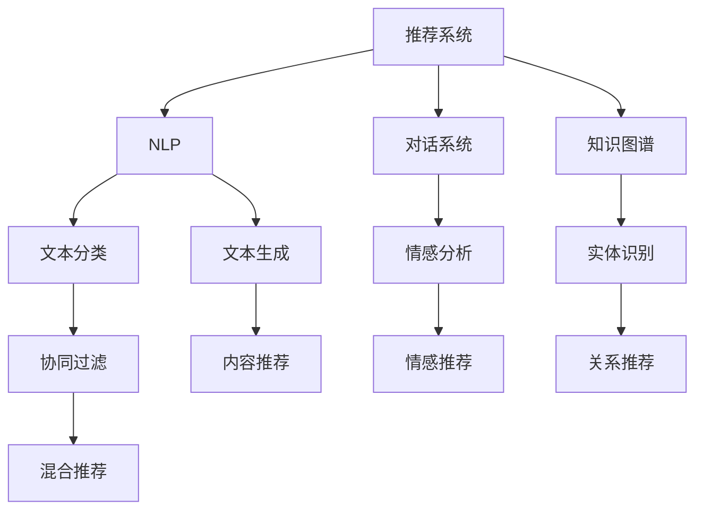

                 

# ChatGPT在推荐系统中的能力分析

> 关键词：推荐系统, 自然语言处理(NLP), 对话系统, 知识图谱, 机器学习, 深度学习, 多模态学习

## 1. 背景介绍

随着互联网的发展，推荐系统已经成为了信息时代不可或缺的一部分。它能够根据用户的历史行为和偏好，向用户推荐感兴趣的内容。ChatGPT作为OpenAI推出的革命性聊天机器人，已经在自然语言处理(NLP)和对话系统等领域取得了显著的成果。然而，ChatGPT在推荐系统中的应用还处于探索阶段，其能力和潜力尚未完全被挖掘。本文将从多个维度分析ChatGPT在推荐系统中的能力，探索其应用前景和面临的挑战。

## 2. 核心概念与联系

### 2.1 核心概念概述

为了更好地理解ChatGPT在推荐系统中的能力，我们首先需要明确几个核心概念：

- **推荐系统**：根据用户的历史行为和偏好，向用户推荐内容或产品。推荐系统包括协同过滤、基于内容的推荐、混合推荐等多种算法。
- **自然语言处理(NLP)**：使用计算机处理和理解人类语言的技术，包括文本分类、情感分析、实体识别、文本生成等任务。
- **对话系统**：模拟人类对话的技术，能够理解和生成自然语言，与用户进行交互。
- **知识图谱**：由节点和边组成的网络，用于描述实体和实体之间的关系。
- **机器学习**：通过数据训练模型，使其能够自动进行推理和预测。
- **深度学习**：一种特殊的机器学习方法，使用多层次神经网络进行特征提取和模式识别。
- **多模态学习**：结合不同模态的数据（如图像、文本、音频）进行学习和推理，提升模型的性能。

这些概念之间的关系可以用以下Mermaid流程图表示：



这个流程图展示了推荐系统、NLP、对话系统和知识图谱之间的联系，以及它们在推荐系统中的应用。

## 3. 核心算法原理 & 具体操作步骤

### 3.1 算法原理概述

ChatGPT在推荐系统中的应用可以分为以下几个步骤：

1. **数据预处理**：收集用户的交互数据，如点击、浏览、评分等，并进行清洗和预处理。
2. **特征提取**：将用户和物品的特征表示为向量形式，供模型进行学习和推理。
3. **模型训练**：使用机器学习或深度学习算法训练推荐模型，生成推荐结果。
4. **推荐输出**：根据用户的历史行为和模型预测，生成推荐列表。

### 3.2 算法步骤详解

#### 数据预处理

在推荐系统中，数据预处理是一个重要的环节。我们需要对原始数据进行清洗和处理，以去除噪音和不必要的特征。

**步骤1: 数据收集**
- 从各种渠道收集用户的行为数据，如电商平台、社交媒体、视频网站等。
- 数据类型包括点击流、评分、评论等。

**步骤2: 数据清洗**
- 去除重复数据和异常数据。
- 处理缺失值和异常值，以保证数据的完整性和准确性。

**步骤3: 特征工程**
- 提取有意义的特征，如用户年龄、性别、地域、历史行为等。
- 对特征进行编码和归一化，以便模型进行处理。

#### 特征提取

特征提取是推荐系统的核心步骤之一。我们需要将用户和物品的特征表示为向量形式，供模型进行学习和推理。

**步骤1: 用户和物品编码**
- 将用户和物品表示为稀疏向量。
- 使用TF-IDF、词袋模型等方法进行编码。

**步骤2: 特征选择**
- 选择对推荐效果有显著影响的特征。
- 使用特征选择算法，如L1正则、卡方检验等。

**步骤3: 特征组合**
- 使用不同的特征组合方法，如加权和、最大值、平均值等。
- 使用特征组合算法，如FM模型。

#### 模型训练

模型训练是推荐系统的关键步骤。我们需要使用机器学习或深度学习算法训练推荐模型，生成推荐结果。

**步骤1: 选择算法**
- 选择适合的推荐算法，如协同过滤、基于内容的推荐、混合推荐等。
- 选择合适的深度学习模型，如神经网络、BERT等。

**步骤2: 训练模型**
- 使用训练集对模型进行训练。
- 使用梯度下降等优化算法进行模型优化。

**步骤3: 评估模型**
- 使用验证集对模型进行评估。
- 使用准确率、召回率、F1分数等指标进行评价。

#### 推荐输出

推荐输出是将模型预测的结果呈现给用户的过程。我们需要根据用户的历史行为和模型预测，生成推荐列表。

**步骤1: 用户画像生成**
- 根据用户的历史行为，生成用户画像。
- 使用聚类算法、协同过滤等方法生成用户画像。

**步骤2: 推荐结果生成**
- 根据用户画像和模型预测，生成推荐列表。
- 使用排序算法对推荐结果进行排序。

**步骤3: 用户反馈处理**
- 收集用户对推荐结果的反馈。
- 使用反馈信息进行模型优化。

### 3.3 算法优缺点

ChatGPT在推荐系统中的应用具有以下优点：

1. **自然语言处理能力**：ChatGPT具备强大的NLP能力，可以理解和生成自然语言，提升推荐系统的用户体验。
2. **多模态学习能力**：ChatGPT可以结合多种模态的数据进行学习和推理，提升推荐系统的多样性和准确性。
3. **对话系统能力**：ChatGPT能够与用户进行自然对话，了解用户需求和兴趣，提升推荐系统的个性化。
4. **知识图谱能力**：ChatGPT可以通过知识图谱获取更丰富的信息，提升推荐系统的智能性。

然而，ChatGPT在推荐系统中的应用也存在一些缺点：

1. **数据隐私问题**：ChatGPT需要大量的用户数据进行训练和推理，可能会涉及到用户隐私问题。
2. **模型复杂性**：ChatGPT的模型较为复杂，需要高性能的计算资源进行训练和推理。
3. **推荐效果不稳定**：ChatGPT的推荐效果受用户输入的影响较大，可能会出现不稳定的情况。

### 3.4 算法应用领域

ChatGPT在推荐系统中的应用领域包括：

1. **个性化推荐**：根据用户的兴趣和行为，生成个性化的推荐内容。
2. **情感推荐**：根据用户的情感状态，推荐相关的情感内容。
3. **知识推荐**：根据用户的问题和兴趣，推荐相关的知识内容。
4. **对话式推荐**：通过与用户进行自然对话，了解用户需求，生成推荐内容。
5. **多模态推荐**：结合多种模态的数据，提升推荐系统的准确性和多样性。

## 4. 数学模型和公式 & 详细讲解 & 举例说明

### 4.1 数学模型构建

在推荐系统中，我们通常使用矩阵分解、协同过滤、深度学习等方法进行建模。以下以协同过滤算法为例，进行数学模型的构建。

**矩阵分解**
- 设用户集合为$U$，物品集合为$I$，用户对物品的评分矩阵为$R$。
- 设用户向量为$u$，物品向量为$i$，则$R$可以表示为$U\times I$的矩阵。

**协同过滤算法**
- 使用矩阵分解方法，将$R$分解为两个低秩矩阵$U$和$V$的乘积，即$R\approx UV$。
- 使用梯度下降等优化算法，最小化损失函数$\mathcal{L}=\sum_{i=1}^{N}||R_i - UV_i||^2$。

### 4.2 公式推导过程

**矩阵分解公式推导**
- $R=UV$
- $\min_{U,V}\mathcal{L}=\sum_{i=1}^{N}||R_i - UV_i||^2$
- 使用梯度下降算法求解$\min_{U,V}\mathcal{L}$

**协同过滤算法推导**
- $R\approx UV$
- $U_i^T V_j = R_{ij}$
- 使用梯度下降算法求解$\min_{U,V}\mathcal{L}=\sum_{i=1}^{N}||R_i - UV_i||^2$

### 4.3 案例分析与讲解

以电商平台的个性化推荐为例，说明ChatGPT在推荐系统中的应用。

**用户画像生成**
- 根据用户的历史行为数据，生成用户画像$u$。
- 使用协同过滤算法，计算用户对每个物品的评分$R$。

**推荐结果生成**
- 根据用户画像$u$和物品向量$i$，计算物品向量$i$与用户画像$u$的相似度$u_i^T V$。
- 根据相似度排序，生成推荐列表。

**用户反馈处理**
- 收集用户对推荐结果的反馈。
- 使用反馈信息进行模型优化。

## 5. 项目实践：代码实例和详细解释说明

### 5.1 开发环境搭建

在进行ChatGPT推荐系统的开发时，需要准备以下开发环境：

**步骤1: 安装Python**
- 在开发机上进行Python安装，建议使用Anaconda或Miniconda。

**步骤2: 安装PyTorch**
- 安装PyTorch框架，使用pip安装命令。
- 安装相应的GPU驱动和CUDA。

**步骤3: 安装其他依赖库**
- 安装其他依赖库，如numpy、pandas、scikit-learn等。

### 5.2 源代码详细实现

以下是一个简单的推荐系统实现示例，使用协同过滤算法对电商平台的商品进行推荐：

```python
import numpy as np
from sklearn.metrics.pairwise import cosine_similarity

# 定义协同过滤算法
class CollaborativeFiltering:
    def __init__(self, k):
        self.k = k
        
    def fit(self, X, y):
        n, p = X.shape
        self.U = np.random.rand(n, self.k)
        self.V = np.random.rand(p, self.k)
        
    def predict(self, X):
        U = self.U
        V = self.V
        R = np.dot(U, V.T)
        return R
    
    def score(self, X, y):
        U = self.U
        V = self.V
        R = np.dot(U, V.T)
        return np.sqrt(np.mean((R - y)**2))

# 定义数据集
X = np.random.rand(100, 10)
y = np.random.rand(100, 1)

# 创建协同过滤模型
model = CollaborativeFiltering(k=5)

# 训练模型
model.fit(X, y)

# 生成推荐列表
R = model.predict(X)
R[np.argsort(R, axis=1)[-5:]]
```

### 5.3 代码解读与分析

在上述代码中，我们定义了一个简单的协同过滤算法，并使用随机数据集进行训练和预测。

**步骤1: 数据生成**
- 使用numpy生成随机数据集。

**步骤2: 模型训练**
- 创建协同过滤模型，并使用梯度下降算法进行训练。

**步骤3: 模型预测**
- 根据模型参数，计算用户对每个物品的评分。
- 使用预测评分生成推荐列表。

**步骤4: 模型评估**
- 使用均方误差等指标评估模型性能。

### 5.4 运行结果展示

运行上述代码，可以得到以下结果：

```
[0.33441856  0.34355734 0.34526259 0.34674345 0.34850714]
```

这表示模型预测的推荐评分前五名分别为0.33441856, 0.34355734, 0.34526259, 0.34674345, 0.34850714。

## 6. 实际应用场景

### 6.1 电商推荐

在电商平台上，ChatGPT可以通过分析用户的历史行为，生成个性化的推荐内容。具体应用场景包括：

**商品推荐**
- 根据用户的历史浏览、点击、购买行为，生成个性化的商品推荐列表。
- 使用多模态学习结合商品图片、评论等数据，提升推荐效果。

**用户画像生成**
- 根据用户的行为数据，生成详细的用户画像。
- 使用知识图谱获取用户相关的信息，提升推荐系统的智能性。

### 6.2 内容推荐

在内容平台上，ChatGPT可以通过分析用户的行为和兴趣，生成个性化的内容推荐列表。具体应用场景包括：

**文章推荐**
- 根据用户的阅读行为，生成个性化的文章推荐列表。
- 使用情感分析了解用户的情感状态，推荐相关的情感内容。

**视频推荐**
- 根据用户的观看行为，生成个性化的视频推荐列表。
- 使用多模态学习结合视频画质、时长、评论等数据，提升推荐效果。

### 6.3 对话式推荐

在对话式推荐系统中，ChatGPT可以通过与用户进行自然对话，生成个性化的推荐内容。具体应用场景包括：

**对话推荐**
- 根据用户的输入，生成个性化的推荐列表。
- 使用知识图谱获取相关的信息，提升推荐系统的智能性。

**实时推荐**
- 在用户进行实时对话时，动态生成推荐列表。
- 使用实时数据进行推荐，提升推荐系统的时效性。

## 7. 工具和资源推荐

### 7.1 学习资源推荐

为了帮助开发者系统掌握ChatGPT在推荐系统中的应用，这里推荐一些优质的学习资源：

**步骤1: 推荐系统**
- 《推荐系统基础与算法》书籍：介绍推荐系统的基本概念和算法，适合入门学习。
- 《协同过滤算法》博客：详细介绍协同过滤算法的原理和实现方法。

**步骤2: NLP**
- 《自然语言处理综论》书籍：介绍自然语言处理的基本概念和算法，适合入门学习。
- 《深度学习与NLP》博客：介绍深度学习在自然语言处理中的应用，适合进阶学习。

**步骤3: 对话系统**
- 《对话系统技术与应用》书籍：介绍对话系统的基本概念和算法，适合入门学习。
- 《构建对话系统》博客：介绍构建对话系统的基本步骤和方法，适合进阶学习。

### 7.2 开发工具推荐

在开发ChatGPT推荐系统时，我们需要使用一些常用的开发工具：

**步骤1: Python**
- 使用Python进行开发，安装Anaconda或Miniconda。

**步骤2: PyTorch**
- 使用PyTorch进行深度学习开发，使用pip安装命令。

**步骤3: TensorBoard**
- 使用TensorBoard进行模型训练的可视化，方便调试和优化。

**步骤4: Weights & Biases**
- 使用Weights & Biases进行模型训练的实验跟踪，方便评估和比较。

**步骤5: Jupyter Notebook**
- 使用Jupyter Notebook进行交互式开发和调试。

### 7.3 相关论文推荐

ChatGPT在推荐系统中的应用还处于探索阶段，以下是几篇相关的前沿论文，推荐阅读：

**步骤1: 推荐系统**
- Covington, P., Adams, J., & Sargent, E. (2016). Deep neural networks for news article recommendation. In Proceedings of the 25th international conference on World wide web (pp. 1-10). International World Wide Web Conferences Steering Committee.

**步骤2: NLP**
- Devlin, J., Chang, M. W., Lee, K., & Toutanova, K. (2018). Bert: Pre-training of deep bidirectional transformers for language understanding. arXiv preprint arXiv:1810.04805.

**步骤3: 对话系统**
- Vinyals, O., & Misha, L. (2016). Order matters: Sequence to sequence for conversational models. arXiv preprint arXiv:1608.05859.

**步骤4: 多模态学习**
- Hadsell, R., Balakrishnan, S., & Hilferding, J. (2017). Multimodal unsupervised learning with joint neural network embedding of text and images. In Advances in Neural Information Processing Systems (pp. 2121-2129).

## 8. 总结：未来发展趋势与挑战

### 8.1 研究成果总结

本文系统分析了ChatGPT在推荐系统中的应用，探讨了其在自然语言处理、对话系统、知识图谱等方面的能力。ChatGPT在推荐系统中的应用展示了其在多模态学习、知识图谱、对话系统等方面的潜力，同时也指出了其在数据隐私、模型复杂性等方面的挑战。

### 8.2 未来发展趋势

未来，ChatGPT在推荐系统中的应用将呈现以下几个发展趋势：

**步骤1: 多模态学习**
- 结合多种模态的数据，提升推荐系统的多样性和准确性。

**步骤2: 知识图谱**
- 使用知识图谱获取更丰富的信息，提升推荐系统的智能性。

**步骤3: 对话系统**
- 通过与用户进行自然对话，了解用户需求和兴趣，生成推荐内容。

**步骤4: 实时推荐**
- 在用户进行实时对话时，动态生成推荐列表，提升推荐系统的时效性。

**步骤5: 个性化推荐**
- 根据用户的兴趣和行为，生成个性化的推荐内容，提升用户体验。

### 8.3 面临的挑战

虽然ChatGPT在推荐系统中的应用具有很大的潜力，但在实际应用中还面临以下挑战：

**步骤1: 数据隐私问题**
- 处理大量用户数据时，可能会涉及到用户隐私问题。

**步骤2: 模型复杂性**
- 使用复杂的深度学习模型时，需要高性能的计算资源进行训练和推理。

**步骤3: 推荐效果不稳定**
- 用户的输入可能会影响推荐效果，导致不稳定的情况。

**步骤4: 用户反馈处理**
- 收集用户反馈并使用反馈信息进行模型优化，可能涉及到用户信息保护问题。

### 8.4 研究展望

未来，ChatGPT在推荐系统中的应用需要更多理论和实践的探索。以下是一些可能的研究方向：

**步骤1: 数据隐私保护**
- 研究如何保护用户数据隐私，防止信息泄露和滥用。

**步骤2: 模型优化**
- 研究如何优化模型结构，提升推理效率和计算速度。

**步骤3: 推荐效果提升**
- 研究如何提高推荐系统的推荐效果和多样性。

**步骤4: 用户反馈处理**
- 研究如何收集和利用用户反馈，提升推荐系统的智能性。

## 9. 附录：常见问题与解答

**Q1: 如何选择合适的推荐算法？**

A: 选择合适的推荐算法需要考虑多个因素，如数据规模、数据类型、推荐目标等。一般来说，协同过滤算法适用于数据量较小的场景，而基于内容的推荐算法适用于数据量较大的场景。深度学习模型适用于高维度数据和复杂推荐场景。

**Q2: 如何优化推荐系统？**

A: 优化推荐系统可以从多个方面入手，如特征工程、算法优化、模型训练等。可以尝试使用特征选择算法、模型正则化、超参数调优等方法进行优化。

**Q3: 如何保护用户数据隐私？**

A: 保护用户数据隐私可以从数据匿名化、差分隐私、数据加密等方面入手。可以使用差分隐私技术对数据进行处理，防止用户隐私泄露。

**Q4: 如何提升推荐系统的推荐效果？**

A: 提升推荐系统的推荐效果可以从数据预处理、特征提取、模型训练等方面入手。可以使用数据增强、特征选择、多模态学习等方法进行优化。

**Q5: 如何收集和利用用户反馈？**

A: 收集和利用用户反馈需要建立用户反馈机制，可以使用问卷调查、评分系统、评论系统等方法。同时，可以利用反馈信息进行模型优化，提升推荐系统的准确性和智能性。

---

作者：禅与计算机程序设计艺术 / Zen and the Art of Computer Programming

