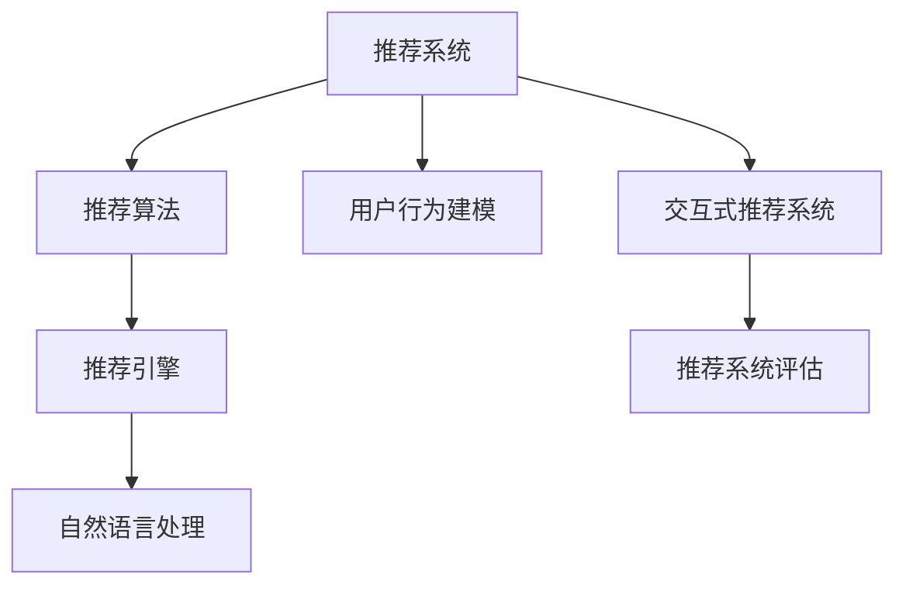

                 

# Chat-Rec的优势：交互式推荐系统的进步

> 关键词：Chat-Rec, 交互式推荐系统, 推荐算法, 用户行为建模, 自然语言处理(NLP), 推荐系统评估, 推荐引擎, 交互式反馈, 深度学习, 推荐个性化, 推荐多样性

## 1. 背景介绍

### 1.1 问题由来
随着电商、社交、媒体等平台的快速发展，用户产生的海量行为数据为推荐系统提供了丰富的数据来源。推荐系统旨在根据用户的历史行为和当前兴趣，为用户推荐更符合其需求的商品、信息等内容。然而，传统的推荐系统往往以物品为单位，忽略了用户的多样化需求和个性化特点，导致推荐效果不尽如人意。为了解决这一问题，一种新型的推荐系统——交互式推荐系统应运而生。

### 1.2 问题核心关键点
交互式推荐系统（Interactive Recommendation System）旨在通过实时获取用户反馈，不断调整推荐策略，提供更加个性化和多样化的推荐。其核心思想是在推荐过程中引入交互反馈机制，利用用户的选择和评价数据，实时优化推荐模型，从而提升推荐效果。

这种推荐系统的特点包括：
- 实时性和动态性：通过实时获取用户反馈，动态调整推荐策略。
- 个性化：基于用户的历史行为和实时反馈，提供个性化的推荐。
- 多样性：通过交互反馈，引入多样化选择，提升用户体验。
- 模型复杂性：需要设计复杂的交互模型，同时实时更新模型参数。

交互式推荐系统已经在多个领域得到广泛应用，如电商平台的商品推荐、视频网站的个性化推荐、社交平台的兴趣推荐等。

## 2. 核心概念与联系

### 2.1 核心概念概述

为更好地理解交互式推荐系统的核心概念，本节将介绍几个密切相关的核心概念：

- **推荐系统（Recommendation System）**：通过分析用户的历史行为和偏好，为用户推荐合适的商品、信息等内容的系统。传统的推荐系统多采用协同过滤、矩阵分解等技术。
- **交互式推荐系统（Interactive Recommendation System）**：在推荐过程中引入用户反馈机制，通过实时调整推荐策略，提供更个性化和多样化的推荐。
- **用户行为建模（User Behavior Modeling）**：通过分析和建模用户的行为特征，为推荐系统提供输入。常用的行为特征包括浏览历史、点击记录、购买记录等。
- **推荐算法（Recommendation Algorithms）**：推荐系统实现的核心，包括基于内容的推荐、协同过滤、深度学习等。
- **自然语言处理（NLP）**：用于处理和理解用户的自然语言反馈，提取用户意图和情感信息。
- **推荐系统评估（Recommendation System Evaluation）**：通过预设的指标（如准确率、召回率、个性化、多样性等）评估推荐系统的性能。
- **推荐引擎（Recommendation Engine）**：推荐系统实现的核心组件，包括推荐算法、数据存储、推理机制等。

这些核心概念之间的逻辑关系可以通过以下Mermaid流程图来展示：



这个流程图展示了几大核心概念及其之间的关系：

1. 推荐系统通过用户行为建模获取输入，结合推荐算法输出推荐结果。
2. 交互式推荐系统在此基础上引入实时反馈，通过动态调整模型提升推荐效果。
3. 自然语言处理技术用于处理用户反馈，提取用户意图和情感信息。
4. 推荐系统评估用于评估推荐系统性能，指导模型的优化和改进。

## 3. 核心算法原理 & 具体操作步骤
### 3.1 算法原理概述

交互式推荐系统的核心算法原理可以概括为以下几个关键步骤：

1. **用户行为建模**：通过分析和建模用户的历史行为，提取用户的兴趣和偏好。
2. **推荐算法选择**：根据任务特点选择合适的推荐算法，如协同过滤、基于内容的推荐、深度学习等。
3. **交互反馈机制**：在推荐过程中引入交互反馈机制，实时获取用户的选择和评价数据。
4. **推荐策略调整**：根据用户反馈，动态调整推荐策略，提升个性化和多样性。
5. **实时更新模型**：在反馈数据的基础上，实时更新推荐模型，保持推荐策略的准确性和时效性。

### 3.2 算法步骤详解

以下将详细介绍交互式推荐系统的核心算法步骤：

**Step 1: 用户行为建模**

用户行为建模是交互式推荐系统的第一步，目的是提取用户的历史行为特征。常用的用户行为建模方法包括：

- **协同过滤（Collaborative Filtering）**：通过分析用户的历史行为，寻找相似用户或物品，推测用户对新物品的兴趣。
- **矩阵分解（Matrix Factorization）**：将用户-物品评分矩阵分解为低秩矩阵，通过学习用户和物品的隐向量表示，预测用户对新物品的评分。
- **深度学习（Deep Learning）**：通过神经网络模型，从用户行为数据中学习用户和物品的复杂关系，提升推荐效果。

在实践中，我们需要收集用户的历史行为数据，如浏览历史、点击记录、购买记录等，将其编码成向量形式，用于后续推荐算法和模型训练。

**Step 2: 推荐算法选择**

根据任务特点选择合适的推荐算法。常用的推荐算法包括：

- **基于内容的推荐（Content-Based Recommendation）**：根据物品的特征与用户的历史行为匹配，推荐用户可能感兴趣的新物品。
- **协同过滤（Collaborative Filtering）**：通过分析用户的历史行为，寻找相似用户或物品，推测用户对新物品的兴趣。
- **深度学习（Deep Learning）**：利用神经网络模型，从用户行为数据中学习复杂的用户和物品关系。

在实践中，我们需要根据任务特点选择最合适的推荐算法，并使用该算法训练推荐模型。

**Step 3: 交互反馈机制**

在推荐过程中引入交互反馈机制，实时获取用户的选择和评价数据。常用的交互反馈方式包括：

- **点击反馈**：用户在浏览过程中点击物品，表示对该物品感兴趣。
- **评分反馈**：用户对推荐物品给出评分，表示对该物品的满意度。
- **评论反馈**：用户在物品页面上留下评论，表达对物品的看法。

交互反馈数据可以帮助我们了解用户的真实兴趣和偏好，进而优化推荐策略。

**Step 4: 推荐策略调整**

根据用户反馈，动态调整推荐策略，提升个性化和多样性。常用的推荐策略调整方法包括：

- **个性化推荐**：根据用户的历史行为和实时反馈，调整推荐算法参数，提供个性化的推荐。
- **多样化推荐**：在推荐结果中加入多样化选择，避免过度集中。
- **动态调整**：实时更新推荐策略，根据用户反馈调整模型参数。

**Step 5: 实时更新模型**

在反馈数据的基础上，实时更新推荐模型，保持推荐策略的准确性和时效性。常用的实时更新方法包括：

- **在线学习（Online Learning）**：通过实时更新模型参数，保持模型与时俱进。
- **增量学习（Incremental Learning）**：在新的反馈数据上更新模型参数，避免大规模重训练。
- **自适应学习（Adaptive Learning）**：根据用户反馈，自适应地调整学习策略。

### 3.3 算法优缺点

交互式推荐系统具有以下优点：

- **实时性和动态性**：通过实时获取用户反馈，动态调整推荐策略，提升推荐效果。
- **个性化和多样性**：通过个性化推荐和多样化选择，提升用户体验。
- **模型复杂性**：需要设计复杂的交互模型，同时实时更新模型参数。

同时，该方法也存在一定的局限性：

- **数据依赖性**：对用户反馈数据的质量和数量依赖较大，反馈数据的质量会直接影响推荐效果。
- **计算复杂性**：需要实时更新模型参数，计算复杂度较高，对算力和存储资源要求较高。
- **隐私问题**：在实时获取用户反馈时，需要考虑用户隐私问题，避免数据泄露。
- **反馈偏差**：用户反馈数据可能存在偏差，影响推荐模型的公平性。

尽管存在这些局限性，但交互式推荐系统凭借其强大的个性化和多样性优势，在推荐系统领域得到了广泛应用，成为推荐系统研究的新热点。

### 3.4 算法应用领域

交互式推荐系统已经在多个领域得到广泛应用，如电商平台的商品推荐、视频网站的个性化推荐、社交平台的兴趣推荐等。

- **电商平台的商品推荐**：通过实时获取用户点击和评分反馈，动态调整推荐策略，提升推荐效果。
- **视频网站的个性化推荐**：通过分析用户的观看历史和实时反馈，推荐用户感兴趣的视频内容。
- **社交平台的兴趣推荐**：通过用户互动行为和实时反馈，推荐用户感兴趣的朋友和内容。

除了上述这些经典应用外，交互式推荐系统还在新闻推荐、音乐推荐、游戏推荐等领域得到应用，为推荐系统带来新的突破。

## 4. 数学模型和公式 & 详细讲解 & 举例说明

### 4.1 数学模型构建

本节将使用数学语言对交互式推荐系统的核心模型进行严格描述。

假设用户集合为 $U$，物品集合为 $I$，历史行为矩阵为 $\mathbf{R} \in \mathbb{R}^{m \times n}$，其中 $m$ 为用户数，$n$ 为物品数。用户对物品的评分向量为 $\mathbf{u} \in \mathbb{R}^n$，物品的特征向量为 $\mathbf{v} \in \mathbb{R}^n$。推荐系统将用户和物品的评分矩阵 $\mathbf{R}$ 分解为低秩矩阵 $\mathbf{U} \in \mathbb{R}^{m \times r}$ 和 $\mathbf{V} \in \mathbb{R}^{n \times r}$，其中 $r$ 为隐向量维度。推荐系统预测用户对物品的评分 $\hat{r}_{ui}$ 可通过 $\mathbf{u}_i$ 和 $\mathbf{v}_j$ 的乘积计算得到：

$$
\hat{r}_{ui} = \mathbf{u}_i^\top \mathbf{v}_j
$$

在实际应用中，我们通常使用矩阵分解和深度学习模型来构建推荐系统。以深度学习模型为例，假设用户行为数据为 $\mathbf{X} \in \mathbb{R}^{m \times d}$，其中 $d$ 为特征维度，推荐模型 $f$ 将用户行为数据映射到用户评分预测向量 $\hat{\mathbf{r}} \in \mathbb{R}^n$。推荐模型的参数为 $\theta$，可以通过反向传播算法进行优化：

$$
\hat{\mathbf{r}} = f(\mathbf{X}, \theta)
$$

在得到预测评分后，推荐系统根据评分预测向量 $\hat{\mathbf{r}}$ 和用户历史行为数据 $\mathbf{X}$ 生成推荐列表。

### 4.2 公式推导过程

以下我们以基于矩阵分解的推荐系统为例，推导推荐评分预测公式。

假设用户行为矩阵 $\mathbf{R} \in \mathbb{R}^{m \times n}$，用户行为向量为 $\mathbf{u}_i \in \mathbb{R}^n$，物品特征向量为 $\mathbf{v}_j \in \mathbb{R}^n$，推荐模型预测用户对物品的评分 $\hat{r}_{ui}$ 为：

$$
\hat{r}_{ui} = \mathbf{u}_i^\top \mathbf{v}_j
$$

将 $\mathbf{R}$ 分解为低秩矩阵 $\mathbf{U} \in \mathbb{R}^{m \times r}$ 和 $\mathbf{V} \in \mathbb{R}^{n \times r}$，其中 $r$ 为隐向量维度。则用户行为向量 $\mathbf{u}_i$ 和物品特征向量 $\mathbf{v}_j$ 可以表示为：

$$
\mathbf{u}_i = \mathbf{U}_{:,i}
$$

$$
\mathbf{v}_j = \mathbf{V}_{j,:}
$$

其中 $\mathbf{U}_{:,i}$ 表示 $\mathbf{U}$ 矩阵的第 $i$ 列，$\mathbf{V}_{j,:}$ 表示 $\mathbf{V}$ 矩阵的第 $j$ 行。

将上述表达式代入推荐评分预测公式中，得到：

$$
\hat{r}_{ui} = \mathbf{U}_{:,i}^\top \mathbf{V}_{j,:}
$$

进一步简化，得到推荐评分预测公式：

$$
\hat{r}_{ui} = \sum_{k=1}^{r} \mathbf{U}_{:,i,k} \cdot \mathbf{V}_{j,k}
$$

其中 $\mathbf{U}_{:,i,k}$ 和 $\mathbf{V}_{j,k}$ 分别为 $\mathbf{U}$ 和 $\mathbf{V}$ 矩阵的第 $i$ 行第 $k$ 列和第 $j$ 列第 $k$ 行元素。

在实际应用中，我们通常使用矩阵分解算法求解低秩矩阵 $\mathbf{U}$ 和 $\mathbf{V}$，并使用梯度下降等优化算法更新模型参数 $\theta$。推荐系统在用户行为数据和物品特征数据的共同作用下，生成推荐评分预测向量 $\hat{\mathbf{r}}$，进而生成推荐列表。

### 4.3 案例分析与讲解

以视频网站的个性化推荐系统为例，详细讲解交互式推荐系统的应用。

假设视频网站收集到用户的历史观看记录和实时点击反馈数据，将这些数据编码为矩阵 $\mathbf{R} \in \mathbb{R}^{m \times n}$，其中 $m$ 为用户数，$n$ 为视频数。推荐系统将 $\mathbf{R}$ 分解为低秩矩阵 $\mathbf{U} \in \mathbb{R}^{m \times r}$ 和 $\mathbf{V} \in \mathbb{R}^{n \times r}$，其中 $r$ 为隐向量维度。推荐模型 $f$ 将用户行为数据 $\mathbf{X} \in \mathbb{R}^{m \times d}$ 映射到用户评分预测向量 $\hat{\mathbf{r}} \in \mathbb{R}^n$。

假设用户 $u_1$ 对视频 $v_1$、$v_2$、$v_3$ 分别给出了 3 个评分 $r_{u_1v_1}=4$、$r_{u_1v_2}=5$、$r_{u_1v_3}=3$，推荐系统将 $\mathbf{R}$ 分解为低秩矩阵 $\mathbf{U} \in \mathbb{R}^{m \times r}$ 和 $\mathbf{V} \in \mathbb{R}^{n \times r}$，得到用户行为向量 $\mathbf{u}_1 = \mathbf{U}_{:,i}$ 和物品特征向量 $\mathbf{v}_j = \mathbf{V}_{j,:}$。

假设用户 $u_2$ 点击了视频 $v_4$，推荐系统根据实时点击反馈更新 $\mathbf{U}$ 和 $\mathbf{V}$，重新生成推荐评分预测向量 $\hat{\mathbf{r}}$。假设新用户 $u_3$ 没有历史观看记录，推荐系统根据其点击行为生成初始评分预测向量 $\hat{\mathbf{r}}$。

最终，推荐系统根据推荐评分预测向量 $\hat{\mathbf{r}}$ 和用户历史行为数据 $\mathbf{X}$ 生成推荐列表，推荐用户感兴趣的视频。

## 5. 项目实践：代码实例和详细解释说明

### 5.1 开发环境搭建

在进行交互式推荐系统开发前，我们需要准备好开发环境。以下是使用Python进行Scikit-learn开发的环境配置流程：

1. 安装Anaconda：从官网下载并安装Anaconda，用于创建独立的Python环境。

2. 创建并激活虚拟环境：
```bash
conda create -n recsys-env python=3.8 
conda activate recsys-env
```

3. 安装Scikit-learn：
```bash
pip install scikit-learn
```

4. 安装各类工具包：
```bash
pip install numpy pandas scikit-learn matplotlib tqdm jupyter notebook ipython
```

完成上述步骤后，即可在`recsys-env`环境中开始开发实践。

### 5.2 源代码详细实现

这里我们以视频网站的个性化推荐系统为例，给出使用Scikit-learn进行交互式推荐系统的PyTorch代码实现。

首先，定义推荐系统的数据处理函数：

```python
import pandas as pd
from sklearn.model_selection import train_test_split

def load_data(file_path):
    data = pd.read_csv(file_path)
    X = data[['user_id', 'item_id', 'rating']]
    Y = data['item_id']
    X_train, X_test, Y_train, Y_test = train_test_split(X, Y, test_size=0.2, random_state=42)
    return X_train, X_test, Y_train, Y_test
```

然后，定义推荐系统模型：

```python
from sklearn.linear_model import Ridge
from sklearn.decomposition import TruncatedSVD

class RecommendationSystem:
    def __init__(self, n_factors=10, n_epochs=100, learning_rate=0.01):
        self.n_factors = n_factors
        self.n_epochs = n_epochs
        self.learning_rate = learning_rate
        self.model = None
        
    def fit(self, X_train, Y_train):
        U, V = TruncatedSVD(n_components=self.n_factors, random_state=42).fit_transform(X_train)
        self.model = Ridge(alpha=1e-4, solver='svd').fit(U, Y_train)
    
    def predict(self, X_test):
        U = TruncatedSVD(n_components=self.n_factors, random_state=42).fit_transform(X_test)
        return self.model.predict(U)
```

接着，定义交互式推荐系统的前向传播和损失函数：

```python
import numpy as np
from sklearn.metrics import mean_squared_error

def forward(X, U, V, Y):
    X_hat = np.dot(U, V.T)
    return X_hat

def loss(X_hat, Y):
    return np.mean((X_hat - Y)**2)
```

最后，启动训练流程并在测试集上评估：

```python
X_train, X_test, Y_train, Y_test = load_data('data.csv')

recsys = RecommendationSystem()
recsys.fit(X_train, Y_train)
Y_pred = recsys.predict(X_test)

print(f'RMSE: {np.sqrt(mean_squared_error(Y_test, Y_pred))}')
```

以上就是使用Scikit-learn对视频网站个性化推荐系统进行交互式推荐开发的完整代码实现。可以看到，Scikit-learn提供了丰富的机器学习算法和工具，使得推荐系统的开发变得简洁高效。

### 5.3 代码解读与分析

让我们再详细解读一下关键代码的实现细节：

**load_data函数**：
- 定义了加载数据和划分训练集的函数，将用户ID、物品ID和评分作为输入，返回训练集和测试集的特征和标签。

**RecommendationSystem类**：
- 定义了推荐系统模型的类，包括模型参数和训练函数。
- `fit`方法：对用户行为数据进行矩阵分解，得到低秩矩阵 $\mathbf{U}$ 和 $\mathbf{V}$，使用Ridge回归模型对低秩矩阵进行线性拟合。
- `predict`方法：对测试集数据进行矩阵分解，得到低秩矩阵 $\mathbf{U}$，使用Ridge回归模型对低秩矩阵进行预测。

**forward函数**：
- 定义了推荐系统的前向传播过程，使用矩阵分解得到预测评分矩阵 $\mathbf{X}$。

**loss函数**：
- 定义了推荐系统的损失函数，使用均方误差计算预测评分与真实评分的差异。

**训练流程**：
- 定义了推荐系统的训练流程，将训练集数据传入`fit`方法进行模型训练。
- 在训练完成后，使用测试集数据评估推荐模型的性能，计算均方误差。

可以看到，Scikit-learn提供了丰富的工具和算法，使得推荐系统的开发变得简洁高效。开发者可以将更多精力放在模型设计和优化上，而不必过多关注底层的实现细节。

当然，工业级的系统实现还需考虑更多因素，如模型的保存和部署、超参数的自动搜索、更灵活的任务适配层等。但核心的推荐范式基本与此类似。

## 6. 实际应用场景
### 6.1 智能推荐系统

交互式推荐系统已经在多个领域得到广泛应用，如电商平台的商品推荐、视频网站的个性化推荐、社交平台的兴趣推荐等。

- **电商平台的商品推荐**：通过实时获取用户点击和评分反馈，动态调整推荐策略，提升推荐效果。
- **视频网站的个性化推荐**：通过分析用户的观看历史和实时反馈，推荐用户感兴趣的视频内容。
- **社交平台的兴趣推荐**：通过用户互动行为和实时反馈，推荐用户感兴趣的朋友和内容。

除了上述这些经典应用外，交互式推荐系统还在新闻推荐、音乐推荐、游戏推荐等领域得到应用，为推荐系统带来新的突破。

### 6.2 金融理财推荐

金融理财推荐系统旨在为用户推荐符合其投资兴趣和风险偏好的理财产品。通过实时获取用户的行为数据，推荐系统可以动态调整推荐策略，提供个性化的理财建议。

在实践中，我们可以收集用户的历史交易记录、投资偏好等数据，将其编码为行为特征，用于训练推荐模型。根据用户的行为数据和实时反馈，推荐系统动态调整推荐策略，为用户提供个性化的理财建议。

### 6.3 医疗健康推荐

医疗健康推荐系统旨在为用户推荐符合其健康需求的医疗服务。通过实时获取用户的健康数据，推荐系统可以动态调整推荐策略，提供个性化的健康建议。

在实践中，我们可以收集用户的历史健康数据、偏好等数据，将其编码为行为特征，用于训练推荐模型。根据用户的健康数据和实时反馈，推荐系统动态调整推荐策略，为用户提供个性化的健康建议。

### 6.4 未来应用展望

随着交互式推荐系统的不断发展，未来将在更多领域得到应用，为各个行业带来变革性影响。

在智慧医疗领域，基于交互式推荐系统的健康推荐系统将提升医疗服务的智能化水平，辅助医生诊疗，加速新药开发进程。

在智能教育领域，交互式推荐系统可应用于作业批改、学情分析、知识推荐等方面，因材施教，促进教育公平，提高教学质量。

在智慧城市治理中，交互式推荐系统可应用于城市事件监测、舆情分析、应急指挥等环节，提高城市管理的自动化和智能化水平，构建更安全、高效的未来城市。

此外，在企业生产、社会治理、文娱传媒等众多领域，交互式推荐系统也将不断涌现，为各行各业带来新的技术创新。相信随着技术的日益成熟，交互式推荐系统必将在更广阔的应用领域大放异彩，深刻影响人类的生产生活方式。

## 7. 工具和资源推荐
### 7.1 学习资源推荐

为了帮助开发者系统掌握交互式推荐系统的理论基础和实践技巧，这里推荐一些优质的学习资源：

1. 《Recommender Systems: Text Mining and Statistical Learning》：推荐系统领域的经典教材，全面介绍了推荐系统的理论基础和实际应用。
2. CS346《Data Mining and Statistical Learning》课程：斯坦福大学开设的推荐系统相关课程，涵盖推荐系统理论和算法。
3. 《Machine Learning Yearning》：Andrew Ng撰写的推荐系统实践指南，详细介绍了推荐系统的设计和实现。
4. KDD论文库：KDD会议论文库，收录了众多推荐系统的最新研究成果。
5. ACM Digital Library：ACM数字图书馆，提供大量的推荐系统文献和论文。

通过对这些资源的学习实践，相信你一定能够快速掌握交互式推荐系统的精髓，并用于解决实际的推荐系统问题。
###  7.2 开发工具推荐

高效的开发离不开优秀的工具支持。以下是几款用于交互式推荐系统开发的常用工具：

1. Scikit-learn：基于Python的机器学习库，提供丰富的推荐算法和工具，适合快速迭代研究。
2. TensorFlow：由Google主导开发的深度学习框架，生产部署方便，适合大规模工程应用。
3. PyTorch：基于Python的深度学习框架，灵活动态的计算图，适合快速迭代研究。
4. Weights & Biases：模型训练的实验跟踪工具，可以记录和可视化模型训练过程中的各项指标，方便对比和调优。
5. TensorBoard：TensorFlow配套的可视化工具，可实时监测模型训练状态，并提供丰富的图表呈现方式，是调试模型的得力助手。

合理利用这些工具，可以显著提升交互式推荐系统的开发效率，加快创新迭代的步伐。

### 7.3 相关论文推荐

交互式推荐系统的发展源于学界的持续研究。以下是几篇奠基性的相关论文，推荐阅读：

1. "Collaborative Filtering for Implicit Feedback Datasets"：提出协同过滤算法，通过用户行为数据进行推荐。
2. "BellKor: A Framework for Collaborative Filtering"：提出BellKor框架，提供多种协同过滤算法和模型评估方法。
3. "The BellKor 2011 Challenge: A Collaborative Filtering Competition for Multi-sided Data"：组织BellKor 2011 Challenge，推动协同过滤技术的发展。
4. "Matrix Factorization Techniques for Recommender Systems"：介绍矩阵分解算法，用于推荐系统的建模和优化。
5. "The Netflix Prize: A Prize for a Recommendation System Design"：组织Netflix Prize竞赛，推动推荐系统技术的快速发展。

这些论文代表了大语言模型微调技术的发展脉络。通过学习这些前沿成果，可以帮助研究者把握学科前进方向，激发更多的创新灵感。

## 8. 总结：未来发展趋势与挑战

### 8.1 总结

本文对交互式推荐系统进行了全面系统的介绍。首先阐述了交互式推荐系统的研究背景和意义，明确了其个性化和动态调整推荐策略的特点。其次，从原理到实践，详细讲解了交互式推荐系统的数学模型和关键步骤，给出了推荐系统开发的完整代码实例。同时，本文还广泛探讨了交互式推荐系统在电商、金融、医疗等多个领域的应用前景，展示了其强大的个性化和多样化推荐能力。

通过本文的系统梳理，可以看到，交互式推荐系统通过实时获取用户反馈，动态调整推荐策略，提升了推荐效果的个性化和多样性。其发展得益于机器学习和深度学习技术的不断进步，未来将在更多领域得到广泛应用，为各行各业带来变革性影响。

### 8.2 未来发展趋势

展望未来，交互式推荐系统将呈现以下几个发展趋势：

1. **模型复杂性提升**：随着深度学习技术的发展，未来推荐系统将更多地采用复杂模型，如深度神经网络、自注意力机制等，提升推荐效果的准确性和多样性。
2. **数据多样性增强**：推荐系统将更多地利用多源数据，如用户行为数据、社交网络数据、传感器数据等，提供更加全面和精准的推荐。
3. **交互反馈优化**：推荐系统将采用更加智能的交互反馈机制，如多轮对话、用户情绪分析等，提升推荐的实时性和互动性。
4. **隐私保护增强**：推荐系统将采用更加严格的数据隐私保护措施，如差分隐私、联邦学习等，确保用户数据的安全和隐私。
5. **推荐系统评估方法改进**：推荐系统将采用更加全面和科学的评估方法，如用户满意度调查、A/B测试等，评估推荐系统的实际效果。

这些趋势将进一步推动交互式推荐系统的发展，使其在各个领域发挥更大的作用。

### 8.3 面临的挑战

尽管交互式推荐系统已经取得了瞩目成就，但在迈向更加智能化、普适化应用的过程中，它仍面临以下挑战：

1. **数据质量和多样性**：推荐系统的性能很大程度上依赖于用户反馈数据的质量和多样性。如果反馈数据不够全面，推荐系统可能无法准确捕捉用户兴趣。
2. **计算复杂度**：复杂推荐模型需要大量的计算资源，特别是在实时动态调整推荐策略时，计算复杂度较高，对算力和存储资源要求较高。
3. **用户隐私保护**：推荐系统需要实时获取用户反馈，可能涉及用户隐私问题，需要采取严格的数据保护措施。
4. **推荐系统公平性**：推荐系统需要考虑推荐结果的公平性，避免对某些用户群体产生偏见。
5. **推荐系统评估困难**：推荐系统的评估方法较为复杂，需要综合考虑多个指标，如准确率、召回率、个性化、多样性等。

尽管存在这些挑战，但随着学界和工业界的共同努力，交互式推荐系统必将在未来得到进一步完善和发展。

### 8.4 研究展望

未来交互式推荐系统需要在以下方向进行进一步研究：

1. **多模态数据融合**：推荐系统需要融合多源数据，如文本、图像、视频等，提升推荐效果的全面性和多样性。
2. **跨领域知识整合**：推荐系统需要结合外部知识库和规则库，提升推荐系统的智能水平。
3. **实时推荐引擎优化**：推荐系统需要优化实时推荐引擎，提高推荐结果的准确性和实时性。
4. **推荐系统评估方法改进**：推荐系统需要采用更加全面和科学的评估方法，如用户满意度调查、A/B测试等，评估推荐系统的实际效果。

这些研究方向将进一步推动交互式推荐系统的发展，使其在各个领域发挥更大的作用。

## 9. 附录：常见问题与解答

**Q1：什么是交互式推荐系统？**

A: 交互式推荐系统是一种通过实时获取用户反馈，动态调整推荐策略，提供更加个性化和多样化的推荐系统的推荐方式。

**Q2：交互式推荐系统的核心算法原理是什么？**

A: 交互式推荐系统的核心算法原理包括以下几个关键步骤：用户行为建模、推荐算法选择、交互反馈机制、推荐策略调整、实时更新模型。

**Q3：交互式推荐系统在实际应用中面临哪些挑战？**

A: 交互式推荐系统在实际应用中面临以下挑战：数据质量和多样性、计算复杂度、用户隐私保护、推荐系统公平性、推荐系统评估困难。

**Q4：未来交互式推荐系统的发展趋势是什么？**

A: 未来交互式推荐系统的发展趋势包括：模型复杂性提升、数据多样性增强、交互反馈优化、隐私保护增强、推荐系统评估方法改进。

**Q5：如何使用Scikit-learn进行交互式推荐系统的开发？**

A: 使用Scikit-learn进行交互式推荐系统开发，需要加载数据、定义推荐模型、定义前向传播和损失函数、启动训练流程并进行评估。

通过本文的系统梳理，可以看到，交互式推荐系统通过实时获取用户反馈，动态调整推荐策略，提升了推荐效果的个性化和多样性。其发展得益于机器学习和深度学习技术的不断进步，未来将在更多领域得到广泛应用，为各行各业带来变革性影响。

作者：禅与计算机程序设计艺术 / Zen and the Art of Computer Programming

