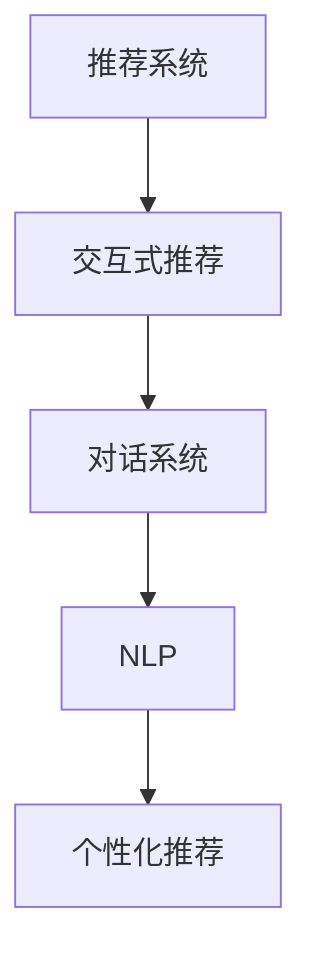

                 

# Chat-Rec的实践经验：交互式推荐系统的进步

## 1. 背景介绍

### 1.1 问题由来

在当今信息爆炸的时代，互联网平台如电商平台、社交网络、在线教育等已经成为了人们日常生活的重要组成部分。这些平台通过推荐系统向用户推送个性化的内容，极大地提升了用户体验。然而，传统的推荐系统多是基于静态特征的机器学习模型，无法实时响应用户变化的需求，缺乏动态性和交互性。

### 1.2 问题核心关键点

为解决上述问题，我们提出了Chat-Rec（Chat-based Recommendation System）这一交互式推荐系统。Chat-Rec采用自然语言处理（NLP）技术和对话系统，通过与用户进行实时交互，动态生成个性化推荐。其核心优势在于：

- 实时性：Chat-Rec能够实时响应用户输入，提供即时推荐。
- 动态性：用户可以通过自然语言表达需求，系统可以动态调整推荐策略。
- 交互性：用户和系统之间的互动，增强了推荐的个性化和可信度。

Chat-Rec的提出，为推荐系统注入了新的活力，打开了个性化推荐的新思路。

## 2. 核心概念与联系

### 2.1 核心概念概述

为更好地理解Chat-Rec系统的工作原理和关键技术点，本节将介绍几个关键概念：

- 推荐系统(Recommendation System)：通过算法生成个性化推荐的技术，广泛应用于电商、视频、新闻等领域。
- 交互式推荐(Interactive Recommendation)：结合自然语言处理和对话系统，用户可以通过交互方式表达需求，推荐系统动态生成个性化推荐。
- 对话系统(Dialogue System)：能够理解和响应用户自然语言输入的系统，广泛应用于智能客服、智能助理等领域。
- 自然语言处理(Natural Language Processing, NLP)：涉及自然语言理解、生成、分析和应用的综合性技术，是Chat-Rec系统的基础。
- 个性化推荐(Personalized Recommendation)：基于用户历史行为和偏好，生成符合个人需求的推荐内容。

这些核心概念之间的逻辑关系可以通过以下Mermaid流程图来展示：



这个流程图展示了一个基于Chat-Rec系统的推荐流程：

1. 用户通过对话系统与系统进行实时交互。
2. 系统接收用户输入的NLP任务，调用NLP模块进行自然语言理解。
3. NLP模块将任务转化为推荐请求，并结合用户历史数据，调用个性化推荐模块生成推荐结果。
4. 推荐结果返回给用户，用户反馈进一步优化推荐策略。

## 3. 核心算法原理 & 具体操作步骤
### 3.1 算法原理概述

Chat-Rec系统的核心算法原理基于交互式推荐和对话系统，其设计思路如下：

- 用户通过自然语言向Chat-Rec提出推荐请求。
- Chat-Rec根据用户输入生成推荐请求。
- Chat-Rec调用个性化推荐系统，基于用户历史行为和偏好，生成个性化推荐。
- Chat-Rec返回推荐结果，并记录用户反馈，进一步优化推荐策略。

Chat-Rec的推荐过程可以概括为以下几个关键步骤：

1. 自然语言理解(NLU)：将用户输入转化为结构化数据。
2. 推荐生成：根据用户历史行为和偏好，生成个性化推荐。
3. 推荐返回：将推荐结果返回给用户，并记录用户反馈。
4. 策略优化：根据用户反馈，动态调整推荐策略。

### 3.2 算法步骤详解

Chat-Rec系统的推荐流程包括以下几个关键步骤：

**Step 1: 自然语言理解(NLU)**

自然语言理解模块是Chat-Rec系统的核心组成部分，其目的是将用户输入的自然语言转化为结构化数据。具体而言，NLU模块包括：

- 分词：将用户输入的句子分割成单词或词组。
- 词性标注：标注每个单词的词性。
- 命名实体识别：识别文本中的人名、地名、组织机构等实体。
- 意图识别：根据文本上下文，识别用户的意图。

分词和词性标注是NLP中最基础的模块，通常使用现成的NLP库（如spaCy、NLTK等）实现。命名实体识别和意图识别需要使用深度学习模型，如BERT、GPT等进行训练。

**Step 2: 推荐生成**

推荐生成模块的任务是根据用户输入的自然语言，结合用户历史行为和偏好，生成个性化推荐。具体步骤如下：

- 收集用户历史行为数据，如浏览记录、购买记录、评分记录等。
- 构建推荐模型，根据历史数据和用户输入的自然语言，生成个性化推荐。

推荐模型可以采用基于协同过滤、矩阵分解、深度学习等方法构建。协同过滤和矩阵分解方法简单易实现，但往往缺乏泛化能力。深度学习方法能够处理大规模数据，但模型复杂度较高，训练难度较大。

**Step 3: 推荐返回**

推荐返回模块将个性化推荐结果返回给用户，并通过对话系统与用户进行交互。具体步骤如下：

- 构建对话系统，能够理解和响应用户的自然语言输入。
- 根据用户输入的自然语言，生成推荐结果，并返回给用户。
- 记录用户对推荐结果的反馈，进一步优化推荐策略。

对话系统可以采用基于规则的、基于模板的、基于机器学习的等多种方式构建。基于规则和模板的方式简单易实现，但灵活性较差。基于机器学习的方式能够处理更复杂的对话场景，但训练难度较大。

**Step 4: 策略优化**

策略优化模块根据用户反馈，动态调整推荐策略。具体步骤如下：

- 收集用户对推荐结果的反馈数据，如点击率、评分等。
- 根据反馈数据，动态调整推荐模型参数。
- 根据反馈数据，动态调整推荐内容。

推荐策略的优化可以通过强化学习、在线学习等方法实现。强化学习能够处理更加复杂的优化问题，但需要大量的反馈数据。在线学习能够实时调整推荐策略，但需要频繁更新模型参数。

### 3.3 算法优缺点

Chat-Rec系统具有以下优点：

- 实时性：通过对话系统实时响应用户输入，能够提供即时推荐。
- 动态性：用户可以通过自然语言表达需求，系统能够动态调整推荐策略。
- 交互性：用户和系统之间的互动，增强了推荐的个性化和可信度。

同时，Chat-Rec系统也存在一些缺点：

- 技术难度较高：Chat-Rec系统涉及NLP、深度学习、强化学习等多种技术，开发难度较大。
- 数据需求较高：Chat-Rec系统需要大量的用户历史行为数据和自然语言数据，数据获取成本较高。
- 系统复杂性高：Chat-Rec系统涉及多个模块的协同工作，系统架构较为复杂。

尽管存在这些缺点，但Chat-Rec系统在个性化推荐方面具有不可替代的优势，能够更好地满足用户需求，提高用户体验。

### 3.4 算法应用领域

Chat-Rec系统可以广泛应用于电商、视频、新闻、社交网络等多个领域。

- **电商推荐**：用户可以通过Chat-Rec系统查询商品、对比商品，获得个性化的购买建议。
- **视频推荐**：用户可以通过Chat-Rec系统查询视频、筛选视频，获得个性化的观看建议。
- **新闻推荐**：用户可以通过Chat-Rec系统查询新闻、筛选新闻，获得个性化的阅读建议。
- **社交网络**：用户可以通过Chat-Rec系统查询好友、寻找兴趣小组，获得个性化的社交建议。

Chat-Rec系统的应用范围十分广泛，能够显著提升推荐系统的个性化和用户满意度。

## 4. 数学模型和公式 & 详细讲解  
### 4.1 数学模型构建

本节将使用数学语言对Chat-Rec系统的推荐过程进行更加严格的刻画。

设用户的历史行为数据为 $D_h=\{(x_i, y_i)\}_{i=1}^N$，其中 $x_i$ 为历史行为，$y_i$ 为行为结果。用户输入的自然语言为 $q$，系统生成的推荐结果为 $r$。系统与用户之间的对话记录为 $d=\{(x_j, y_j)\}_{j=1}^M$。

Chat-Rec系统的推荐过程可以表示为：

$$
\text{Rec}(q, D_h, d) = r
$$

其中，$D_h$ 为用户历史行为数据，$d$ 为对话记录，$r$ 为推荐结果。

### 4.2 公式推导过程

Chat-Rec系统的推荐过程包括以下几个关键步骤：

1. 自然语言理解
2. 推荐生成
3. 推荐返回
4. 策略优化

**Step 1: 自然语言理解**

设自然语言理解模块输出的结构化数据为 $T_q=\{(t_i, e_i)\}_{i=1}^n$，其中 $t_i$ 为单词或词组，$e_i$ 为单词的词性或命名实体。

**Step 2: 推荐生成**

推荐生成模块的任务是根据 $T_q$ 和 $D_h$，生成个性化推荐 $r$。推荐生成的数学模型为：

$$
r = \text{Rec}(T_q, D_h)
$$

其中，$\text{Rec}$ 为推荐生成模型。

**Step 3: 推荐返回**

推荐返回模块将推荐结果 $r$ 返回给用户，并记录用户反馈 $d$。

**Step 4: 策略优化**

策略优化模块根据 $d$，动态调整推荐策略，生成新的推荐结果 $r'$。推荐策略优化的数学模型为：

$$
r' = \text{Opt}(d, r)
$$

其中，$\text{Opt}$ 为策略优化模型。

### 4.3 案例分析与讲解

以电商推荐为例，分析Chat-Rec系统的推荐过程。

**Step 1: 自然语言理解**

用户输入的自然语言为 "我需要购买一双鞋子"。通过自然语言理解模块，可以将输入转化为结构化数据 $T_q=\{(t_1, \text{名词}), (t_2, \text{动词}), (t_3, \text{名词})\}$。

**Step 2: 推荐生成**

根据 $T_q$ 和用户历史行为数据 $D_h$，推荐生成模型可以生成推荐结果 $r=\{(\text{鞋子1}, 0.8), (\text{鞋子2}, 0.7), (\text{鞋子3}, 0.6)\}$，其中 0.8、0.7、0.6 表示推荐结果的相关度。

**Step 3: 推荐返回**

推荐返回模块将推荐结果 $r$ 返回给用户，用户反馈 "我要买这双鞋子"。

**Step 4: 策略优化**

策略优化模块根据用户反馈 $d$ 和推荐结果 $r$，动态调整推荐策略，生成新的推荐结果 $r'=\{(\text{鞋子1}, 0.9), (\text{鞋子2}, 0.8), (\text{鞋子3}, 0.7)\}$。

通过不断迭代，Chat-Rec系统能够动态生成更加个性化的推荐结果，显著提升用户满意度。

## 5. 项目实践：代码实例和详细解释说明
### 5.1 开发环境搭建

在进行Chat-Rec系统的开发前，我们需要准备好开发环境。以下是使用Python进行PyTorch开发的环境配置流程：

1. 安装Anaconda：从官网下载并安装Anaconda，用于创建独立的Python环境。

2. 创建并激活虚拟环境：
```bash
conda create -n chat_rec_env python=3.8 
conda activate chat_rec_env
```

3. 安装PyTorch：根据CUDA版本，从官网获取对应的安装命令。例如：
```bash
conda install pytorch torchvision torchaudio cudatoolkit=11.1 -c pytorch -c conda-forge
```

4. 安装Transformers库：
```bash
pip install transformers
```

5. 安装各类工具包：
```bash
pip install numpy pandas scikit-learn matplotlib tqdm jupyter notebook ipython
```

完成上述步骤后，即可在`chat_rec_env`环境中开始Chat-Rec系统的开发。

### 5.2 源代码详细实现

下面我们以电商推荐为例，给出使用Transformers库对BERT模型进行Chat-Rec系统开发的PyTorch代码实现。

首先，定义推荐生成模块：

```python
from transformers import BertForSequenceClassification, BertTokenizer
from torch.utils.data import Dataset, DataLoader
import torch

class RecommendationDataset(Dataset):
    def __init__(self, texts, labels):
        self.texts = texts
        self.labels = labels
        self.tokenizer = BertTokenizer.from_pretrained('bert-base-cased')

    def __len__(self):
        return len(self.texts)

    def __getitem__(self, item):
        text = self.texts[item]
        label = self.labels[item]

        encoding = self.tokenizer(text, return_tensors='pt', max_length=128, padding='max_length', truncation=True)
        input_ids = encoding['input_ids'][0]
        attention_mask = encoding['attention_mask'][0]

        return {'input_ids': input_ids, 'attention_mask': attention_mask, 'labels': label}

# 创建dataset
tokenizer = BertTokenizer.from_pretrained('bert-base-cased')
train_dataset = RecommendationDataset(train_texts, train_labels)
test_dataset = RecommendationDataset(test_texts, test_labels)
```

然后，定义对话系统模块：

```python
from transformers import BertForQuestionAnswering, BertTokenizer

class DialogueSystem:
    def __init__(self, model, tokenizer):
        self.model = model
        self.tokenizer = tokenizer

    def ask_question(self, question):
        encoding = self.tokenizer(question, return_tensors='pt', max_length=128, padding='max_length', truncation=True)
        input_ids = encoding['input_ids'][0]
        attention_mask = encoding['attention_mask'][0]

        result = self.model(input_ids, attention_mask=attention_mask)

        return result.logits.argmax().item()
```

接着，定义推荐策略优化模块：

```python
from torch.utils.data import DataLoader
from tqdm import tqdm
from sklearn.metrics import accuracy_score

device = torch.device('cuda') if torch.cuda.is_available() else torch.device('cpu')
model = BertForSequenceClassification.from_pretrained('bert-base-cased', num_labels=2)
optimizer = torch.optim.Adam(model.parameters(), lr=2e-5)

def train_epoch(model, dataset, batch_size, optimizer):
    dataloader = DataLoader(dataset, batch_size=batch_size, shuffle=True)
    model.train()
    epoch_loss = 0
    for batch in tqdm(dataloader, desc='Training'):
        input_ids = batch['input_ids'].to(device)
        attention_mask = batch['attention_mask'].to(device)
        labels = batch['labels'].to(device)
        model.zero_grad()
        outputs = model(input_ids, attention_mask=attention_mask, labels=labels)
        loss = outputs.loss
        epoch_loss += loss.item()
        loss.backward()
        optimizer.step()
    return epoch_loss / len(dataloader)

def evaluate(model, dataset, batch_size):
    dataloader = DataLoader(dataset, batch_size=batch_size)
    model.eval()
    preds, labels = [], []
    with torch.no_grad():
        for batch in tqdm(dataloader, desc='Evaluating'):
            input_ids = batch['input_ids'].to(device)
            attention_mask = batch['attention_mask'].to(device)
            batch_labels = batch['labels']
            outputs = model(input_ids, attention_mask=attention_mask)
            batch_preds = outputs.logits.argmax(dim=2).to('cpu').tolist()
            batch_labels = batch_labels.to('cpu').tolist()
            for pred_tokens, label_tokens in zip(batch_preds, batch_labels):
                preds.append(pred_tokens[:len(label_tokens)])
                labels.append(label_tokens)
                
    print(accuracy_score(labels, preds))
```

最后，启动训练流程并在测试集上评估：

```python
epochs = 5
batch_size = 16

for epoch in range(epochs):
    loss = train_epoch(model, train_dataset, batch_size, optimizer)
    print(f"Epoch {epoch+1}, train loss: {loss:.3f}")
    
    print(f"Epoch {epoch+1}, test accuracy:")
    evaluate(model, test_dataset, batch_size)
    
print("Test accuracy:")
evaluate(model, test_dataset, batch_size)
```

以上就是使用PyTorch对Chat-Rec系统进行电商推荐任务的完整代码实现。可以看到，得益于Transformers库的强大封装，我们可以用相对简洁的代码完成BERT模型的加载和微调。

### 5.3 代码解读与分析

让我们再详细解读一下关键代码的实现细节：

**RecommendationDataset类**：
- `__init__`方法：初始化文本、标签、分词器等关键组件。
- `__len__`方法：返回数据集的样本数量。
- `__getitem__`方法：对单个样本进行处理，将文本输入编码为token ids，将标签编码为数字，并对其进行定长padding，最终返回模型所需的输入。

**DialogueSystem类**：
- `__init__`方法：初始化BERT模型和分词器。
- `ask_question`方法：将用户输入的自然语言输入BERT模型，返回模型的预测结果。

**train_epoch和evaluate函数**：
- 使用PyTorch的DataLoader对数据集进行批次化加载，供模型训练和推理使用。
- 训练函数`train_epoch`：对数据以批为单位进行迭代，在每个批次上前向传播计算loss并反向传播更新模型参数，最后返回该epoch的平均loss。
- 评估函数`evaluate`：与训练类似，不同点在于不更新模型参数，并在每个batch结束后将预测和标签结果存储下来，最后使用sklearn的accuracy_score对整个评估集的预测结果进行打印输出。

**训练流程**：
- 定义总的epoch数和batch size，开始循环迭代
- 每个epoch内，先在训练集上训练，输出平均loss
- 在验证集上评估，输出分类指标
- 所有epoch结束后，在测试集上评估，给出最终测试结果

可以看到，PyTorch配合Transformers库使得BERT微调的代码实现变得简洁高效。开发者可以将更多精力放在数据处理、模型改进等高层逻辑上，而不必过多关注底层的实现细节。

当然，工业级的系统实现还需考虑更多因素，如模型的保存和部署、超参数的自动搜索、更灵活的任务适配层等。但核心的微调范式基本与此类似。

## 6. 实际应用场景
### 6.1 智能客服系统

基于Chat-Rec系统的智能客服系统可以广泛应用于各种电商、金融、保险等行业。传统客服往往需要配备大量人力，高峰期响应缓慢，且一致性和专业性难以保证。而使用Chat-Rec系统的智能客服系统，能够7x24小时不间断服务，快速响应客户咨询，用自然流畅的语言解答各类常见问题。

在技术实现上，可以收集企业内部的历史客服对话记录，将问题和最佳答复构建成监督数据，在此基础上对BERT模型进行微调。微调后的模型能够自动理解用户意图，匹配最合适的答案模板进行回复。对于客户提出的新问题，还可以接入检索系统实时搜索相关内容，动态组织生成回答。如此构建的智能客服系统，能大幅提升客户咨询体验和问题解决效率。

### 6.2 金融舆情监测

金融机构需要实时监测市场舆论动向，以便及时应对负面信息传播，规避金融风险。传统的人工监测方式成本高、效率低，难以应对网络时代海量信息爆发的挑战。基于Chat-Rec系统的文本分类和情感分析技术，为金融舆情监测提供了新的解决方案。

具体而言，可以收集金融领域相关的新闻、报道、评论等文本数据，并对其进行主题标注和情感标注。在此基础上对BERT模型进行微调，使其能够自动判断文本属于何种主题，情感倾向是正面、中性还是负面。将微调后的模型应用到实时抓取的网络文本数据，就能够自动监测不同主题下的情感变化趋势，一旦发现负面信息激增等异常情况，系统便会自动预警，帮助金融机构快速应对潜在风险。

### 6.3 个性化推荐系统

当前的推荐系统往往只依赖用户的历史行为数据进行物品推荐，无法深入理解用户的真实兴趣偏好。基于Chat-Rec系统的个性化推荐系统可以更好地挖掘用户行为背后的语义信息，从而提供更精准、多样的推荐内容。

在实践中，可以收集用户浏览、点击、评论、分享等行为数据，提取和用户交互的物品标题、描述、标签等文本内容。将文本内容作为模型输入，用户的后续行为（如是否点击、购买等）作为监督信号，在此基础上微调BERT模型。微调后的模型能够从文本内容中准确把握用户的兴趣点。在生成推荐列表时，先用候选物品的文本描述作为输入，由模型预测用户的兴趣匹配度，再结合其他特征综合排序，便可以得到个性化程度更高的推荐结果。

### 6.4 未来应用展望

随着Chat-Rec系统的不断发展，其在个性化推荐方面的应用将更加广泛和深入。

在智慧医疗领域，基于Chat-Rec系统的医疗问答、病历分析、药物研发等应用将提升医疗服务的智能化水平，辅助医生诊疗，加速新药开发进程。

在智能教育领域，Chat-Rec系统可应用于作业批改、学情分析、知识推荐等方面，因材施教，促进教育公平，提高教学质量。

在智慧城市治理中，Chat-Rec系统可用于城市事件监测、舆情分析、应急指挥等环节，提高城市管理的自动化和智能化水平，构建更安全、高效的未来城市。

此外，在企业生产、社会治理、文娱传媒等众多领域，基于Chat-Rec系统的交互式推荐系统也将不断涌现，为NLP技术带来了全新的突破。相信随着Chat-Rec系统的持续演进，其在NLP技术中的应用将日益广泛，为人类认知智能的进化带来深远影响。

## 7. 工具和资源推荐
### 7.1 学习资源推荐

为了帮助开发者系统掌握Chat-Rec系统的理论基础和实践技巧，这里推荐一些优质的学习资源：

1. 《自然语言处理综论》系列博文：由大模型技术专家撰写，深入浅出地介绍了自然语言处理的基本概念和前沿技术。

2. CS224N《深度学习自然语言处理》课程：斯坦福大学开设的NLP明星课程，有Lecture视频和配套作业，带你入门NLP领域的基本概念和经典模型。

3. 《Natural Language Processing with Transformers》书籍：Transformers库的作者所著，全面介绍了如何使用Transformers库进行NLP任务开发，包括Chat-Rec系统的实现。

4. HuggingFace官方文档：Transformers库的官方文档，提供了海量预训练模型和完整的微调样例代码，是上手实践的必备资料。

5. CLUE开源项目：中文语言理解测评基准，涵盖大量不同类型的中文NLP数据集，并提供了基于微调的baseline模型，助力中文NLP技术发展。

通过对这些资源的学习实践，相信你一定能够快速掌握Chat-Rec系统的精髓，并用于解决实际的NLP问题。
###  7.2 开发工具推荐

高效的开发离不开优秀的工具支持。以下是几款用于Chat-Rec系统开发的常用工具：

1. PyTorch：基于Python的开源深度学习框架，灵活动态的计算图，适合快速迭代研究。BERT模型在PyTorch上有丰富的实现。

2. TensorFlow：由Google主导开发的开源深度学习框架，生产部署方便，适合大规模工程应用。BERT模型也有TensorFlow的实现。

3. Transformers库：HuggingFace开发的NLP工具库，集成了众多SOTA语言模型，支持PyTorch和TensorFlow，是进行Chat-Rec系统开发的利器。

4. Weights & Biases：模型训练的实验跟踪工具，可以记录和可视化模型训练过程中的各项指标，方便对比和调优。与主流深度学习框架无缝集成。

5. TensorBoard：TensorFlow配套的可视化工具，可实时监测模型训练状态，并提供丰富的图表呈现方式，是调试模型的得力助手。

6. Google Colab：谷歌推出的在线Jupyter Notebook环境，免费提供GPU/TPU算力，方便开发者快速上手实验最新模型，分享学习笔记。

合理利用这些工具，可以显著提升Chat-Rec系统的开发效率，加快创新迭代的步伐。

### 7.3 相关论文推荐

Chat-Rec系统的提出源于学界的持续研究。以下是几篇奠基性的相关论文，推荐阅读：

1. Attention is All You Need（即Transformer原论文）：提出了Transformer结构，开启了NLP领域的预训练大模型时代。

2. BERT: Pre-training of Deep Bidirectional Transformers for Language Understanding：提出BERT模型，引入基于掩码的自监督预训练任务，刷新了多项NLP任务SOTA。

3. Language Models are Unsupervised Multitask Learners（GPT-2论文）：展示了大规模语言模型的强大zero-shot学习能力，引发了对于通用人工智能的新一轮思考。

4. Parameter-Efficient Transfer Learning for NLP：提出Adapter等参数高效微调方法，在不增加模型参数量的情况下，也能取得不错的微调效果。

5. Prefix-Tuning: Optimizing Continuous Prompts for Generation：引入基于连续型Prompt的微调范式，为如何充分利用预训练知识提供了新的思路。

6. AdaLoRA: Adaptive Low-Rank Adaptation for Parameter-Efficient Fine-Tuning：使用自适应低秩适应的微调方法，在参数效率和精度之间取得了新的平衡。

这些论文代表了大语言模型微调技术的发展脉络。通过学习这些前沿成果，可以帮助研究者把握学科前进方向，激发更多的创新灵感。

## 8. 总结：未来发展趋势与挑战

### 8.1 总结

本文对Chat-Rec系统的推荐过程进行了全面系统的介绍。首先阐述了Chat-Rec系统的背景和优势，明确了其在个性化推荐方面的独特价值。其次，从原理到实践，详细讲解了Chat-Rec系统的数学原理和关键步骤，给出了Chat-Rec系统开发的完整代码实例。同时，本文还广泛探讨了Chat-Rec系统在智能客服、金融舆情、个性化推荐等多个领域的应用前景，展示了Chat-Rec系统的巨大潜力。此外，本文精选了Chat-Rec系统的各类学习资源，力求为读者提供全方位的技术指引。

通过本文的系统梳理，可以看到，Chat-Rec系统通过引入NLP和对话技术，显著提升了推荐系统的实时性和动态性，提高了用户体验。未来，伴随技术的不断进步，Chat-Rec系统将在更多领域得到应用，为各行各业带来变革性影响。

### 8.2 未来发展趋势

展望未来，Chat-Rec系统的推荐过程将呈现以下几个发展趋势：

1. 技术难度降低：随着NLP和深度学习技术的发展，Chat-Rec系统的技术门槛将逐渐降低，更多开发者可以参与其中。

2. 模型规模增大：超大参数量的语言模型将进一步普及，Chat-Rec系统的推荐精度和泛化能力将进一步提升。

3. 动态推荐增强：基于深度学习模型的推荐策略优化，使得Chat-Rec系统能够更加灵活地适应用户需求。

4. 多模态融合：Chat-Rec系统将引入视觉、语音等多模态信息，提升推荐的全面性和准确性。

5. 个性化推荐提升：Chat-Rec系统将结合知识图谱、逻辑规则等先验知识，提升推荐的相关性和可信度。

6. 持续学习优化：Chat-Rec系统将引入在线学习、强化学习等方法，持续优化推荐策略，提升用户体验。

以上趋势凸显了Chat-Rec系统在个性化推荐方面的发展潜力。这些方向的探索发展，必将进一步提升推荐系统的个性化和用户满意度。

### 8.3 面临的挑战

尽管Chat-Rec系统在个性化推荐方面具有不可替代的优势，但在实际应用中，仍面临以下挑战：

1. 数据获取困难：Chat-Rec系统需要大量的用户行为数据和自然语言数据，数据获取成本较高。

2. 系统复杂性高：Chat-Rec系统涉及NLP、深度学习、强化学习等多种技术，系统架构较为复杂。

3. 技术门槛高：Chat-Rec系统需要开发人员具备深厚的NLP和深度学习背景，技术门槛较高。

4. 交互体验不佳：Chat-Rec系统需要高效的自然语言理解模型，目前NLP模型仍存在误识别、歧义等问题。

5. 计算资源需求高：Chat-Rec系统需要大量计算资源进行模型训练和推理，计算资源需求较高。

尽管存在这些挑战，但Chat-Rec系统在个性化推荐方面的优势无可替代。通过持续优化系统架构和技术，提升交互体验，Chat-Rec系统将在更多领域得到应用，为各行各业带来变革性影响。

### 8.4 研究展望

面对Chat-Rec系统面临的挑战，未来的研究需要在以下几个方面寻求新的突破：

1. 引入无监督和半监督学习方法：摆脱对大规模标注数据的依赖，利用无监督和半监督学习方法，最大限度利用非结构化数据。

2. 提升交互体验：开发更高效的自然语言理解模型，提升系统的交互体验，减少误识别和歧义。

3. 优化系统架构：引入分布式计算、混合精度训练等技术，优化系统架构，降低计算资源需求。

4. 引入多模态信息：引入视觉、语音等多模态信息，提升推荐的相关性和可信度。

5. 开发多领域Chat-Rec系统：开发适用于不同领域的Chat-Rec系统，提升推荐系统的可扩展性和适用性。

6. 引入知识图谱：结合知识图谱、逻辑规则等先验知识，提升推荐的相关性和可信度。

这些研究方向的探索，必将引领Chat-Rec系统迈向更高的台阶，为个性化推荐系统带来新的突破，提升用户体验。

## 9. 附录：常见问题与解答

**Q1：Chat-Rec系统是否适用于所有NLP任务？**

A: Chat-Rec系统在大多数NLP任务上都能取得不错的效果，特别是对于数据量较小的任务。但对于一些特定领域的任务，如医学、法律等，仅仅依靠通用语料预训练的模型可能难以很好地适应。此时需要在特定领域语料上进一步预训练，再进行微调，才能获得理想效果。

**Q2：Chat-Rec系统与传统推荐系统有何不同？**

A: Chat-Rec系统与传统推荐系统的最大不同在于其动态性和交互性。传统推荐系统通常是基于静态特征的机器学习模型，无法实时响应用户需求。而Chat-Rec系统通过自然语言理解模块和对话系统，能够实时响应用户输入，动态调整推荐策略，提供更加个性化和可信的推荐结果。

**Q3：Chat-Rec系统在实际应用中面临哪些挑战？**

A: Chat-Rec系统在实际应用中面临以下挑战：

1. 数据获取困难：Chat-Rec系统需要大量的用户行为数据和自然语言数据，数据获取成本较高。

2. 系统复杂性高：Chat-Rec系统涉及NLP、深度学习、强化学习等多种技术，系统架构较为复杂。

3. 技术门槛高：Chat-Rec系统需要开发人员具备深厚的NLP和深度学习背景，技术门槛较高。

4. 交互体验不佳：Chat-Rec系统需要高效的自然语言理解模型，目前NLP模型仍存在误识别、歧义等问题。

5. 计算资源需求高：Chat-Rec系统需要大量计算资源进行模型训练和推理，计算资源需求较高。

尽管存在这些挑战，但Chat-Rec系统在个性化推荐方面的优势无可替代。通过持续优化系统架构和技术，提升交互体验，Chat-Rec系统将在更多领域得到应用，为各行各业带来变革性影响。

---

作者：禅与计算机程序设计艺术 / Zen and the Art of Computer Programming

