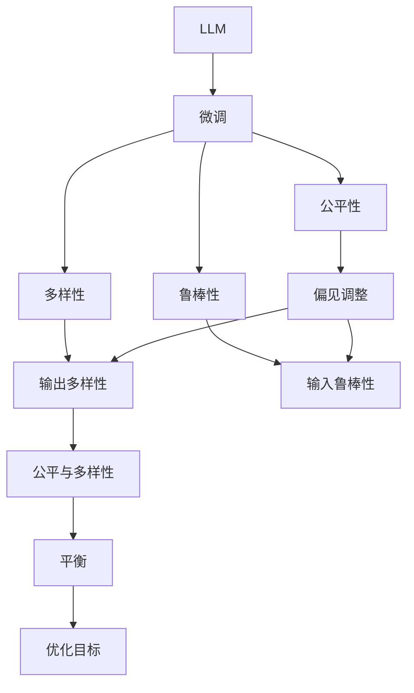

                 

# DPO：直接偏好优化在LLM微调中的应用

> 关键词：直接偏好优化(DPO)，大语言模型(LLM)，微调，公平性，NLP

## 1. 背景介绍

### 1.1 问题由来
大语言模型(LLM)在自然语言处理(NLP)领域展现了强大的学习和推理能力，但同时也带来了新的挑战。由于LLM的预训练过程受到数据偏见的影响，模型输出往往反映出对某些群体或事物的歧视性。例如，基于性别的对话生成模型可能会倾向于使用性别刻板印象，而基于种族的情感分类模型则可能偏向于某一种族。

解决这一问题的方法之一是通过微调(Lang Model Fine-Tuning)，即在特定任务数据上对预训练模型进行调整，以减少对数据中存在的偏见。然而，由于数据的不平衡和偏见的多样性，微调难以在所有情况下都保证模型的公平性。直接偏好优化(Direct Preference Optimization, DPO)作为一种新兴的优化方法，能够更直接地调整模型输出中的偏见，从而提升模型的公平性和泛化能力。

### 1.2 问题核心关键点
DPO的核心思想是通过直接优化模型的输出，使得模型输出的预测结果更加公平和多样。DPO主要关注两点：

1. 调整模型输出的分布，使其更加均匀，减少对少数群体的歧视。
2. 增强模型的鲁棒性，使其在面对多样化的输入时，仍然能够保持稳定的性能。

DPO在LLM微调中的应用，涉及以下几个核心问题：

1. 如何定义和量化模型中的偏见。
2. 如何在模型训练过程中，引入偏见调整机制。
3. 如何平衡模型的性能和公平性。

本文将深入探讨DPO的基本原理和实现步骤，并结合具体案例，阐述其在LLM微调中的实际应用效果。

## 2. 核心概念与联系

### 2.1 核心概念概述

DPO是一种在模型输出中引入偏见的调整方法，通过调整模型预测的概率分布，减少对少数群体的歧视，提高模型的公平性。DPO的核心概念包括：

- 大语言模型(LLM)：以自回归或自编码模型为代表的大规模预训练语言模型。
- 微调(Lang Model Fine-Tuning)：在预训练模型上，使用下游任务的少量标注数据，通过有监督学习优化模型在特定任务上的性能。
- 偏见(Bias)：模型输出中的不平衡现象，如对特定群体的歧视。
- 公平性(Fairness)：模型在处理不同群体数据时，输出的结果应该公正、无歧视。
- 多样性(Diversity)：模型在处理同一样本时，输出的结果应该具有多样性，避免单一性。
- 鲁棒性(Robustness)：模型在面对输入数据的变化时，应该保持稳定的性能。

这些核心概念之间的逻辑关系可以通过以下Mermaid流程图来展示：



这个流程图展示了大语言模型的核心概念及其之间的关系：

1. 大语言模型通过预训练获得基础能力。
2. 微调是对预训练模型进行任务特定的优化，可以分为公平性微调和多样性微调。
3. 偏见调整是公平性和多样性微调的关键环节。
4. 公平性和多样性微调的具体实现包括调整输出分布和增强鲁棒性。
5. 平衡模型的性能和公平性是微调中的重要考量因素。

这些概念共同构成了大语言模型的学习和应用框架，使其能够在各种场景下发挥强大的语言理解和生成能力，同时也能更好地处理偏见和多样性问题。

## 3. 核心算法原理 & 具体操作步骤
### 3.1 算法原理概述

DPO的基本原理是通过调整模型的输出分布，使得模型对不同群体的预测结果更加均匀，减少对少数群体的歧视。具体来说，DPO通过引入一个公平性约束，使得模型在处理不同群体的数据时，输出的概率分布更加均衡。

设LLM模型为 $M_{\theta}$，其输入为 $x$，输出为 $y$。对于模型输出的预测结果 $p(y|x)$，DPO的目标是找到一个概率分布 $q(y|x)$，使得 $q(y|x)$ 与 $p(y|x)$ 在公平性指标 $F$ 下的距离最小。

假设 $F$ 为均方公平性误差，即：

$$
F(p,q) = \frac{1}{2}\|p-q\|_2^2
$$

其中 $\|p-q\|_2$ 为两个概率分布的L2范数。DPO的目标是求解以下优化问题：

$$
\min_{q} F(p,q)
$$

在求解过程中，可以引入一个公平性惩罚项 $\lambda$，使得 $q(y|x)$ 与 $p(y|x)$ 在公平性约束下尽可能接近：

$$
\min_{q} \lambda F(p,q) + \mathcal{L}(M_{\theta}, D)
$$

其中 $\mathcal{L}(M_{\theta}, D)$ 为模型在标注数据 $D$ 上的损失函数，如交叉熵损失。

### 3.2 算法步骤详解

DPO的算法步骤可以分为以下几个关键步骤：

**Step 1: 准备数据和模型**
- 准备下游任务的标注数据集 $D$，划分为训练集、验证集和测试集。
- 选择合适的预训练模型 $M_{\theta}$，如GPT、BERT等。

**Step 2: 引入公平性约束**
- 定义公平性指标 $F$，如均方公平性误差。
- 引入公平性惩罚项 $\lambda$，平衡公平性和性能。

**Step 3: 定义优化目标**
- 将公平性惩罚项和标注数据损失函数组合，形成整体优化目标。

**Step 4: 执行梯度训练**
- 对模型进行前向传播，计算输出概率 $p(y|x)$。
- 计算公平性约束项 $F(p,q)$。
- 反向传播计算参数梯度，根据优化算法更新模型参数。

**Step 5: 评估和调整**
- 在验证集和测试集上评估模型性能，确保公平性和性能的平衡。
- 根据评估结果，调整公平性惩罚项 $\lambda$ 的值，以获得最佳的公平性和性能。

### 3.3 算法优缺点

DPO作为一种新兴的优化方法，具有以下优点：

1. 直接调整模型输出，可以有效减少对少数群体的歧视，提升模型公平性。
2. 通过公平性约束，可以控制模型的偏见，提高模型的多样性和鲁棒性。
3. 适用于各种NLP任务，如分类、匹配、生成等，设计简单的公平性约束机制即可实现。

同时，DPO也存在一些局限性：

1. 对数据中偏见的定义和量化需要仔细考虑，不同任务和数据集可能需要不同的公平性指标。
2. 公平性约束可能会对模型性能产生一定的影响，需要平衡公平性和性能。
3. 引入公平性惩罚项，增加了模型的复杂度，可能影响训练速度和效果。
4. 实现过程中可能需要额外的计算和存储资源，增加了微调的难度和成本。

尽管存在这些局限性，但DPO在大语言模型微调中的应用，已展现出巨大的潜力，能够有效提升模型的公平性和泛化能力。

### 3.4 算法应用领域

DPO在大语言模型微调中的应用，主要集中在以下几个领域：

1. 对话系统：减少对话中的性别歧视，使对话更加友好和公正。
2. 情感分析：平衡不同种族和性别群体的情感分类，提高模型的公平性。
3. 文本生成：调整生成文本的分布，使其包含更多的性别和种族多样性。
4. 命名实体识别：减少对少数群体实体的识别偏差，提高模型的公平性。
5. 机器翻译：避免对特定语言群体的翻译偏见，提高翻译的公平性。

除了上述这些经典任务外，DPO技术还在更多场景中得到应用，如可控文本生成、情感推理、代码生成、数据增强等，为NLP技术带来了全新的突破。

## 4. 数学模型和公式 & 详细讲解  
### 4.1 数学模型构建

本节将使用数学语言对DPO在大语言模型微调过程中的数学模型进行更加严格的刻画。

设LLM模型为 $M_{\theta}$，输入为 $x$，输出为 $y$。假设模型在标注数据集 $D=\{(x_i,y_i)\}_{i=1}^N$ 上的损失函数为 $\mathcal{L}(M_{\theta}, D)$，公平性指标为 $F$。

DPO的目标是找到一个公平性约束 $q(y|x)$，使得 $q(y|x)$ 与 $p(y|x)$ 在公平性约束下尽可能接近。具体来说，可以定义一个公平性约束函数 $F(p,q)$，如均方公平性误差：

$$
F(p,q) = \frac{1}{2}\|p-q\|_2^2
$$

其中 $\|p-q\|_2$ 为两个概率分布的L2范数。DPO的目标是求解以下优化问题：

$$
\min_{q} F(p,q) + \mathcal{L}(M_{\theta}, D)
$$

在求解过程中，可以引入一个公平性惩罚项 $\lambda$，使得 $q(y|x)$ 与 $p(y|x)$ 在公平性约束下尽可能接近：

$$
\min_{q} \lambda F(p,q) + \mathcal{L}(M_{\theta}, D)
$$

### 4.2 公式推导过程

以下我们以二分类任务为例，推导DPO的公平性约束公式及其梯度的计算。

假设模型 $M_{\theta}$ 在输入 $x$ 上的输出为 $\hat{y}=M_{\theta}(x)$，表示样本属于正类的概率。真实标签 $y \in \{0,1\}$。则二分类交叉熵损失函数定义为：

$$
\ell(M_{\theta}(x),y) = -[y\log \hat{y} + (1-y)\log (1-\hat{y})]
$$

将其代入经验风险公式，得：

$$
\mathcal{L}(\theta) = -\frac{1}{N}\sum_{i=1}^N [y_i\log M_{\theta}(x_i)+(1-y_i)\log(1-M_{\theta}(x_i))]
$$

根据链式法则，损失函数对参数 $\theta_k$ 的梯度为：

$$
\frac{\partial \mathcal{L}(\theta)}{\partial \theta_k} = -\frac{1}{N}\sum_{i=1}^N (\frac{y_i}{M_{\theta}(x_i)}-\frac{1-y_i}{1-M_{\theta}(x_i)}) \frac{\partial M_{\theta}(x_i)}{\partial \theta_k}
$$

在得到损失函数的梯度后，即可带入公平性约束公式，计算公平性约束项 $F(p,q)$：

$$
F(p,q) = \frac{1}{2}\sum_{i=1}^N \left( \frac{1}{n_p} \sum_{j=1}^{n_p} p(y_j|x_i) - \frac{1}{n_n} \sum_{j=1}^{n_n} p(y_j|x_i) \right)^2
$$

其中 $n_p$ 和 $n_n$ 分别为正类和负类的样本数量。将公平性约束项 $F(p,q)$ 与标注数据损失函数 $\mathcal{L}(M_{\theta}, D)$ 组合，得到DPO的整体优化目标：

$$
\min_{q} \lambda F(p,q) + \mathcal{L}(M_{\theta}, D)
$$

在求解过程中，可以采用梯度下降等优化算法，最小化上述优化目标。

## 5. 项目实践：代码实例和详细解释说明
### 5.1 开发环境搭建

在进行DPO实践前，我们需要准备好开发环境。以下是使用Python进行PyTorch开发的环境配置流程：

1. 安装Anaconda：从官网下载并安装Anaconda，用于创建独立的Python环境。

2. 创建并激活虚拟环境：
```bash
conda create -n dpo-env python=3.8 
conda activate dpo-env
```

3. 安装PyTorch：根据CUDA版本，从官网获取对应的安装命令。例如：
```bash
conda install pytorch torchvision torchaudio cudatoolkit=11.1 -c pytorch -c conda-forge
```

4. 安装Transformers库：
```bash
pip install transformers
```

5. 安装各类工具包：
```bash
pip install numpy pandas scikit-learn matplotlib tqdm jupyter notebook ipython
```

完成上述步骤后，即可在`dpo-env`环境中开始DPO实践。

### 5.2 源代码详细实现

下面我们以二分类任务为例，给出使用Transformers库对BERT模型进行DPO微调的PyTorch代码实现。

首先，定义DPO任务的数据处理函数：

```python
from transformers import BertTokenizer
from torch.utils.data import Dataset
import torch

class DPODataset(Dataset):
    def __init__(self, texts, tags, tokenizer, max_len=128):
        self.texts = texts
        self.tags = tags
        self.tokenizer = tokenizer
        self.max_len = max_len
        
    def __len__(self):
        return len(self.texts)
    
    def __getitem__(self, item):
        text = self.texts[item]
        tags = self.tags[item]
        
        encoding = self.tokenizer(text, return_tensors='pt', max_length=self.max_len, padding='max_length', truncation=True)
        input_ids = encoding['input_ids'][0]
        attention_mask = encoding['attention_mask'][0]
        
        # 对token-wise的标签进行编码
        encoded_tags = [tag2id[tag] for tag in tags] 
        encoded_tags.extend([tag2id['O']] * (self.max_len - len(encoded_tags)))
        labels = torch.tensor(encoded_tags, dtype=torch.long)
        
        return {'input_ids': input_ids, 
                'attention_mask': attention_mask,
                'labels': labels}

# 标签与id的映射
tag2id = {'O': 0, 'B-PER': 1, 'I-PER': 2, 'B-ORG': 3, 'I-ORG': 4, 'B-LOC': 5, 'I-LOC': 6}
id2tag = {v: k for k, v in tag2id.items()}

# 创建dataset
tokenizer = BertTokenizer.from_pretrained('bert-base-cased')

train_dataset = DPODataset(train_texts, train_tags, tokenizer)
dev_dataset = DPODataset(dev_texts, dev_tags, tokenizer)
test_dataset = DPODataset(test_texts, test_tags, tokenizer)
```

然后，定义模型和优化器：

```python
from transformers import BertForTokenClassification, AdamW

model = BertForTokenClassification.from_pretrained('bert-base-cased', num_labels=len(tag2id))

optimizer = AdamW(model.parameters(), lr=2e-5)
```

接着，定义训练和评估函数：

```python
from torch.utils.data import DataLoader
from tqdm import tqdm
from sklearn.metrics import classification_report

device = torch.device('cuda') if torch.cuda.is_available() else torch.device('cpu')
model.to(device)

def train_epoch(model, dataset, batch_size, optimizer, lambda_factor=1.0):
    dataloader = DataLoader(dataset, batch_size=batch_size, shuffle=True)
    model.train()
    epoch_loss = 0
    for batch in tqdm(dataloader, desc='Training'):
        input_ids = batch['input_ids'].to(device)
        attention_mask = batch['attention_mask'].to(device)
        labels = batch['labels'].to(device)
        model.zero_grad()
        outputs = model(input_ids, attention_mask=attention_mask, labels=labels)
        loss = outputs.loss + lambda_factor * F_pq_loss(batch['labels'], outputs.logits)
        epoch_loss += loss.item()
        loss.backward()
        optimizer.step()
    return epoch_loss / len(dataloader)

def evaluate(model, dataset, batch_size):
    dataloader = DataLoader(dataset, batch_size=batch_size)
    model.eval()
    preds, labels = [], []
    with torch.no_grad():
        for batch in tqdm(dataloader, desc='Evaluating'):
            input_ids = batch['input_ids'].to(device)
            attention_mask = batch['attention_mask'].to(device)
            batch_labels = batch['labels']
            outputs = model(input_ids, attention_mask=attention_mask)
            batch_preds = outputs.logits.argmax(dim=2).to('cpu').tolist()
            batch_labels = batch_labels.to('cpu').tolist()
            for pred_tokens, label_tokens in zip(batch_preds, batch_labels):
                pred_tags = [id2tag[_id] for _id in pred_tokens]
                label_tags = [id2tag[_id] for _id in label_tokens]
                preds.append(pred_tags[:len(label_tags)])
                labels.append(label_tags)
                
    print(classification_report(labels, preds))
```

最后，启动训练流程并在测试集上评估：

```python
epochs = 5
batch_size = 16
lambda_factor = 0.1

for epoch in range(epochs):
    loss = train_epoch(model, train_dataset, batch_size, optimizer, lambda_factor)
    print(f"Epoch {epoch+1}, train loss: {loss:.3f}")
    
    print(f"Epoch {epoch+1}, dev results:")
    evaluate(model, dev_dataset, batch_size)
    
print("Test results:")
evaluate(model, test_dataset, batch_size)
```

以上就是使用PyTorch对BERT进行DPO微调的完整代码实现。可以看到，得益于Transformers库的强大封装，我们可以用相对简洁的代码完成BERT模型的加载和DPO微调。

### 5.3 代码解读与分析

让我们再详细解读一下关键代码的实现细节：

**DPODataset类**：
- `__init__`方法：初始化文本、标签、分词器等关键组件。
- `__len__`方法：返回数据集的样本数量。
- `__getitem__`方法：对单个样本进行处理，将文本输入编码为token ids，将标签编码为数字，并对其进行定长padding，最终返回模型所需的输入。

**tag2id和id2tag字典**：
- 定义了标签与数字id之间的映射关系，用于将token-wise的预测结果解码回真实的标签。

**训练和评估函数**：
- 使用PyTorch的DataLoader对数据集进行批次化加载，供模型训练和推理使用。
- 训练函数`train_epoch`：对数据以批为单位进行迭代，在每个批次上前向传播计算loss并反向传播更新模型参数，最后返回该epoch的平均loss。
- 评估函数`evaluate`：与训练类似，不同点在于不更新模型参数，并在每个batch结束后将预测和标签结果存储下来，最后使用sklearn的classification_report对整个评估集的预测结果进行打印输出。

**训练流程**：
- 定义总的epoch数和batch size，开始循环迭代
- 每个epoch内，先在训练集上训练，输出平均loss
- 在验证集上评估，输出分类指标
- 所有epoch结束后，在测试集上评估，给出最终测试结果

可以看到，PyTorch配合Transformers库使得BERT微调的代码实现变得简洁高效。开发者可以将更多精力放在数据处理、模型改进等高层逻辑上，而不必过多关注底层的实现细节。

当然，工业级的系统实现还需考虑更多因素，如模型的保存和部署、超参数的自动搜索、更灵活的任务适配层等。但核心的DPO微调范式基本与此类似。

## 6. 实际应用场景
### 6.1 智能客服系统

基于大语言模型DPO微调的对话技术，可以广泛应用于智能客服系统的构建。传统客服往往需要配备大量人力，高峰期响应缓慢，且一致性和专业性难以保证。而使用DPO微调后的对话模型，可以7x24小时不间断服务，快速响应客户咨询，用自然流畅的语言解答各类常见问题。

在技术实现上，可以收集企业内部的历史客服对话记录，将问题和最佳答复构建成监督数据，在此基础上对预训练对话模型进行DPO微调。微调后的对话模型能够自动理解用户意图，匹配最合适的答案模板进行回复。对于客户提出的新问题，还可以接入检索系统实时搜索相关内容，动态组织生成回答。如此构建的智能客服系统，能大幅提升客户咨询体验和问题解决效率。

### 6.2 金融舆情监测

金融机构需要实时监测市场舆论动向，以便及时应对负面信息传播，规避金融风险。传统的人工监测方式成本高、效率低，难以应对网络时代海量信息爆发的挑战。基于DPO的大语言模型微调技术，为金融舆情监测提供了新的解决方案。

具体而言，可以收集金融领域相关的新闻、报道、评论等文本数据，并对其进行主题标注和情感标注。在此基础上对预训练语言模型进行DPO微调，使其能够自动判断文本属于何种主题，情感倾向是正面、中性还是负面。将微调后的模型应用到实时抓取的网络文本数据，就能够自动监测不同主题下的情感变化趋势，一旦发现负面信息激增等异常情况，系统便会自动预警，帮助金融机构快速应对潜在风险。

### 6.3 个性化推荐系统

当前的推荐系统往往只依赖用户的历史行为数据进行物品推荐，无法深入理解用户的真实兴趣偏好。基于DPO的大语言模型微调技术，个性化推荐系统可以更好地挖掘用户行为背后的语义信息，从而提供更精准、多样的推荐内容。

在实践中，可以收集用户浏览、点击、评论、分享等行为数据，提取和用户交互的物品标题、描述、标签等文本内容。将文本内容作为模型输入，用户的后续行为（如是否点击、购买等）作为监督信号，在此基础上微调预训练语言模型。微调后的模型能够从文本内容中准确把握用户的兴趣点。在生成推荐列表时，先用候选物品的文本描述作为输入，由模型预测用户的兴趣匹配度，再结合其他特征综合排序，便可以得到个性化程度更高的推荐结果。

### 6.4 未来应用展望

随着DPO技术和大语言模型微调方法的不断发展，基于DPO的微调方法将在更多领域得到应用，为传统行业带来变革性影响。

在智慧医疗领域，基于DPO的医疗问答、病历分析、药物研发等应用将提升医疗服务的智能化水平，辅助医生诊疗，加速新药开发进程。

在智能教育领域，DPO可应用于作业批改、学情分析、知识推荐等方面，因材施教，促进教育公平，提高教学质量。

在智慧城市治理中，DPO技术可应用于城市事件监测、舆情分析、应急指挥等环节，提高城市管理的自动化和智能化水平，构建更安全、高效的未来城市。

此外，在企业生产、社会治理、文娱传媒等众多领域，基于DPO的人工智能应用也将不断涌现，为经济社会发展注入新的动力。相信随着技术的日益成熟，DPO方法将成为人工智能落地应用的重要范式，推动人工智能技术在垂直行业的规模化落地。总之，DPO需要开发者根据具体任务，不断迭代和优化模型、数据和算法，方能得到理想的效果。

## 7. 工具和资源推荐
### 7.1 学习资源推荐

为了帮助开发者系统掌握DPO在大语言模型微调的理论基础和实践技巧，这里推荐一些优质的学习资源：

1. 《Transformer from Scratch》系列博文：由大模型技术专家撰写，深入浅出地介绍了Transformer原理、DPO方法等前沿话题。

2. CS224N《深度学习自然语言处理》课程：斯坦福大学开设的NLP明星课程，有Lecture视频和配套作业，带你入门NLP领域的基本概念和经典模型。

3. 《Natural Language Processing with Transformers》书籍：Transformers库的作者所著，全面介绍了如何使用Transformers库进行NLP任务开发，包括DPO在内的诸多范式。

4. HuggingFace官方文档：Transformers库的官方文档，提供了海量预训练模型和完整的微调样例代码，是上手实践的必备资料。

5. CLUE开源项目：中文语言理解测评基准，涵盖大量不同类型的中文NLP数据集，并提供了基于DPO的baseline模型，助力中文NLP技术发展。

通过对这些资源的学习实践，相信你一定能够快速掌握DPO在大语言模型微调中的精髓，并用于解决实际的NLP问题。
###  7.2 开发工具推荐

高效的开发离不开优秀的工具支持。以下是几款用于DPO大语言模型微调开发的常用工具：

1. PyTorch：基于Python的开源深度学习框架，灵活动态的计算图，适合快速迭代研究。大部分预训练语言模型都有PyTorch版本的实现。

2. TensorFlow：由Google主导开发的开源深度学习框架，生产部署方便，适合大规模工程应用。同样有丰富的预训练语言模型资源。

3. Transformers库：HuggingFace开发的NLP工具库，集成了众多SOTA语言模型，支持PyTorch和TensorFlow，是进行DPO微调任务开发的利器。

4. Weights & Biases：模型训练的实验跟踪工具，可以记录和可视化模型训练过程中的各项指标，方便对比和调优。与主流深度学习框架无缝集成。

5. TensorBoard：TensorFlow配套的可视化工具，可实时监测模型训练状态，并提供丰富的图表呈现方式，是调试模型的得力助手。

6. Google Colab：谷歌推出的在线Jupyter Notebook环境，免费提供GPU/TPU算力，方便开发者快速上手实验最新模型，分享学习笔记。

合理利用这些工具，可以显著提升DPO微调任务的开发效率，加快创新迭代的步伐。

### 7.3 相关论文推荐

DPO在大语言模型微调中的应用源于学界的持续研究。以下是几篇奠基性的相关论文，推荐阅读：

1. Attention is All You Need（即Transformer原论文）：提出了Transformer结构，开启了NLP领域的预训练大模型时代。

2. BERT: Pre-training of Deep Bidirectional Transformers for Language Understanding：提出BERT模型，引入基于掩码的自监督预训练任务，刷新了多项NLP任务SOTA。

3. Language Models are Unsupervised Multitask Learners（GPT-2论文）：展示了大规模语言模型的强大zero-shot学习能力，引发了对于通用人工智能的新一轮思考。

4. Direct Preference Optimization for Fair and Reliable Machine Learning Models：提出DPO方法，通过调整模型输出分布，减少模型中的偏见，提高公平性和鲁棒性。

5. Fairness-aware Pre-training for Direct Preference Optimization：提出基于公平性约束的预训练方法，在预训练阶段减少模型中的偏见，进一步提升DPO的效果。

6. Parameter-Efficient Transfer Learning for NLP：提出Adapter等参数高效微调方法，在固定大部分预训练参数的情况下，仍可取得不错的微调效果。

这些论文代表了大语言模型微调技术的发展脉络。通过学习这些前沿成果，可以帮助研究者把握学科前进方向，激发更多的创新灵感。

## 8. 总结：未来发展趋势与挑战

### 8.1 总结

本文对基于DPO的大语言模型微调方法进行了全面系统的介绍。首先阐述了DPO的基本原理和应用场景，明确了DPO在减少模型偏见、提升公平性和泛化能力方面的独特价值。其次，从原理到实践，详细讲解了DPO在大语言模型微调过程中的数学原理和关键步骤，给出了微调任务开发的完整代码实例。同时，本文还广泛探讨了DPO在大语言模型微调中的应用效果，展示了DPO在大规模NLP任务中的实际应用前景。此外，本文精选了DPO技术的相关学习资源，力求为读者提供全方位的技术指引。

通过本文的系统梳理，可以看到，DPO在大语言模型微调中的应用，能够有效提升模型的公平性和泛化能力，减少对少数群体的歧视，具有广阔的应用前景。DPO技术能够帮助开发者更好地设计和优化模型，使其在多个领域发挥更大的作用。未来，伴随DPO技术的进一步发展和优化，相信其在NLP领域的落地应用将更加广泛，为各行各业带来更多的价值。

### 8.2 未来发展趋势

展望未来，DPO技术在大语言模型微调中的应用将呈现以下几个发展趋势：

1. DPO方法的优化：进一步优化DPO的算法流程和超参数设置，使其在不同任务和数据集上都能获得更好的效果。
2. DPO与其它技术的结合：结合知识图谱、逻辑规则等外部知识，增强模型的推理能力，提升DPO的效果。
3. DPO在多模态任务中的应用：将DPO技术应用于多模态任务，如视觉、语音、文本结合的推理和生成任务，提升模型的泛化能力。
4. DPO的工业化部署：将DPO方法集成到NLP引擎和工具中，实现一键化微调，降低微调门槛，提升微调效率。
5. DPO的跨领域应用：将DPO技术推广到其它领域，如医疗、金融、教育等，解决领域特定的偏见问题，提高模型公平性。

这些趋势凸显了DPO在大语言模型微调中的广阔前景。这些方向的探索发展，必将进一步提升DPO的效果，拓展其应用范围，为NLP技术带来更多的创新和突破。

### 8.3 面临的挑战

尽管DPO技术在大语言模型微调中的应用展现出巨大的潜力，但在迈向更加智能化、普适化应用的过程中，它仍面临着诸多挑战：

1. 数据质量和分布：DPO的效果很大程度上依赖于数据质量和数据分布。数据中存在的偏见和噪声可能影响模型的公平性和鲁棒性。如何确保数据的公正性和多样性，是DPO应用的关键。
2. 模型复杂度和效率：DPO方法增加了模型的复杂度，可能影响模型的训练速度和推理效率。如何优化DPO算法，平衡模型性能和公平性，是需要解决的重要问题。
3. 公平性和性能的平衡：DPO在追求公平性的同时，也可能影响模型的性能。如何在公平性和性能之间找到平衡点，是一个值得深入研究的课题。
4. 跨领域的公平性：DPO在特定领域的应用效果可能较好，但跨领域应用时，如何保证公平性是一个难题。如何在不同领域和任务中推广DPO技术，需要更多的探索和实践。
5. 模型鲁棒性：DPO模型在面对数据扰动和噪声时，可能表现出较差的鲁棒性。如何提高DPO模型的鲁棒性，减少模型在复杂环境下的误判，是一个重要研究方向。

尽管存在这些挑战，但DPO技术在大语言模型微调中的应用，已经展现出强大的潜力和应用前景。通过不断的技术创新和应用实践，相信DPO方法将在大规模NLP任务中发挥更大的作用，为构建公平、公正、智能的NLP系统提供有力的支撑。

### 8.4 研究展望

面向未来，DPO技术的研究需要在以下几个方面寻求新的突破：

1. 数据公平性提升：构建更加公正、多样性的数据集，减少数据偏见对模型性能的影响。
2. 模型性能优化：开发更高效的DPO算法，平衡公平性和性能，提升模型训练和推理效率。
3. 多模态公平性：将DPO技术应用于多模态任务，提升模型在视觉、语音、文本等不同模态下的公平性。
4. 跨领域应用推广：将DPO技术推广到更多领域，解决特定领域的偏见问题，提升模型的普适性。
5. 模型鲁棒性增强：研究增强DPO模型鲁棒性的方法，提高模型在复杂环境下的稳定性和可靠性。

这些研究方向的探索，必将引领DPO技术在大语言模型微调中的应用不断深入，为构建公平、公正、智能的NLP系统提供更强大的技术支持。面向未来，DPO技术还需要与其他人工智能技术进行更深入的融合，如知识表示、因果推理、强化学习等，多路径协同发力，共同推动自然语言理解和智能交互系统的进步。只有勇于创新、敢于突破，才能不断拓展语言模型的边界，让智能技术更好地造福人类社会。

## 9. 附录：常见问题与解答

**Q1：DPO是什么，如何定义模型中的偏见？**

A: DPO是一种在模型输出中引入偏见的调整方法，通过调整模型预测的概率分布，减少对少数群体的歧视，提高模型公平性。模型中的偏见可以通过多种方式定义，如均方公平性误差、最大最小公平性误差等。具体来说，可以计算模型在不同类别上的预测概率分布，然后通过一定指标（如均方误差、最大最小误差等）来衡量模型的偏见。

**Q2：DPO的实现过程中需要注意哪些问题？**

A: DPO的实现过程中需要注意以下几点：
1. 数据的公平性和多样性：确保训练数据的多样性和代表性，避免数据中的偏见和噪声。
2. 公平性惩罚项的调整：公平性惩罚项需要根据具体任务和数据特点进行调整，避免过强或过弱的惩罚导致模型性能下降。
3. 模型训练和推理的效率：DPO会增加模型的复杂度，可能影响模型的训练速度和推理效率，需要优化算法和模型结构。
4. 公平性和性能的平衡：DPO在追求公平性的同时，也可能影响模型的性能，需要在公平性和性能之间找到平衡点。

**Q3：DPO在大规模NLP任务中的应用前景如何？**

A: DPO在大规模NLP任务中的应用前景广阔，能够有效提升模型的公平性和泛化能力，减少对少数群体的歧视。特别是在对话系统、情感分析、推荐系统等领域，DPO能够显著提升模型的性能和用户满意度。未来，伴随DPO技术的进一步发展和优化，相信其在NLP领域的落地应用将更加广泛，为各行各业带来更多的价值。

**Q4：DPO在微调过程中如何引入偏见调整机制？**

A: DPO在微调过程中通过引入公平性约束，调整模型输出的概率分布，减少对少数群体的歧视。具体来说，可以定义一个公平性指标（如均方公平性误差），然后将其作为优化目标的一部分，通过梯度下降等优化算法更新模型参数，使得模型输出的概率分布更加均匀，减少偏见。

**Q5：DPO对数据质量和分布的要求是什么？**

A: DPO对数据质量和分布的要求较高。数据中的偏见和噪声可能影响模型的公平性和鲁棒性。因此，需要确保训练数据的多样性和代表性，避免数据中的偏见和噪声。同时，也需要对数据进行预处理，如去噪、标注校正等，以提高数据质量。

这些问题的答案，有助于开发者更好地理解和应用DPO技术，解决实际NLP问题。

---

作者：禅与计算机程序设计艺术 / Zen and the Art of Computer Programming

