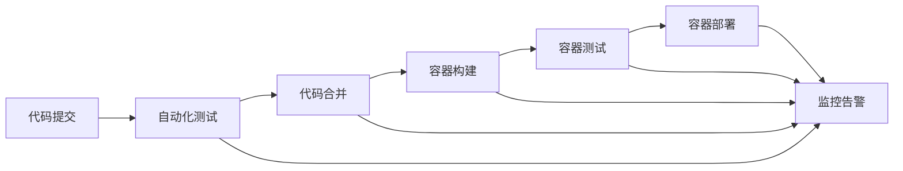

                 

# DevOps工具链搭建与集成

> 关键词：DevOps, 自动化, 持续集成(CI), 持续部署(CD), 容器化, 自动化测试, 部署流水线, 监控与告警

## 1. 背景介绍

在当今的软件开发与运维领域，DevOps（Development和Operations的结合）已成为企业实现快速、高效、稳定交付的重要手段。DevOps不仅连接了开发与运维，还融合了工具链、流程和文化的方方面面，致力于提升整个软件开发生态的效率和质量。本文旨在系统介绍DevOps工具链的搭建与集成，帮助企业构建高效、自动化、可扩展的持续交付流水线。

## 2. 核心概念与联系

### 2.1 核心概念概述

- **DevOps**：指的是一种文化和实践，强调协作、自动化、持续交付和持续监控，以提升软件交付速度和质量。
- **持续集成(CI)**：指的是一种软件开发实践，其中每个代码提交都会自动构建、测试和集成到主干代码库中。
- **持续部署(CD)**：指的是一种部署实践，其中每次代码提交都会自动部署到生产环境，确保应用快速、安全地发布。
- **容器化**：指的是一种技术，通过将应用程序及其依赖打包到可移植的容器中，以实现跨平台、跨环境的一致性和快速部署。
- **自动化测试**：指的是一种测试实践，通过自动化的方式执行测试，减少人为错误，提升测试效率和可靠性。
- **部署流水线**：指的是一种自动化流程，从代码提交到部署上线，所有步骤都自动化、规范化，确保流程一致和高效。
- **监控与告警**：指的是一种运维实践，通过实时监控系统性能、资源使用情况，及时发现并解决问题，防止服务中断。

这些概念构成了DevOps工具链的核心要素，通过合理的工具链设计，可以显著提升软件开发和运维的效率和质量。

### 2.2 核心概念原理和架构的 Mermaid 流程图



## 3. 核心算法原理 & 具体操作步骤

### 3.1 算法原理概述

DevOps工具链的搭建与集成，本质上是一个系统集成工程，旨在构建从代码提交到产品交付的自动化流水线，并通过持续集成、持续部署、持续监控的“三持续”实践，确保软件交付的高效、稳定和可靠。其核心算法原理包括：

1. **持续集成**：通过自动化测试和代码合并，确保每次代码提交都是可部署的。
2. **持续部署**：通过自动化部署流程，确保新代码能够快速、可靠地发布到生产环境。
3. **持续监控**：通过实时监控和告警，及时发现和解决问题，确保应用稳定运行。

### 3.2 算法步骤详解

1. **需求分析与规划**：明确项目目标、需求和技术栈，选择合适的工具和平台。
2. **工具选择与集成**：选择适合的CI/CD工具、容器编排工具、监控工具等，进行集成和配置。
3. **流程设计**：设计自动化流程，包括代码提交、测试、合并、构建、部署等环节。
4. **自动化测试**：编写单元测试、集成测试和端到端测试，确保代码质量和系统稳定性。
5. **持续集成与持续部署**：配置CI/CD管道，自动执行构建、测试、部署流程。
6. **监控与告警**：集成监控工具，设置告警策略，实时监控系统性能和资源使用情况。

### 3.3 算法优缺点

**优点**：
- **提升效率**：自动化流程减少了手动操作，大大提升了开发和运维效率。
- **提高质量**：持续测试和自动化部署减少了人为错误，提升了代码和系统质量。
- **增强稳定性**：持续监控和告警机制确保了系统稳定运行，减少了故障和停机时间。

**缺点**：
- **复杂性**：搭建和维护一个自动化流水线相对复杂，需要投入较多时间和资源。
- **依赖性**：依赖于稳定的工具和环境，工具失效或配置错误可能导致流程中断。
- **学习曲线**：需要掌握多种工具和技术，学习曲线较陡。

### 3.4 算法应用领域

DevOps工具链广泛应用于软件开发、运维、云平台、微服务架构等场景，尤其在敏捷开发、持续交付、云原生架构等领域具有显著优势。企业可通过DevOps实践，提升软件交付速度和质量，缩短产品上市时间，增强市场竞争力。

## 4. 数学模型和公式 & 详细讲解 & 举例说明

### 4.1 数学模型构建

DevOps工具链的数学模型主要关注流水线效率和质量的优化。我们可以用以下的模型来描述CI/CD流水线的过程：

设流水线包含n个步骤，每个步骤的执行时间为$t_i$，执行成功率为$p_i$（0到1之间），流水线整体的成功率为$P$。

流水线整体执行时间为$T = \sum_{i=1}^n t_i$，整体成功率为$P = \prod_{i=1}^n p_i$。

### 4.2 公式推导过程

推导过程如下：

1. 流水线整体执行时间$T$是各个步骤执行时间的总和。
2. 流水线整体成功率$P$是各个步骤成功的乘积。
3. 假设步骤$j$失败后，流水线立即停止，且每个步骤相互独立。

因此，流水线整体执行时间为$T$，整体成功率为$P = \prod_{i=1}^n (1-q_i) = \prod_{i=1}^n p_i$。

### 4.3 案例分析与讲解

以一个典型的CI/CD流程为例，包含代码提交、构建、测试、部署等步骤，每个步骤的执行时间和成功率如下：

- 代码提交：$t_1 = 5min, p_1 = 0.99$
- 构建：$t_2 = 10min, p_2 = 0.98$
- 测试：$t_3 = 15min, p_3 = 0.95$
- 部署：$t_4 = 20min, p_4 = 0.97$

整体执行时间$T = t_1 + t_2 + t_3 + t_4 = 50min$，整体成功率$P = p_1 \cdot p_2 \cdot p_3 \cdot p_4 = 0.97 \cdot 0.98 \cdot 0.95 \cdot 0.97 = 0.92$。

通过上述数学模型，可以定量分析流水线效率和成功率，从而优化各个环节的执行时间和成功率，提升整体效率。

## 5. 项目实践：代码实例和详细解释说明

### 5.1 开发环境搭建

首先需要搭建一个完整的开发环境，包括代码仓库、CI/CD工具、容器编排工具、监控工具等。

1. **代码仓库**：使用GitLab、GitHub等版本控制系统。
2. **CI/CD工具**：使用Jenkins、Travis CI、CircleCI等持续集成工具。
3. **容器编排工具**：使用Docker、Kubernetes等容器编排工具。
4. **监控工具**：使用Prometheus、Grafana等监控工具。

### 5.2 源代码详细实现

以下是一个简单的CI/CD流程的实现示例：

1. 在Jenkins上配置代码仓库和构建步骤，编写构建脚本：

```python
from jenkins import Jenkins

# 配置Jenkins连接信息
server = Jenkins('http://jenkins.example.com', 'username', 'password')

# 新建项目
job = server.create_job('myjob')

# 配置构建步骤
build_step = job.add_build_step(
    'execute shell', shell='python3 mybuildscript.py'
)

# 保存配置
job.save()
```

2. 编写构建脚本`mybuildscript.py`，执行测试和构建操作：

```python
import subprocess

# 执行单元测试
subprocess.run(['python3', 'pytest', 'test.py'])

# 执行构建命令
subprocess.run(['sh', 'build.sh'])
```

3. 在Docker上构建应用镜像：

```Dockerfile
# 基础镜像
FROM ubuntu:20.04

# 安装依赖
RUN apt-get update && apt-get install -y python3

# 设置工作目录
WORKDIR /app

# 复制代码
COPY . /app

# 安装依赖
RUN pip3 install -r requirements.txt

# 执行测试和构建
RUN python3 mybuildscript.py

# 构建镜像
FROM ubuntu:20.04
COPY --from=pre_build:/app /app
```

4. 在Jenkins上配置部署步骤，使用Docker容器部署应用：

```python
# 配置部署步骤
deploy_step = job.add_post_build_step(
    'execute shell', shell='docker run -d --name myapp -p 8000:8000 myimage'
)
```

5. 在Grafana上配置监控仪表盘，实时监控应用性能：

```json
{
  "title": "My Application Metrics",
  "panels": [
    {
      "type": "graph",
      "title": "CPU Usage",
      "targets": [
        {
          "expr": "node_cpu_usage_total{node!~'[a-z0-9]+', type='idle', mode='rate'}",
          "legendFormat": "{{ $labels.[kube_pod] }}: {{ $value }}",
          "refId": "A",
          "datasource": "$datasource",
          "options": {
            "alertThreshold": 80,
            "legend": {
              "show": true,
              "alignAsTable": false,
              "avg": false,
              "current": true,
              "max": false,
              "min": false,
              "rightSide": false,
              "rightSideShow": true,
              "side": "right",
              "sideShow": true,
              "sort": 0,
              "total": true,
              "useTags": false
            },
            "yAxis": {
              "align": false,
              "alignLevel": 0,
              "avg": true,
              "decimals": 0,
              "format": "short",
              "grow": true,
              "hide": false,
              "mode": "linear",
              "nicing": false,
              "show": false,
              "spike": 0,
              "steps": true,
              "unit": "none"
            }
          }
        }
      ]
    }
  ]
}
```

### 5.3 代码解读与分析

在上述代码示例中，我们主要使用了Jenkins、Docker和Grafana三个工具来实现CI/CD和监控功能。

- **Jenkins**：配置代码仓库、构建脚本、测试脚本、部署脚本等，自动化执行整个构建和部署流程。
- **Docker**：构建应用镜像，实现容器化部署，确保应用在各个环境中的一致性和稳定性。
- **Grafana**：配置监控仪表盘，实时监控应用性能，设置告警策略，确保系统稳定运行。

通过这些工具的集成和配置，我们可以构建一个完整的DevOps流水线，提升软件交付的效率和质量。

### 5.4 运行结果展示

运行结果展示如下：

- **构建结果**：在Jenkins上可以看到每次构建的详细日志和执行结果，确保每次提交都是可部署的。
- **部署结果**：在Jenkins上看到每次部署的执行结果和日志，确保应用能够快速、可靠地发布。
- **监控结果**：在Grafana上实时查看应用的CPU、内存等性能指标，及时发现和解决问题，确保系统稳定运行。

## 6. 实际应用场景

### 6.1 自动化测试与CI流水线

在软件开发过程中，自动化测试是保证代码质量的重要手段。通过将自动化测试集成到CI流水线中，可以快速发现和修复代码缺陷，提高开发效率和软件质量。

例如，一个SaaS平台，通过CI流水线实现自动化测试，包括单元测试、集成测试和端到端测试。每次代码提交后，自动执行测试流程，生成测试报告，并在Jenkins上显示测试结果。开发人员可以快速定位和修复缺陷，确保软件质量。

### 6.2 持续部署与CD流水线

持续部署是DevOps的核心实践之一，通过自动化部署流程，确保新代码能够快速、可靠地发布到生产环境，提高产品上市速度和市场竞争力。

例如，一个电商网站，通过CI/CD流水线实现自动化部署。每次代码提交后，自动构建应用镜像，并部署到生产环境中，确保新功能能够及时上线，提升用户体验。同时，通过监控工具实时监控应用性能，及时发现和解决问题，确保服务稳定运行。

### 6.3 容器化与容器编排

容器化是DevOps的另一重要实践，通过将应用程序及其依赖打包到容器中，实现跨平台、跨环境的一致性和快速部署。容器编排工具如Kubernetes，可以自动化管理容器的生命周期，确保应用的稳定性和可靠性。

例如，一个金融系统，通过Docker容器化应用，实现跨平台部署。同时，使用Kubernetes进行容器编排，确保应用在多个节点上均衡运行，提升系统可用性和扩展性。

## 7. 工具和资源推荐

### 7.1 学习资源推荐

- **《DevOps基础设施自动化》**：介绍DevOps基础设施自动化的基本概念和实践。
- **《持续交付：软件质量的理念与实践》**：探讨持续交付的核心思想和最佳实践。
- **《容器编排与调度》**：深入讲解Kubernetes等容器编排工具的使用方法。
- **《监控与告警：运维自动化与高效管理》**：介绍Prometheus、Grafana等监控工具的使用和配置。

### 7.2 开发工具推荐

- **Jenkins**：一个流行的持续集成和持续部署工具，支持丰富的插件和扩展。
- **Docker**：一个开源的容器化平台，支持应用程序的打包、分发和运行。
- **Kubernetes**：一个开源的容器编排工具，支持容器在集群上的自动化部署和管理。
- **Prometheus**：一个开源的监控系统，支持时间序列数据收集、查询和报警。
- **Grafana**：一个开源的监控仪表盘，支持实时数据的可视化和告警。

### 7.3 相关论文推荐

- **《持续交付：实现、效益与风险》**：探讨持续交付的实践、效益和风险。
- **《容器化的优势与挑战》**：分析容器化的优势和面临的挑战。
- **《自动化测试在DevOps中的重要性》**：探讨自动化测试在DevOps中的作用和重要性。
- **《DevOps的文化与实践》**：分析DevOps的文化和实践对软件开发的影响。

## 8. 总结：未来发展趋势与挑战

### 8.1 总结

本文系统介绍了DevOps工具链的搭建与集成，从背景、核心概念、算法原理、具体操作步骤、数学模型和公式、项目实践、实际应用场景、工具和资源推荐等多个方面，对DevOps进行了深入探讨。DevOps通过持续集成、持续部署、持续监控的“三持续”实践，实现了软件交付的高效、稳定和可靠。未来，DevOps将在软件开发和运维领域发挥越来越重要的作用。

### 8.2 未来发展趋势

未来DevOps工具链的发展趋势如下：

1. **自动化程度更高**：随着工具和技术的不断进步，DevOps的自动化程度将进一步提升，从代码提交到生产部署，所有环节都将实现自动化。
2. **云计算与容器化深度融合**：DevOps将与云计算、容器化等技术深度融合，实现更高效、更灵活的部署和管理。
3. **持续监控与告警机制更完善**：实时监控和告警机制将进一步完善，确保系统稳定运行，减少故障和停机时间。
4. **可视化与数据分析能力更强**：DevOps工具将具备更强的可视化与数据分析能力，提供更详细的性能指标和系统健康状态。
5. **更多开源工具和平台**：开源工具和平台将持续涌现，推动DevOps技术的普及和应用。

### 8.3 面临的挑战

DevOps虽然带来了很多优势，但在实施过程中仍面临一些挑战：

1. **工具复杂性**：DevOps工具链涉及多个组件和配置，复杂度高，需要投入较多时间和资源。
2. **学习曲线陡峭**：DevOps涉及多种工具和技术，学习曲线较陡，需要较高的技术门槛。
3. **文化与组织挑战**：DevOps需要改变传统软件开发和运维模式，对企业文化和组织架构有较高要求。
4. **安全与合规风险**：DevOps流水线涉及代码提交、构建、部署等多个环节，需要考虑安全与合规风险。

### 8.4 研究展望

未来DevOps工具链的研究方向如下：

1. **自动化与智能化**：研发更自动化、智能化的工具和平台，提升DevOps实践的效率和质量。
2. **安全和合规**：加强DevOps流水线的安全与合规管理，保障系统安全稳定运行。
3. **多领域应用**：将DevOps实践应用到更多领域，如医疗、金融、制造等，推动各行各业数字化转型。
4. **跨组织协同**：推动DevOps跨组织协同，实现更高效的软件开发与运维。
5. **DevOps生态建设**：构建健康的DevOps生态，促进DevOps技术的发展和应用。

## 9. 附录：常见问题与解答

### Q1: 什么是DevOps？

**A**: DevOps是一种文化和实践，强调协作、自动化、持续交付和持续监控，以提升软件交付速度和质量。

### Q2: 持续集成和持续部署的区别是什么？

**A**: 持续集成指的是每个代码提交都会自动构建、测试和集成到主干代码库中。持续部署指的是每次代码提交都会自动部署到生产环境。持续集成和持续部署都是DevOps的核心实践。

### Q3: 如何提高DevOps的自动化程度？

**A**: 可以通过选择合适的工具和平台，配置自动化的流水线，减少人工干预。例如，使用Jenkins、Travis CI、CircleCI等持续集成工具，Docker、Kubernetes等容器编排工具，以及Prometheus、Grafana等监控工具，实现自动化流程。

### Q4: DevOps对企业有哪些好处？

**A**: DevOps可以提升软件交付速度，减少故障和停机时间，提高软件质量，增强市场竞争力。同时，DevOps还促进团队协作，提升开发效率和运维效率，实现敏捷开发和持续交付。

### Q5: DevOps工具链搭建时需要注意哪些问题？

**A**: 需要注意工具的选择和集成，配置自动化流程，确保系统稳定和安全。同时，还需要考虑团队协作、文化变革、组织架构等因素，确保DevOps实践的顺利实施。

通过系统学习和实践，相信你一定能够构建一个高效、自动化、可扩展的DevOps流水线，提升软件交付的效率和质量，为企业创造更大的价值。

