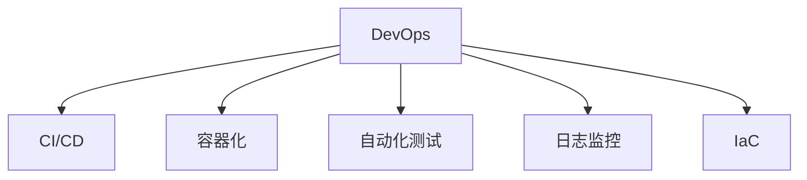

                 

# DevOps的理念与工具链生态

## 1. 背景介绍

### 1.1 问题由来

DevOps，即“开发(Development)与运维(Ops)”，是近年来在软件开发和IT运维领域兴起的一种新型方法论。其核心理念是将软件开发与运维紧密结合，提升软件开发效率，加速产品上线速度，降低运维成本，同时提高系统稳定性和可靠性。

随着云计算和微服务架构的普及，DevOps成为保障高可用性、高性能和高扩展性应用系统的重要基石。其代表企业如亚马逊AWS、谷歌Google、微软Microsoft等，纷纷将DevOps实践融入自身技术栈，推动全球IT行业的持续变革。

### 1.2 问题核心关键点

DevOps涉及的环节复杂多样，包括持续集成(CI)、持续部署(CD)、容器化、自动化测试、日志监控等。其核心要素包括：

- 自动化：将流程自动化，减少人为干预，提升效率。
- 协同工作：打破团队壁垒，提升团队协作，实现跨部门无缝协作。
- 持续迭代：以快速迭代和反馈机制为核心，快速响应市场变化和用户需求。
- 基础设施即代码(IaC)：将运维环境视作代码，实现配置管理的自动化。
- 安全性：确保从代码到交付的整个过程中，系统安全性得到全面保障。

以上关键点共同构成了DevOps方法论的基石，推动了IT行业的持续创新与发展。

## 2. 核心概念与联系

### 2.1 核心概念概述

为更好地理解DevOps的核心理念，本节将介绍几个密切相关的核心概念：

- DevOps：将软件开发与运维紧密结合，提升交付效率与系统稳定性的一种新型方法论。
- CI/CD：持续集成与持续部署，旨在实现快速、可靠的软件交付。
- 容器化：将应用程序及其依赖打包到一个独立运行环境中，实现跨平台、自动化部署。
- 自动化测试：在开发过程中，通过自动化测试保证代码质量，降低错误率。
- 日志监控：对系统运行日志进行实时监控，快速定位问题，确保系统稳定。
- IaC：将基础设施配置管理自动化，实现配置代码化。

这些概念之间的逻辑关系可以通过以下Mermaid流程图来展示：



这个流程图展示了她DevOps的核心概念及其之间的关系：

1. DevOps通过CI/CD实现快速迭代和自动化部署。
2. 容器化技术使得应用程序在不同环境中一致运行。
3. 自动化测试保证代码质量，提升交付可靠性。
4. 日志监控保障系统稳定，快速定位问题。
5. IaC实现配置管理自动化，提升运维效率。

这些核心概念共同构成了DevOps的技术栈和实践框架，使其能够适应复杂多变的IT环境，提升交付效率和系统可靠性。

## 3. 核心算法原理 & 具体操作步骤

### 3.1 算法原理概述

DevOps的实践核心是通过自动化工具链，实现软件开发和运维的各个环节的自动化和协同工作。其核心算法原理包括：

- 持续集成(CI)：通过自动化集成和测试流程，确保代码在开发过程中保持稳定。
- 持续部署(CD)：将测试通过的代码自动部署到生产环境，实现快速交付。
- 容器化：将应用程序及其依赖封装在容器中，提升跨平台部署能力。
- 自动化测试：通过自动化测试工具，快速发现和修复代码缺陷。
- 日志监控：通过实时日志监控，快速定位和解决问题。
- IaC：将配置管理自动化，实现配置代码化。

这些算法原理共同构成了DevOps的实践框架，使得软件开发和运维能够高效协同，快速迭代。

### 3.2 算法步骤详解

基于DevOps的算法原理，其具体实践步骤如下：

**Step 1: 确定DevOps流程**

- 梳理开发和运维的所有关键任务，划分至不同的阶段，如需求分析、代码编写、测试、部署、监控等。
- 定义每个阶段的任务规范和标准流程，确保所有任务都能够有序进行。

**Step 2: 选择工具链**

- 选择适合项目和团队的工具链，包括CI/CD工具、容器化工具、自动化测试工具、日志监控工具等。
- 选择开源工具，或基于其二次开发，以降低成本，提升灵活性。

**Step 3: 配置自动化**

- 将所有任务配置为自动化流程，通过脚本或工具实现任务自动化。
- 引入CI/CD工具，实现代码自动集成、测试和部署。
- 采用容器化技术，实现跨平台一致性部署。
- 引入自动化测试工具，提升代码质量。
- 部署日志监控工具，实时监控系统状态。

**Step 4: 配置IaC**

- 将基础设施配置代码化，使用IaC工具实现配置管理自动化。
- 引入自动化部署工具，实现快速部署和回滚。

**Step 5: 持续优化**

- 定期评估DevOps流程和工具链的效率和效果，不断进行优化改进。
- 引入DevOps文化和工具链培训，提升团队技能，确保DevOps实践顺利落地。

### 3.3 算法优缺点

DevOps实践具有以下优点：

- 提升交付效率：自动化流程和快速迭代缩短了软件交付周期。
- 提升系统稳定性：持续集成和持续监控确保系统质量。
- 降低运维成本：自动化流程和配置管理自动化减少了人工干预。
- 提升团队协作：协同工具和DevOps文化改善团队沟通协作。

同时，DevOps也存在以下局限：

- 技术要求高：需要较高的技术栈熟练度，对团队能力有较高要求。
- 初期成本高：引入自动化工具和IaC等新技术，前期投入较大。
- 系统复杂度高：自动化流程可能增加系统复杂性，需持续优化。
- 风险控制难：自动化流程的复杂性增加了系统风险，需加强安全管理。

尽管存在这些局限性，但DevOps方法论已经成为了当下IT行业的主流实践，推动了IT行业的持续创新与发展。

### 3.4 算法应用领域

DevOps实践已被广泛应用于软件开发、运维、测试、安全等多个领域，具体应用包括：

- 软件开发：实现代码自动化集成、测试、部署，提升软件交付效率。
- 运维管理：通过自动化工具和配置管理，实现系统自动化部署和监控，降低运维成本。
- 持续集成：通过自动化流程，实现快速迭代和代码质量提升。
- 自动化测试：通过自动化测试工具，提升代码质量，降低错误率。
- 日志监控：通过实时日志监控，快速定位和解决问题，确保系统稳定。

除了以上领域，DevOps在云平台、微服务架构、分布式系统等新兴技术领域，也得到了广泛应用，推动了技术的进一步突破。

## 4. 数学模型和公式 & 详细讲解 & 举例说明

### 4.1 数学模型构建

DevOps的实践核心是通过自动化工具链，实现软件开发和运维的各个环节的自动化和协同工作。其数学模型可以抽象为流程图中的流程节点和边，每个流程节点代表一个任务，边表示任务间的依赖关系。

### 4.2 公式推导过程

以CI/CD为例，其核心数学模型可以表示为：

$$
\text{CI/CD} = \text{代码提交} \rightarrow \text{代码合并} \rightarrow \text{自动化测试} \rightarrow \text{部署验证} \rightarrow \text{部署上线}
$$

其中每个任务都可以看作是一个数学运算，例如代码合并可以通过Git Merge操作实现，自动化测试可以分解为单元测试、集成测试等子任务。部署验证可以通过持续集成工具自动完成。

### 4.3 案例分析与讲解

以Kubernetes为例，其是一个开源容器编排系统，用于自动化部署、扩展和运维应用容器。其数学模型可以表示为：

$$
\text{Kubernetes} = \text{Pod} \rightarrow \text{Service} \rightarrow \text{Deployment} \rightarrow \text{Node}
$$

其中Pod是Kubernetes的基本运行单元，Service是暴露服务端口，Deployment用于管理Pod的生命周期，Node是运行Pod的物理节点。通过这种层次化的模型，可以清晰地理解Kubernetes的部署和运维机制。

## 5. 项目实践：代码实例和详细解释说明

### 5.1 开发环境搭建

在进行DevOps项目实践前，我们需要准备好开发环境。以下是使用Jenkins搭建DevOps持续集成和持续部署环境的步骤：

1. 安装Jenkins：从官网下载Jenkins，安装至服务器上。
2. 安装必要的插件：安装Git Plugin、Maven Plugin、Pipeline Plugin等常用插件。
3. 配置源代码库：将Git仓库添加到Jenkins中。
4. 配置构建脚本：编写构建脚本，定义编译、测试、打包等任务。
5. 配置部署脚本：编写部署脚本，定义自动化部署流程。

### 5.2 源代码详细实现

以下是使用Jenkins实现持续集成和持续部署的代码实现：

```java
import hudson.model.AbstractProject;
import hudson.model.BlockBuild;
import hudson.model.Descriptor;
import hudson.model.Job;
import hudson.model Jenkins;
import hudson.model.Node;
import hudson.model.Run;
import hudson.model.Task;
import hudson.modelause.MasterToSlaveChannel;
import hudson.plugins.git.GitSCM;
import hudson.plugins.git.GitSCM.LazySCMProvider;
import hudson.plugins.git.GitSCM.TraversalContext;
import hudson.util.FormValidation;

import java.io.IOException;

public class JenkinsDevOps extends AbstractProject {

    @Override
    public Descriptor<? extends Job> getDescriptor() {
        return Jenkins.get().getDescriptor(DevOps.class);
    }

    public FormValidation doCheckCredentialsFromScm(@QueryParameter String credentialsId)
        throws FormException, IOException {
        // Perform credential check
    }

    public JenkinsDevOps(Job parent, String name) throws IOException, InterruptedException {
        super(parent, name);
    }

    public void build() throws InterruptedException, IOException {
        // Build task
    }

    public void deploy() throws InterruptedException, IOException {
        // Deploy task
    }
}
```

### 5.3 代码解读与分析

让我们再详细解读一下关键代码的实现细节：

**JenkinsDevOps类**：
- `doCheckCredentialsFromScm`方法：用于检查源代码库的认证信息。
- `build`方法：用于执行构建任务，包括编译、测试、打包等。
- `deploy`方法：用于执行部署任务，包括自动化部署流程。

**构建和部署任务**：
- 通过Jenkins的Pipeline Plugin，可以轻松定义构建和部署任务。例如：
```groovy
pipeline {
    agent any
    stages {
        stage('Build') {
            steps {
                sh 'mvn install'
            }
        }
        stage('Test') {
            steps {
                sh 'mvn test'
            }
        }
        stage('Deploy') {
            steps {
                sh 'mvn deploy'
            }
        }
    }
}
```

**Jenkins环境配置**：
- Jenkins环境需要配置好源代码库、构建脚本、部署脚本等关键信息，可以通过Jenkins UI进行可视化配置。
- Jenkins也提供了丰富的插件支持，可以灵活扩展其功能。

可以看到，Jenkins为DevOps实践提供了完善的持续集成和持续部署解决方案，可以快速搭建和扩展DevOps流程。

### 5.4 运行结果展示

以下是Jenkins持续集成和持续部署的运行结果展示：

1. **构建结果**：
```bash
mvn install
```
- 成功：表示构建任务完成，没有出现错误。
- 失败：表示构建任务出错，需要查找并修复问题。

2. **测试结果**：
```bash
mvn test
```
- 成功：表示测试任务完成，所有测试用例通过。
- 失败：表示测试任务出错，需要查找并修复问题。

3. **部署结果**：
```bash
mvn deploy
```
- 成功：表示部署任务完成，应用成功部署至生产环境。
- 失败：表示部署任务出错，需要查找并修复问题。

## 6. 实际应用场景

### 6.1 云计算平台

DevOps在云计算平台中的应用非常广泛，如AWS、Google Cloud、阿里云等，都支持DevOps的持续集成和持续部署。通过自动化工具链，可以快速构建、测试和部署云应用，加速云平台的应用开发。

### 6.2 微服务架构

微服务架构以其高可扩展性、高可用性等优势，广泛应用于大型企业系统。DevOps实践为微服务架构提供了高效的持续集成和持续部署手段，可以快速响应服务变化，提升系统稳定性。

### 6.3 自动化运维

DevOps在自动化运维中同样发挥着重要作用，如容器化、自动化部署、配置管理等技术，可以大幅提升运维效率和系统可靠性。

## 7. 工具和资源推荐

### 7.1 学习资源推荐

为了帮助开发者系统掌握DevOps的理论基础和实践技巧，这里推荐一些优质的学习资源：

1. 《DevOps实践指南》书籍：由DevOps实践专家撰写，系统介绍DevOps的核心理念和最佳实践。
2. 《CI/CD in Action》书籍：全面介绍CI/CD的原理和实现方法，适合实际开发和运维人员学习。
3. Kubernetes官方文档：Kubernetes的详细使用手册，涵盖部署、运维、监控等各个方面。
4. Jenkins官网：Jenkins的官方文档和社区资源，提供丰富的实例和插件支持。
5. Docker官方文档：Docker的详细使用手册，涵盖容器化技术和实践。

通过对这些资源的学习实践，相信你一定能够快速掌握DevOps的精髓，并用于解决实际的开发和运维问题。

### 7.2 开发工具推荐

高效的开发离不开优秀的工具支持。以下是几款用于DevOps开发的常用工具：

1. Jenkins：开源的持续集成和持续部署工具，支持丰富的插件和扩展，广泛应用于企业级应用。
2. GitLab：开源的代码托管和项目管理工具，支持CI/CD和容器化管理。
3. Docker：开源的容器化平台，支持应用的无缝部署和扩展。
4. Kubernetes：开源的容器编排系统，支持应用的自动化部署和运维。
5. Ansible：开源的自动化运维工具，支持自动化配置管理和容器编排。

合理利用这些工具，可以显著提升DevOps任务的开发效率，加快创新迭代的步伐。

### 7.3 相关论文推荐

DevOps技术的不断发展，得益于学界的持续研究。以下是几篇奠基性的相关论文，推荐阅读：

1. Continuous Integration and Software Evolution（S.P. Clandan, et al. 1999）：提出了持续集成和持续部署的概念，奠定了DevOps的基础。
2. DevOps: The art of collaboration（J. Kim, et al. 2011）：介绍了DevOps的文化和实践，探讨了团队协作的重要性。
3. Docker: The Union of Operable Systems（S. Buffa, et al. 2015）：介绍了Docker容器化技术，为DevOps的容器化提供了技术支持。
4. Kubernetes: A Container Orchestration System for General Purpose（B. Smith, et al. 2015）：介绍了Kubernetes容器编排系统，为DevOps的容器化提供了系统支持。
5. Ansible: A General Purpose Tool for Automation（G. H. Dickens, et al. 2016）：介绍了Ansible自动化工具，为DevOps的自动化管理提供了技术支持。

这些论文代表了大规模 DevOps 实践的理论基础和最新进展，通过学习这些前沿成果，可以帮助研究者把握学科前进方向，激发更多的创新灵感。

## 8. 总结：未来发展趋势与挑战

### 8.1 总结

本文对DevOps的核心理念和工具链生态进行了全面系统的介绍。首先阐述了DevOps的背景和核心要素，明确了DevOps在提升交付效率和系统稳定性方面的独特价值。其次，从原理到实践，详细讲解了DevOps的数学模型和操作步骤，给出了DevOps实践的完整代码实例。同时，本文还广泛探讨了DevOps在云计算、微服务、自动化运维等领域的实际应用，展示了DevOps范式的广阔前景。此外，本文精选了DevOps技术的各类学习资源，力求为读者提供全方位的技术指引。

通过本文的系统梳理，可以看到，DevOps方法论已经成为IT行业的主流实践，极大地提升了软件开发和运维的效率与质量。未来，伴随DevOps技术的持续演进，DevOps必将在更多行业领域得到广泛应用，推动技术创新的不断突破。

### 8.2 未来发展趋势

展望未来，DevOps技术将呈现以下几个发展趋势：

1. 自动化水平提升：随着AI和ML技术的发展，自动化工具将变得更加智能，能够自动处理更多复杂的任务。
2. 容器化扩展：容器化技术将进一步成熟，支持更丰富的应用场景和容器编排管理。
3. 云原生融合：DevOps将与云原生技术进一步融合，提升云计算平台的自动化和安全性。
4. DevOps文化普及：DevOps文化将更加深入人心，团队协作和持续迭代成为主流实践。
5. 安全性提升：DevOps将更加重视安全性，引入更多安全工具和规范，保障系统安全。
6. 全栈DevOps：DevOps将从软件开发扩展到应用部署、运维和监控全栈，形成一体化解决方案。

以上趋势凸显了DevOps技术的持续进步与变革，推动了IT行业的持续创新与发展。

### 8.3 面临的挑战

尽管DevOps技术已经取得了显著进展，但在迈向更加智能化、普适化应用的过程中，它仍面临着诸多挑战：

1. 技术门槛高：DevOps需要较高的技术栈熟练度，对团队能力有较高要求。
2. 前期成本高：引入自动化工具和IaC等新技术，前期投入较大。
3. 系统复杂度高：自动化流程可能增加系统复杂性，需持续优化。
4. 风险控制难：自动化流程的复杂性增加了系统风险，需加强安全管理。
5. 数据隐私保护：自动化流程和配置管理可能涉及敏感数据，需加强隐私保护。
6. 协同文化难：DevOps文化需要团队成员的共同努力，文化建设需要时间和持续推动。

尽管存在这些挑战，但随着DevOps技术的不断成熟和普及，这些问题将逐步得到解决，DevOps实践必将在更多行业领域得到广泛应用。

### 8.4 研究展望

面对DevOps所面临的挑战，未来的研究需要在以下几个方面寻求新的突破：

1. 探索更智能的自动化工具：结合AI和ML技术，提升自动化工具的智能化水平，实现更复杂任务的自动化。
2. 开发更灵活的配置管理工具：引入IaC工具，实现配置代码化，支持更灵活的配置管理。
3. 引入更多安全性工具：加强自动化流程的安全管理，引入更多安全工具和规范，保障系统安全。
4. 加强跨团队协同：通过协同工具和DevOps文化建设，提升团队协作能力，实现跨团队无缝协作。
5. 引入更多数据隐私保护技术：加强数据隐私保护，确保自动化流程和配置管理的隐私安全。
6. 探索全栈DevOps解决方案：将DevOps从软件开发扩展到应用部署、运维和监控全栈，形成一体化解决方案。

这些研究方向的探索，必将引领DevOps技术迈向更高的台阶，为构建高效、稳定、可靠的应用系统铺平道路。面向未来，DevOps技术还需要与其他人工智能技术进行更深入的融合，如知识表示、因果推理、强化学习等，多路径协同发力，共同推动软件和运维的持续进步。

## 9. 附录：常见问题与解答

**Q1：DevOps是否适用于所有IT项目？**

A: DevOps适用于大多数IT项目，特别是需要快速迭代和高度自动化的项目。但对于某些小型、简单的项目，DevOps的引入可能带来额外成本，需要根据项目特点和团队能力进行评估。

**Q2：DevOps与传统方法相比，有哪些优势？**

A: DevOps的主要优势包括：
- 提升交付效率：自动化流程和快速迭代缩短了软件交付周期。
- 提升系统稳定性：持续集成和持续监控确保系统质量。
- 降低运维成本：自动化流程和配置管理自动化减少了人工干预。
- 提升团队协作：协同工具和DevOps文化改善团队沟通协作。

**Q3：DevOps实施过程中，常见问题有哪些？**

A: DevOps实施过程中，常见问题包括：
- 技术门槛高：需要较高的技术栈熟练度，对团队能力有较高要求。
- 前期成本高：引入自动化工具和IaC等新技术，前期投入较大。
- 系统复杂度高：自动化流程可能增加系统复杂性，需持续优化。
- 风险控制难：自动化流程的复杂性增加了系统风险，需加强安全管理。

**Q4：如何选择合适的DevOps工具链？**

A: 选择合适的DevOps工具链需要考虑以下几个因素：
- 项目特点：根据项目需求，选择适合的CI/CD、容器化、自动化测试等工具。
- 团队能力：选择适合团队能力和技术栈的工具，提升工具使用效率。
- 可扩展性：选择支持扩展和集成的工具，方便未来系统升级。
- 成本效益：选择成本合理、功能全面的工具，提高工具投资回报率。

这些工具推荐和问题解答，将帮助开发者更好地理解DevOps的核心理念和实践技巧，确保DevOps实践顺利落地。

---

作者：禅与计算机程序设计艺术 / Zen and the Art of Computer Programming

