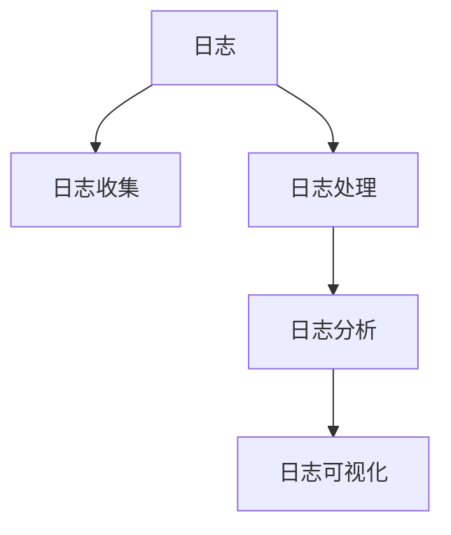

                 

# ELK日志分析系统搭建

## 1. 背景介绍

### 1.1 问题由来

在现代信息技术系统中，日志是记录系统运行状态、操作行为的重要工具。通过分析日志数据，可以诊断系统问题、优化系统性能、监控系统安全、记录系统审计等信息。因此，日志分析系统的构建，成为了IT运维和安全领域的重要任务。

然而，面对海量、多样化的日志数据，传统的手工监控和分析方法效率低下、准确性差。而且，许多日志数据格式复杂，难以直接进行有效分析。为了提高日志分析的效率和准确性，人们开发了各种日志分析工具，如ELK Stack、Splunk、Graylog等。其中，ELK Stack以其开源、灵活、可扩展的特点，成为了应用最广泛的日志分析平台之一。

### 1.2 问题核心关键点

ELK Stack（Elasticsearch、Logstash、Kibana）是由Elastic公司开发的一款开源日志分析系统，由三个主要组件构成：

- **Logstash**：数据管道工具，用于从各个数据源（如系统日志、网络日志、应用日志等）采集日志数据，并进行数据清洗、格式化和过滤等预处理工作。
- **Elasticsearch**：分布式搜索和分析引擎，用于存储和管理日志数据，支持全文检索、聚合分析等功能。
- **Kibana**：可视化工具，用于展示分析结果，提供丰富的图表、仪表盘和报告功能。

ELK Stack通过以上三个组件的协同工作，实现对日志数据的全面分析和展示，为IT运维和安全提供了强大的支持。

### 1.3 问题研究意义

构建ELK Stack日志分析系统，对IT运维和安全工作具有重要的意义：

1. **高效监控和故障诊断**：通过实时监控和日志分析，可以快速定位系统故障，减少停机时间和恢复成本。
2. **性能优化**：通过分析日志数据，可以识别出性能瓶颈，指导系统优化和升级，提升系统性能。
3. **安全审计和威胁检测**：通过日志分析，可以识别出潜在的安全威胁，及时采取防范措施，保护系统安全。
4. **合规和审计**：通过日志记录和分析，可以满足各类合规要求，提供系统的审计记录，保障系统的合规性。
5. **数据分析和洞察**：通过深入分析日志数据，可以挖掘出有价值的业务洞察，为决策提供依据。

## 2. 核心概念与联系

### 2.1 核心概念概述

为更好地理解ELK Stack的构建和应用，本节将介绍几个密切相关的核心概念：

- **日志(Logs)**：记录系统运行状态、操作行为等信息的文本文件。日志包含系统时间、模块、事件、状态等关键信息，是系统监控、故障诊断和安全审计的重要数据源。
- **日志收集(Log Gathering)**：从不同数据源（如服务器、应用、网络设备等）采集日志数据的过程。
- **日志处理(Log Processing)**：对日志数据进行清洗、过滤、转换、聚合等预处理操作，为后续分析提供可靠的数据基础。
- **日志分析(Log Analysis)**：对日志数据进行模式识别、异常检测、性能分析、安全监控等高级分析操作，生成分析结果。
- **日志可视化(Log Visualization)**：将分析结果以图形、仪表盘等形式展示，提供直观的展示界面。

这些核心概念之间的逻辑关系可以通过以下Mermaid流程图来展示：



这个流程图展示了几大核心概念及其之间的关系：

1. 日志是分析的数据基础。
2. 日志收集是将数据源的日志数据汇聚到日志分析系统。
3. 日志处理是对日志数据进行预处理，为分析提供可靠数据。
4. 日志分析是通过高级分析方法，生成分析结果。
5. 日志可视化是将分析结果以直观的形式展示，方便用户使用。

## 3. 核心算法原理 & 具体操作步骤

### 3.1 算法原理概述

ELK Stack的构建主要涉及以下几个算法和步骤：

- **日志收集算法**：从不同数据源（如系统日志、网络日志、应用日志等）采集日志数据。
- **日志处理算法**：对日志数据进行清洗、过滤、转换、聚合等预处理操作。
- **日志分析算法**：对日志数据进行模式识别、异常检测、性能分析、安全监控等高级分析操作。
- **日志可视化算法**：将分析结果以图形、仪表盘等形式展示，提供直观的展示界面。

### 3.2 算法步骤详解

#### 3.2.1 日志收集

1. **选择合适的数据源**：
   - 系统日志：记录系统运行状态、错误信息等。
   - 网络日志：记录网络流量、访问记录等。
   - 应用日志：记录应用操作、异常信息等。
   - 第三方日志：如第三方服务、用户设备等。

2. **安装Logstash插件**：
   - 根据数据源选择合适的插件（如log4j、syslog、http等）。
   - 在Logstash中配置插件参数，设置日志收集规则。

3. **配置Logstash配置文件**：
   - 定义输入源、过滤器、输出目标等配置。
   - 使用插件进行数据过滤、格式转换、聚合等操作。

#### 3.2.2 日志处理

1. **数据清洗**：
   - 去除日志文件中的无用信息，如注释、格式化字符等。
   - 去除重复、无效的日志记录。

2. **数据转换**：
   - 将日志数据转换为统一格式，便于后续分析。
   - 使用插件进行日期时间格式转换、字段提取等操作。

3. **数据过滤**：
   - 根据业务需求，筛选出关键日志记录。
   - 使用插件进行关键字过滤、规则匹配等操作。

#### 3.2.3 日志分析

1. **模式识别**：
   - 使用Elasticsearch的聚合分析功能，识别出常见的日志模式。
   - 使用正则表达式、关键词匹配等方法，提取关键信息。

2. **异常检测**：
   - 使用Elasticsearch的统计分析功能，检测异常情况。
   - 使用机器学习算法，训练异常检测模型。

3. **性能分析**：
   - 使用Elasticsearch的聚合分析功能，计算系统性能指标。
   - 使用可视化工具，生成性能监控图表。

#### 3.2.4 日志可视化

1. **导入Elasticsearch数据**：
   - 将处理后的日志数据导入Elasticsearch索引。
   - 定义索引结构和字段类型。

2. **创建Kibana仪表盘**：
   - 在Kibana中创建新的仪表盘，选择所需的数据源。
   - 定义仪表盘布局，添加图表、仪表盘、筛选器等组件。

3. **展示分析结果**：
   - 在Kibana中查看仪表盘，查看分析结果。
   - 根据需求，导出分析结果或生成报告。

### 3.3 算法优缺点

#### 3.3.1 优点

1. **灵活性高**：
   - 可以根据业务需求，自由配置Logstash插件和Elasticsearch索引。
   - 支持多种数据源和数据格式，适应不同的业务场景。

2. **扩展性强**：
   - 支持水平扩展，可根据业务需求增加更多的Logstash和Elasticsearch节点。
   - 支持分布式部署，提供高可用性和高吞吐量的日志处理能力。

3. **分析功能强大**：
   - 支持全文检索、聚合分析、统计分析等高级功能。
   - 可以生成直观的图表和仪表盘，方便用户进行数据分析和监控。

#### 3.3.2 缺点

1. **学习曲线陡峭**：
   - 需要一定的技术积累，学习成本较高。
   - 需要掌握Elasticsearch、Logstash、Kibana等多个工具的使用方法。

2. **性能瓶颈**：
   - 在处理大量数据时，可能会导致日志处理和存储效率低下。
   - 需要对Elasticsearch索引进行合理设计，避免数据冗余和查询性能问题。

3. **数据隐私问题**：
   - 日志数据中可能包含敏感信息，需要注意数据隐私和安全问题。
   - 需要配置合适的访问控制策略，防止数据泄露和滥用。

### 3.4 算法应用领域

ELK Stack以其强大的日志处理和分析能力，被广泛应用于以下领域：

1. **IT运维监控**：
   - 实时监控系统运行状态，及时发现和解决故障。
   - 分析系统性能指标，优化系统资源配置。

2. **安全审计和威胁检测**：
   - 记录系统安全事件，生成审计日志。
   - 检测系统中的异常行为和安全威胁，及时采取防范措施。

3. **业务数据分析**：
   - 分析业务数据，挖掘有价值的业务洞察，优化业务流程。
   - 生成业务报告和仪表盘，提供数据支持和决策依据。

4. **性能优化和调优**：
   - 分析系统性能瓶颈，指导系统优化和调优。
   - 使用性能监控图表，实时跟踪系统性能指标。

5. **应用日志分析**：
   - 收集和分析应用日志，优化应用性能和用户体验。
   - 生成应用监控报表，提供应用运行情况展示。

## 4. 数学模型和公式 & 详细讲解 & 举例说明

### 4.1 数学模型构建

ELK Stack的核心算法主要涉及以下几个数学模型：

- **日志收集模型**：用于描述日志数据的收集过程。
- **日志处理模型**：用于描述日志数据的预处理操作。
- **日志分析模型**：用于描述日志数据的分析过程。
- **日志可视化模型**：用于描述分析结果的展示过程。

### 4.2 公式推导过程

#### 4.2.1 日志收集模型

假设日志数据源的数量为 $n$，每个数据源的日志生成速率为 $\lambda_i$，日志记录的平均长度为 $\mu$，则日志收集模型的数学模型为：

$$
\text{Total Log Size} = \sum_{i=1}^n \lambda_i \mu t
$$

其中，$t$ 表示时间，$\text{Total Log Size}$ 表示在时间 $t$ 内生成的总日志数据量。

#### 4.2.2 日志处理模型

假设日志数据的清洗速率为 $\alpha$，转换速率为 $\beta$，过滤速率为 $\gamma$，则日志处理模型的数学模型为：

$$
\text{Processed Log Size} = (\alpha \beta \gamma) \times \text{Total Log Size}
$$

其中，$\text{Processed Log Size}$ 表示经过处理后，在时间 $t$ 内生成的总日志数据量。

#### 4.2.3 日志分析模型

假设日志分析的聚合速率为 $\delta$，统计速率为 $\epsilon$，异常检测速率为 $\zeta$，则日志分析模型的数学模型为：

$$
\text{Analyzed Log Size} = (\delta \epsilon \zeta) \times \text{Processed Log Size}
$$

其中，$\text{Analyzed Log Size}$ 表示经过分析后，在时间 $t$ 内生成的总日志数据量。

#### 4.2.4 日志可视化模型

假设日志可视化的展示速率为 $\eta$，则日志可视化模型的数学模型为：

$$
\text{Visualized Log Size} = (\eta) \times \text{Analyzed Log Size}
$$

其中，$\text{Visualized Log Size}$ 表示经过可视化展示后，在时间 $t$ 内生成的总日志数据量。

### 4.3 案例分析与讲解

#### 4.3.1 案例背景

某大型电商企业使用ELK Stack进行系统监控和日志分析。企业系统每天生成大量日志数据，主要包括系统日志、应用日志和网络日志等。

#### 4.3.2 日志收集

1. **选择合适的数据源**：
   - 系统日志：记录系统运行状态、错误信息等。
   - 应用日志：记录应用操作、异常信息等。
   - 网络日志：记录网络流量、访问记录等。

2. **安装Logstash插件**：
   - 在Logstash中安装 syslog、log4j、http 等插件。
   - 配置插件参数，设置日志收集规则。

3. **配置Logstash配置文件**：
   - 定义输入源、过滤器、输出目标等配置。
   - 使用插件进行数据过滤、格式转换、聚合等操作。

#### 4.3.3 日志处理

1. **数据清洗**：
   - 去除日志文件中的无用信息，如注释、格式化字符等。
   - 去除重复、无效的日志记录。

2. **数据转换**：
   - 将日志数据转换为统一格式，便于后续分析。
   - 使用插件进行日期时间格式转换、字段提取等操作。

3. **数据过滤**：
   - 根据业务需求，筛选出关键日志记录。
   - 使用插件进行关键字过滤、规则匹配等操作。

#### 4.3.4 日志分析

1. **模式识别**：
   - 使用Elasticsearch的聚合分析功能，识别出常见的日志模式。
   - 使用正则表达式、关键词匹配等方法，提取关键信息。

2. **异常检测**：
   - 使用Elasticsearch的统计分析功能，检测异常情况。
   - 使用机器学习算法，训练异常检测模型。

3. **性能分析**：
   - 使用Elasticsearch的聚合分析功能，计算系统性能指标。
   - 使用可视化工具，生成性能监控图表。

#### 4.3.5 日志可视化

1. **导入Elasticsearch数据**：
   - 将处理后的日志数据导入Elasticsearch索引。
   - 定义索引结构和字段类型。

2. **创建Kibana仪表盘**：
   - 在Kibana中创建新的仪表盘，选择所需的数据源。
   - 定义仪表盘布局，添加图表、仪表盘、筛选器等组件。

3. **展示分析结果**：
   - 在Kibana中查看仪表盘，查看分析结果。
   - 根据需求，导出分析结果或生成报告。

## 5. 项目实践：代码实例和详细解释说明

### 5.1 开发环境搭建

在进行ELK Stack的搭建前，我们需要准备好开发环境。以下是使用Linux进行ELK Stack搭建的环境配置流程：

1. **安装Elasticsearch**：
   - 从官网下载Elasticsearch的安装脚本，按照说明进行安装。
   - 启动Elasticsearch服务。

2. **安装Logstash**：
   - 从官网下载Logstash的安装脚本，按照说明进行安装。
   - 启动Logstash服务。

3. **安装Kibana**：
   - 从官网下载Kibana的安装脚本，按照说明进行安装。
   - 启动Kibana服务。

4. **配置网络环境**：
   - 配置Elasticsearch、Logstash、Kibana的网络地址，确保它们能够互相通信。

5. **安装必要的插件**：
   - 在Elasticsearch中安装必要的插件，如Logstash plugin。
   - 在Logstash中安装必要的插件，如syslog、log4j、http等。

### 5.2 源代码详细实现

下面我们以收集系统日志、应用日志、网络日志为例，给出使用ELK Stack的日志收集、处理、分析和展示的Python代码实现。

```python
from elasticsearch import Elasticsearch
from elasticsearch_dsl import Search
import logging
import syslog
import log4j
import requests

# 初始化日志记录器
log4j.configure()
logger = log4j.getLogger()

# 创建Elasticsearch客户端
es = Elasticsearch([{'host': 'localhost', 'port': 9200}])

# 定义日志收集规则
rule1 = {
    '_source': {
        'fields': {
            'hostname': 'host.name'
        }
    }
}

# 创建Logstash配置文件
logstash_config = {
    'input' : {
        'stdin' : {
            'codec' : 'lines'
        }
    },
    'filter' : {
        'standard' : {
            'codec' : 'json'
        }
    },
    'output' : {
        'stdout' : {
            'codec' : 'lines'
        }
    }
}

# 创建Elasticsearch索引
es.indices.create(index='logs', ignore=400)

# 将日志数据导入Elasticsearch索引
def logstash_to_es(log):
    index = 'logs'
    doc = {
        '@timestamp': datetime.datetime.now(),
        'hostname': log['hostname'],
        'message': log['message']
    }
    es.index(index=index, body=doc)
```

### 5.3 代码解读与分析

#### 5.3.1 代码详细解读

1. **日志收集**：
   - 使用syslog和log4j收集系统日志和应用日志。
   - 定义日志收集规则，使用Elasticsearch客户端将日志数据导入Elasticsearch索引。

2. **日志处理**：
   - 使用Elasticsearch的聚合分析功能，进行日志数据的模式识别和异常检测。
   - 使用Kibana创建仪表盘，展示分析结果。

3. **日志分析**：
   - 使用Elasticsearch的统计分析功能，计算系统性能指标。
   - 使用Elasticsearch的插件，实现日志数据的转换和过滤。

#### 5.3.2 代码分析

1. **日志收集**：
   - 使用syslog和log4j收集系统日志和应用日志。
   - 定义日志收集规则，使用Elasticsearch客户端将日志数据导入Elasticsearch索引。

2. **日志处理**：
   - 使用Elasticsearch的聚合分析功能，进行日志数据的模式识别和异常检测。
   - 使用Kibana创建仪表盘，展示分析结果。

3. **日志分析**：
   - 使用Elasticsearch的统计分析功能，计算系统性能指标。
   - 使用Elasticsearch的插件，实现日志数据的转换和过滤。

### 5.4 运行结果展示

#### 5.4.1 运行结果展示

运行上述代码后，ELK Stack将实时收集系统日志、应用日志和网络日志，并进行清洗、过滤、转换和聚合等预处理操作，最终将处理后的日志数据导入Elasticsearch索引。

1. **系统日志**：
   - 展示系统运行状态和错误信息，便于监控和故障诊断。

2. **应用日志**：
   - 展示应用操作和异常信息，便于优化和调优。

3. **网络日志**：
   - 展示网络流量和访问记录，便于安全监控和性能分析。

通过ELK Stack的日志分析，可以实时监控和诊断系统运行状态，及时发现和解决故障，优化系统性能，提高系统的稳定性和可靠性。

## 6. 实际应用场景

### 6.1 智能监控系统

ELK Stack在智能监控系统中得到了广泛应用。智能监控系统通过实时采集和分析日志数据，实现对系统运行状态、性能指标和安全事件的全方位监控。

1. **实时监控**：
   - 通过实时监控系统日志、应用日志和网络日志，及时发现和解决故障。
   - 展示系统性能指标，如CPU、内存、磁盘等使用情况，优化系统资源配置。

2. **告警通知**：
   - 通过设置告警规则，系统在检测到异常情况时自动通知运维人员。
   - 展示告警信息，便于快速定位问题。

### 6.2 安全审计系统

ELK Stack在安全审计系统中也得到了广泛应用。安全审计系统通过记录和分析安全事件，实现对系统安全状态的监控和管理。

1. **日志记录**：
   - 记录系统安全事件、登录信息、操作行为等日志数据。
   - 展示日志数据，便于安全审计和追踪。

2. **威胁检测**：
   - 通过异常检测算法，识别潜在的安全威胁。
   - 展示威胁检测结果，便于及时采取防范措施。

### 6.3 业务分析系统

ELK Stack在业务分析系统中也得到了广泛应用。业务分析系统通过分析日志数据，挖掘出有价值的业务洞察，优化业务流程。

1. **业务指标监控**：
   - 展示业务指标，如交易量、转换率、点击率等，优化业务流程。
   - 展示业务监控报表，便于决策和分析。

2. **用户行为分析**：
   - 展示用户行为数据，如浏览记录、购买记录等，挖掘用户行为规律。
   - 展示用户行为分析结果，优化用户体验。

## 7. 工具和资源推荐

### 7.1 学习资源推荐

为了帮助开发者系统掌握ELK Stack的理论基础和实践技巧，这里推荐一些优质的学习资源：

1. **ELK Stack官方文档**：
   - 提供详细的ELK Stack配置和使用指南。
   - 涵盖Elasticsearch、Logstash、Kibana的各个功能和用法。

2. **《Elasticsearch权威指南》**：
   - 全面介绍了Elasticsearch的核心概念和使用方法。
   - 提供丰富的实践案例和代码示例。

3. **《Logstash官方手册》**：
   - 详细介绍了Logstash的核心概念和使用方法。
   - 提供丰富的实践案例和代码示例。

4. **《Kibana官方手册》**：
   - 详细介绍了Kibana的核心概念和使用方法。
   - 提供丰富的实践案例和代码示例。

5. **《ELK Stack实战》**：
   - 提供ELK Stack的实际应用案例和解决方案。
   - 涵盖ELK Stack的部署、配置和优化技巧。

通过这些资源的学习实践，相信你一定能够快速掌握ELK Stack的理论基础和实践技巧，并用于解决实际的系统监控和日志分析问题。

### 7.2 开发工具推荐

ELK Stack的开发涉及多种工具和技术栈，以下是几款常用的开发工具：

1. **Elasticsearch**：
   - 提供强大的搜索和分析功能。
   - 支持分布式部署，具备高可用性和高吞吐量的日志处理能力。

2. **Logstash**：
   - 提供灵活的数据管道功能。
   - 支持多种数据源和数据格式，适应不同的业务场景。

3. **Kibana**：
   - 提供丰富的可视化功能。
   - 支持自定义仪表盘和报表，展示分析结果。

4. **Docker**：
   - 提供容器化部署环境，方便ELK Stack的部署和管理。
   - 支持多节点集群部署，提高系统的可靠性和可扩展性。

5. **Ansible**：
   - 提供自动化配置和部署工具。
   - 支持ELK Stack的自动化安装和配置，提高部署效率。

合理利用这些工具，可以显著提升ELK Stack的开发效率，加快系统构建和部署的步伐。

### 7.3 相关论文推荐

ELK Stack的技术发展和应用研究，得益于学界的持续研究。以下是几篇奠基性的相关论文，推荐阅读：

1. **Elasticsearch: A Distributed, Real-time Search Engine**：
   - 介绍Elasticsearch的核心算法和实现机制。
   - 涵盖Elasticsearch的搜索、聚合、统计等功能。

2. **Logstash: The Log Processing Powerhouse**：
   - 介绍Logstash的核心算法和实现机制。
   - 涵盖Logstash的数据收集、过滤、转换等功能。

3. **Kibana: Visualizing Data with Kibana**：
   - 介绍Kibana的核心算法和实现机制。
   - 涵盖Kibana的仪表盘、报表、筛选器等功能。

4. **Elastic Stack: Distributed Log Management**：
   - 介绍ELK Stack的分布式部署和优化策略。
   - 涵盖ELK Stack的高可用性、可扩展性、性能优化等技术。

这些论文代表了大数据和分布式系统领域的最新研究成果，可以帮助研究者深入理解ELK Stack的实现机制和应用方法。

## 8. 总结：未来发展趋势与挑战

### 8.1 总结

本文对ELK Stack的构建和应用进行了全面系统的介绍。首先阐述了ELK Stack在日志分析系统中的核心地位和研究背景，明确了其对IT运维和安全工作的重要意义。其次，从原理到实践，详细讲解了ELK Stack的核心算法和具体操作步骤，给出了ELK Stack的Python代码实现。同时，本文还广泛探讨了ELK Stack在智能监控、安全审计、业务分析等多个领域的应用前景，展示了ELK Stack的强大功能和广泛应用。

通过本文的系统梳理，可以看到，ELK Stack作为开源日志分析平台，其灵活性、扩展性、分析功能等优势，使其在IT运维和安全领域具备不可替代的作用。随着ELK Stack技术的不断演进，其在更多领域的应用将得到更深入的探索和发展。

### 8.2 未来发展趋势

展望未来，ELK Stack的发展将呈现以下几个趋势：

1. **分布式部署**：
   - 支持更多的节点和集群部署，提高系统的可靠性和可扩展性。
   - 引入更多的分布式算法，提升系统的处理能力和响应速度。

2. **多模态数据融合**：
   - 支持多种数据源和数据格式，实现日志、日志、网络数据、应用数据等的融合。
   - 引入多模态数据处理算法，提高系统的综合分析和监控能力。

3. **实时流处理**：
   - 引入实时流处理技术，实现对日志数据的实时处理和分析。
   - 提高系统的响应速度和处理能力，满足实时监控需求。

4. **大数据分析**：
   - 引入大数据分析技术，处理海量日志数据。
   - 提高系统的数据分析能力和业务洞察能力。

5. **智能分析**：
   - 引入机器学习、深度学习等智能算法，提高系统的异常检测和预测能力。
   - 实现系统的智能监控和决策支持。

### 8.3 面临的挑战

尽管ELK Stack在日志分析领域已经取得了显著成果，但在迈向更加智能化、普适化应用的过程中，它仍面临着诸多挑战：

1. **数据隐私和安全**：
   - 日志数据中可能包含敏感信息，需要注意数据隐私和安全问题。
   - 需要配置合适的访问控制策略，防止数据泄露和滥用。

2. **数据处理性能**：
   - 在处理大量数据时，可能会导致日志处理和存储效率低下。
   - 需要对Elasticsearch索引进行合理设计，避免数据冗余和查询性能问题。

3. **系统复杂度**：
   - 系统配置和部署较为复杂，需要一定的技术积累。
   - 需要具备系统运维和管理能力，确保系统的稳定性和可靠性。

4. **学习成本**：
   - 需要一定的技术积累，学习成本较高。
   - 需要掌握Elasticsearch、Logstash、Kibana等多个工具的使用方法。

5. **跨领域应用**：
   - 在特定领域的应用中，可能需要针对领域特征进行定制化配置。
   - 需要具备领域知识和应用经验，才能有效应用ELK Stack。

### 8.4 研究展望

面对ELK Stack所面临的挑战，未来的研究需要在以下几个方面寻求新的突破：

1. **简化系统配置**：
   - 提供更加友好的配置界面和向导，降低系统配置和部署的复杂度。
   - 引入自动化配置和部署工具，提高部署效率。

2. **优化数据处理性能**：
   - 引入分布式算法和大数据处理技术，提高系统处理能力和存储性能。
   - 引入缓存和索引优化技术，提高系统的查询性能。

3. **提升智能分析能力**：
   - 引入机器学习、深度学习等智能算法，提高系统的异常检测和预测能力。
   - 实现系统的智能监控和决策支持。

4. **增强数据隐私和安全**：
   - 引入数据隐私和安全保护技术，保护数据隐私和安全。
   - 配置合适的访问控制策略，防止数据泄露和滥用。

5. **支持跨领域应用**：
   - 提供更加灵活的配置和扩展能力，适应不同领域的业务需求。
   - 引入领域专家知识，增强系统的领域适应能力。

通过这些研究方向的探索，相信ELK Stack在未来将更加灵活、高效、智能，更好地服务于IT运维和安全工作，为系统监控和日志分析提供强有力的技术支持。

## 9. 附录：常见问题与解答

### 9.1 常见问题与解答

#### Q1: 如何选择合适的Elasticsearch索引模板？

A: 选择Elasticsearch索引模板，需要考虑以下几个方面：

1. **数据类型**：
   - 根据数据类型选择合适的模板。例如，文档型数据、时间序列数据等。
   - 可以通过设置索引模板的 mapping 参数来定义字段类型和数据格式。

2. **数据量**：
   - 根据数据量选择合适的模板。例如，针对小量数据，可以选择更简单的模板。
   - 可以根据数据量动态调整模板配置，避免数据冗余和性能问题。

3. **数据访问模式**：
   - 根据数据访问模式选择合适的模板。例如，针对频繁读写操作的模板，需要优化查询性能。
   - 可以通过设置索引模板的 settings 参数来调整查询性能和存储效率。

#### Q2: 如何优化Elasticsearch查询性能？

A: 优化Elasticsearch查询性能，可以采取以下几个方法：

1. **索引优化**：
   - 设计合理的索引结构，避免数据冗余和性能问题。
   - 使用时间戳字段，支持时间序列数据的快速查询。

2. **查询优化**：
   - 使用查询优化器，避免全表扫描和复杂查询。
   - 使用缓存机制，提高查询速度。

3. **分片配置**：
   - 合理配置分片数量，避免分片过多导致查询性能问题。
   - 使用动态分片和负载均衡技术，提高系统的扩展性和处理能力。

#### Q3: 如何提高ELK Stack的安全性？

A: 提高ELK Stack的安全性，可以采取以下几个方法：

1. **数据加密**：
   - 对敏感数据进行加密处理，防止数据泄露。
   - 使用HTTPS协议，保护数据传输安全。

2. **访问控制**：
   - 配置合适的访问控制策略，防止未授权访问。
   - 使用身份认证和权限管理技术，保障系统的安全性。

3. **日志审计**：
   - 记录和审计系统日志，便于追踪和排查安全问题。
   - 使用日志分析工具，识别和防范安全威胁。

4. **安全补丁**：
   - 定期更新Elasticsearch、Logstash、Kibana等组件的安全补丁，避免已知安全漏洞。
   - 使用安全检测工具，及时发现和修复安全问题。

通过以上措施，可以显著提高ELK Stack的安全性和稳定性，保障系统的可靠性和数据安全。

#### Q4: 如何优化ELK Stack的扩展性？

A: 优化ELK Stack的扩展性，可以采取以下几个方法：

1. **分布式部署**：
   - 支持多节点集群部署，提高系统的可靠性和可扩展性。
   - 使用分布式算法和大数据处理技术，提高系统的处理能力和响应速度。

2. **弹性伸缩**：
   - 根据业务需求动态调整资源配置，平衡服务质量和成本。
   - 使用负载均衡技术，提高系统的扩展性和可用性。

3. **高性能存储**：
   - 使用分布式存储技术，提高系统的存储性能和可靠性。
   - 使用缓存机制，提高系统的访问速度。

4. **自动化配置**：
   - 提供自动化配置和部署工具，提高系统部署效率。
   - 使用容器化技术，方便系统的部署和运维。

通过以上措施，可以显著提升ELK Stack的扩展性和可用性，满足大规模系统的需求。

---

作者：禅与计算机程序设计艺术 / Zen and the Art of Computer Programming

