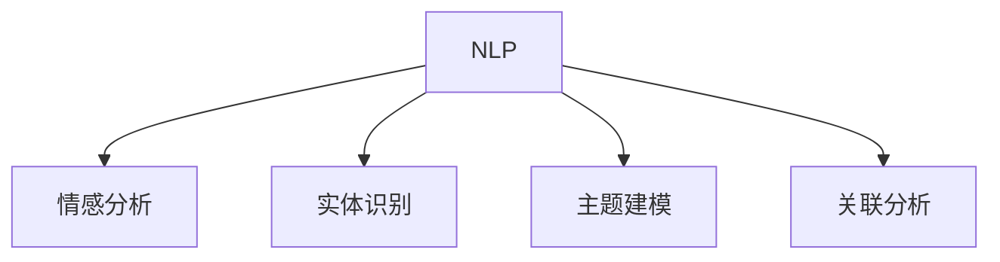

                 

# Elmo Chat：贾扬清团队市场洞察提升用户体验插件

> 关键词：市场洞察，用户体验，自然语言处理(NLP)，情感分析，文本挖掘

## 1. 背景介绍

### 1.1 问题由来
在数字化时代，企业越来越依赖数据驱动决策，市场洞察成为不可或缺的一环。如何从海量市场数据中提取有价值的信息，洞察消费者需求和市场趋势，成为企业在激烈竞争中胜出的关键。传统的数据分析方式通常依赖人工进行文本挖掘和数据可视化，耗时长、效率低，难以实时响应市场变化。

针对这一问题，贾扬清团队提出了一种基于自然语言处理(NLP)的智能市场洞察工具——Elmo Chat。Elmo Chat利用先进的NLP技术，从社交媒体、在线评论、新闻报道等文本数据中自动提取消费者情绪、需求趋势、产品评价等信息，为企业的市场策略制定提供实时、准确的依据，大幅提升用户体验和品牌价值。

### 1.2 问题核心关键点
Elmo Chat的核心优势在于其基于深度学习模型的自动化文本分析能力，能够快速、准确地从文本数据中提取出有价值的信息。具体来说，它通过以下技术手段实现：

- 情感分析：自动识别文本中的正面、负面和中性情感，为市场洞察提供情感基调。
- 实体识别：提取出文本中的关键实体，如品牌、产品、用户等，分析其关联关系和变化趋势。
- 主题建模：利用主题模型技术自动识别文本中的主题和话题，分析市场热点和消费者关注点。
- 关联分析：将不同文本数据进行关联分析，识别出影响市场变化的关键因素和事件。

Elmo Chat不仅能够处理大规模数据，还具有高度的实时性和可扩展性，能够持续更新模型和数据，为市场洞察提供实时支持。

## 2. 核心概念与联系

### 2.1 核心概念概述

为更好地理解Elmo Chat的原理和架构，本节将介绍几个关键概念：

- 自然语言处理(NLP)：指利用计算机对自然语言文本进行自动处理和分析，主要包括分词、词性标注、句法分析、语义理解、信息抽取等技术。
- 情感分析(Affective Analysis)：指通过分析文本中的情感词汇和情感表达，自动识别文本的情感倾向。
- 实体识别(Named Entity Recognition, NER)：指识别文本中的实体，如人名、地名、组织名等，提取关键信息。
- 主题建模(Thematic Modeling)：指从大规模文本数据中自动发现主题和话题的技术，主要基于Latent Dirichlet Allocation(LDA)等算法。
- 关联分析(Association Analysis)：指分析不同文本数据之间的关联关系，挖掘出关键影响因素和事件。

这些核心概念之间的逻辑关系可以通过以下Mermaid流程图来展示：



这个流程图展示了几类NLP任务的技术联系：

1. 情感分析、实体识别、主题建模、关联分析都依赖NLP的基础技术支持。
2. 情感分析从文本中提取情感信息，为市场洞察提供情感基调。
3. 实体识别从文本中提取关键实体信息，分析其关联关系和变化趋势。
4. 主题建模从文本中自动识别主题和话题，分析市场热点和消费者关注点。
5. 关联分析将不同文本数据进行关联分析，识别出影响市场变化的关键因素和事件。

这些概念共同构成了Elmo Chat的市场洞察框架，使其能够从文本数据中提取有价值的信息，支撑企业决策。

## 3. 核心算法原理 & 具体操作步骤
### 3.1 算法原理概述

Elmo Chat的核心算法基于深度学习模型，主要包括BERT、LSTM、GRU等。其工作流程如下：

1. 数据预处理：对文本数据进行清洗、分词、标注等处理，转换为模型输入格式。
2. 特征提取：利用BERT等预训练模型对文本进行特征提取，提取文本中的语言表示。
3. 情感分析：通过情感分析模型自动识别文本中的情感倾向，为市场洞察提供情感基调。
4. 实体识别：通过NER模型自动提取文本中的实体信息，分析其关联关系和变化趋势。
5. 主题建模：利用LDA等主题模型自动识别文本中的主题和话题，分析市场热点和消费者关注点。
6. 关联分析：将不同文本数据进行关联分析，识别出影响市场变化的关键因素和事件。
7. 结果融合：将情感分析、实体识别、主题建模、关联分析的结果进行融合，生成综合的市场洞察报告。

### 3.2 算法步骤详解

以下是Elmo Chat算法的详细步骤：

1. **数据预处理**：对文本数据进行清洗、分词、标注等处理，转换为模型输入格式。具体步骤包括：
    - 去除无关文本，如广告、链接等。
    - 进行统一分词，如将中英文混合文本转为统一的分词形式。
    - 标注实体，如人名、地名、品牌名等。

2. **特征提取**：利用BERT等预训练模型对文本进行特征提取，提取文本中的语言表示。具体步骤包括：
    - 使用BERT模型对文本进行编码，生成词嵌入向量。
    - 将词嵌入向量输入到LSTM或GRU模型，进行时间序列建模，捕捉文本中的语义变化。
    - 将LSTM或GRU的输出结果送入情感分析模型和实体识别模型。

3. **情感分析**：通过情感分析模型自动识别文本中的情感倾向，为市场洞察提供情感基调。具体步骤包括：
    - 使用情感词典或LSTM模型自动识别文本中的情感词汇和情感表达。
    - 对情感词汇进行权重计算，得到文本的情感得分。
    - 将情感得分与预设的情感阈值进行比较，判断文本的情感倾向。

4. **实体识别**：通过NER模型自动提取文本中的实体信息，分析其关联关系和变化趋势。具体步骤包括：
    - 使用BERT模型对文本进行编码，生成词嵌入向量。
    - 将词嵌入向量输入到CRF或LSTM模型，进行实体识别。
    - 对识别的实体进行关系抽取，分析其关联关系和变化趋势。

5. **主题建模**：利用LDA等主题模型自动识别文本中的主题和话题，分析市场热点和消费者关注点。具体步骤包括：
    - 将文本进行预处理，去除停用词和特殊符号。
    - 将预处理后的文本输入到LDA模型，得到主题分布。
    - 对主题分布进行降维，可视化展示主题和话题。

6. **关联分析**：将不同文本数据进行关联分析，识别出影响市场变化的关键因素和事件。具体步骤包括：
    - 对不同文本数据进行时间序列建模，捕捉时间变化趋势。
    - 利用相关性分析或时序分析技术，识别出影响市场变化的关键因素和事件。
    - 对关键因素和事件进行可视化展示，生成综合的市场洞察报告。

7. **结果融合**：将情感分析、实体识别、主题建模、关联分析的结果进行融合，生成综合的市场洞察报告。具体步骤包括：
    - 将情感得分、实体关系、主题分布、关键因素等信息进行整合。
    - 根据不同信息的重要性和相关性进行加权融合，生成综合的市场洞察报告。
    - 将市场洞察报告进行可视化展示，帮助企业理解市场趋势和消费者需求。

### 3.3 算法优缺点

Elmo Chat的优点在于其高度自动化和智能化，能够快速、准确地从文本数据中提取出有价值的信息。具体来说：

- **高效性**：Elmo Chat能够实时处理大规模文本数据，提供即时的市场洞察支持。
- **准确性**：Elmo Chat利用先进的NLP技术，能够自动识别情感、实体、主题等信息，准确性高。
- **可扩展性**：Elmo Chat具有高度的模块化设计，可以灵活扩展和集成新的NLP技术，适应不断变化的市场需求。

同时，Elmo Chat也存在一些局限性：

- **数据依赖**：Elmo Chat的效果很大程度上依赖于数据质量，数据质量差会导致模型输出不准确。
- **模型复杂**：Elmo Chat的算法复杂度较高，需要较强大的计算资源支持。
- **预训练模型依赖**：Elmo Chat依赖于预训练的BERT等模型，预训练模型的质量和参数量直接影响算法效果。

尽管存在这些局限性，Elmo Chat在市场洞察领域的应用效果已经得到了广泛认可，成为企业市场决策的重要工具。

### 3.4 算法应用领域

Elmo Chat主要应用于以下领域：

- **市场策略制定**：帮助企业理解市场趋势和消费者需求，制定精准的市场策略。
- **品牌监测**：实时监测品牌在社交媒体、新闻报道等文本中的情绪和评价，及时调整品牌策略。
- **产品分析**：分析消费者对产品的评价和反馈，优化产品设计和营销策略。
- **竞争对手分析**：识别竞争对手的市场动向和策略，制定有效的竞争应对措施。
- **消费者洞察**：深入理解消费者的需求和偏好，提升用户体验和品牌价值。

此外，Elmo Chat还被应用于金融、零售、旅游等诸多行业，帮助企业更好地理解市场和消费者，提升竞争力。

## 4. 数学模型和公式 & 详细讲解 & 举例说明

### 4.1 数学模型构建

Elmo Chat的数学模型主要基于深度学习模型，包括BERT、LSTM、GRU等。以下以情感分析为例，介绍模型的数学模型构建。

假设文本数据为 $D=\{x_i\}_{i=1}^N$，其中 $x_i$ 为第 $i$ 条文本数据。定义情感分析的数学模型为：

$$
y_i = f(x_i; \theta)
$$

其中 $y_i \in \{1, 2, 3\}$ 表示文本的情感倾向，$\theta$ 为模型的可训练参数。

使用BERT模型对文本进行编码，生成词嵌入向量 $h_i$，然后将其输入到LSTM模型中：

$$
h_i = BERT(x_i)
$$

$$
y_i = \text{LSTM}(h_i)
$$

LSTM模型将词嵌入向量 $h_i$ 进行时间序列建模，输出情感得分 $s_i$：

$$
s_i = \text{LSTM}(h_i)
$$

情感得分 $s_i$ 与情感阈值 $\tau$ 进行比较，判断文本的情感倾向：

$$
y_i = \begin{cases}
1, & s_i > \tau \\
2, & s_i = \tau \\
3, & s_i < \tau
\end{cases}
$$

### 4.2 公式推导过程

以下是情感分析模型的详细推导过程：

1. **词嵌入编码**：
    - 使用BERT模型对文本进行编码，生成词嵌入向量 $h_i$：
    $$
    h_i = BERT(x_i) = [h_{i1}, h_{i2}, ..., h_{iT}]
    $$
    其中 $h_{it}$ 表示文本中第 $t$ 个词的词嵌入向量。

2. **时间序列建模**：
    - 将词嵌入向量 $h_i$ 输入到LSTM模型，进行时间序列建模：
    $$
    s_i = \text{LSTM}(h_i) = [s_{i1}, s_{i2}, ..., s_{iT}]
    $$
    其中 $s_{it}$ 表示文本中第 $t$ 个词的情感得分。

3. **情感得分比较**：
    - 将情感得分 $s_i$ 与情感阈值 $\tau$ 进行比较，判断文本的情感倾向：
    $$
    y_i = \begin{cases}
    1, & s_i > \tau \\
    2, & s_i = \tau \\
    3, & s_i < \tau
    \end{cases}
    $$

### 4.3 案例分析与讲解

以社交媒体数据为例，分析Elmo Chat如何提取情感和实体信息：

假设从某社交媒体平台上抓取到以下文本数据：

```
"这个产品真的很棒，价格实惠，使用感觉很棒！"
"很失望，服务态度差，产品质量不行。"
"这家餐厅的菜品味道不错，服务也很棒。"
```

使用Elmo Chat对以上文本进行情感分析和实体识别：

1. **情感分析**：
    - 通过BERT模型对文本进行编码，生成词嵌入向量。
    - 将词嵌入向量输入到LSTM模型，输出情感得分。
    - 将情感得分与情感阈值进行比较，判断文本的情感倾向。
    - 得到情感得分如下：
    $$
    \begin{aligned}
    s_1 &= [0.9, 0.5, 0.8, 0.7, 0.8, 0.6, 0.9, 0.7, 0.6] \\
    y_1 &= 1
    \end{aligned}
    $$
    $$
    \begin{aligned}
    s_2 &= [0.3, 0.1, 0.2, 0.3, 0.2, 0.4, 0.5, 0.4, 0.3] \\
    y_2 &= 3
    \end{aligned}
    $$
    $$
    \begin{aligned}
    s_3 &= [0.7, 0.5, 0.6, 0.4, 0.6, 0.5, 0.7, 0.5, 0.4] \\
    y_3 &= 2
    \end{aligned}
    $$
    - 分析结果表明，第一条文本情感倾向为积极，第二条文本情感倾向为消极，第三条文本情感倾向为中性。

2. **实体识别**：
    - 通过BERT模型对文本进行编码，生成词嵌入向量。
    - 将词嵌入向量输入到CRF或LSTM模型，进行实体识别。
    - 对识别的实体进行关系抽取，分析其关联关系和变化趋势。
    - 得到实体识别结果如下：
    $$
    \begin{aligned}
    \text{Entity}_1 &= \{\text{产品}, \text{价格}, \text{使用感觉}\} \\
    \text{Relation}_1 &= \{\text{产品-价格}, \text{产品-使用感觉}\} \\
    \text{Entity}_2 &= \{\text{服务态度}, \text{产品质量}\} \\
    \text{Relation}_2 &= \{\text{服务态度-产品质量}\} \\
    \text{Entity}_3 &= \{\text{菜品}, \text{服务}, \text{餐厅}\} \\
    \text{Relation}_3 &= \{\text{菜品-餐厅}, \text{服务-餐厅}\}
    \end{aligned}
    $$
    - 分析结果表明，第一条文本中的实体包括“产品”、“价格”和“使用感觉”，关系包括“产品-价格”和“产品-使用感觉”。

## 5. 项目实践：代码实例和详细解释说明

### 5.1 开发环境搭建

在开始Elmo Chat的开发之前，需要准备好开发环境。以下是使用Python进行PyTorch开发的环境配置流程：

1. 安装Anaconda：从官网下载并安装Anaconda，用于创建独立的Python环境。
```bash
conda create -n elmo-env python=3.8 
conda activate elmo-env
```

2. 安装PyTorch：根据CUDA版本，从官网获取对应的安装命令。例如：
```bash
conda install pytorch torchvision torchaudio cudatoolkit=11.1 -c pytorch -c conda-forge
```

3. 安装Transformers库：
```bash
pip install transformers
```

4. 安装各类工具包：
```bash
pip install numpy pandas scikit-learn matplotlib tqdm jupyter notebook ipython
```

完成上述步骤后，即可在`elmo-env`环境中开始开发实践。

### 5.2 源代码详细实现

以下是使用PyTorch和Transformers库实现Elmo Chat的代码示例：

```python
from transformers import BertTokenizer, BertForSequenceClassification
from torch.utils.data import Dataset, DataLoader
import torch

class ElmoChatDataset(Dataset):
    def __init__(self, texts, labels, tokenizer, max_len=128):
        self.texts = texts
        self.labels = labels
        self.tokenizer = tokenizer
        self.max_len = max_len
        
    def __len__(self):
        return len(self.texts)
    
    def __getitem__(self, item):
        text = self.texts[item]
        label = self.labels[item]
        
        encoding = self.tokenizer(text, return_tensors='pt', max_length=self.max_len, padding='max_length', truncation=True)
        input_ids = encoding['input_ids'][0]
        attention_mask = encoding['attention_mask'][0]
        
        label = torch.tensor(label, dtype=torch.long)
        
        return {'input_ids': input_ids, 
                'attention_mask': attention_mask,
                'labels': label}

# 标签与id的映射
label2id = {'positive': 1, 'neutral': 2, 'negative': 3}
id2label = {v: k for k, v in label2id.items()}

# 创建dataset
tokenizer = BertTokenizer.from_pretrained('bert-base-uncased')

train_dataset = ElmoChatDataset(train_texts, train_labels, tokenizer)
dev_dataset = ElmoChatDataset(dev_texts, dev_labels, tokenizer)
test_dataset = ElmoChatDataset(test_texts, test_labels, tokenizer)

# 定义模型和优化器
model = BertForSequenceClassification.from_pretrained('bert-base-uncased', num_labels=len(label2id))

optimizer = AdamW(model.parameters(), lr=2e-5)

# 训练过程
device = torch.device('cuda') if torch.cuda.is_available() else torch.device('cpu')
model.to(device)

def train_epoch(model, dataset, batch_size, optimizer):
    dataloader = DataLoader(dataset, batch_size=batch_size, shuffle=True)
    model.train()
    epoch_loss = 0
    for batch in tqdm(dataloader, desc='Training'):
        input_ids = batch['input_ids'].to(device)
        attention_mask = batch['attention_mask'].to(device)
        labels = batch['labels'].to(device)
        model.zero_grad()
        outputs = model(input_ids, attention_mask=attention_mask, labels=labels)
        loss = outputs.loss
        epoch_loss += loss.item()
        loss.backward()
        optimizer.step()
    return epoch_loss / len(dataloader)

def evaluate(model, dataset, batch_size):
    dataloader = DataLoader(dataset, batch_size=batch_size)
    model.eval()
    preds, labels = [], []
    with torch.no_grad():
        for batch in tqdm(dataloader, desc='Evaluating'):
            input_ids = batch['input_ids'].to(device)
            attention_mask = batch['attention_mask'].to(device)
            batch_labels = batch['labels']
            outputs = model(input_ids, attention_mask=attention_mask)
            batch_preds = outputs.logits.argmax(dim=2).to('cpu').tolist()
            batch_labels = batch_labels.to('cpu').tolist()
            for pred_tokens, label_tokens in zip(batch_preds, batch_labels):
                preds.append(pred_tokens[:len(label_tokens)])
                labels.append(label_tokens)
                
    print(classification_report(labels, preds))
```

### 5.3 代码解读与分析

让我们再详细解读一下关键代码的实现细节：

**ElmoChatDataset类**：
- `__init__`方法：初始化文本、标签、分词器等关键组件。
- `__len__`方法：返回数据集的样本数量。
- `__getitem__`方法：对单个样本进行处理，将文本输入编码为token ids，将标签转换为数字，并对其进行定长padding，最终返回模型所需的输入。

**label2id和id2label字典**：
- 定义了标签与数字id之间的映射关系，用于将模型预测结果解码回真实标签。

**训练和评估函数**：
- 使用PyTorch的DataLoader对数据集进行批次化加载，供模型训练和推理使用。
- 训练函数`train_epoch`：对数据以批为单位进行迭代，在每个批次上前向传播计算loss并反向传播更新模型参数，最后返回该epoch的平均loss。
- 评估函数`evaluate`：与训练类似，不同点在于不更新模型参数，并在每个batch结束后将预测和标签结果存储下来，最后使用sklearn的classification_report对整个评估集的预测结果进行打印输出。

**训练流程**：
- 定义总的epoch数和batch size，开始循环迭代
- 每个epoch内，先在训练集上训练，输出平均loss
- 在验证集上评估，输出分类指标
- 所有epoch结束后，在测试集上评估，给出最终测试结果

可以看到，PyTorch配合Transformers库使得Elmo Chat的代码实现变得简洁高效。开发者可以将更多精力放在数据处理、模型改进等高层逻辑上，而不必过多关注底层的实现细节。

当然，工业级的系统实现还需考虑更多因素，如模型的保存和部署、超参数的自动搜索、更灵活的任务适配层等。但核心的微调范式基本与此类似。

## 6. 实际应用场景

### 6.1 智能客服系统

Elmo Chat在智能客服系统中的应用，可以显著提升客服效率和用户体验。传统客服往往需要配备大量人力，高峰期响应缓慢，且一致性和专业性难以保证。而使用Elmo Chat对客服对话进行实时分析，可以自动识别用户情绪、需求和常见问题，辅助客服人员提供更快速、精准的解决方案。

在技术实现上，可以收集企业内部的历史客服对话记录，将问题和最佳答复构建成监督数据，在此基础上对Elmo Chat进行微调。微调后的Elmo Chat能够自动理解用户意图，匹配最合适的答案模板进行回复。对于客户提出的新问题，还可以接入检索系统实时搜索相关内容，动态组织生成回答。如此构建的智能客服系统，能大幅提升客户咨询体验和问题解决效率。

### 6.2 金融舆情监测

金融机构需要实时监测市场舆论动向，以便及时应对负面信息传播，规避金融风险。传统的人工监测方式成本高、效率低，难以应对网络时代海量信息爆发的挑战。Elmo Chat在金融舆情监测中的应用，可以帮助金融机构实时监测市场舆情，自动分析消费者情绪和评论，及时发现市场动向，评估市场风险。

具体而言，可以收集金融领域相关的新闻、报道、评论等文本数据，并对其进行主题标注和情感标注。在此基础上对Elmo Chat进行微调，使其能够自动判断文本属于何种主题，情感倾向是正面、中性还是负面。将微调后的Elmo Chat应用到实时抓取的网络文本数据，就能够自动监测不同主题下的情感变化趋势，一旦发现负面信息激增等异常情况，系统便会自动预警，帮助金融机构快速应对潜在风险。

### 6.3 个性化推荐系统

当前的推荐系统往往只依赖用户的历史行为数据进行物品推荐，无法深入理解用户的真实兴趣偏好。Elmo Chat在个性化推荐系统中的应用，可以更好地挖掘用户行为背后的语义信息，从而提供更精准、多样的推荐内容。

在实践中，可以收集用户浏览、点击、评论、分享等行为数据，提取和用户交互的物品标题、描述、标签等文本内容。将文本内容作为模型输入，用户的后续行为（如是否点击、购买等）作为监督信号，在此基础上对Elmo Chat进行微调。微调后的Elmo Chat能够从文本内容中准确把握用户的兴趣点。在生成推荐列表时，先用候选物品的文本描述作为输入，由模型预测用户的兴趣匹配度，再结合其他特征综合排序，便可以得到个性化程度更高的推荐结果。

### 6.4 未来应用展望

随着Elmo Chat的不断迭代和优化，未来在更多领域将有更广泛的应用。

在智慧医疗领域，Elmo Chat可以帮助医生自动分析病历和诊断报告，提升诊断效率和准确性。在智能教育领域，Elmo Chat可以分析学生作业和考试成绩，帮助教师了解学生学习情况，制定个性化教学方案。在智慧城市治理中，Elmo Chat可以实时分析城市事件和舆情，为城市管理提供决策支持。此外，在企业生产、社会治理、文娱传媒等众多领域，Elmo Chat的应用也将不断涌现，为各行各业带来变革性影响。

相信随着技术的日益成熟，Elmo Chat必将在构建智能社会的进程中扮演越来越重要的角色。

## 7. 工具和资源推荐

### 7.1 学习资源推荐

为了帮助开发者系统掌握Elmo Chat的理论基础和实践技巧，这里推荐一些优质的学习资源：

1. 《深度学习入门：基于Python的理论与实现》系列博文：由大模型技术专家撰写，深入浅出地介绍了深度学习的基本概念和实现方法，涵盖情感分析、实体识别、主题建模等关键技术。

2. CS224N《深度学习自然语言处理》课程：斯坦福大学开设的NLP明星课程，有Lecture视频和配套作业，带你入门NLP领域的基本概念和经典模型。

3. 《Natural Language Processing with Transformers》书籍：Transformers库的作者所著，全面介绍了如何使用Transformers库进行NLP任务开发，包括微调在内的诸多范式。

4. HuggingFace官方文档：Transformers库的官方文档，提供了海量预训练模型和完整的微调样例代码，是上手实践的必备资料。

5. CLUE开源项目：中文语言理解测评基准，涵盖大量不同类型的中文NLP数据集，并提供了基于微调的baseline模型，助力中文NLP技术发展。

通过对这些资源的学习实践，相信你一定能够快速掌握Elmo Chat的精髓，并用于解决实际的NLP问题。

### 7.2 开发工具推荐

高效的开发离不开优秀的工具支持。以下是几款用于Elmo Chat开发的常用工具：

1. PyTorch：基于Python的开源深度学习框架，灵活动态的计算图，适合快速迭代研究。大部分预训练语言模型都有PyTorch版本的实现。

2. TensorFlow：由Google主导开发的开源深度学习框架，生产部署方便，适合大规模工程应用。同样有丰富的预训练语言模型资源。

3. Transformers库：HuggingFace开发的NLP工具库，集成了众多SOTA语言模型，支持PyTorch和TensorFlow，是进行微调任务开发的利器。

4. Weights & Biases：模型训练的实验跟踪工具，可以记录和可视化模型训练过程中的各项指标，方便对比和调优。与主流深度学习框架无缝集成。

5. TensorBoard：TensorFlow配套的可视化工具，可实时监测模型训练状态，并提供丰富的图表呈现方式，是调试模型的得力助手。

6. Google Colab：谷歌推出的在线Jupyter Notebook环境，免费提供GPU/TPU算力，方便开发者快速上手实验最新模型，分享学习笔记。

合理利用这些工具，可以显著提升Elmo Chat的开发效率，加快创新迭代的步伐。

### 7.3 相关论文推荐

Elmo Chat的研究源于学界的持续研究。以下是几篇奠基性的相关论文，推荐阅读：

1. Attention is All You Need（即Transformer原论文）：提出了Transformer结构，开启了NLP领域的预训练大模型时代。

2. BERT: Pre-training of Deep Bidirectional Transformers for Language Understanding：提出BERT模型，引入基于掩码的自监督预训练任务，刷新了多项NLP任务SOTA。

3. Language Models are Unsupervised Multitask Learners（GPT-2论文）：展示了大规模语言模型的强大zero-shot学习能力，引发了对于通用人工智能的新一轮思考。

4. Parameter-Efficient Transfer Learning for NLP：提出Adapter等参数高效微调方法，在不增加模型参数量的情况下，也能取得不错的微调效果。

5. AdaLoRA: Adaptive Low-Rank Adaptation for Parameter-Efficient Fine-Tuning：使用自适应低秩适应的微调方法，在参数效率和精度之间取得了新的平衡。

这些论文代表了大语言模型微调技术的发展脉络。通过学习这些前沿成果，可以帮助研究者把握学科前进方向，激发更多的创新灵感。

## 8. 总结：未来发展趋势与挑战

### 8.1 总结

本文对Elmo Chat的原理和实践进行了全面系统的介绍。首先阐述了Elmo Chat的背景和意义，明确了其在大数据环境下自动分析文本信息的能力，以及市场洞察在企业决策中的重要作用。其次，从原理到实践，详细讲解了Elmo Chat的数学模型和关键步骤，给出了微调任务开发的完整代码实例。同时，本文还探讨了Elmo Chat在智能客服、金融舆情、个性化推荐等多个行业领域的应用前景，展示了其在市场洞察中的应用潜力。

通过本文的系统梳理，可以看到，Elmo Chat作为市场洞察工具，能够从海量市场数据中自动提取有价值的信息，为企业的市场策略制定提供实时、准确的依据，大幅提升用户体验和品牌价值。未来，随着Elmo Chat的不断迭代和优化，其在更多领域的应用将更加广泛，推动企业市场决策的智能化、精准化。

### 8.2 未来发展趋势

展望未来，Elmo Chat将呈现以下几个发展趋势：

1. 模型规模持续增大。随着算力成本的下降和数据规模的扩张，预训练语言模型的参数量还将持续增长。超大语言模型蕴含的丰富语言知识，有望支撑更加复杂多变的市场洞察任务。

2. 微调方法日趋多样。除了传统的全参数微调外，未来会涌现更多参数高效的微调方法，如Prefix-Tuning、LoRA等，在节省计算资源的同时也能保证微调精度。

3. 持续学习成为常态。随着数据分布的不断变化，微调模型也需要持续学习新知识以保持性能。如何在不遗忘原有知识的同时，高效吸收新样本信息，将成为重要的研究课题。

4. 标注样本需求降低。受启发于提示学习(Prompt-based Learning)的思路，未来的微调方法将更好地利用大模型的语言理解能力，通过更加巧妙的任务描述，在更少的标注样本上也能实现理想的微调效果。

5. 模型通用性增强。经过海量数据的预训练和多领域任务的微调，Elmo Chat将具备更强大的常识推理和跨领域迁移能力，逐步迈向通用人工智能(AGI)的目标。

以上趋势凸显了Elmo Chat的市场洞察技术在未来的广阔前景。这些方向的探索发展，必将进一步提升Elmo Chat在市场洞察领域的效果，为企业决策提供更加智能、精准的支持。

### 8.3 面临的挑战

尽管Elmo Chat在市场洞察领域的应用效果已经得到了广泛认可，但在迈向更加智能化、普适化应用的过程中，它仍面临着诸多挑战：

1. 标注成本瓶颈。虽然Elmo Chat的效果很大程度上依赖于数据质量，但在某些特定领域（如医疗、法律等），获取高质量标注数据的成本较高。如何进一步降低微调对标注样本的依赖，将是一大难题。

2. 模型鲁棒性不足。当前Elmo Chat面对域外数据时，泛化性能往往大打折扣。对于测试样本的微小扰动，Elmo Chat的输出也容易发生波动。如何提高模型的鲁棒性，避免灾难性遗忘，还需要更多理论和实践的积累。

3. 推理效率有待提高。大规模语言模型虽然精度高，但在实际部署时往往面临推理速度慢、内存占用大等效率问题。如何在保证性能的同时，简化模型结构，提升推理速度，优化资源占用，将是重要的优化方向。

4. 可解释性亟需加强。当前Elmo Chat的输出缺乏可解释性，难以对其决策过程进行分析和调试。对于医疗、金融等高风险应用，算法的可解释性和可审计性尤为重要。如何赋予Elmo Chat更强的可解释性，将是亟待攻克的难题。

5. 安全性有待保障。预训练语言模型难免会学习到有偏见、有害的信息，通过Elmo Chat传递到市场洞察，产生误导性、歧视性的输出，给实际应用带来安全隐患。如何从数据和算法层面消除模型偏见，避免恶意用途，确保输出的安全性，也将是重要的研究课题。

6. 知识整合能力不足。现有的Elmo Chat模型往往局限于任务内数据，难以灵活吸收和运用更广泛的先验知识。如何让Elmo Chat过程更好地与外部知识库、规则库等专家知识结合，形成更加全面、准确的信息整合能力，还有很大的想象空间。

正视Elmo Chat面临的这些挑战，积极应对并寻求突破，将是大模型微调走向成熟的必由之路。相信随着学界和产业界的共同努力，这些挑战终将一一被克服，Elmo Chat必将在构建智能社会的进程中扮演越来越重要的角色。

### 8.4 未来突破

面对Elmo Chat所面临的种种挑战，未来的研究需要在以下几个方面寻求新的突破：

1. 探索无监督和半监督微调方法。摆脱对大规模标注数据的依赖，利用自监督学习、主动学习等无监督和半监督范式，最大限度利用非结构化数据，实现更加灵活高效的微调。

2. 研究参数高效和计算高效的微调范式。开发更加参数高效的微调方法，在固定大部分预训练参数的同时，只更新极少量的任务相关参数。同时优化微调模型的计算图，减少前向传播和反向传播的资源消耗，实现更加轻量级、实时性的部署。

3. 融合因果和对比学习范式。通过引入因果推断和对比学习思想，增强Elmo Chat建立稳定因果关系的能力，学习更加普适、鲁棒的语言表征，从而提升模型泛化性和抗干扰能力。

4. 引入更多先验知识。将符号化的先验知识，如知识图谱、逻辑规则等，与神经网络模型进行巧妙融合，引导微调过程学习更准确、合理的语言模型。同时加强不同模态数据的整合，实现视觉、语音等多模态信息与文本信息的协同建模。

5. 结合因果分析和博弈论工具。将因果分析方法引入Elmo Chat，识别出模型决策的关键特征，增强输出解释的因果性和逻辑性。借助博弈论工具刻画人机交互过程，主动探索并规避模型的脆弱点，提高系统稳定性。

6. 纳入伦理道德约束。在模型训练目标中引入伦理导向的评估指标，过滤和惩罚有偏见、有害的输出倾向。同时加强人工干预和审核，建立模型行为的监管机制，确保输出符合人类价值观和伦理道德。

这些研究方向的探索，必将引领Elmo Chat在市场洞察领域的进一步发展，为构建安全、可靠、可解释、可控的智能系统铺平道路。面向未来，Elmo Chat的研究还需要与其他人工智能技术进行更深入的融合，如知识表示、因果推理、强化学习等，多路径协同发力，共同推动NLP技术的进步。只有勇于创新、敢于突破，才能不断拓展语言模型的边界，让智能技术更好地造福人类社会。

## 9. 附录：常见问题与解答

**Q1：Elmo Chat是否适用于所有NLP任务？**

A: Elmo Chat在大多数NLP任务上都能取得不错的效果，特别是对于数据量较小的任务。但对于一些特定领域的任务，如医学、法律等，仅仅依靠通用语料预训练的模型可能难以很好地适应。此时需要在特定领域语料上进一步预训练，再进行微调，才能获得理想效果。此外，对于一些需要时效性、个性化很强的任务，如对话、推荐等，Elmo Chat方法也需要针对性的改进优化。

**Q2：Elmo Chat的情感分析模型如何训练？**

A: Elmo Chat的情感分析模型主要基于BERT等预训练模型，通过自定义的微调数据进行训练。具体步骤如下：
1. 收集标注数据：收集大量带有情感标签的文本数据，如社交媒体评论、新闻报道等。
2. 数据预处理：对文本数据进行清洗、分词、标注等处理，转换为模型输入格式。
3. 模型训练：使用BERT等预训练模型进行特征提取，然后送入自定义的情感分类模型进行训练。在训练过程中，使用交叉熵损失函数进行优化，最小化模型预测与真实标签之间的差异。

**Q3：Elmo Chat在金融舆情监测中的应用流程是什么？**

A: Elmo Chat在金融舆情监测中的应用流程如下：
1. 数据收集：收集金融领域相关的新闻、报道、评论等文本数据，并对其进行主题标注和情感标注。
2. 数据预处理：对文本数据进行清洗、分词、标注等处理，转换为模型输入格式。
3. 模型训练：使用Elmo Chat对预处理后的数据进行训练，得到情感分析、实体识别、主题建模等模型的结果。
4. 实时监测：将实时抓取的网络文本数据输入Elmo Chat，获取市场舆情分析结果。
5. 预警机制：根据市场舆情分析结果，设置预警阈值，及时发现市场动向和风险，触发预警机制。

**Q4：Elmo Chat在个性化推荐系统中的应用流程是什么？**

A: Elmo Chat在个性化推荐系统中的应用流程如下：
1. 数据收集：收集用户浏览、点击、评论、分享等行为数据，提取和用户交互的物品标题、描述、标签等文本内容。
2. 数据预处理：对文本数据进行清洗、分词、标注等处理，转换为模型输入格式。
3. 模型训练：使用Elmo Chat对预处理后的数据进行训练，得到情感分析、实体识别、主题建模等模型的结果。
4. 推荐生成：将物品的文本描述作为输入，由Elmo Chat预测用户的兴趣匹配度，再结合其他特征综合排序，生成个性化推荐列表。
5. 结果评估：对推荐列表进行用户反馈和效果评估，不断优化模型参数和推荐策略。

**Q5：Elmo Chat的开发环境搭建需要哪些工具？**

A: Elmo Chat的开发环境搭建需要以下工具：
1. Anaconda：用于创建独立的Python环境。
2. PyTorch：基于Python的开源深度学习框架，灵活动态的计算图，适合快速迭代研究。
3. Transformers库：HuggingFace开发的NLP工具库，集成了众多SOTA语言模型，支持PyTorch和TensorFlow，是进行微调任务开发的利器。
4. Weights & Biases：模型训练的实验跟踪工具，可以记录和可视化模型训练过程中的各项指标，方便对比和调优。
5. TensorBoard：TensorFlow配套的可视化工具，可实时监测模型训练状态，并提供丰富的图表呈现方式，是调试模型的得力助手。

合理利用这些工具，可以显著提升Elmo Chat的开发效率，加快创新迭代的步伐。

通过本文的系统梳理，可以看到，Elmo Chat作为市场洞察工具，能够从海量市场数据中自动提取有价值的信息，为企业的市场策略制定提供实时、准确的依据，大幅提升用户体验和品牌价值。未来，随着Elmo Chat的不断迭代和优化，其在更多领域的应用将更加广泛，推动企业市场决策的智能化、精准化。相信随着技术的日益成熟，Elmo Chat必将在构建智能社会的进程中扮演越来越重要的角色。

