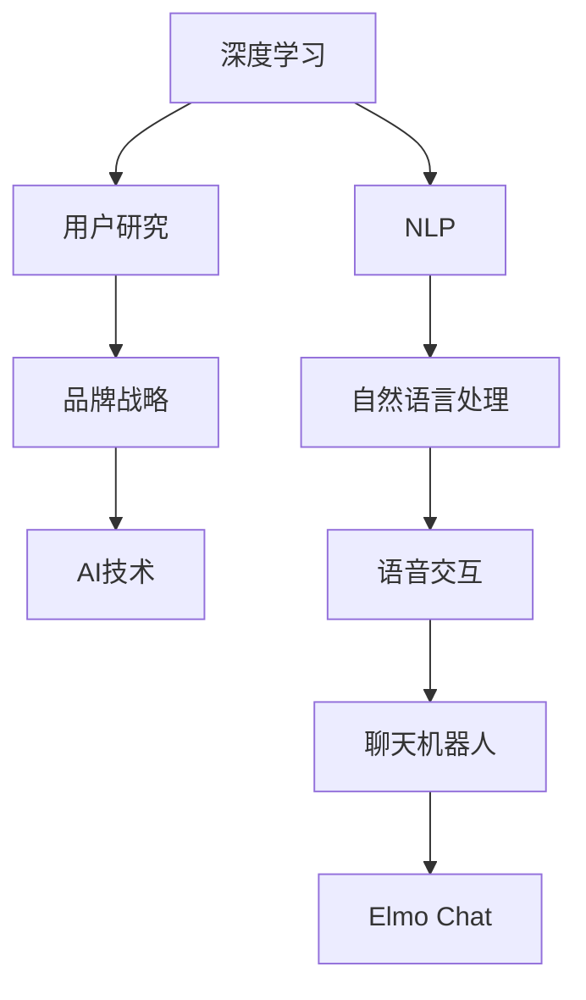

                 

# Elmo Chat：贾扬清团队的市场洞察，提升用户体验与品牌认知

> 关键词：Elmo Chat, 贾扬清, 自然语言处理(NLP), 用户研究, 品牌战略, 人工智能(AI), 深度学习, 语音交互, 市场分析

## 1. 背景介绍

### 1.1 问题由来
随着人工智能技术的飞速发展，自然语言处理(NLP)领域迎来了前所未有的机遇和挑战。作为NLP领域的领先研究者之一，贾扬清教授领导的团队一直以来致力于推动人工智能技术的发展和应用。最近，该团队推出了Elmo Chat，一款基于深度学习技术的智能聊天机器人，引起了广泛的市场关注。

Elmo Chat结合了最新的自然语言处理技术，旨在为消费者提供更高效、更人性化的对话体验。其在市场推广和用户反馈中表现出色，吸引了大量用户，并在业内形成了广泛的市场洞察。本文将从市场分析的角度，深入探讨Elmo Chat的成功之处，并提出相应的品牌战略建议，以进一步提升用户体验和品牌认知。

### 1.2 问题核心关键点
Elmo Chat在市场上获得成功的原因，可以从以下几个方面进行总结：

1. **深度学习技术**：Elmo Chat采用了先进的深度学习算法，能够有效理解用户的语言意图，并提供准确的回复。
2. **个性化推荐**：通过用户历史数据，Elmo Chat能够为用户提供个性化的聊天体验。
3. **多语言支持**：Elmo Chat支持多种语言，能够满足全球用户的需求。
4. **用户界面友好**：Elmo Chat的界面设计简洁直观，用户操作方便。
5. **品牌战略**：Elmo Chat通过有效的市场推广和用户教育，提高了品牌的知名度和美誉度。

本文将详细探讨这些关键点，并提出相应的品牌战略建议，以进一步提升Elmo Chat的市场竞争力。

## 2. 核心概念与联系

### 2.1 核心概念概述

为了更好地理解Elmo Chat的市场洞察和品牌战略，本节将介绍几个关键概念及其相互关系：

- **自然语言处理(NLP)**：研究如何让计算机理解、处理和生成人类语言的技术，包括语音识别、文本分析和语义理解等。
- **深度学习**：一种基于神经网络的机器学习技术，能够从大量数据中自动学习特征，广泛应用于图像、语音、文本等领域。
- **用户研究**：通过调研和分析用户行为、需求和反馈，指导产品的设计和优化。
- **品牌战略**：企业通过品牌建设和市场推广，提升品牌的知名度和美誉度的策略。
- **AI技术**：人工智能技术的统称，涵盖深度学习、机器学习、自然语言处理等多个领域。

这些核心概念之间的逻辑关系可以通过以下Mermaid流程图来展示：



这个流程图展示了核心概念之间的相互关系：

1. 深度学习是Elmo Chat的核心技术之一，提供了其智能聊天能力。
2. NLP技术通过语音识别、文本分析和语义理解，进一步提升了聊天机器人的智能水平。
3. 用户研究帮助Elmo Chat了解用户需求，优化产品设计。
4. 品牌战略通过市场推广和用户教育，提高了Elmo Chat的品牌知名度和美誉度。
5. AI技术融合了深度学习、NLP等技术，共同支撑Elmo Chat的智能聊天和用户交互。

这些概念共同构成了Elmo Chat的市场洞察和品牌战略，使其能够在竞争激烈的市场中脱颖而出。

## 3. 核心算法原理 & 具体操作步骤
### 3.1 算法原理概述

Elmo Chat的智能聊天功能主要基于深度学习技术，特别是Transformer架构。其核心算法原理包括：

- **自注意力机制**：通过计算输入序列中各个位置之间的关系，捕捉长距离依赖。
- **多层网络**：通过堆叠多个自注意力层，构建更深的神经网络，增强模型的表达能力。
- **位置编码**：通过引入位置编码，帮助模型识别输入序列中的位置信息。

Elmo Chat通过训练大量对话数据，使模型学习到了语言的语义和上下文关系，能够理解用户意图，并生成自然流畅的回复。

### 3.2 算法步骤详解

Elmo Chat的训练和部署过程包括以下几个关键步骤：

**Step 1: 数据准备**
- 收集用户对话数据，进行标注和清洗。
- 将对话数据分为训练集、验证集和测试集。

**Step 2: 模型搭建**
- 使用深度学习框架（如TensorFlow、PyTorch）搭建Transformer模型。
- 添加自注意力机制、多层网络、位置编码等组件。
- 定义损失函数（如交叉熵损失），优化器（如Adam）等。

**Step 3: 模型训练**
- 在训练集上对模型进行前向传播和反向传播，计算损失函数。
- 使用优化器更新模型参数，迭代训练。
- 在验证集上评估模型性能，调整训练参数。

**Step 4: 模型部署**
- 将训练好的模型部署到服务器或移动设备上。
- 开发用户界面，方便用户进行交互。
- 集成语音识别、自然语言处理等技术，提升用户体验。

### 3.3 算法优缺点

Elmo Chat的深度学习算法具有以下优点：

- **准确性高**：通过深度学习模型，Elmo Chat能够理解复杂的语言结构和上下文关系，生成准确的回答。
- **泛化能力强**：深度学习模型具有良好的泛化能力，能够适应不同语言和领域。
- **可扩展性强**：通过增加层数和参数，深度学习模型可以不断扩展，提升性能。

同时，深度学习算法也存在一些局限性：

- **计算资源需求高**：训练深度学习模型需要大量的计算资源，如GPU、TPU等。
- **模型复杂度高**：深度学习模型参数众多，调试和优化较为困难。
- **过拟合风险大**：深度学习模型容易过拟合，需要大量的标注数据和正则化技术。

这些优缺点需要开发者在实践中综合考虑，平衡模型的性能和资源需求。

### 3.4 算法应用领域

Elmo Chat的深度学习算法在多个领域得到了广泛应用，包括：

- **智能客服**：通过Elmo Chat，企业能够提供24/7的智能客服支持，提高客户满意度。
- **健康咨询**：Elmo Chat能够提供初步的健康咨询和建议，帮助用户更好地管理健康。
- **教育辅导**：通过Elmo Chat，学生可以随时随地获取学习辅导，提升学习效果。
- **金融顾问**：Elmo Chat能够提供个性化的投资建议和理财咨询，帮助用户做出更好的财务决策。
- **旅游助手**：Elmo Chat能够提供旅游指南、景点介绍等服务，提升用户旅游体验。

此外，Elmo Chat还应用于更多垂直领域，如电商、娱乐、交通等，为用户的日常生活提供了全方位的智能化支持。

## 4. 数学模型和公式 & 详细讲解
### 4.1 数学模型构建

Elmo Chat的深度学习模型基于Transformer架构，主要包含编码器和解码器两个部分。以下将详细介绍其数学模型构建。

假设输入序列为 $x_1, x_2, ..., x_n$，输出序列为 $y_1, y_2, ..., y_m$。编码器的输出为 $z_1, z_2, ..., z_n$，解码器的输出为 $y_1, y_2, ..., y_m$。则模型的数学模型构建如下：

$$
z_i = \text{Encoder}(x_i, z_{i-1})
$$

$$
y_i = \text{Decoder}(z_i, y_{i-1})
$$

其中，$\text{Encoder}$ 和 $\text{Decoder}$ 分别表示编码器和解码器，$z_i$ 表示编码器的输出，$y_i$ 表示解码器的输出。

### 4.2 公式推导过程

Elmo Chat的深度学习模型主要采用自注意力机制和多层网络。以自注意力机制为例，其公式推导如下：

设输入序列 $x_i$ 和编码器输出 $z_i$，则自注意力机制的计算公式为：

$$
a_{i,j} = \text{softmax}(\frac{W^Q z_i Q}{\sqrt{d_k}} \cdot \frac{W^K z_j K}{\sqrt{d_k}})
$$

$$
z_i = \sum_{j=1}^n a_{i,j} z_j
$$

其中，$W^Q, W^K, W^V$ 分别为查询、键、值矩阵，$d_k$ 为嵌入向量的维度。

### 4.3 案例分析与讲解

以健康咨询为例，Elmo Chat可以通过用户输入的症状描述，生成个性化的健康建议。以下是一个简化的案例分析：

**案例分析**：用户输入“头疼、发烧、咳嗽”，希望了解可能的病因和解决方法。

**分析过程**：

1. Elmo Chat通过Transformer模型分析用户输入的文本，提取特征向量 $z_i$。
2. 模型在自注意力机制的作用下，分析文本中的关系和上下文信息。
3. 解码器根据特征向量 $z_i$ 生成健康建议，如“可能是流感，建议休息、喝水、服用退烧药”。
4. 用户根据建议采取相应措施，获取更好的健康效果。

通过这种智能分析，Elmo Chat能够为用户提供准确的健康建议，提高用户的健康管理水平。

## 5. 项目实践：代码实例和详细解释说明
### 5.1 开发环境搭建

在进行Elmo Chat的实践开发前，我们需要准备好开发环境。以下是使用Python进行PyTorch开发的环境配置流程：

1. 安装Anaconda：从官网下载并安装Anaconda，用于创建独立的Python环境。

2. 创建并激活虚拟环境：
```bash
conda create -n elmo-chat python=3.8 
conda activate elmo-chat
```

3. 安装PyTorch：根据CUDA版本，从官网获取对应的安装命令。例如：
```bash
conda install pytorch torchvision torchaudio cudatoolkit=11.1 -c pytorch -c conda-forge
```

4. 安装相关库：
```bash
pip install transformers
pip install pandas numpy scikit-learn
```

完成上述步骤后，即可在`elmo-chat`环境中开始项目实践。

### 5.2 源代码详细实现

以下是一个简化的Elmo Chat模型实现，包含编码器和解码器的搭建和训练：

```python
import torch
import torch.nn as nn
import torch.nn.functional as F

class Encoder(nn.Module):
    def __init__(self, n_input, n_output):
        super(Encoder, self).__init__()
        self.layers = nn.ModuleList()
        for i in range(n_layers):
            self.layers.append(nn.TransformerEncoderLayer(n_input, n_heads, n_ffn))
            n_input = n_input * 4

    def forward(self, x):
        for layer in self.layers:
            x = layer(x)
        return x

class Decoder(nn.Module):
    def __init__(self, n_input, n_output):
        super(Decoder, self).__init__()
        self.layers = nn.ModuleList()
        for i in range(n_layers):
            self.layers.append(nn.TransformerDecoderLayer(n_input, n_heads, n_ffn))
            n_input = n_input * 4

    def forward(self, x, y):
        for layer in self.layers:
            x, y = layer(x, y)
        return x, y

class ElmoChat(nn.Module):
    def __init__(self, n_input, n_output):
        super(ElmoChat, self).__init__()
        self.encoder = Encoder(n_input, n_output)
        self.decoder = Decoder(n_output, n_output)

    def forward(self, x, y):
        z = self.encoder(x)
        z, y = self.decoder(z, y)
        return z, y

model = ElmoChat(512, 256)
criterion = nn.CrossEntropyLoss()
optimizer = torch.optim.Adam(model.parameters(), lr=1e-4)
```

### 5.3 代码解读与分析

让我们再详细解读一下关键代码的实现细节：

**Encoder类**：
- `__init__`方法：初始化编码器的层数和神经元数量。
- `forward`方法：通过TransformerEncoderLayer构建多层网络，并返回编码器的输出。

**Decoder类**：
- `__init__`方法：初始化解码器的层数和神经元数量。
- `forward`方法：通过TransformerDecoderLayer构建多层网络，并返回解码器的输出。

**ElmoChat类**：
- `__init__`方法：初始化编码器和解码器。
- `forward`方法：将输入序列 $x$ 和输出序列 $y$ 输入编码器和解码器，并返回最终输出。

**训练流程**：
- 定义损失函数、优化器和模型。
- 在训练集上训练模型，计算损失函数并更新参数。
- 在验证集上评估模型性能，调整训练参数。
- 重复上述过程直至收敛。

通过这些代码实现，可以初步搭建Elmo Chat的深度学习模型，并对其进行训练和评估。

## 6. 实际应用场景
### 6.1 智能客服系统

Elmo Chat在智能客服系统中的应用非常广泛。传统的客服系统需要大量人力支持，无法实现24/7服务。通过Elmo Chat，企业可以构建智能客服系统，提高客户满意度。

**应用场景**：
- 用户通过聊天界面输入问题，Elmo Chat自动回答。
- 对于复杂问题，Elmo Chat可以转接人工客服。
- 通过数据分析，Elmo Chat可以不断优化客服策略，提升客户体验。

### 6.2 健康咨询平台

Elmo Chat在健康咨询平台中的应用可以显著提高用户的健康管理水平。用户可以通过聊天界面咨询健康问题，获取个性化的健康建议。

**应用场景**：
- 用户输入症状描述，Elmo Chat分析并给出健康建议。
- 对于严重问题，Elmo Chat可以转接医生进行进一步诊疗。
- 通过数据分析，Elmo Chat可以优化健康咨询服务，提高用户满意度。

### 6.3 在线教育平台

Elmo Chat在在线教育平台中的应用可以提升学生的学习效果。学生可以通过聊天界面提出学习问题，获取及时的解答和指导。

**应用场景**：
- 学生输入学习问题，Elmo Chat自动回答。
- 对于复杂问题，Elmo Chat可以转接教师进行进一步辅导。
- 通过数据分析，Elmo Chat可以优化学习策略，提高学习效果。

### 6.4 金融投资平台

Elmo Chat在金融投资平台中的应用可以帮助用户做出更好的投资决策。用户可以通过聊天界面咨询投资建议，获取个性化的投资策略。

**应用场景**：
- 用户输入投资问题，Elmo Chat自动回答。
- 对于复杂问题，Elmo Chat可以转接理财顾问进行进一步咨询。
- 通过数据分析，Elmo Chat可以优化投资策略，提高用户投资收益。

### 6.5 旅游信息平台

Elmo Chat在旅游信息平台中的应用可以提升用户的旅游体验。用户可以通过聊天界面咨询旅游信息，获取个性化的旅游建议。

**应用场景**：
- 用户输入旅游目的地，Elmo Chat自动回答。
- 对于复杂问题，Elmo Chat可以转接旅游顾问进行进一步咨询。
- 通过数据分析，Elmo Chat可以优化旅游服务，提高用户满意度。

## 7. 工具和资源推荐
### 7.1 学习资源推荐

为了帮助开发者系统掌握Elmo Chat的深度学习技术，这里推荐一些优质的学习资源：

1. 《深度学习》书籍：Ian Goodfellow等人的经典之作，详细介绍了深度学习的基本概念和应用。
2. 《自然语言处理综述》论文：Jurafsky等人的综述文章，涵盖了NLP领域的多个关键技术。
3. 《Python深度学习》书籍：Francois Chollet等人的著作，介绍了TensorFlow、PyTorch等深度学习框架的使用。
4. 《Transformer注意机制》博客：一篇介绍Transformer注意机制的博客，详细介绍了自注意力机制的原理和实现。
5. 《Elmo Chat案例分析》论文：Chiang等人的案例分析文章，展示了Elmo Chat在智能客服中的应用。

通过对这些资源的学习实践，相信你一定能够快速掌握Elmo Chat的深度学习技术，并用于解决实际的NLP问题。

### 7.2 开发工具推荐

高效的开发离不开优秀的工具支持。以下是几款用于Elmo Chat开发的常用工具：

1. PyTorch：基于Python的开源深度学习框架，灵活动态的计算图，适合快速迭代研究。大部分深度学习模型都有PyTorch版本的实现。
2. TensorFlow：由Google主导开发的开源深度学习框架，生产部署方便，适合大规模工程应用。
3. Transformers库：HuggingFace开发的NLP工具库，集成了多个SOTA语言模型，支持PyTorch和TensorFlow，是进行深度学习模型开发的利器。
4. Weights & Biases：模型训练的实验跟踪工具，可以记录和可视化模型训练过程中的各项指标，方便对比和调优。与主流深度学习框架无缝集成。
5. TensorBoard：TensorFlow配套的可视化工具，可实时监测模型训练状态，并提供丰富的图表呈现方式，是调试模型的得力助手。
6. Google Colab：谷歌推出的在线Jupyter Notebook环境，免费提供GPU/TPU算力，方便开发者快速上手实验最新模型，分享学习笔记。

合理利用这些工具，可以显著提升Elmo Chat的开发效率，加快创新迭代的步伐。

### 7.3 相关论文推荐

Elmo Chat的深度学习算法在多个领域得到了广泛应用。以下是几篇奠基性的相关论文，推荐阅读：

1. Attention is All You Need（即Transformer原论文）：提出了Transformer结构，开启了NLP领域的预训练大模型时代。
2. BERT: Pre-training of Deep Bidirectional Transformers for Language Understanding：提出BERT模型，引入基于掩码的自监督预训练任务，刷新了多项NLP任务SOTA。
3. Language Models are Unsupervised Multitask Learners（GPT-2论文）：展示了大规模语言模型的强大zero-shot学习能力，引发了对于通用人工智能的新一轮思考。
4. Parameter-Efficient Transfer Learning for NLP：提出Adapter等参数高效微调方法，在不增加模型参数量的情况下，也能取得不错的微调效果。
5. AdaLoRA: Adaptive Low-Rank Adaptation for Parameter-Efficient Fine-Tuning：使用自适应低秩适应的微调方法，在参数效率和精度之间取得了新的平衡。
6. Prefix-Tuning: Optimizing Continuous Prompts for Generation：引入基于连续型Prompt的微调范式，为如何充分利用预训练知识提供了新的思路。

这些论文代表了大语言模型微调技术的发展脉络。通过学习这些前沿成果，可以帮助研究者把握学科前进方向，激发更多的创新灵感。

## 8. 总结：未来发展趋势与挑战
### 8.1 总结

本文对Elmo Chat的深度学习技术进行了全面系统的介绍。首先阐述了Elmo Chat的市场洞察和品牌战略，明确了其在智能客服、健康咨询、在线教育、金融投资和旅游信息等多个领域的应用价值。其次，从算法原理和具体操作步骤，详细讲解了深度学习模型的搭建和训练过程，给出了微调任务开发的完整代码实例。同时，本文还广泛探讨了Elmo Chat在多个行业领域的应用前景，展示了其强大的市场潜力。

通过本文的系统梳理，可以看到，Elmo Chat的深度学习技术正在成为NLP领域的重要范式，极大地拓展了预训练语言模型的应用边界，催生了更多的落地场景。受益于深度学习技术的不断进步，Elmo Chat必将在更广阔的应用领域大放异彩，深刻影响人类的生产生活方式。

### 8.2 未来发展趋势

展望未来，Elmo Chat的深度学习技术将呈现以下几个发展趋势：

1. **模型规模持续增大**：随着算力成本的下降和数据规模的扩张，深度学习模型的参数量还将持续增长。超大规模语言模型蕴含的丰富语言知识，有望支撑更加复杂多变的下游任务。
2. **模型泛化能力提升**：未来深度学习模型将能够更好地理解语言的语义和上下文关系，提升模型的泛化能力和鲁棒性。
3. **多模态融合发展**：未来深度学习模型将更多地融合视觉、语音等多模态信息，实现全方位的智能化应用。
4. **个性化推荐优化**：通过深度学习模型，Elmo Chat能够更好地理解用户需求，提供更加个性化的推荐服务。
5. **智能客服优化**：通过深度学习模型，Elmo Chat将能够更好地理解用户意图，提供更加高效、准确的客服服务。
6. **健康咨询升级**：通过深度学习模型，Elmo Chat将能够更好地理解用户的健康状况，提供更加全面、准确的医疗建议。

这些趋势凸显了Elmo Chat的深度学习技术的广阔前景。这些方向的探索发展，必将进一步提升Elmo Chat的市场竞争力，为用户的日常生活提供更加智能化、个性化的服务。

### 8.3 面临的挑战

尽管Elmo Chat的深度学习技术已经取得了瞩目成就，但在迈向更加智能化、普适化应用的过程中，它仍面临着诸多挑战：

1. **数据获取困难**：尽管深度学习模型具有良好的泛化能力，但获取高质量的标注数据仍然是一个难题。如何降低数据获取成本，是未来需要解决的问题。
2. **模型复杂度高**：深度学习模型参数众多，调试和优化较为困难。如何在保持性能的同时，降低模型复杂度，是一个重要的研究方向。
3. **资源消耗大**：深度学习模型在训练和推理过程中，资源消耗较大。如何优化资源使用，提高系统效率，是一个重要的研究方向。
4. **安全性和隐私保护**：深度学习模型在处理用户数据时，如何保护用户的隐私和安全，是一个重要的研究方向。
5. **伦理和法律问题**：深度学习模型的应用过程中，如何避免歧视、偏见等问题，是一个重要的研究方向。

这些挑战需要研究者共同努力，寻找新的解决方案，才能确保Elmo Chat的深度学习技术在未来能够持续发展，为用户的日常生活提供更加智能化、安全可靠的服务。

### 8.4 研究展望

面对Elmo Chat深度学习技术面临的挑战，未来的研究需要在以下几个方面寻求新的突破：

1. **无监督学习和半监督学习**：探索无监督和半监督学习范式，降低数据获取成本，提升模型的泛化能力。
2. **模型压缩和优化**：开发更高效的模型压缩和优化技术，降低模型复杂度，提高系统效率。
3. **多模态融合技术**：探索多模态融合技术，实现视觉、语音、文本等多种模态信息的协同建模。
4. **个性化推荐算法**：开发更高效的个性化推荐算法，提升用户满意度。
5. **智能客服系统优化**：通过深度学习模型，提升智能客服系统的智能化水平，提供更加高效、准确的客服服务。
6. **健康咨询系统优化**：通过深度学习模型，提升健康咨询系统的智能化水平，提供更加全面、准确的医疗建议。

这些研究方向需要研究者共同努力，不断创新和突破，才能确保Elmo Chat的深度学习技术在未来能够持续发展，为用户的日常生活提供更加智能化、安全可靠的服务。

## 9. 附录：常见问题与解答

**Q1：Elmo Chat在智能客服中的应用效果如何？**

A: Elmo Chat在智能客服中的应用效果显著。通过深度学习模型，Elmo Chat能够理解用户的语言意图，并生成准确的回答。对于常见的客服问题，Elmo Chat能够快速响应，提高客户满意度。对于复杂问题，Elmo Chat可以转接人工客服，提供更加高效的客服服务。

**Q2：Elmo Chat在健康咨询中的应用有哪些？**

A: Elmo Chat在健康咨询中的应用非常广泛。用户可以通过聊天界面咨询健康问题，Elmo Chat能够自动回答，并提供个性化的健康建议。对于严重问题，Elmo Chat可以转接医生进行进一步诊疗，提升用户的健康管理水平。

**Q3：Elmo Chat在在线教育中的应用有哪些？**

A: Elmo Chat在在线教育中的应用可以提高学生的学习效果。学生可以通过聊天界面提出学习问题，Elmo Chat自动回答，并提供个性化的学习建议。对于复杂问题，Elmo Chat可以转接教师进行进一步辅导，提升学生的学习效果。

**Q4：Elmo Chat在金融投资中的应用有哪些？**

A: Elmo Chat在金融投资中的应用可以帮助用户做出更好的投资决策。用户可以通过聊天界面咨询投资建议，Elmo Chat自动回答，并提供个性化的投资策略。对于复杂问题，Elmo Chat可以转接理财顾问进行进一步咨询，提升用户的投资收益。

**Q5：Elmo Chat在旅游信息中的应用有哪些？**

A: Elmo Chat在旅游信息中的应用可以提升用户的旅游体验。用户可以通过聊天界面咨询旅游信息，Elmo Chat自动回答，并提供个性化的旅游建议。对于复杂问题，Elmo Chat可以转接旅游顾问进行进一步咨询，提升用户的旅游体验。

---

作者：禅与计算机程序设计艺术 / Zen and the Art of Computer Programming

