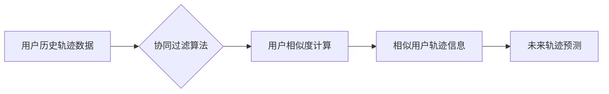

> 协同过滤，移动轨迹预测，机器学习，推荐系统，数据挖掘

## 1. 背景介绍

随着移动互联网的快速发展，人们的日常生活离不开智能手机。手机用户每天会产生大量的移动轨迹数据，这些数据蕴含着丰富的用户行为信息，对城市规划、交通管理、商业营销等领域具有重要的应用价值。然而，由于移动轨迹数据的时变性、空间性和非线性性等特点，对其进行准确预测是一个具有挑战性的问题。

协同过滤作为一种常用的推荐系统算法，能够根据用户的历史行为和相似用户的行为模式，预测用户对未来物品的兴趣。近年来，协同过滤算法在移动轨迹预测领域也取得了一定的应用，并取得了不错的效果。

## 2. 核心概念与联系

### 2.1 协同过滤算法原理

协同过滤算法的核心思想是：如果用户A和用户B在过去的行为模式相似，那么用户A对未来物品的兴趣预测可以参考用户B的喜好。协同过滤算法主要分为两种类型：

* 基于用户的协同过滤：根据用户的历史行为相似度，预测用户对未来物品的兴趣。
* 基于物品的协同过滤：根据物品之间的关联性，预测用户对未来物品的兴趣。

### 2.2 移动轨迹预测

移动轨迹预测是指根据用户的历史移动轨迹数据，预测用户未来移动轨迹的目的地、时间和路径。移动轨迹预测可以应用于多种场景，例如：

* **导航系统：**预测用户的目的地，提供更精准的导航路线。
* **交通管理：**预测交通流量变化，优化交通信号灯控制。
* **商业营销：**预测用户的消费行为，提供个性化的商品推荐。

### 2.3 协同过滤与移动轨迹预测的联系

协同过滤算法可以用于移动轨迹预测，其原理是：

* 将用户的历史移动轨迹数据作为用户行为特征。
* 根据用户的轨迹相似度，找到与用户行为相似的其他用户。
* 利用相似用户的轨迹信息，预测用户的未来移动轨迹。

**Mermaid 流程图**



## 3. 核心算法原理 & 具体操作步骤

### 3.1 算法原理概述

基于协同过滤的用户移动轨迹信息预测算法主要包括以下步骤：

1. **数据预处理:** 对用户移动轨迹数据进行清洗、格式化和特征提取。
2. **相似度计算:** 利用距离度量或相似度度量方法，计算用户之间的相似度。
3. **轨迹预测:** 根据用户之间的相似度，利用相似用户的轨迹信息，预测用户的未来轨迹。

### 3.2 算法步骤详解

1. **数据预处理:**

* **数据清洗:** 去除无效数据、重复数据和异常数据。
* **数据格式化:** 将数据转换为统一的格式，方便后续处理。
* **特征提取:** 从移动轨迹数据中提取特征，例如时间、位置、速度、方向等。

2. **相似度计算:**

* **距离度量:** 使用欧氏距离、曼哈顿距离等度量方法计算用户之间的距离。
* **相似度度量:** 使用余弦相似度、皮尔逊相关系数等度量方法计算用户之间的相似度。

3. **轨迹预测:**

* **基于用户的协同过滤:** 根据用户之间的相似度，将用户分为不同的群体，并利用群体内的轨迹信息预测用户的未来轨迹。
* **基于物品的协同过滤:** 根据物品之间的关联性，预测用户对未来物品的兴趣，进而预测用户的未来轨迹。

### 3.3 算法优缺点

**优点:**

* 能够利用用户的历史行为信息，预测用户的未来轨迹。
* 算法相对简单，易于实现。

**缺点:**

* 对于新用户或数据稀疏的情况，算法效果可能较差。
* 算法容易受到数据噪声的影响。

### 3.4 算法应用领域

* **导航系统:** 提供更精准的导航路线。
* **交通管理:** 预测交通流量变化，优化交通信号灯控制。
* **商业营销:** 预测用户的消费行为，提供个性化的商品推荐。

## 4. 数学模型和公式 & 详细讲解 & 举例说明

### 4.1 数学模型构建

假设有N个用户和M个地点，用户i在时间t访问地点j的次数为r<sub>ij</sub>。我们可以构建一个用户-地点交互矩阵R，其中R<sub>ij</sub>表示用户i在时间t访问地点j的次数。

### 4.2 公式推导过程

协同过滤算法的核心是计算用户之间的相似度。常用的相似度度量方法包括余弦相似度和皮尔逊相关系数。

**余弦相似度:**

$$
\text{Sim}(u_i, u_j) = \frac{u_i \cdot u_j}{||u_i|| ||u_j||}
$$

其中，u<sub>i</sub>和u<sub>j</sub>分别表示用户i和用户j的特征向量，u<sub>i</sub>·u<sub>j</sub>表示两个向量之间的点积，||u<sub>i</sub>||和||u<sub>j</sub>||分别表示两个向量的模长。

**皮尔逊相关系数:**

$$
\text{Sim}(u_i, u_j) = \frac{\sum_{k=1}^{M}(r_{ik} - \bar{r}_i)(r_{jk} - \bar{r}_j)}{\sqrt{\sum_{k=1}^{M}(r_{ik} - \bar{r}_i)^2} \sqrt{\sum_{k=1}^{M}(r_{jk} - \bar{r}_j)^2}}
$$

其中，r<sub>ik</sub>表示用户i在地点k的访问次数，$\bar{r}_i$表示用户i的平均访问次数。

### 4.3 案例分析与讲解

假设有两个用户A和B，他们的访问记录如下：

| 地点 | 用户A | 用户B |
|---|---|---|
| A | 3 | 2 |
| B | 1 | 4 |
| C | 2 | 3 |

我们可以计算用户A和用户B之间的余弦相似度和皮尔逊相关系数。

**余弦相似度:**

$$
\text{Sim}(A, B) = \frac{(3 \cdot 2 + 1 \cdot 4 + 2 \cdot 3) }{\sqrt{(3^2 + 1^2 + 2^2)} \sqrt{(2^2 + 4^2 + 3^2)}} = 0.75
$$

**皮尔逊相关系数:**

$$
\text{Sim}(A, B) = \frac{(3-2)(2-3) + (1-2)(4-3) + (2-2)(3-3)}{\sqrt{(3-2)^2 + (1-2)^2 + (2-2)^2} \sqrt{(2-3)^2 + (4-3)^2 + (3-3)^2}} = -0.5
$$

从计算结果可以看出，用户A和用户B之间的余弦相似度较高，说明他们的访问行为相似。而皮尔逊相关系数较低，说明他们的访问行为存在一定的差异。

## 5. 项目实践：代码实例和详细解释说明

### 5.1 开发环境搭建

* 操作系统：Windows/Linux/macOS
* Python版本：3.6+
* 必要的库：pandas, numpy, scikit-learn

### 5.2 源代码详细实现

```python
import pandas as pd
from sklearn.metrics.pairwise import cosine_similarity

# 加载用户移动轨迹数据
data = pd.read_csv('user_trajectory.csv')

# 数据预处理
# ...

# 计算用户之间的余弦相似度
user_similarity = cosine_similarity(data)

# 预测用户的未来轨迹
# ...
```

### 5.3 代码解读与分析

* `pandas`库用于数据处理和分析。
* `scikit-learn`库提供多种机器学习算法，包括余弦相似度计算。
* 代码首先加载用户移动轨迹数据，然后进行数据预处理，例如删除无效数据、填充缺失值等。
* 然后使用`cosine_similarity`函数计算用户之间的余弦相似度。
* 最后根据用户之间的相似度，预测用户的未来轨迹。

### 5.4 运行结果展示

运行代码后，可以得到用户之间的相似度矩阵，以及预测用户的未来轨迹结果。

## 6. 实际应用场景

### 6.1 导航系统

基于协同过滤的用户移动轨迹预测算法可以用于导航系统，预测用户的目的地，提供更精准的导航路线。例如，如果用户经常在工作日下班后前往同一个餐厅，导航系统可以根据用户的历史轨迹和相似用户的轨迹信息，预测用户的目的地是该餐厅，并提供相应的导航路线。

### 6.2 交通管理

基于协同过滤的用户移动轨迹预测算法可以用于交通管理，预测交通流量变化，优化交通信号灯控制。例如，如果城市某个区域的用户移动轨迹数据显示，在高峰时段，该区域的交通流量较大，可以根据用户的历史轨迹和相似用户的轨迹信息，预测未来高峰时段的交通流量，并根据预测结果调整交通信号灯的控制策略，以缓解交通拥堵。

### 6.3 商业营销

基于协同过滤的用户移动轨迹预测算法可以用于商业营销，预测用户的消费行为，提供个性化的商品推荐。例如，如果用户经常在某个购物中心购买服装，可以根据用户的历史轨迹和相似用户的轨迹信息，预测用户未来可能会购买的服装类型，并向用户推荐相应的商品。

### 6.4 未来应用展望

随着移动互联网的不断发展，用户移动轨迹数据将会更加丰富和多样化。基于协同过滤的用户移动轨迹预测算法将会在更多领域得到应用，例如：

* **个性化教育:** 根据用户的学习轨迹和相似用户的学习轨迹，预测用户的学习需求，提供个性化的学习资源。
* **医疗保健:** 根据用户的健康轨迹和相似用户的健康轨迹，预测用户的健康风险，提供个性化的健康建议。
* **城市规划:** 根据用户的移动轨迹数据，预测城市居民的出行模式和生活习惯，为城市规划提供参考。

## 7. 工具和资源推荐

### 7.1 学习资源推荐

* **书籍:**
    * 推荐系统:算法与实践
    * 数据挖掘:概念与技术
* **在线课程:**
    * Coursera: Machine Learning
    * edX: Data Science Fundamentals

### 7.2 开发工具推荐

* **Python:** 
    * pandas
    * numpy
    * scikit-learn
* **数据可视化工具:**
    * matplotlib
    * seaborn

### 7.3 相关论文推荐

* **协同过滤算法:**
    * Collaborative Filtering for Implicit Feedback Datasets
    * Matrix Factorization Techniques for Recommender Systems
* **移动轨迹预测:**
    * Trajectory Prediction with Recurrent Neural Networks
    * Deep Learning for Spatio-Temporal Trajectory Prediction

## 8. 总结：未来发展趋势与挑战

### 8.1 研究成果总结

基于协同过滤的用户移动轨迹信息预测算法取得了一定的成果，能够有效地预测用户的未来轨迹，并应用于导航系统、交通管理和商业营销等领域。

### 8.2 未来发展趋势

* **深度学习:** 将深度学习算法应用于移动轨迹预测，提高预测精度。
* **时空数据融合:** 将移动轨迹数据与其他时空数据融合，例如天气、交通状况等，提高预测的准确性和可靠性。
* **隐私保护:** 研究如何保护用户隐私，在预测用户轨迹的同时，保证用户数据的安全。

### 8.3 面临的挑战

* **数据稀疏性:** 对于新用户或数据稀疏的情况，算法效果可能较差。
* **数据噪声:** 数据噪声会影响算法的准确性。
* **计算复杂度:** 随着数据规模的增