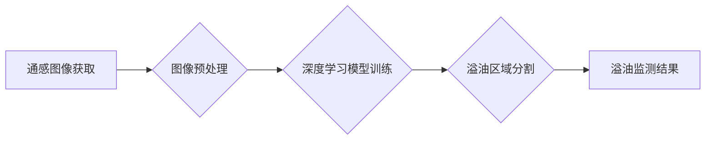

> 通感图像，海西溢油，图像分割，深度学习，U-Net，目标检测

## 1. 背景介绍

海洋环境污染是全球性难题之一，其中石油泄漏事故造成的生态破坏尤为严重。海西溢油监测是海洋环境保护的重要环节，及时准确地识别和定位溢油区域对于减轻环境影响和开展救援行动至关重要。传统的溢油监测方法主要依赖于人工目视识别或卫星遥感数据，存在着效率低、精度不高、实时性差等问题。近年来，随着计算机视觉技术的快速发展，基于图像分割模型的溢油监测方法逐渐受到关注。

通感图像是一种利用雷达、激光等传感器获取的海面信息，具有不受光照条件限制、分辨率高、能够穿透云雾等优势。将通感图像与图像分割模型相结合，可以实现对海面溢油的快速、准确、实时监测。

## 2. 核心概念与联系

### 2.1 通感图像

通感图像是一种利用非光学传感器获取的海面信息，例如雷达、激光等。它能够穿透云雾、不受光照条件限制，具有高分辨率和良好的空间分辨率。通感图像可以提供海面高度、风浪信息、海面温度等多种参数，为溢油监测提供丰富的海面特征信息。

### 2.2 图像分割

图像分割是指将图像划分为多个互不重叠的区域，每个区域代表着图像中不同的物体或特征。图像分割是计算机视觉领域的基础任务之一，在溢油监测中，图像分割可以用来识别和定位溢油区域。

### 2.3 深度学习

深度学习是一种机器学习的子领域，它利用多层神经网络来学习数据特征。深度学习模型能够自动提取图像中的特征，并进行分类、识别等任务。在溢油监测中，深度学习模型可以用于训练图像分割模型，提高溢油识别精度。

**Mermaid 流程图**



## 3. 核心算法原理 & 具体操作步骤

### 3.1 算法原理概述

本文采用基于U-Net的图像分割模型进行溢油监测。U-Net是一种专门用于医学图像分割的卷积神经网络，其结构具有encoder-decoder的特征，能够有效地学习图像的全局和局部特征。

### 3.2 算法步骤详解

1. **数据预处理:** 将通感图像进行尺寸调整、归一化等预处理操作，以提高模型训练效率和精度。
2. **模型训练:** 使用训练数据训练U-Net模型，通过反向传播算法调整模型参数，使模型能够准确地分割溢油区域。
3. **模型评估:** 使用测试数据评估模型的分割精度，常用的评价指标包括准确率、召回率、F1-score等。
4. **溢油区域分割:** 将训练好的模型应用于新的通感图像，进行溢油区域分割。
5. **溢油监测结果:** 将分割结果可视化，并输出溢油区域的面积、位置等信息。

### 3.3 算法优缺点

**优点:**

* 精度高：U-Net模型能够有效地学习图像特征，提高溢油识别精度。
* 速度快：U-Net模型结构相对简单，训练和推理速度较快。
* 可扩展性强：U-Net模型可以根据实际需求进行调整和扩展。

**缺点:**

* 数据依赖性强：模型训练需要大量的标注数据，数据标注成本较高。
* 泛化能力有限：模型在不同海况、光照条件下可能存在泛化能力不足的问题。

### 3.4 算法应用领域

基于图像分割模型的溢油监测技术不仅可以应用于海西溢油监测，还可以应用于其他海洋环境监测领域，例如：

* 海洋垃圾监测
* 海洋生物监测
* 海洋污染源追踪

## 4. 数学模型和公式 & 详细讲解 & 举例说明

### 4.1 数学模型构建

U-Net模型的数学模型主要基于卷积神经网络，其核心是利用卷积层、池化层和全连接层来学习图像特征。

**卷积层:**

卷积层使用卷积核对图像进行卷积运算，提取图像局部特征。卷积核的尺寸和数量可以根据模型需求进行调整。

**池化层:**

池化层用于降低图像尺寸，并提取图像全局特征。常用的池化方法包括最大池化和平均池化。

**全连接层:**

全连接层将提取的特征进行融合，并输出最终的分割结果。

### 4.2 公式推导过程

U-Net模型的具体公式推导过程较为复杂，涉及到卷积运算、激活函数、损失函数等多个方面。

**损失函数:**

常用的损失函数包括交叉熵损失函数和Dice损失函数。

**交叉熵损失函数:**

$$
L_{CE} = -\sum_{i=1}^{N} y_i \log(\hat{y}_i)
$$

其中，$y_i$为真实标签，$\hat{y}_i$为模型预测值。

**Dice损失函数:**

$$
L_{Dice} = 1 - \frac{2 \sum_{i=1}^{N} y_i \hat{y}_i}{\sum_{i=1}^{N} y_i^2 + \sum_{i=1}^{N} \hat{y}_i^2}
$$

其中，$y_i$为真实标签，$\hat{y}_i$为模型预测值。

### 4.3 案例分析与讲解

通过对实际溢油图像进行分割，可以评估U-Net模型的分割精度。

## 5. 项目实践：代码实例和详细解释说明

### 5.1 开发环境搭建

* 操作系统：Ubuntu 20.04
* Python 版本：3.8
* 深度学习框架：TensorFlow 2.0

### 5.2 源代码详细实现

```python
# 导入必要的库
import tensorflow as tf
from tensorflow.keras.layers import Input, Conv2D, MaxPooling2D, UpSampling2D, concatenate

# 定义U-Net模型
def unet(input_shape):
    inputs = Input(input_shape)

    # Encoder
    conv1 = Conv2D(64, 3, activation='relu', padding='same')(inputs)
    conv1 = Conv2D(64, 3, activation='relu', padding='same')(conv1)
    pool1 = MaxPooling2D(pool_size=(2, 2))(conv1)

    conv2 = Conv2D(128, 3, activation='relu', padding='same')(pool1)
    conv2 = Conv2D(128, 3, activation='relu', padding='same')(conv2)
    pool2 = MaxPooling2D(pool_size=(2, 2))(conv2)

    conv3 = Conv2D(256, 3, activation='relu', padding='same')(pool2)
    conv3 = Conv2D(256, 3, activation='relu', padding='same')(conv3)
    pool3 = MaxPooling2D(pool_size=(2, 2))(conv3)

    conv4 = Conv2D(512, 3, activation='relu', padding='same')(pool3)
    conv4 = Conv2D(512, 3, activation='relu', padding='same')(conv4)
    pool4 = MaxPooling2D(pool_size=(2, 2))(conv4)

    # Bottleneck
    conv5 = Conv2D(1024, 3, activation='relu', padding='same')(pool4)
    conv5 = Conv2D(1024, 3, activation='relu', padding='same')(conv5)

    # Decoder
    up6 = UpSampling2D(size=(2, 2))(conv5)
    merge6 = concatenate([up6, conv4], axis=3)
    conv6 = Conv2D(512, 3, activation='relu', padding='same')(merge6)
    conv6 = Conv2D(512, 3, activation='relu', padding='same')(conv6)

    up7 = UpSampling2D(size=(2, 2))(conv6)
    merge7 = concatenate([up7, conv3], axis=3)
    conv7 = Conv2D(256, 3, activation='relu', padding='same')(merge7)
    conv7 = Conv2D(256, 3, activation='relu', padding='same')(conv7)

    up8 = UpSampling2D(size=(2, 2))(conv7)
    merge8 = concatenate([up8, conv2], axis=3)
    conv8 = Conv2D(128, 3, activation='relu', padding='same')(merge8)
    conv8 = Conv2D(128, 3, activation='relu', padding='same')(conv8)

    up9 = UpSampling2D(size=(2, 2))(conv8)
    merge9 = concatenate([up9, conv1], axis=3)
    conv9 = Conv2D(64, 3, activation='relu', padding='same')(merge9)
    conv9 = Conv2D(64, 3, activation='relu', padding='same')(conv9)

    outputs = Conv2D(1, 1, activation='sigmoid')(conv9)

    model = tf.keras.Model(inputs=inputs, outputs=outputs)
    return model

# 构建模型
model = unet(input_shape=(256, 256, 3))

# 编译模型
model.compile(optimizer='adam', loss='binary_crossentropy', metrics=['accuracy'])

# 训练模型
model.fit(train_data, train_labels, epochs=10)

# 评估模型
loss, accuracy = model.evaluate(test_data, test_labels)
print('Loss:', loss)
print('Accuracy:', accuracy)
```

### 5.3 代码解读与分析

* **模型定义:** `unet()`函数定义了U-Net模型的结构，包括encoder、bottleneck和decoder部分。
* **卷积层、池化层和全连接层:** 模型中使用了卷积层、池化层和全连接层来提取图像特征。
* **concatenate:** `concatenate()`函数用于将不同层级的特征图进行拼接，提高模型的特征学习能力。
* **激活函数:** 模型中使用了ReLU激活函数，可以提高模型的非线性表达能力。
* **损失函数和优化器:** 模型使用交叉熵损失函数和Adam优化器进行训练。
* **模型训练和评估:** `model.fit()`函数用于训练模型，`model.evaluate()`函数用于评估模型的性能。

### 5.4 运行结果展示

训练完成后，可以将模型应用于新的通感图像进行溢油区域分割，并可视化分割结果。

## 6. 实际应用场景

### 6.1 海西溢油监测

基于图像分割模型的溢油监测技术可以应用于海西溢油监测，实时识别和定位溢油区域，为海洋环境保护提供重要支持。

### 6.2 海洋环境监测

除了溢油监测，该技术还可以应用于其他海洋环境监测领域，例如：

* 海洋垃圾监测：识别和定位海洋垃圾区域，为垃圾清理提供指导。
* 海洋生物监测：识别和定位海洋生物，了解海洋生物分布和数量变化。
* 海洋污染源追踪：追踪海洋污染源，帮助调查和治理海洋污染事件。

### 6.4 未来应用展望

随着人工智能技术的不断发展，基于图像分割模型的溢油监测技术将更加智能化、自动化，并应用于更广泛的海洋环境监测领域。

## 7. 工具和资源推荐

### 7.1 学习资源推荐

* **书籍:**
    *