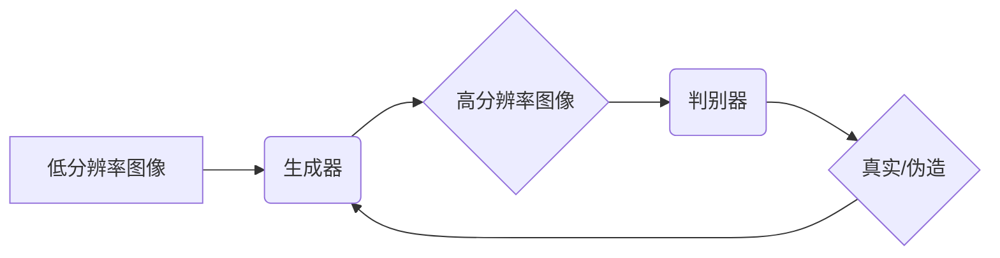

> 图像超分辨率，对抗神经网络，生成对抗网络，卷积神经网络，图像重建

## 1. 背景介绍

图像超分辨率（Image Super-Resolution，SR）技术是指通过利用已有的低分辨率图像，利用算法将其放大到更高分辨率的图像处理技术。近年来，随着深度学习的快速发展，基于深度学习的图像超分辨率算法取得了显著的成果，在图像处理、计算机视觉、医学影像等领域得到了广泛应用。

传统的图像超分辨率算法主要依赖于插值和重建技术，例如双线性插值、多重尺度分析等，这些方法在处理简单的图像时效果较好，但对于复杂图像的处理效果有限。深度学习方法的出现为图像超分辨率带来了新的突破。

基于深度学习的图像超分辨率算法主要利用卷积神经网络（Convolutional Neural Network，CNN）来学习图像的特征和重建高分辨率图像。这些算法通常包含两个主要部分：

* **编码器（Encoder）：** 负责提取低分辨率图像的特征。
* **解码器（Decoder）：** 负责根据提取的特征重建高分辨率图像。

## 2. 核心概念与联系

### 2.1 生成对抗网络（GAN）

生成对抗网络（Generative Adversarial Network，GAN）是由Goodfellow等人在2014年提出的一个生成模型。GAN由两个神经网络组成：

* **生成器（Generator）：** 负责生成新的数据样本，例如图像。
* **判别器（Discriminator）：** 负责判断数据样本是真实数据还是生成数据。

生成器和判别器之间进行对抗训练，生成器试图生成逼真的数据样本，而判别器试图区分真实数据和生成数据。通过这种对抗训练，生成器可以逐渐学习到生成逼真数据的能力。

### 2.2  对抗神经网络在图像超分辨率中的应用

在图像超分辨率领域，GAN的思想被广泛应用。

* **生成器** 负责将低分辨率图像映射到高分辨率图像。
* **判别器** 负责判断输入图像是否为真实的高分辨率图像。

通过对抗训练，生成器可以学习到将低分辨率图像映射到高分辨率图像的映射关系，从而实现图像超分辨率。

**Mermaid 流程图**



## 3. 核心算法原理 & 具体操作步骤

### 3.1  算法原理概述

基于对抗神经网络的图像超分辨率算法的核心原理是利用生成对抗网络的思想，通过对抗训练来学习图像的特征和重建高分辨率图像。

算法流程如下：

1. **输入低分辨率图像**：将低分辨率图像作为输入，输入到生成器中。
2. **生成高分辨率图像**：生成器根据输入的低分辨率图像，生成一个高分辨率图像。
3. **判别真实性**：将生成的图像和真实的高分辨率图像输入到判别器中，判别器判断输入图像的真实性。
4. **更新网络参数**：根据判别器的反馈，更新生成器和判别器的参数。
5. **重复步骤1-4**：重复上述步骤，直到生成器能够生成逼真的高分辨率图像。

### 3.2  算法步骤详解

1. **数据预处理**：将原始图像进行预处理，例如裁剪、归一化等，以提高算法的训练效率和效果。
2. **网络架构设计**：设计生成器和判别器的网络架构，选择合适的激活函数、损失函数等参数。
3. **训练过程**：

* **生成器训练**：固定判别器，训练生成器，使其生成逼真的高分辨率图像。
* **判别器训练**：固定生成器，训练判别器，使其能够准确地判断真实图像和生成图像。
* **交替训练**：交替训练生成器和判别器，直到生成器能够生成逼真的高分辨率图像。

4. **测试阶段**：将训练好的生成器用于将低分辨率图像放大到高分辨率图像。

### 3.3  算法优缺点

**优点：**

* **生成图像质量高**：基于对抗神经网络的图像超分辨率算法能够生成高质量的高分辨率图像，能够有效地恢复图像细节。
* **学习能力强**：深度学习模型能够学习图像的复杂特征，从而实现更准确的图像重建。

**缺点：**

* **训练复杂度高**：训练对抗神经网络需要大量的计算资源和时间。
* **训练不稳定**：对抗神经网络的训练过程比较不稳定，容易出现模式崩溃等问题。

### 3.4  算法应用领域

基于对抗神经网络的图像超分辨率算法在以下领域得到了广泛应用：

* **图像处理**：图像放大、图像修复、图像增强等。
* **计算机视觉**：目标检测、图像识别、图像分割等。
* **医学影像**：医学图像增强、医学图像分割等。

## 4. 数学模型和公式 & 详细讲解 & 举例说明

### 4.1  数学模型构建

基于对抗神经网络的图像超分辨率算法的数学模型可以概括为以下两个部分：

* **生成器网络（G）**：

$$
G(x) = \hat{y}
$$

其中，$x$ 是输入的低分辨率图像，$\hat{y}$ 是生成器生成的对应的高分辨率图像。

* **判别器网络（D）**：

$$
D(y) = p(y \text{ is real})
$$

其中，$y$ 是输入的图像，$p(y \text{ is real})$ 是判别器判断输入图像为真实图像的概率。

### 4.2  公式推导过程

对抗训练的目标是让生成器生成逼真的图像，让判别器无法区分真实图像和生成图像。

* **生成器损失函数**：

$$
L_G = -E_{x,y}[log(D(G(x)))]
$$

其中，$E_{x,y}$ 表示对所有低分辨率图像$x$和真实高分辨率图像$y$的期望。

* **判别器损失函数**：

$$
L_D = -E_{x,y}[log(D(x))] - E_{x, \hat{y}}[log(1-D(G(x)))]
$$

其中，$\hat{y}$ 是生成器生成的图像。

### 4.3  案例分析与讲解

假设我们有一个低分辨率图像，我们希望将其放大到高分辨率图像。

1. 将低分辨率图像输入到生成器中，生成器会根据训练好的参数生成一个高分辨率图像。
2. 将生成的图像和真实的高分辨率图像输入到判别器中，判别器会判断这两个图像的真实性。
3. 根据判别器的反馈，更新生成器的参数，使其生成更逼真的图像。
4. 重复上述步骤，直到生成器能够生成与真实图像几乎相同的图像。

## 5. 项目实践：代码实例和详细解释说明

### 5.1  开发环境搭建

* **操作系统**: Ubuntu 18.04
* **深度学习框架**: TensorFlow 2.0
* **编程语言**: Python 3.7

### 5.2  源代码详细实现

```python
# 生成器网络
def generator(input_shape):
    # ...

# 判别器网络
def discriminator(input_shape):
    # ...

# 损失函数
def loss_function(real_output, fake_output):
    # ...

# 优化器
optimizer = tf.keras.optimizers.Adam(learning_rate=0.0002)

# 训练循环
for epoch in range(num_epochs):
    for batch in dataset:
        # ...
```

### 5.3  代码解读与分析

* **生成器网络**: 生成器网络负责将低分辨率图像映射到高分辨率图像。网络架构可以根据具体任务进行设计，常用的网络架构包括ResNet、U-Net等。
* **判别器网络**: 判别器网络负责判断输入图像的真实性。判别器网络通常是一个分类网络，输出一个概率值，表示输入图像为真实图像的概率。
* **损失函数**: 损失函数用于衡量生成器和判别器的性能。常用的损失函数包括Binary Cross Entropy Loss、Wasserstein Loss等。
* **优化器**: 优化器用于更新生成器和判别器的参数。常用的优化器包括Adam、SGD等。

### 5.4  运行结果展示

训练完成后，可以将训练好的生成器用于将低分辨率图像放大到高分辨率图像。

## 6. 实际应用场景

### 6.1  图像放大

在图像放大场景中，基于对抗神经网络的图像超分辨率算法可以有效地放大图像分辨率，同时保持图像细节和质量。例如，可以将低分辨率的手机照片放大到高分辨率，用于打印或展示。

### 6.2  图像修复

在图像修复场景中，基于对抗神经网络的图像超分辨率算法可以用于修复图像中的损坏部分，例如缺失的像素、噪声等。例如，可以修复老照片中的损坏部分，恢复照片的完整性。

### 6.3  视频增强

在视频增强场景中，基于对抗神经网络的图像超分辨率算法可以用于提高视频的分辨率和清晰度。例如，可以将低分辨率的视频放大到高分辨率，用于观看或制作视频特效。

### 6.4  未来应用展望

随着深度学习技术的不断发展，基于对抗神经网络的图像超分辨率算法将在更多领域得到应用，例如：

* **虚拟现实和增强现实**: 用于提高虚拟现实和增强现实场景的图像质量。
* **医学影像**: 用于提高医学影像的清晰度和细节，辅助医生诊断和治疗。
* **遥感影像**: 用于提高遥感影像的分辨率和细节，用于环境监测、灾害预警等。

## 7. 工具和资源推荐

### 7.1  学习资源推荐

* **论文**:

* Goodfellow, I., Pouget-Abadie, J., Mirza, M., Xu, B., Warde-Farley, D., Ozair, S., ... & Bengio, Y. (2014). Generative adversarial nets. In Advances in neural information processing systems (pp. 2672-2680).

* **博客**:

* https://blog.keras.io/

* **在线课程**:

* https://www.coursera.org/

### 7.2  开发工具推荐

* **TensorFlow**: https://www.tensorflow.org/
* **PyTorch**: https://pytorch.org/
* **Keras**: https://keras.io/

### 7.3  相关论文推荐

* **ESRGAN**: https://arxiv.org/abs/1809.00219
* **SRGAN**: https://arxiv.org/abs/1609.04802
* **EDSR**: https://arxiv.org/abs/1609.02500

## 8. 总结：未来发展趋势与挑战

### 8.1  研究成果总结

基于对抗神经网络的图像超分辨率算法取得了显著的成果，能够生成高质量的高分辨率图像，在图像处理、计算机视觉等领域得到了广泛应用。

### 8.2  未来发展趋势

* **更高效的算法**: 研究更高效、更快速的图像超分辨率算法，降低计算成本。
* **更强的泛化能力**: 研究能够处理不同类型图像的通用图像超分辨率算法。
* **多尺度超分辨率**: 研究能够同时进行多尺度图像超分辨率的算法。
* **跨模态超分辨率**: 研究能够将不同模态的图像进行超分辨率，例如将音频转换为图像。

### 8.3  面临的挑战

* **训练数据**: 训练高质量的图像超分辨率算法需要大量的训练数据，获取高质量的训练数据仍然是一个挑战。
* **计算资源**: 训练对抗神经网络需要大量的计算资源，降低训练成本仍然是一个挑战。
* **算法稳定性**: 训练对抗神经网络的稳定性较