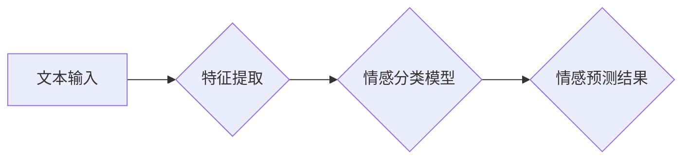

> 中文情感识别，机器学习，深度学习，自然语言处理，文本分类，情感分析

## 1. 背景介绍

随着互联网的快速发展和社交媒体的普及，海量文本数据涌现，如何有效地理解和分析这些文本信息成为了一个重要的研究课题。情感识别，即从文本中识别出表达的情感倾向（例如积极、消极、中性），在众多自然语言处理 (NLP) 任务中扮演着至关重要的角色。它广泛应用于市场调研、舆情监测、用户体验评估、广告投放等领域，为企业和个人提供决策支持和洞察。

中文情感识别相较于英文情感识别存在着独特的挑战。首先，中文是复杂的汉字语言，其语义表达丰富多样，包含大量的成语、俚语和网络用语，这些都增加了情感识别的难度。其次，中文的语法结构相对灵活，句子结构多样，缺乏明确的标点符号来区分情感倾向，这使得基于规则的方法难以有效地识别情感。

## 2. 核心概念与联系

**2.1 情感识别概述**

情感识别是指从文本中识别出表达的情感倾向的过程。它可以分为以下几个主要类别：

* **情感分类:** 将文本的情绪归类到预定义的类别中，例如积极、消极、中性。
* **情感强度度量:** 评估文本中表达的情感强度，例如非常高兴、稍微高兴、不高兴等。
* **情感细粒度分类:** 将情感细分为更具体的类别，例如喜悦、悲伤、愤怒、恐惧等。

**2.2 机器学习在情感识别中的应用**

机器学习算法能够从大量文本数据中学习情感识别模式，并对新的文本进行情感分类。常用的机器学习算法包括：

* **朴素贝叶斯算法:** 基于贝叶斯定理，假设特征之间相互独立，计算文本属于不同情感类别的概率。
* **支持向量机 (SVM):** 通过寻找最佳的分隔超平面，将文本数据分类到不同的情感类别。
* **决策树算法:** 通过构建决策树模型，根据文本特征进行决策，最终预测文本的情感类别。
* **随机森林算法:** 结合多个决策树，提高分类精度。
* **深度学习算法:** 利用多层神经网络，学习更复杂的文本特征，提高情感识别性能。

**2.3 中文情感识别技术现状**

近年来，随着深度学习技术的快速发展，中文情感识别技术取得了显著进步。许多研究者提出了基于深度学习的中文情感识别模型，例如：

* **Recurrent Neural Networks (RNN):** RNN能够处理序列数据，适合用于情感识别任务。
* **Long Short-Term Memory (LSTM):** LSTM是一种改进的RNN，能够更好地捕捉长距离依赖关系。
* **Gated Recurrent Unit (GRU):** GRU是一种更轻量级的RNN，具有与LSTM相似的性能。
* **Transformer:** Transformer是一种基于注意力机制的模型，能够更有效地处理长文本序列。

**2.4 Mermaid 流程图**



## 3. 核心算法原理 & 具体操作步骤

### 3.1  算法原理概述

本文将重点介绍基于深度学习的中文情感识别算法，特别是基于LSTM的模型。LSTM是一种特殊的RNN，能够学习文本序列中的长期依赖关系，从而更好地捕捉情感信息。

### 3.2  算法步骤详解

1. **文本预处理:** 将文本数据进行清洗、分词、词性标注等预处理操作，以便于模型训练。
2. **特征提取:** 将预处理后的文本数据转换为模型可理解的特征向量，例如词向量、词嵌入等。
3. **模型训练:** 使用LSTM模型对训练数据进行训练，学习情感分类的模式。
4. **模型评估:** 使用测试数据评估模型的性能，例如准确率、召回率、F1-score等。
5. **模型部署:** 将训练好的模型部署到实际应用场景中，用于对新的文本数据进行情感分类。

### 3.3  算法优缺点

**优点:**

* 能够捕捉文本序列中的长期依赖关系，提高情感识别精度。
* 对文本数据具有较强的鲁棒性，能够处理噪声和不规则文本。

**缺点:**

* 训练时间较长，需要大量的训练数据。
* 模型参数较多，需要较大的计算资源。

### 3.4  算法应用领域

* **市场调研:** 分析用户对产品或服务的评价，了解市场趋势。
* **舆情监测:** 监测网络舆情，及时发现潜在风险。
* **用户体验评估:** 分析用户对产品或服务的体验，改进产品设计。
* **广告投放:** 根据用户情感倾向，精准投放广告。

## 4. 数学模型和公式 & 详细讲解 & 举例说明

### 4.1  数学模型构建

LSTM模型的核心是其单元结构，每个单元包含多个门控机制，用于控制信息的流动。

**4.1.1 门控机制:**

* **遗忘门 (Forget Gate):** 控制之前单元状态中哪些信息需要遗忘。
* **输入门 (Input Gate):** 控制哪些新的信息需要被添加到单元状态中。
* **输出门 (Output Gate):** 控制单元状态中哪些信息需要输出到下一个单元。

**4.1.2 公式:**

* 遗忘门：$f_t = \sigma(W_f \cdot [h_{t-1}, x_t] + b_f)$
* 输入门：$i_t = \sigma(W_i \cdot [h_{t-1}, x_t] + b_i)$
* 候选单元状态：$\tilde{C}_t = \tanh(W_c \cdot [h_{t-1}, x_t] + b_c)$
* 单元状态：$C_t = f_t \cdot C_{t-1} + i_t \cdot \tilde{C}_t$
* 输出门：$o_t = \sigma(W_o \cdot [h_{t-1}, x_t] + b_o)$
* 输出：$h_t = o_t \cdot \tanh(C_t)$

其中：

* $h_t$：当前时间步的隐藏状态
* $x_t$：当前时间步的输入
* $C_t$：当前时间步的单元状态
* $f_t$：遗忘门
* $i_t$：输入门
* $o_t$：输出门
* $\tilde{C}_t$：候选单元状态
* $W_f$, $W_i$, $W_c$, $W_o$：权重矩阵
* $b_f$, $b_i$, $b_c$, $b_o$：偏置项
* $\sigma$：sigmoid函数
* $\tanh$：tanh函数

### 4.2  公式推导过程

LSTM模型的公式推导过程较为复杂，涉及到矩阵运算、激活函数等多个方面。

### 4.3  案例分析与讲解

通过对实际文本数据进行情感分类，可以验证LSTM模型的性能。例如，可以将电影评论数据进行情感分类，评估模型对正面、负面评论的识别能力。

## 5. 项目实践：代码实例和详细解释说明

### 5.1  开发环境搭建

* Python 3.x
* TensorFlow 或 PyTorch
* NLTK 或 spaCy

### 5.2  源代码详细实现

```python
import tensorflow as tf

# 定义LSTM模型
model = tf.keras.Sequential([
    tf.keras.layers.Embedding(input_dim=vocab_size, output_dim=embedding_dim),
    tf.keras.layers.LSTM(units=128),
    tf.keras.layers.Dense(units=num_classes, activation='softmax')
])

# 编译模型
model.compile(optimizer='adam',
              loss='sparse_categorical_crossentropy',
              metrics=['accuracy'])

# 训练模型
model.fit(x_train, y_train, epochs=10, batch_size=32)

# 评估模型
loss, accuracy = model.evaluate(x_test, y_test)
print('Loss:', loss)
print('Accuracy:', accuracy)
```

### 5.3  代码解读与分析

* **Embedding层:** 将词向量转换为稠密的向量表示。
* **LSTM层:** 学习文本序列中的长期依赖关系。
* **Dense层:** 将LSTM输出转换为情感类别概率。
* **编译模型:** 设置优化器、损失函数和评价指标。
* **训练模型:** 使用训练数据训练模型。
* **评估模型:** 使用测试数据评估模型性能。

### 5.4  运行结果展示

训练完成后，可以查看模型的损失值和准确率，评估模型的性能。

## 6. 实际应用场景

### 6.1  市场调研

* 分析用户对产品或服务的评价，了解市场趋势。
* 识别潜在的客户需求和痛点。

### 6.2  舆情监测

* 监测网络舆情，及时发现潜在风险。
* 分析用户对特定事件或产品的态度。

### 6.3  用户体验评估

* 分析用户对产品或服务的体验，改进产品设计。
* 识别用户使用产品时遇到的问题。

### 6.4  未来应用展望

* **个性化推荐:** 根据用户的兴趣和情感倾向，提供个性化的产品或服务推荐。
* **情感机器人:** 开发能够理解和回应人类情感的机器人。
* **医疗诊断:** 分析患者的语言表达，辅助医生进行诊断。

## 7. 工具和资源推荐

### 7.1  学习资源推荐

* **书籍:**
    * "Speech and Language Processing" by Jurafsky and Martin
    * "Deep Learning" by Goodfellow, Bengio, and Courville
* **在线课程:**
    * Coursera: Natural Language Processing Specialization
    * edX: Artificial Intelligence

### 7.2  开发工具推荐

* **TensorFlow:** 开源深度学习框架。
* **PyTorch:** 开源深度学习框架。
* **NLTK:** 自然语言处理工具包。
* **spaCy:** 自然语言处理库。

### 7.3  相关论文推荐

* "Recurrent Neural Network Based Language Model" by Mikolov et al.
* "Long Short-Term Memory" by Hochreiter and Schmidhuber
* "Attention Is All You Need" by Vaswani et al.

## 8. 总结：未来发展趋势与挑战

### 8.1  研究成果总结

近年来，基于深度学习的中文情感识别技术取得了显著进步，能够有效地识别文本中的情感倾向。

### 8.2  未来发展趋势

* **更准确的情感识别:** 研究更先进的深度学习模型，提高情感识别精度。
* **更细粒度的情感分类:** 将情感细分为更具体的类别，例如喜悦、悲伤、愤怒等。
* **跨语言情感识别:** 研究跨语言的情感识别模型，能够识别不同语言文本的情感。

### 8.3  面临的挑战

* **数据标注:** 高质量的标注数据是深度学习模型训练的基础，但中文情感数据标注成本较高。
* **模型解释性:** 深度学习模型的决策过程难以解释，这限制了模型的应用场景。
* **对抗攻击:** 攻击者可以构造对抗样本，欺骗深度学习模型做出错误的预测。

### 8.4  研究展望

未来，中文情感识别技术将朝着更准确、更细粒度、更鲁棒的方向发展。研究者将继续探索新的深度学习模型和算法，提高情感识别性能。同时，也将关注模型的解释性、安全性等问题，推动中文情感识别技术在更多领域得到应用。

## 9. 附录：常见问题与解答

### 9.1  常见问题

* **如何选择合适的LSTM模型参数？**

参数选择需要根据具体任务和数据集进行调整。一般来说，可以先从预设的参数开始，然后通过交叉验证等方法进行调优。

* **如何处理中文文本中的停用词？**

