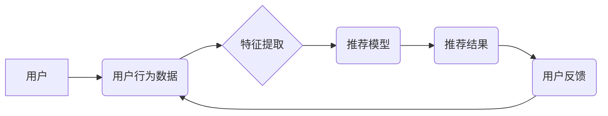

> 推荐系统, 深度学习, 协同过滤, 矩阵分解, 神经网络, 自然语言处理, 用户画像

## 1. 背景介绍

在信息爆炸的时代，海量数据和个性化需求日益凸显。推荐系统作为连接用户和信息的桥梁，在电商、社交媒体、视频平台等领域发挥着越来越重要的作用。传统的基于内容过滤和协同过滤的推荐系统，虽然取得了一定的成功，但随着用户行为的复杂化和数据规模的扩大，其效果逐渐趋于饱和。

深度学习技术的兴起为推荐系统带来了新的机遇。深度学习算法能够自动学习用户和物品的复杂特征，并挖掘潜在的关联关系，从而实现更精准、更个性化的推荐。基于深度学习的推荐系统，在准确率、覆盖范围和用户体验等方面都展现出显著优势。

## 2. 核心概念与联系

**2.1 推荐系统概述**

推荐系统旨在根据用户的历史行为、偏好和上下文信息，预测用户对特定物品的兴趣，并推荐最相关的物品。

**2.2 深度学习概述**

深度学习是一种机器学习的子领域，它利用多层神经网络来模拟人类大脑的学习过程。深度学习算法能够自动学习数据中的复杂特征，并进行高层次的抽象和推理。

**2.3 深度学习与推荐系统的结合**

深度学习算法能够有效地处理海量数据和复杂特征，为推荐系统提供了强大的学习能力。

**2.4 推荐系统架构**



## 3. 核心算法原理 & 具体操作步骤

**3.1 算法原理概述**

基于深度学习的推荐系统主要采用以下几种算法：

* **协同过滤模型:** 基于用户-物品交互矩阵，预测用户对未交互物品的兴趣。
* **矩阵分解:** 将用户-物品交互矩阵分解成低维的用户和物品向量，学习用户和物品的潜在特征。
* **神经网络模型:** 利用多层神经网络学习用户和物品的复杂特征，并进行预测。

**3.2 算法步骤详解**

以矩阵分解为例，详细说明算法步骤：

1. **数据预处理:** 将用户-物品交互数据转换为矩阵形式，并进行缺失值处理和数据归一化。
2. **矩阵分解:** 将用户-物品交互矩阵分解成两个低维矩阵，分别表示用户和物品的潜在特征。
3. **损失函数定义:** 定义一个损失函数，用于衡量预测结果与真实交互数据的差异。
4. **模型训练:** 使用梯度下降算法优化模型参数，最小化损失函数值。
5. **预测评分:** 将训练好的模型应用于新的用户-物品交互数据，预测用户对物品的评分。
6. **推荐排序:** 根据预测评分对推荐结果进行排序，并返回给用户。

**3.3 算法优缺点**

* **优点:** 能够学习用户和物品的潜在特征，提高推荐准确率。
* **缺点:** 容易受到数据稀疏性的影响，需要大量的训练数据。

**3.4 算法应用领域**

* **电商推荐:** 推荐商品、优惠券、促销活动等。
* **视频平台推荐:** 推荐视频、电视剧、电影等。
* **音乐平台推荐:** 推荐歌曲、专辑、歌手等。
* **社交媒体推荐:** 推荐好友、群组、话题等。

## 4. 数学模型和公式 & 详细讲解 & 举例说明

**4.1 数学模型构建**

假设用户集合为U，物品集合为I，用户-物品交互矩阵为R，其中R(u,i)表示用户u对物品i的评分。

**4.2 公式推导过程**

矩阵分解模型的目标是将用户-物品交互矩阵R分解成两个低维矩阵：用户特征矩阵P和物品特征矩阵Q。

$$R \approx P Q^T$$

其中，P∈R^(|U|×k)，Q∈R^(|I|×k)，k为隐特征维度。

**4.3 案例分析与讲解**

假设用户集合U={u1, u2, u3}, 物品集合I={i1, i2, i3}, 用户-物品交互矩阵R如下：

```
R = [
    [5, 3, 4],
    [4, 5, 2],
    [3, 2, 5]
]
```

通过矩阵分解，可以得到用户特征矩阵P和物品特征矩阵Q，例如：

```
P = [
    [0.8, 0.6],
    [0.5, 0.9],
    [0.3, 0.7]
]

Q = [
    [0.7, 0.4],
    [0.6, 0.5],
    [0.5, 0.8]
]
```

通过计算PQ^T，可以得到近似值R'，与原始矩阵R进行比较，可以评估模型的性能。

## 5. 项目实践：代码实例和详细解释说明

**5.1 开发环境搭建**

* Python 3.x
* TensorFlow/PyTorch
* Jupyter Notebook

**5.2 源代码详细实现**

```python
import tensorflow as tf

# 定义模型
class RecommenderModel(tf.keras.Model):
    def __init__(self, user_dim, item_dim, latent_dim):
        super(RecommenderModel, self).__init__()
        self.user_embedding = tf.keras.layers.Embedding(user_dim, latent_dim)
        self.item_embedding = tf.keras.layers.Embedding(item_dim, latent_dim)

    def call(self, user_ids, item_ids):
        user_embeddings = self.user_embedding(user_ids)
        item_embeddings = self.item_embedding(item_ids)
        return tf.reduce_sum(user_embeddings * item_embeddings, axis=1)

# 训练模型
model = RecommenderModel(user_dim=100, item_dim=100, latent_dim=64)
model.compile(optimizer='adam', loss='mse')
model.fit(user_ids, item_ids, epochs=10)

# 预测评分
predictions = model.predict(user_ids, item_ids)
```

**5.3 代码解读与分析**

* 模型定义: 使用 TensorFlow 的 Keras API 定义了一个简单的推荐模型。
* 嵌入层: 使用 Embedding 层将用户 ID 和物品 ID 映射到低维向量空间。
* 点积操作: 使用点积操作计算用户和物品的相似度。
* 损失函数: 使用均方误差 (MSE) 作为损失函数，优化模型参数。
* 训练过程: 使用 Adam 优化器训练模型，并设置训练轮数。
* 预测评分: 使用训练好的模型预测用户对物品的评分。

**5.4 运行结果展示**

训练完成后，可以将模型应用于新的用户-物品交互数据，并评估推荐结果的准确率。

## 6. 实际应用场景

**6.1 电商推荐**

* 商品推荐: 根据用户的浏览历史、购买记录和评分等信息，推荐相关的商品。
* 个性化促销: 根据用户的消费习惯和偏好，推荐个性化的优惠券和促销活动。

**6.2 视频平台推荐**

* 视频推荐: 根据用户的观看历史、点赞记录和评论等信息，推荐相关的视频。
* 个性化内容: 根据用户的兴趣爱好，推荐个性化的视频内容和播放列表。

**6.3 音乐平台推荐**

* 歌曲推荐: 根据用户的播放历史、收藏记录和点赞等信息，推荐相关的歌曲。
* 个性化歌单: 根据用户的音乐偏好，推荐个性化的歌单和音乐风格。

**6.4 未来应用展望**

* 多模态推荐: 将文本、图像、音频等多种模态信息融合，实现更精准的推荐。
* 跨平台推荐: 将用户行为数据跨平台整合，实现更全面的用户画像和个性化推荐。
* 增强现实推荐: 利用增强现实技术，将推荐结果叠加到现实世界中，提供更直观的体验。

## 7. 工具和资源推荐

**7.1 学习资源推荐**

* 深度学习推荐系统: https://www.deeplearningbook.org/contents/recommender_systems.html
* TensorFlow 推荐系统教程: https://www.tensorflow.org/tutorials/recommenders

**7.2 开发工具推荐**

* TensorFlow: https://www.tensorflow.org/
* PyTorch: https://pytorch.org/
* Keras: https://keras.io/

**7.3 相关论文推荐**

* Neural Collaborative Filtering (2017)
* Deep Learning for Recommender Systems (2019)

## 8. 总结：未来发展趋势与挑战

**8.1 研究成果总结**

基于深度学习的推荐系统取得了显著的成果，在推荐准确率、覆盖范围和用户体验等方面都展现出优势。

**8.2 未来发展趋势**

* 多模态融合
* 跨平台整合
* 增强现实推荐
* 联邦学习

**8.3 面临的挑战**

* 数据稀疏性
* 隐私保护
* 可解释性

**8.4 研究展望**

未来研究将继续探索更有效的深度学习算法，并解决数据稀疏性、隐私保护和可解释性等挑战，推动推荐系统朝着更智能、更个性化、更安全的方向发展。

## 9. 附录：常见问题与解答

**9.1 如何处理数据稀疏性？**

可以使用矩阵分解、注意力机制等技术来处理数据稀疏性。

**9.2 如何保证用户隐私？**

可以使用联邦学习、差分隐私等技术来保护用户隐私。

**9.3 如何解释推荐结果？**

可以使用可解释性分析方法，例如 LIME、SHAP 等，来解释推荐结果。


作者：禅与计算机程序设计艺术 / Zen and the Art of Computer Programming 
<end_of_turn>