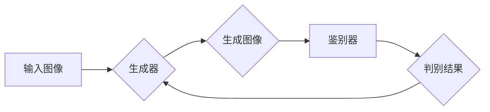

> 生成对抗网络(GAN)，风格迁移，动漫人物，图像处理，深度学习

## 1. 背景介绍

近年来，深度学习技术在图像处理领域取得了显著进展，其中生成对抗网络（Generative Adversarial Networks，GAN）作为一种强大的生成模型，在图像生成、风格迁移、图像修复等方面展现出巨大的潜力。风格迁移技术能够将一种图像的风格应用到另一幅图像上，从而创造出具有独特艺术效果的图像。

动漫人物绘画风格独特，具有鲜明的特征，因此基于GAN的动漫人物绘画风格迁移具有重要的研究价值和应用前景。该技术可以用于：

* **动漫角色设计：** 艺术家可以使用现有的动漫人物图像作为基础，通过风格迁移生成具有不同风格的动漫角色，丰富角色设计。
* **游戏开发：** 游戏开发人员可以使用风格迁移技术将游戏角色的风格与游戏场景相匹配，提升游戏的视觉效果。
* **影视制作：** 电影和动画制作人员可以使用风格迁移技术将真人演员的图像转换为动漫风格，实现角色的二次创作。

## 2. 核心概念与联系

### 2.1 生成对抗网络 (GAN)

GAN由两个神经网络组成：生成器 (Generator) 和鉴别器 (Discriminator)。生成器负责生成新的图像数据，而鉴别器负责判断图像数据是真实数据还是生成数据。这两个网络在对抗博弈中相互竞争，生成器试图生成逼真的图像数据来欺骗鉴别器，而鉴别器则试图准确地识别生成数据和真实数据。

### 2.2 风格迁移

风格迁移是指将一种图像的风格应用到另一幅图像上，从而创造出具有独特艺术效果的图像。常见的风格迁移方法包括：

* **神经风格迁移：** 利用深度神经网络提取图像的风格特征，并将这些特征应用到目标图像上。
* **基于对抗网络的风格迁移：** 使用GAN框架进行风格迁移，生成器生成具有目标风格的图像，鉴别器判断图像的真实性和风格一致性。

### 2.3 Mermaid 流程图



## 3. 核心算法原理 & 具体操作步骤

### 3.1 算法原理概述

基于GAN的动漫人物绘画风格迁移算法主要包括以下步骤：

1. **数据预处理：** 将动漫人物图像和目标风格图像进行预处理，例如尺寸调整、数据增强等。
2. **特征提取：** 使用预训练的深度神经网络提取动漫人物图像和目标风格图像的特征，例如VGG网络、ResNet网络等。
3. **风格迁移：** 将目标风格图像的风格特征应用到动漫人物图像的特征上，生成具有目标风格的图像。
4. **图像生成：** 将迁移后的特征转换为图像数据，生成最终的动漫人物图像。

### 3.2 算法步骤详解

1. **数据预处理：**

   * 将动漫人物图像和目标风格图像裁剪成相同的大小，并进行归一化处理，将像素值范围调整到[0, 1]之间。
   * 使用数据增强技术，例如随机旋转、翻转、裁剪等，增加训练数据的多样性。

2. **特征提取：**

   * 使用预训练的深度神经网络，例如VGG网络，提取动漫人物图像和目标风格图像的特征。
   * 选择网络的特定层级提取特征，例如VGG网络的conv4_2层，该层级可以提取图像的风格特征。

3. **风格迁移：**

   * 将目标风格图像的特征与动漫人物图像的特征进行融合，生成具有目标风格的特征。
   * 可以使用多种融合方法，例如加权平均、注意力机制等。

4. **图像生成：**

   * 将迁移后的特征转换为图像数据，可以使用反卷积网络或其他图像生成网络。
   * 对生成的图像进行后处理，例如去噪、锐化等，提升图像质量。

### 3.3 算法优缺点

**优点：**

* 可以生成具有高质量的动漫人物图像。
* 可以迁移多种风格，例如卡通风格、水彩风格等。
* 可以根据用户的需求进行个性化定制。

**缺点：**

* 需要大量的训练数据。
* 训练过程复杂，需要较强的计算能力。
* 可能会出现图像模糊、失真等问题。

### 3.4 算法应用领域

* 动漫角色设计
* 游戏开发
* 影视制作
* 艺术创作
* 教育培训

## 4. 数学模型和公式 & 详细讲解 & 举例说明

### 4.1 数学模型构建

GAN的数学模型主要包括生成器G和鉴别器D的损失函数。

* **生成器损失函数：**

$$
L_G = -E_{z \sim p_z(z)}[log(D(G(z)))]
$$

其中，$z$是随机噪声，$p_z(z)$是噪声的分布，$D(G(z))$是鉴别器对生成图像的判别结果。生成器的目标是最大化$D(G(z))$的值，即欺骗鉴别器。

* **鉴别器损失函数：**

$$
L_D = -E_{x \sim p_{data}(x)}[log(D(x))] - E_{z \sim p_z(z)}[log(1 - D(G(z)))]
$$

其中，$x$是真实图像，$p_{data}(x)$是真实图像的分布。鉴别器的目标是最大化$L_D$的值，即准确地识别真实图像和生成图像。

### 4.2 公式推导过程

生成器和鉴别器的损失函数的推导过程基于对抗博弈的思想。

* 生成器试图最大化$D(G(z))$的值，即欺骗鉴别器认为生成图像是真实图像。
* 鉴别器试图最小化$L_D$的值，即准确地识别真实图像和生成图像。

通过不断地训练和更新，生成器和鉴别器之间的博弈会达到平衡，生成器能够生成逼真的图像数据。

### 4.3 案例分析与讲解

假设我们想要将一张动漫人物图像的风格迁移到油画风格。

1. 我们需要找到一些油画风格的图像作为目标风格数据。
2. 使用预训练的深度神经网络提取动漫人物图像和油画风格图像的特征。
3. 将油画风格图像的特征与动漫人物图像的特征进行融合，生成具有油画风格的特征。
4. 将迁移后的特征转换为图像数据，生成最终的动漫人物油画图像。

## 5. 项目实践：代码实例和详细解释说明

### 5.1 开发环境搭建

* 操作系统：Windows/macOS/Linux
* Python版本：3.6+
* 深度学习框架：TensorFlow/PyTorch
* 其他依赖库：NumPy、OpenCV、matplotlib等

### 5.2 源代码详细实现

```python
# 导入必要的库
import tensorflow as tf
from tensorflow.keras.layers import Input, Conv2D, BatchNormalization, LeakyReLU, UpSampling2D
from tensorflow.keras.models import Model

# 定义生成器模型
def build_generator(input_shape):
    input_layer = Input(shape=input_shape)
    x = Conv2D(64, (3, 3), activation='relu', padding='same')(input_layer)
    x = BatchNormalization()(x)
    x = Conv2D(128, (3, 3), activation='relu', padding='same')(x)
    x = BatchNormalization()(x)
    x = UpSampling2D((2, 2))(x)
    x = Conv2D(64, (3, 3), activation='relu', padding='same')(x)
    x = BatchNormalization()(x)
    output_layer = Conv2D(3, (3, 3), activation='tanh', padding='same')(x)
    return Model(inputs=input_layer, outputs=output_layer)

# 定义鉴别器模型
def build_discriminator(input_shape):
    input_layer = Input(shape=input_shape)
    x = Conv2D(64, (3, 3), activation='relu', padding='same')(input_layer)
    x = BatchNormalization()(x)
    x = Conv2D(128, (3, 3), activation='relu', padding='same')(x)
    x = BatchNormalization()(x)
    x = LeakyReLU(alpha=0.2)(x)
    x = MaxPooling2D((2, 2))(x)
    x = Conv2D(256, (3, 3), activation='relu', padding='same')(x)
    x = BatchNormalization()(x)
    x = LeakyReLU(alpha=0.2)(x)
    x = MaxPooling2D((2, 2))(x)
    output_layer = Conv2D(1, (3, 3), activation='sigmoid', padding='same')(x)
    return Model(inputs=input_layer, outputs=output_layer)

# 构建生成器和鉴别器模型
generator = build_generator(input_shape=(64, 64, 3))
discriminator = build_discriminator(input_shape=(64, 64, 3))

# 编译模型
discriminator.compile(loss='binary_crossentropy', optimizer='adam')

# 训练模型
# ...

```

### 5.3 代码解读与分析

* **模型构建：** 代码中定义了生成器和鉴别器的模型结构，使用卷积层、池化层、批归一化层和激活函数等构建神经网络。
* **模型编译：** 使用Adam优化器和二元交叉熵损失函数编译鉴别器模型。
* **模型训练：** 训练过程需要使用真实图像和生成图像作为输入，并根据损失函数进行模型更新。

### 5.4 运行结果展示

训练完成后，可以使用生成器模型将动漫人物图像转换为目标风格图像。

## 6. 实际应用场景

### 6.1 动漫角色设计

动漫角色设计需要考虑角色的外形、性格、服饰等多种因素。基于GAN的风格迁移技术可以帮助设计师快速生成不同风格的角色设计，节省时间和精力。

### 6.2 游戏开发

游戏开发中需要大量的角色模型和场景模型。风格迁移技术可以帮助开发者快速生成不同风格的游戏资产，提升游戏开发效率。

### 6.3 影视制作

电影和动画制作中需要大量的角色动画和场景特效。风格迁移技术可以帮助制作人员将真人演员的图像转换为动漫风格，实现角色的二次创作。

### 6.4 未来应用展望

随着深度学习技术的不断发展，基于GAN的风格迁移技术将会在更多领域得到应用，例如：

* **艺术创作：** 艺术家可以使用风格迁移技术创作出具有独特艺术效果的图像作品。
* **教育培训：** 教育机构可以使用风格迁移技术将教材内容转换为更生动有趣的形式，提升学生的学习兴趣。
* **医疗诊断：** 医生可以使用风格迁移技术将医学图像转换为更易于理解的形式，辅助诊断疾病。

## 7. 工具和资源推荐

### 7.1 学习资源推荐

* **书籍：**
    * 《深度学习》 - Ian Goodfellow
    * 《Generative Adversarial Networks》 - Ian Goodfellow
* **在线课程：**
    * Coursera - Deep Learning Specialization
    * Udacity - Deep Learning Nanodegree

### 7.2 开发工具推荐

* **深度学习框架：** TensorFlow, PyTorch
* **图像处理库：** OpenCV
* **可视化工具：** Matplotlib, Seaborn

### 7.3 相关论文推荐

* **Generative Adversarial Networks** - Ian Goodfellow et al. (2014)
* **Deep Convolutional Generative Adversarial Networks** - Radford Neal et al. (2016)
* **Style Transfer Using Convolutional Neural