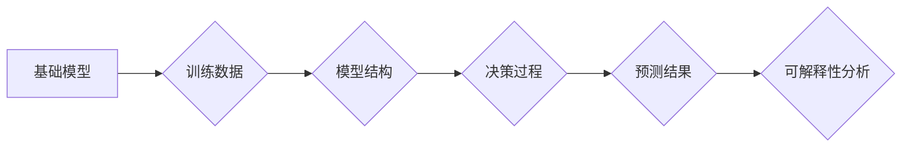

> 基础模型、可解释性、透明度、信任、伦理、公平性、偏见、可控性、人类-AI交互

## 1. 背景介绍

近年来，深度学习模型取得了令人瞩目的成就，在图像识别、自然语言处理、语音识别等领域展现出强大的能力。然而，这些模型的复杂性和黑盒性质也引发了广泛的担忧。

**可解释性** (Interpretability) 成为一个关键议题，指的是理解模型决策过程的能力。对于基础模型而言，可解释性需求尤为重要，因为它往往是其他应用模型的基础，其决策直接影响着后续应用的可靠性和安全性。

**基础模型** (Foundation Model) 指的是在海量数据上预训练的通用模型，能够在多种下游任务中进行微调，例如 GPT-3、BERT、DALL-E 等。这些模型的强大能力也带来了新的挑战：

* **缺乏透明度:** 基础模型的决策过程过于复杂，难以理解其是如何得出结果的。
* **信任问题:** 当模型的决策对人类产生重大影响时，缺乏可解释性会导致人们对模型的信任度下降。
* **伦理风险:** 模型可能存在偏见或歧视，导致不公平的结果。缺乏可解释性使得识别和解决这些问题变得更加困难。

## 2. 核心概念与联系

**可解释性** 可以从不同的角度进行理解：

* **局部可解释性:** 解释单个预测结果是如何产生的。
* **全局可解释性:** 解释模型的整体行为模式。
* **模型可视化:** 使用可视化技术帮助人类理解模型的结构和功能。

**基础模型的可解释性** 涉及到以下几个关键方面：

* **模型结构:** 理解模型的架构和参数是如何工作的。
* **训练数据:** 分析模型的训练数据，识别潜在的偏见或噪声。
* **决策过程:** 追踪模型的决策过程，了解其是如何处理输入信息并生成输出结果的。

**Mermaid 流程图:**



## 3. 核心算法原理 & 具体操作步骤

### 3.1  算法原理概述

可解释性算法旨在揭示模型的决策过程，并提供人类可理解的解释。常见的可解释性算法包括：

* **LIME (Local Interpretable Model-agnostic Explanations):** 通过在每个预测点附近构建一个简单的模型来解释单个预测结果。
* **SHAP (SHapley Additive exPlanations):** 基于博弈论的理论，为每个特征分配一个重要性分数，解释其对预测结果的影响。
* **Attention 机制:** 在 Transformer 模型中，Attention 机制可以突出模型关注的输入特征，提供对决策过程的直观解释。

### 3.2  算法步骤详解

以 LIME 为例，其步骤如下：

1. **选择一个预测点:** 首先选择一个需要解释的预测结果。
2. **生成扰动样本:** 在预测点附近生成一系列扰动样本，每个样本都对原始样本进行微小的修改。
3. **预测扰动样本:** 使用基础模型对扰动样本进行预测。
4. **构建局部模型:** 使用扰动样本和预测结果训练一个简单的模型，例如线性回归模型。
5. **解释预测结果:** 使用局部模型解释预测结果，例如哪些特征对预测结果有重要影响。

### 3.3  算法优缺点

**LIME:**

* **优点:** 模型无关性，适用于各种类型的基础模型。
* **缺点:** 局部解释性，无法解释模型的整体行为模式。

**SHAP:**

* **优点:** 全局解释性，可以解释模型的整体行为模式。
* **缺点:** 计算复杂度较高，难以处理大型模型。

### 3.4  算法应用领域

可解释性算法在各个领域都有广泛的应用，例如：

* **医疗诊断:** 解释模型对患者病情的预测结果，帮助医生做出更明智的决策。
* **金融风险评估:** 解释模型对客户信用风险的评估结果，帮助银行制定更合理的贷款政策。
* **自动驾驶:** 解释模型对道路场景的感知和决策结果，提高自动驾驶系统的安全性。

## 4. 数学模型和公式 & 详细讲解 & 举例说明

### 4.1  数学模型构建

LIME 算法的核心思想是使用一个简单的模型来近似基础模型在预测点附近的行为。假设基础模型为 f(x)，其中 x 是输入特征向量，y 是预测结果。LIME 算法的目标是找到一个简单的模型 g(x) ，使得 g(x) 在预测点附近与 f(x) 的预测结果尽可能接近。

### 4.2  公式推导过程

LIME 算法使用以下公式来计算 g(x) 的参数：

$$
\min_{g} \sum_{x' \in \mathcal{N}(x)} (f(x') - g(x'))^2 + \lambda ||g||_2^2
$$

其中：

* $\mathcal{N}(x)$ 是预测点 x 附近的样本集。
* $\lambda$ 是正则化参数，用于控制模型的复杂度。

### 4.3  案例分析与讲解

假设我们有一个基础模型用于预测房价，输入特征包括房屋面积、房间数量、地理位置等。

使用 LIME 算法解释一个特定房子的房价预测结果，可以生成一个简单的线性模型，例如：

$$
\text{房价} = 10000 \times \text{面积} + 5000 \times \text{房间数量} - 2000 \times \text{距离市中心}
$$

这个线性模型可以解释哪些特征对该房子的房价预测结果有重要影响。

## 5. 项目实践：代码实例和详细解释说明

### 5.1  开发环境搭建

* Python 3.7+
* TensorFlow/PyTorch
* LIME/SHAP 库

### 5.2  源代码详细实现

```python
from lime import lime_tabular
import pandas as pd

# 加载数据
data = pd.read_csv('housing_data.csv')

# 训练基础模型
# ...

# 选择一个预测点
instance = data.iloc[0]

# 使用 LIME 算法解释预测结果
explainer = lime_tabular.LimeTabularExplainer(data.values, feature_names=data.columns)
explanation = explainer.explain_instance(instance, model.predict, top_labels=1)

# 可视化解释结果
explanation.as_list()
explanation.as_pyplot_figure()
```

### 5.3  代码解读与分析

* 使用 `lime_tabular.LimeTabularExplainer` 创建 LIME 解释器。
* 使用 `explain_instance` 方法解释预测点，并指定要解释的模型和标签。
* 使用 `as_list` 和 `as_pyplot_figure` 方法可视化解释结果。

### 5.4  运行结果展示

运行代码后，会生成一个列表和一个图表，展示哪些特征对预测结果有重要影响。

## 6. 实际应用场景

### 6.1  医疗诊断

* 解释模型对患者病情的预测结果，帮助医生做出更明智的诊断和治疗方案。
* 识别模型的潜在偏见，确保医疗决策公平公正。

### 6.2  金融风险评估

* 解释模型对客户信用风险的评估结果，帮助银行制定更合理的贷款政策。
* 识别模型的潜在风险，避免因模型误判导致的财务损失。

### 6.3  自动驾驶

* 解释模型对道路场景的感知和决策结果，提高自动驾驶系统的安全性。
* 识别模型的潜在盲点，避免因模型误判导致的交通事故。

### 6.4  未来应用展望

随着基础模型的不断发展，可解释性技术将发挥越来越重要的作用。未来，可解释性技术将被应用于更多领域，例如：

* **教育:** 解释模型对学生的学习情况的预测结果，帮助老师制定个性化的教学方案。
* **法律:** 解释模型对案件的判决结果，提高法律决策的透明度和公正性。
* **科学研究:** 解释模型对实验结果的解释，帮助科学家更深入地理解自然现象。

## 7. 工具和资源推荐

### 7.1  学习资源推荐

* **论文:**

    * Ribeiro, M. T., Singh, S., & Guestrin, C. (2016). "Why should I trust you?": Explaining the predictions of any classifier. In *Proceedings of the 22nd ACM SIGKDD International Conference on Knowledge Discovery and Data Mining* (pp. 1135-1144).

    * Lundberg, S. M., & Lee, S. I. (2017). A unified approach to interpreting model predictions. In *Advances in neural information processing systems* (pp. 4765-4774).

* **书籍:**

    * "Interpretable Machine Learning" by Christoph Molnar

* **在线课程:**

    * Coursera: "Machine Learning" by Andrew Ng

### 7.2  开发工具推荐

* **LIME:** https://github.com/marcotcr/lime
* **SHAP:** https://github.com/slundberg/shap
* **TensorFlow:** https://www.tensorflow.org/
* **PyTorch:** https://pytorch.org/

### 7.3  相关论文推荐

* **Towards a Rigorous Science of Interpretable Machine Learning**
* **Explainable AI: Interpreting, Explaining and Visualizing Deep Learning**
* **Interpretable Machine Learning: A Guide for Making Black Box Models Explainable**

## 8. 总结：未来发展趋势与挑战

### 8.1  研究成果总结

近年来，可解释性研究取得了显著进展，涌现出许多有效的算法和工具。这些方法为理解和信任基础模型提供了新的思路和手段。

### 8.2  未来发展趋势

* **更强大的可解释性算法:** 研究更精确、更有效的可解释性算法，能够解释更复杂的基础模型。
* **可解释性与效率的平衡:** 探索如何兼顾可解释性和模型效率，避免过度复杂化导致的性能下降。
* **面向特定领域的解释:** 开发针对不同领域特定需求的可解释性方法，例如医疗、金融、自动驾驶等。

### 8.3  面临的挑战

* **定义可解释性:** 可解释性是一个多方面概念，缺乏统一的定义和标准。
* **量化可解释性:** 如何量化可解释性的程度，是一个开放性问题。
* **用户友好性:** 可解释性结果需要以易于理解的方式呈现给用户，需要考虑用户背景和认知水平。

### 8.4  研究展望

可解释性研究是一个充满挑战和机遇的领域。未来，随着人工智能技术的不断发展，可解释性将成为人工智能应用的关键要素，推动人工智能技术更加安全、可靠、可信赖。

## 9. 附录：常见问题与解答

**Q1: 为什么需要基础模型的可解释性？**

**A1:** 基础模型的决策过程过于复杂，难以理解其是如何得出结果的。缺乏可解释性会导致人们对模型的信任度下降，并可能导致模型在实际应用中出现偏差或错误。

**Q2: 如何选择合适的可解释性算法？**

**A2:** 选择合适的可解释性算法需要根据具体的应用场景和模型类型进行选择。例如，对于分类任务，可以使用 LIME 或 SHAP 算法；对于回归任务，可以使用局部线性模型或决策树解释器。

**Q3: 可解释性结果如何应用于实际场景？**

**A3:** 可解释性结果可以用于多种场景，例如：

* **模型调试:** 识别模型的潜在问题和偏差。
* **模型改进:** 根据可解释性结果，调整模型参数或训练数据，提高模型性能。
* **决策支持:** 为人类决策者提供模型的解释，帮助他们做出更明智的决策。


作者：禅与计算机