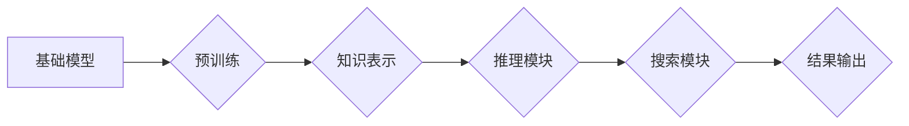

> 基础模型、推理、搜索、知识图谱、Transformer、逻辑推理、检索式QA、生成式QA

## 1. 背景介绍

近年来，深度学习在人工智能领域取得了显著进展，基础模型作为其重要组成部分，展现出强大的泛化能力和适应性。基础模型通常是指在海量数据上预训练的深度神经网络，能够学习到丰富的语义表示和知识结构。随着基础模型的不断发展，其在推理和搜索领域的应用也日益广泛。

传统的推理和搜索方法往往依赖于人工设计的规则和特征工程，难以应对复杂、开放世界的知识推理和信息检索需求。而基础模型凭借其强大的学习能力，能够从海量数据中自动学习推理和搜索的规律，从而实现更智能、更灵活的推理和搜索功能。

## 2. 核心概念与联系

**2.1 基础模型**

基础模型是指在海量数据上预训练的深度神经网络，其核心特点是：

* **规模庞大:** 基础模型通常拥有数亿甚至数十亿个参数，能够学习到更丰富的语义表示和知识结构。
* **泛化能力强:** 在预训练阶段，基础模型学习了大量的通用知识和模式，能够应用于多种下游任务。
* **可微性:** 基础模型是可微的，能够通过反向传播算法进行训练和优化。

**2.2 推理**

推理是指根据已知信息和规则，推导出新的结论或知识的过程。在人工智能领域，推理通常是指机器根据输入的知识和规则，自动生成新的知识或做出决策的过程。

**2.3 搜索**

搜索是指在给定条件下，从大量数据中找到满足特定条件的信息的过程。在人工智能领域，搜索通常是指机器根据用户查询，从海量数据中找到相关信息的过程。

**2.4 知识图谱**

知识图谱是一种结构化的知识表示形式，它将实体和关系以图的形式表示出来。知识图谱能够存储和组织大量的知识，并支持复杂的知识推理和查询。

**2.5 Transformer**

Transformer是一种新型的深度神经网络架构，其核心特点是利用注意力机制，能够捕捉到文本序列中的长距离依赖关系。Transformer在自然语言处理领域取得了显著进展，也为基础模型的推理和搜索能力提供了重要的技术支持。

**2.6 逻辑推理**

逻辑推理是指根据逻辑规则和推理方法，从已知前提推导出新的结论的过程。逻辑推理是人工智能领域的重要研究方向，也是基础模型推理能力的重要组成部分。

**2.7 检索式QA**

检索式问答是指根据用户的问题，从预先准备好的知识库中检索出最相关的答案的过程。

**2.8 生成式QA**

生成式问答是指根据用户的问题，利用语言模型生成新的答案的过程。

**Mermaid 流程图**



## 3. 核心算法原理 & 具体操作步骤

### 3.1 算法原理概述

基础模型的推理和搜索能力主要基于以下核心算法原理：

* **预训练:** 在海量数据上预训练基础模型，学习到丰富的语义表示和知识结构。
* **注意力机制:** 利用注意力机制，捕捉到文本序列中的长距离依赖关系，提高推理和搜索的准确性。
* **知识图谱嵌入:** 将知识图谱中的实体和关系嵌入到向量空间中，方便进行知识推理和搜索。
* **逻辑推理算法:** 利用逻辑推理算法，从已知知识和规则中推导出新的结论。
* **检索算法:** 利用检索算法，从海量数据中找到满足特定条件的信息。

### 3.2 算法步骤详解

**3.2.1 预训练阶段:**

1. 选择合适的预训练数据集，例如文本语料库、知识图谱等。
2. 使用预训练模型架构，例如Transformer，对数据集进行预训练。
3. 通过反向传播算法，优化模型参数，使模型能够学习到丰富的语义表示和知识结构。

**3.2.2 推理阶段:**

1. 将输入的文本或知识表示转换为模型可理解的格式。
2. 利用预训练模型的推理模块，根据输入信息和已知知识，推导出新的结论或知识。
3. 将推理结果转换为人类可理解的格式。

**3.2.3 搜索阶段:**

1. 将用户查询转换为模型可理解的格式。
2. 利用预训练模型的搜索模块，从海量数据中检索出与用户查询相关的文档或信息。
3. 将检索结果排序并返回给用户。

### 3.3 算法优缺点

**优点:**

* 泛化能力强，能够应用于多种下游任务。
* 学习能力强，能够自动学习推理和搜索的规律。
* 效率高，能够处理海量数据。

**缺点:**

* 训练成本高，需要大量的计算资源和数据。
* 可解释性差，难以理解模型的推理过程。
* 容易受到数据偏差的影响。

### 3.4 算法应用领域

基础模型的推理和搜索能力在以下领域具有广泛的应用前景:

* **自然语言理解:** 问答系统、文本摘要、机器翻译等。
* **知识图谱推理:** 知识问答、关系抽取、知识补全等。
* **搜索引擎:** 信息检索、个性化推荐等。
* **人工智能助手:** 智能对话、任务执行等。

## 4. 数学模型和公式 & 详细讲解 & 举例说明

### 4.1 数学模型构建

基础模型的推理和搜索能力可以基于以下数学模型构建:

* **Transformer模型:** Transformer模型利用注意力机制，将文本序列映射到一个隐藏空间，并通过多层编码器和解码器结构进行信息处理。

* **知识图谱嵌入模型:** 知识图谱嵌入模型将实体和关系嵌入到向量空间中，通过计算向量之间的相似度进行知识推理和搜索。

* **逻辑推理模型:** 逻辑推理模型利用逻辑规则和推理算法，从已知知识和规则中推导出新的结论。

### 4.2 公式推导过程

**4.2.1 Transformer模型注意力机制公式:**

$$
Attention(Q, K, V) = \frac{exp(Q \cdot K^T / \sqrt{d_k})}{exp(Q \cdot K^T / \sqrt{d_k})} \cdot V
$$

其中:

* $Q$：查询矩阵
* $K$：键矩阵
* $V$：值矩阵
* $d_k$：键向量的维度

**4.2.2 知识图谱嵌入模型相似度计算公式:**

$$
Sim(e_1, e_2) = \frac{e_1 \cdot e_2}{||e_1|| ||e_2||}
$$

其中:

* $e_1$：实体1的嵌入向量
* $e_2$：实体2的嵌入向量

### 4.3 案例分析与讲解

**4.3.1 Transformer模型在问答系统中的应用:**

Transformer模型可以用于构建问答系统，通过学习文本语义关系，从给定的文本中找到与问题相关的答案。例如，BERT模型在问答任务上取得了显著的成绩，能够准确地理解问题和上下文，并找到最合适的答案。

**4.3.2 知识图谱嵌入模型在知识问答中的应用:**

知识图谱嵌入模型可以用于构建知识问答系统，通过计算实体和关系之间的相似度，回答用户关于知识的疑问。例如，TransE模型可以将实体和关系嵌入到向量空间中，并通过计算向量之间的相似度，回答用户关于实体和关系的疑问。

## 5. 项目实践：代码实例和详细解释说明

### 5.1 开发环境搭建

* Python 3.7+
* PyTorch 1.7+
* CUDA 10.2+

### 5.2 源代码详细实现

```python
# 导入必要的库
import torch
import torch.nn as nn

# 定义一个简单的Transformer模型
class SimpleTransformer(nn.Module):
    def __init__(self, vocab_size, embedding_dim, num_heads, num_layers):
        super(SimpleTransformer, self).__init__()
        self.embedding = nn.Embedding(vocab_size, embedding_dim)
        self.transformer_encoder = nn.TransformerEncoder(nn.TransformerEncoderLayer(embedding_dim, num_heads), num_layers)

    def forward(self, x):
        x = self.embedding(x)
        x = self.transformer_encoder(x)
        return x

# 实例化模型
model = SimpleTransformer(vocab_size=10000, embedding_dim=512, num_heads=8, num_layers=6)

# 定义损失函数和优化器
criterion = nn.CrossEntropyLoss()
optimizer = torch.optim.Adam(model.parameters(), lr=0.001)

# 训练模型
for epoch in range(10):
    # 训练数据
    input_ids = torch.randint(0, 10000, (64, 32))
    # 目标标签
    labels = torch.randint(0, 10000, (64,))
    # 前向传播
    outputs = model(input_ids)
    loss = criterion(outputs.view(-1, 10000), labels.view(-1))
    # 反向传播
    optimizer.zero_grad()
    loss.backward()
    # 更新参数
    optimizer.step()

```

### 5.3 代码解读与分析

* 代码首先定义了一个简单的Transformer模型，包含嵌入层、Transformer编码器等组件。
* 然后定义了损失函数和优化器，并进行模型训练。
* 训练过程包括前向传播、反向传播和参数更新。

### 5.4 运行结果展示

训练完成后，可以将模型应用于实际任务，例如文本分类、问答系统等。

## 6. 实际应用场景

### 6.1 基础模型在问答系统的应用

基础模型在问答系统中可以作为强大的知识库和理解引擎，能够理解用户的问题，并从知识库中找到最相关的答案。例如，Google的BERT模型在问答系统中取得了显著的成绩，能够准确地理解问题和上下文，并找到最合适的答案。

### 6.2 基础模型在搜索引擎中的应用

基础模型可以用于改进搜索引擎的检索效果，能够更好地理解用户查询意图，并返回更相关的搜索结果。例如，微软的Bing搜索引擎利用了基础模型来提高搜索结果的准确性和相关性。

### 6.3 基础模型在聊天机器人中的应用

基础模型可以用于构建更智能的聊天机器人，能够更好地理解用户对话，并提供更自然、更人性化的回复。例如，OpenAI的GPT-3模型可以用于构建聊天机器人，能够进行自然语言对话，并回答用户的问题。

### 6.4 未来应用展望

基础模型在未来将有更广泛的应用前景，例如：

* **个性化推荐:** 基于用户行为和偏好，提供个性化的商品、服务和内容推荐。
* **自动写作:** 自动生成新闻报道、小说、诗歌等文本内容。
* **代码生成:** 自动生成代码，提高软件开发效率。
* **医疗诊断:** 基于患者症状和病史，辅助医生进行诊断。

## 7. 工具和资源推荐

### 7.1 学习资源推荐

* **书籍:**
    * 《深度学习》
    * 《自然语言处理》
    * 《Transformer模型》
* **在线课程:**
    * Coursera: 深度学习
    * Udacity: 自然语言处理
    * fast.ai: 深度学习

### 7.2 开发工具推荐

* **框架:**
    * PyTorch
    * TensorFlow
* **库:**
    * HuggingFace Transformers
    * Gensim
* **平台:**
    * Google Colab
    * Paperspace Gradient

### 7.3 相关论文推荐

* **Attention Is All You Need:** https://arxiv.org/