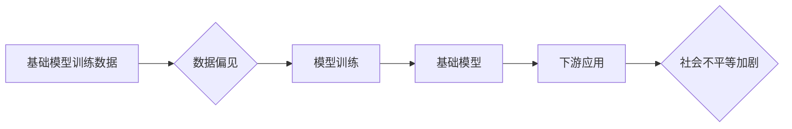

> 基础模型，社会不平等，算法偏见，数据鸿沟，可解释性，公平性，伦理

## 1. 背景介绍

近年来，基础模型（Foundation Models）在人工智能领域取得了令人瞩目的成就。这些模型通常拥有庞大的参数规模和广泛的知识储备，能够在各种下游任务中表现出色，例如自然语言处理、计算机视觉和代码生成。然而，基础模型的快速发展也引发了关于其社会不平等问题的担忧。

社会不平等问题是指基础模型在训练数据和应用场景中可能导致的歧视、偏见和不公平现象。这些问题不仅会影响模型的准确性和可靠性，还会加剧社会中的现有不平等，甚至可能导致新的不平等问题。

## 2. 核心概念与联系

**2.1 基础模型**

基础模型是指在海量数据上预训练的大规模人工智能模型。它们通常具有以下特点：

* **参数规模庞大:** 基础模型拥有数亿甚至数十亿个参数，使其能够学习到复杂的模式和关系。
* **通用性强:** 基础模型可以应用于多种下游任务，例如文本分类、机器翻译和图像识别。
* **可迁移性高:** 基础模型的预训练知识可以迁移到新的任务和领域，降低了模型训练的成本和时间。

**2.2 社会不平等**

社会不平等是指社会成员之间在资源、机会和权利方面的差异。这些差异可以是基于种族、性别、年龄、经济地位或其他社会属性。

**2.3 联系**

基础模型的训练数据通常来自互联网或其他公开数据源，这些数据往往反映了社会中的现有不平等。例如，训练数据中可能存在种族或性别偏见，导致模型在处理与这些属性相关的任务时表现出歧视性。

**2.4 流程图**



## 3. 核心算法原理 & 具体操作步骤

**3.1 算法原理概述**

基础模型的训练通常基于深度学习算法，例如Transformer模型。这些算法通过学习数据中的模式和关系来构建复杂的表示，从而实现各种任务。

**3.2 算法步骤详解**

1. **数据预处理:** 将训练数据清洗、格式化和转换为模型可理解的格式。
2. **模型架构设计:** 选择合适的深度学习模型架构，例如Transformer模型。
3. **模型参数初始化:** 为模型参数赋予初始值。
4. **前向传播:** 将输入数据通过模型进行处理，得到输出结果。
5. **损失函数计算:** 计算模型输出与真实值的差异，即损失值。
6. **反向传播:** 计算损失值对模型参数的梯度。
7. **参数更新:** 使用梯度下降算法更新模型参数，降低损失值。
8. **模型评估:** 使用验证集评估模型的性能，并根据性能调整训练参数。
9. **模型保存:** 保存训练好的模型参数。

**3.3 算法优缺点**

**优点:**

* **性能优异:** 深度学习算法在许多任务中表现出优异的性能。
* **可迁移性强:** 预训练模型可以迁移到新的任务和领域。
* **自动化程度高:** 深度学习模型的训练过程可以高度自动化。

**缺点:**

* **数据依赖性强:** 深度学习模型的性能依赖于训练数据的质量和数量。
* **计算资源消耗大:** 训练大型深度学习模型需要大量的计算资源。
* **可解释性差:** 深度学习模型的决策过程难以理解。

**3.4 算法应用领域**

* 自然语言处理：文本分类、机器翻译、问答系统
* 计算机视觉：图像识别、物体检测、图像生成
* 代码生成：自动代码补全、代码翻译、代码生成

## 4. 数学模型和公式 & 详细讲解 & 举例说明

**4.1 数学模型构建**

基础模型的训练过程可以看作是一个优化问题，目标是找到一组模型参数，使得模型在训练数据上的损失函数最小。

**损失函数:**

$$L(\theta) = \sum_{i=1}^{N} loss(y_i, \hat{y}_i)$$

其中：

* $\theta$ 是模型参数
* $N$ 是训练样本的数量
* $y_i$ 是第 $i$ 个样本的真实值
* $\hat{y}_i$ 是模型预测的第 $i$ 个样本的值
* $loss(y_i, \hat{y}_i)$ 是第 $i$ 个样本的损失函数

**4.2 公式推导过程**

损失函数的最小化可以通过梯度下降算法实现。梯度下降算法的基本思想是迭代地更新模型参数，使得损失函数的值逐渐减小。

**梯度下降算法:**

$$\theta = \theta - \alpha \nabla L(\theta)$$

其中：

* $\alpha$ 是学习率，控制着参数更新的步长
* $\nabla L(\theta)$ 是损失函数对模型参数的梯度

**4.3 案例分析与讲解**

例如，在训练一个图像分类模型时，可以使用交叉熵损失函数来衡量模型预测结果与真实标签之间的差异。

**交叉熵损失函数:**

$$loss(y, \hat{y}) = - \sum_{i=1}^{C} y_i \log(\hat{y}_i)$$

其中：

* $y$ 是真实标签
* $\hat{y}$ 是模型预测的概率分布

## 5. 项目实践：代码实例和详细解释说明

**5.1 开发环境搭建**

* Python 3.7+
* TensorFlow 或 PyTorch
* CUDA 和 cuDNN (可选)

**5.2 源代码详细实现**

```python
import tensorflow as tf

# 定义模型架构
model = tf.keras.models.Sequential([
    tf.keras.layers.Conv2D(32, (3, 3), activation='relu', input_shape=(28, 28, 1)),
    tf.keras.layers.MaxPooling2D((2, 2)),
    tf.keras.layers.Conv2D(64, (3, 3), activation='relu'),
    tf.keras.layers.MaxPooling2D((2, 2)),
    tf.keras.layers.Flatten(),
    tf.keras.layers.Dense(10, activation='softmax')
])

# 定义损失函数和优化器
model.compile(loss='sparse_categorical_crossentropy',
              optimizer='adam',
              metrics=['accuracy'])

# 加载训练数据
(x_train, y_train), (x_test, y_test) = tf.keras.datasets.mnist.load_data()

# 训练模型
model.fit(x_train, y_train, epochs=5)

# 评估模型
loss, accuracy = model.evaluate(x_test, y_test)
print('Test loss:', loss)
print('Test accuracy:', accuracy)
```

**5.3 代码解读与分析**

这段代码实现了使用 TensorFlow 库训练一个简单的图像分类模型。

* 模型架构使用卷积神经网络 (CNN) 来提取图像特征。
* 损失函数使用稀疏类别交叉熵损失函数，用于分类任务。
* 优化器使用 Adam 优化器，用于更新模型参数。
* 训练数据使用 MNIST 手写数字数据集。

**5.4 运行结果展示**

训练完成后，模型可以用来预测新的图像的类别。

## 6. 实际应用场景

基础模型在各个领域都有广泛的应用场景，例如：

* **自然语言处理:**

    * **机器翻译:** 基于基础模型的机器翻译系统可以实现更高效、更准确的翻译。
    * **文本摘要:** 基于基础模型的文本摘要系统可以自动生成文本的简要概述。
    * **对话系统:** 基于基础模型的对话系统可以进行更自然、更流畅的对话。

* **计算机视觉:**

    * **图像识别:** 基于基础模型的图像识别系统可以识别图像中的物体、场景和人物。
    * **目标检测:** 基于基础模型的目标检测系统可以定位图像中的特定物体。
    * **图像生成:** 基于基础模型的图像生成系统可以生成逼真的图像。

* **其他领域:**

    * **代码生成:** 基于基础模型的代码生成系统可以自动生成代码。
    * **药物发现:** 基于基础模型的药物发现系统可以加速药物研发过程。
    * **金融分析:** 基于基础模型的金融分析系统可以进行更准确的风险评估和投资决策。

**6.4 未来应用展望**

随着基础模型的不断发展，其应用场景将更加广泛，例如：

* **个性化教育:** 基于基础模型的个性化教育系统可以根据学生的学习情况提供定制化的学习内容和教学方法。
* **医疗诊断:** 基于基础模型的医疗诊断系统可以辅助医生进行疾病诊断。
* **自动驾驶:** 基于基础模型的自动驾驶系统可以实现更安全、更可靠的自动驾驶功能。

## 7. 工具和资源推荐

**7.1 学习资源推荐**

* **书籍:**
    * Deep Learning by Ian Goodfellow, Yoshua Bengio, and Aaron Courville
    * Hands-On Machine Learning with Scikit-Learn, Keras & TensorFlow by Aurélien Géron
* **在线课程:**
    * TensorFlow Tutorials: https://www.tensorflow.org/tutorials
    * PyTorch Tutorials: https://pytorch.org/tutorials/

**7.2 开发工具推荐**

* **TensorFlow:** https://www.tensorflow.org/
* **PyTorch:** https://pytorch.org/
* **Jupyter Notebook:** https://jupyter.org/

**7.3 相关论文推荐**

* Attention Is All You Need (Vaswani et al., 2017)
* BERT: Pre-training of Deep Bidirectional Transformers for Language Understanding (Devlin et al., 2018)
* GPT-3: Language Models are Few-Shot Learners (Brown et al., 2020)

## 8. 总结：未来发展趋势与挑战

**8.1 研究成果总结**

基础模型在人工智能领域取得了显著的进展，为各种下游任务带来了新的可能性。

**8.2 未来发展趋势**

* **模型规模的进一步扩大:** 预计未来基础模型的规模将继续扩大，从而提升模型的性能和能力。
* **多模态学习:** 基础模型将能够处理多种数据类型，例如文本、图像、音频和视频。
* **可解释性增强:** 研究者将致力于提高基础模型的可解释性，使其决策过程更加透明。

**8.3 面临的挑战**

* **数据偏见:** 基础模型训练数据中的偏见可能会导致模型在某些群体中表现不佳。
* **计算资源消耗:** 训练大型基础模型需要大量的计算资源，这可能会限制其应用范围。
* **伦理问题:** 基础模型的应用可能会引发伦理问题，例如隐私泄露和算法歧视。

**8.4 研究展望**

未来研究将重点关注解决基础模型的社会不平等问题，例如：

* 开发公平的训练算法，减少模型中的偏见。
* 探索新的数据来源，缓解数据鸿沟。
* 加强基础模型的可解释性，提高其透明度和可信度。


## 9. 附录：常见问题与解答

**9.1 如何评估基础模型的公平性？**

可以使用各种公平性评估指标来评估基础模型的公平性，例如：

* 平均差
* 平衡准确率
* 偏见度

**9.2 如何减少基础模型中的数据偏见？**

可以采取以下措施来减少基础模型中的数据偏见：

* 使用更公平的训练数据
* 开发公平的训练算法
* 进行数据增强和样本均衡

**9.3 如何提高基础模型的可解释性？**

可以采用以下方法提高基础模型的可解释性：

* 使用可解释的机器学习模型
* 使用可视化技术解释模型的决策过程
* 开发模型解释工具

作者：禅与计算机程序设计艺术