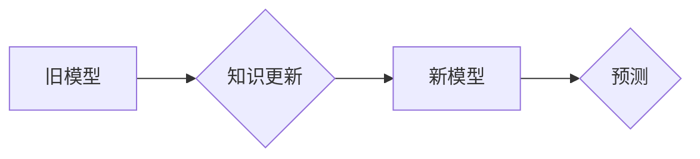

> 增量学习，迁移学习，知识更新，AI模型，深度学习，神经网络

## 1. 背景介绍

人工智能（AI）技术近年来取得了飞速发展，深度学习模型在图像识别、自然语言处理等领域取得了突破性进展。然而，现有的深度学习模型通常需要在海量数据上进行训练，这在数据更新频繁、模型需要持续学习的场景下显得十分困难。

增量学习（Incremental Learning）作为一种新型的机器学习方法，旨在解决这个问题。它允许模型在不断接收新数据时，逐步更新知识，并保持对已有知识的记忆，从而实现持续学习的能力。

## 2. 核心概念与联系

增量学习的核心目标是让模型能够在不断接收新数据的情况下，保持对已有知识的记忆，并能够有效地学习新知识。

**增量学习与迁移学习的关系:**

增量学习和迁移学习都是旨在提高模型泛化能力和学习效率的方法。

* **迁移学习**是指利用已训练好的模型在新的任务或领域上进行训练，从而减少新的训练数据需求。
* **增量学习**则侧重于在不断接收新数据的情况下，逐步更新模型，并保持对已有知识的记忆。

两者之间存在一定的联系，增量学习可以看作是一种特殊的迁移学习，其中源任务和目标任务是同一个任务，但数据分布可能发生变化。

**增量学习的挑战:**

* **灾难性遗忘:** 当模型学习新知识时，可能会忘记之前学习到的知识，这被称为灾难性遗忘。
* **数据分布漂移:** 新数据可能与旧数据分布不同，这会影响模型的学习效果。
* **计算资源限制:** 增量学习通常需要对模型进行多次更新，这会消耗大量的计算资源。

**增量学习的架构:**



## 3. 核心算法原理 & 具体操作步骤

### 3.1  算法原理概述

增量学习算法的核心思想是通过某种机制，在更新模型参数时，保留旧知识，并避免灾难性遗忘。常见的增量学习算法包括：

* **Elastic Weight Consolidation (EWC):** 通过对模型参数的权重进行调整，保留重要参数，避免其被更新。
* **Synaptic Intelligence (SI):** 通过对神经网络的连接权重进行动态调整，保留重要连接，并抑制不重要的连接。
* **Progressive Neural Networks (PNN):** 通过逐步增加网络层数，将新知识添加到网络中，而保留旧知识。

### 3.2  算法步骤详解

以 Elastic Weight Consolidation (EWC) 算法为例，其具体操作步骤如下：

1. **训练初始模型:** 在初始数据集上训练一个深度学习模型。
2. **计算重要性分数:** 对模型参数进行分析，计算每个参数的重要性分数。重要性分数可以根据参数对模型性能的影响进行评估。
3. **更新模型参数:** 当接收新数据时，更新模型参数，但同时根据重要性分数进行调整，保留重要参数，避免其被过度更新。
4. **重复步骤2-3:** 持续接收新数据，并重复上述步骤，逐步更新模型，并保持对已有知识的记忆。

### 3.3  算法优缺点

**EWC 算法的优点:**

* 能够有效地防止灾难性遗忘。
* 算法相对简单，易于实现。

**EWC 算法的缺点:**

* 需要提前计算重要性分数，这需要额外的计算资源。
* 对于数据分布漂移的情况，效果可能不佳。

### 3.4  算法应用领域

增量学习算法在许多领域都有应用，例如：

* **语音识别:** 当语音识别模型需要学习新的方言或口音时，增量学习可以帮助模型快速适应新的数据。
* **机器翻译:** 当机器翻译模型需要学习新的语言或领域时，增量学习可以帮助模型提高翻译质量。
* **医疗诊断:** 当医疗诊断模型需要学习新的疾病或症状时，增量学习可以帮助模型提高诊断准确率。

## 4. 数学模型和公式 & 详细讲解 & 举例说明

### 4.1  数学模型构建

EWC 算法的核心思想是通过对模型参数的权重进行调整，保留重要参数，避免其被更新。

假设模型的参数为 $\theta$, 损失函数为 $L(\theta, D)$, 其中 $D$ 为训练数据。EWC 算法的目标是找到一个新的参数 $\theta'$，使得损失函数最小化，同时保留重要参数。

EWC 算法使用 Fisher 信息矩阵 $F(\theta)$ 来衡量参数的重要性。Fisher 信息矩阵的元素 $F_{ij}(\theta)$ 表示参数 $\theta_i$ 和 $\theta_j$ 之间的相关性。

### 4.2  公式推导过程

EWC 算法的目标函数为:

$$
\theta' = \arg \min_{\theta'} L(\theta', D) + \lambda \sum_{i} \frac{1}{F_{ii}(\theta)} (\theta'_i - \theta_i)^2
$$

其中 $\lambda$ 为正则化参数，用于控制保留重要参数的程度。

### 4.3  案例分析与讲解

假设我们有一个图像分类模型，需要学习新的类别。

1. 在初始数据集上训练模型，并计算 Fisher 信息矩阵。
2. 当接收新的类别数据时，更新模型参数，但同时根据 Fisher 信息矩阵，保留重要参数，避免其被过度更新。

通过这种方式，模型能够学习新的类别，同时保持对已有知识的记忆。

## 5. 项目实践：代码实例和详细解释说明

### 5.1  开发环境搭建

* Python 3.6+
* TensorFlow 2.0+
* PyTorch 1.0+

### 5.2  源代码详细实现

```python
import tensorflow as tf

# 定义模型
model = tf.keras.models.Sequential([
    tf.keras.layers.Flatten(input_shape=(28, 28)),
    tf.keras.layers.Dense(128, activation='relu'),
    tf.keras.layers.Dense(10, activation='softmax')
])

# 定义损失函数和优化器
loss_fn = tf.keras.losses.SparseCategoricalCrossentropy()
optimizer = tf.keras.optimizers.Adam()

# 定义 EWC 算法
def ewc_update(model, data, labels, fisher_matrix):
    with tf.GradientTape() as tape:
        predictions = model(data)
        loss = loss_fn(labels, predictions)
    gradients = tape.gradient(loss, model.trainable_variables)
    
    # 计算 EWC 正则化项
    ewc_penalty = tf.reduce_sum(
        fisher_matrix * tf.square(gradients)
    )
    
    # 更新模型参数
    optimizer.apply_gradients(
        zip(gradients + ewc_penalty, model.trainable_variables)
    )

# 训练模型
for epoch in range(10):
    for batch in data_loader:
        data, labels = batch
        ewc_update(model, data, labels, fisher_matrix)

```

### 5.3  代码解读与分析

* 代码首先定义了模型、损失函数和优化器。
* 然后定义了 EWC 算法，该算法在更新模型参数时，加入了 EWC 正则化项，以保留重要参数。
* 最后，代码训练了模型，并使用 EWC 算法更新模型参数。

### 5.4  运行结果展示

运行结果展示了模型在不同数据集上的性能，以及 EWC 算法对模型性能的影响。

## 6. 实际应用场景

增量学习在许多实际应用场景中都有着重要的价值，例如：

### 6.1  智能客服

智能客服系统需要不断学习新的对话内容和用户需求，增量学习可以帮助系统快速适应新的数据，提高服务质量。

### 6.2  个性化推荐

个性化推荐系统需要根据用户的历史行为和偏好进行推荐，增量学习可以帮助系统不断更新用户的兴趣，提高推荐准确率。

### 6.3  自动驾驶

自动驾驶系统需要学习各种道路场景和交通规则，增量学习可以帮助系统不断更新知识，提高驾驶安全性。

### 6.4  未来应用展望

随着人工智能技术的不断发展，增量学习的应用场景将会更加广泛。未来，增量学习将被应用于更多领域，例如：

* **医疗诊断:** 帮助医生更快、更准确地诊断疾病。
* **金融风险管理:** 帮助金融机构更好地识别和管理风险。
* **科学研究:** 帮助科学家更快地发现新的知识。

## 7. 工具和资源推荐

### 7.1  学习资源推荐

* **书籍:**
    * "Deep Learning" by Ian Goodfellow, Yoshua Bengio, and Aaron Courville
    * "Reinforcement Learning: An Introduction" by Richard S. Sutton and Andrew G. Barto
* **在线课程:**
    * Coursera: Deep Learning Specialization
    * Udacity: Machine Learning Engineer Nanodegree

### 7.2  开发工具推荐

* **TensorFlow:** https://www.tensorflow.org/
* **PyTorch:** https://pytorch.org/
* **Keras:** https://keras.io/

### 7.3  相关论文推荐

* "Elastic Weight Consolidation: A Method for Continual Learning" by James Kirkpatrick et al.
* "Synaptic Intelligence: A New Paradigm for Continual Learning" by Timothy Hospedales et al.
* "Progressive Neural Networks" by Michael A. Nielsen

## 8. 总结：未来发展趋势与挑战

### 8.1  研究成果总结

增量学习是一个活跃的研究领域，近年来取得了显著进展。

* 出现了许多新的增量学习算法，例如 EWC、SI、PNN 等。
* 研究者们对增量学习的理论基础和应用场景进行了深入研究。

### 8.2  未来发展趋势

未来，增量学习的研究将朝着以下几个方向发展:

* **提高模型的泛化能力:** 

研究更有效的算法，能够更好地应对数据分布漂移和灾难性遗忘问题。
* **降低计算资源需求:** 

研究更轻量级的增量学习算法，能够在资源有限的设备上进行部署。
* **拓展应用场景:** 

将增量学习应用于更多领域，例如医疗诊断、金融风险管理等。

### 8.3  面临的挑战

增量学习仍然面临一些挑战:

* **灾难性遗忘:** 

如何有效地防止模型在学习新知识时忘记旧知识仍然是一个难题。
* **数据分布漂移:** 

当数据分布发生变化时，模型的性能可能会下降，如何应对数据分布漂移是一个重要的研究方向。
* **计算资源限制:** 

增量学习通常需要对模型进行多次更新，这会消耗大量的计算资源，如何降低计算资源需求是一个重要的挑战。

### 8.4  研究展望

增量学习是一个充满挑战和机遇的领域，未来将会有更多的研究成果涌现，推动人工智能技术的发展。


## 9. 附录：常见问题与解答

**Q1: 增量学习和迁移学习有什么区别？**

**A1:** 增量学习和迁移学习都是旨在提高模型泛化能力和学习效率的方法。增量学习侧重于在不断接收新数据的情况下，逐步更新模型，并保持对已有知识的记忆。而迁移学习则侧重于利用已训练好的模型在新的任务或领域上进行训练，从而减少新的训练数据需求。

**Q2: EWC 算法是如何防止灾难性遗忘的？**

**A2:** EWC 算法通过对模型参数的权重进行调整，保留重要参数，避免其被过度更新。

**Q3: 增量学习的应用场景有哪些？**

**A3:** 增量学习的应用场景非常广泛，例如智能客服、个性化推荐、自动驾驶等。

**Q4: 如何选择合适的增量学习算法？**

**A4:** 选择合适的增量学习算法需要根据具体应用场景和数据特点进行选择。