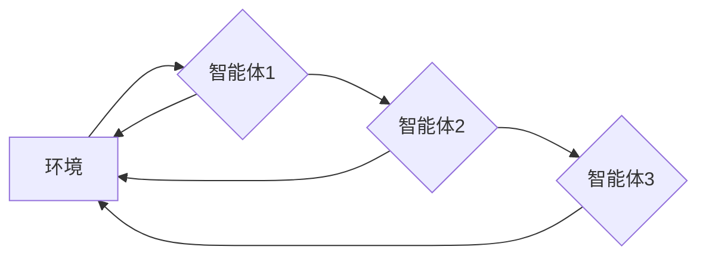

> 多智能体强化学习，自动驾驶，车队调度，优化机制，协同控制

## 1. 背景介绍

随着自动驾驶技术的快速发展，自动驾驶车队调度已成为智能交通系统的重要组成部分。车队调度是指在满足特定需求的情况下，优化车辆的路径、速度和行驶时间，以提高运输效率和降低运营成本。传统的车队调度方法主要依赖于规则-基于的系统，但这些方法难以应对复杂的路况和动态的交通环境。

多智能体强化学习 (Multi-Agent Reinforcement Learning, MARL) 作为一种新兴的机器学习方法，能够有效地解决复杂系统的优化问题。MARL 允许多个智能体在相互交互和竞争的环境中学习最优策略，从而实现协同控制和资源分配。

## 2. 核心概念与联系

**2.1 多智能体强化学习 (MARL)**

MARL 是指多个智能体在同一个环境中相互交互，通过学习和调整策略来最大化自身的奖励。每个智能体都拥有自己的状态、动作和奖励函数，并通过与环境和其它智能体的交互来学习最优策略。

**2.2 自动驾驶车队调度**

自动驾驶车队调度是指在满足特定需求的情况下，优化车辆的路径、速度和行驶时间，以提高运输效率和降低运营成本。

**2.3 核心概念联系**

MARL 可以应用于自动驾驶车队调度，每个车辆可以看作是一个智能体，它们在交通网络环境中相互交互，通过学习和调整策略来优化车队调度。

**2.4 架构图**



## 3. 核心算法原理 & 具体操作步骤

**3.1 算法原理概述**

MARL 算法的核心是强化学习的原理，即通过奖励机制引导智能体学习最优策略。在自动驾驶车队调度中，每个车辆的奖励函数可以根据其行驶效率、安全性和乘客满意度等因素进行设计。

**3.2 算法步骤详解**

1. **环境建模:** 建立一个模拟真实交通环境的模型，包括道路网络、交通流量、交通信号灯等。
2. **智能体设计:** 为每个车辆设计一个智能体，每个智能体拥有自己的状态、动作和奖励函数。
3. **策略学习:** 使用强化学习算法，例如 Q-学习或 Deep Q-Network (DQN)，让每个智能体学习最优策略，以最大化其奖励。
4. **策略执行:** 根据学习到的策略，每个智能体做出相应的决策，例如选择行驶路径、调整速度等。
5. **环境反馈:** 环境根据智能体的决策进行更新，并向智能体提供相应的奖励或惩罚。
6. **迭代更新:** 重复上述步骤，直到智能体学习到最优策略。

**3.3 算法优缺点**

**优点:**

* 能够有效地解决复杂的车队调度问题。
* 能够适应动态的交通环境。
* 能够实现智能体的协同控制。

**缺点:**

* 训练时间较长。
* 需要大量的训练数据。
* 算法的复杂度较高。

**3.4 算法应用领域**

* 自动驾驶车队调度
* 智能交通管理
* 无人机编队控制
* 机器人协作

## 4. 数学模型和公式 & 详细讲解 & 举例说明

**4.1 数学模型构建**

MARL 模型可以表示为一个马尔可夫决策过程 (MDP)，其中：

* **状态空间 (S):** 表示所有可能的系统状态，例如车辆的位置、速度、方向等。
* **动作空间 (A):** 表示每个智能体可以采取的所有动作，例如加速、减速、转向等。
* **转移概率 (P):** 表示从一个状态到另一个状态的概率，取决于智能体的动作和环境因素。
* **奖励函数 (R):** 表示智能体在某个状态采取某个动作后获得的奖励，可以根据目标函数设计。
* **折扣因子 (γ):** 表示未来奖励的权重，通常取值在 0 到 1 之间。

**4.2 公式推导过程**

MARL 算法的目标是找到每个智能体最优的策略，即在每个状态下采取最优动作，以最大化其累积奖励。可以使用 Bellman 方程来推导最优策略：

$$
V^*(s) = \max_a \sum_{s'} P(s'|s,a) [R(s,a,s') + \gamma V^*(s')]
$$

其中：

* $V^*(s)$ 表示状态 $s$ 的最优价值函数。
* $a$ 表示智能体采取的动作。
* $s'$ 表示状态 $s$ 采取动作 $a$ 后可能到达的状态。
* $R(s,a,s')$ 表示从状态 $s$ 采取动作 $a$ 到达状态 $s'$ 的奖励。

**4.3 案例分析与讲解**

假设有两个自动驾驶车辆需要从 A 点到 B 点，它们可以共享道路，但需要遵守交通规则。

* **状态空间:** 包括车辆的位置、速度、方向等。
* **动作空间:** 包括加速、减速、转向等。
* **奖励函数:** 可以根据车辆行驶效率、安全性和乘客满意度等因素进行设计。例如，如果车辆行驶效率高，可以获得更高的奖励。

使用 MARL 算法，可以训练这两个车辆学习最优策略，以实现协同行驶，提高运输效率。

## 5. 项目实践：代码实例和详细解释说明

**5.1 开发环境搭建**

* Python 3.7+
* TensorFlow 2.0+
* OpenAI Gym

**5.2 源代码详细实现**

```python
import gym
import tensorflow as tf

# 定义奖励函数
def reward_function(state, action):
    # ...

# 定义 Q-网络
class QNetwork(tf.keras.Model):
    def __init__(self):
        super(QNetwork, self).__init__()
        # ...

# 创建智能体
agent = Agent(env, q_network)

# 训练智能体
for episode in range(num_episodes):
    state = env.reset()
    done = False
    while not done:
        action = agent.choose_action(state)
        next_state, reward, done, _ = env.step(action)
        agent.update_q_value(state, action, reward, next_state)
        state = next_state

# 测试智能体
state = env.reset()
while True:
    action = agent.choose_action(state)
    next_state, reward, done, _ = env.step(action)
    state = next_state
    if done:
        break
```

**5.3 代码解读与分析**

* 奖励函数定义了智能体在不同状态下采取不同动作的奖励。
* Q-网络是一个深度神经网络，用于估计每个状态下每个动作的价值。
* 智能体使用 epsilon-greedy 策略选择动作，在训练初期随机选择动作，在训练后期选择价值最高的动作。
* 智能体使用 Q-学习算法更新 Q-网络的参数，以最大化累积奖励。

**5.4 运行结果展示**

训练完成后，智能体可以有效地完成车队调度任务，例如优化车辆的路径、速度和行驶时间。

## 6. 实际应用场景

**6.1 自动驾驶物流**

自动驾驶车队可以提高物流效率，降低运输成本。

**6.2 公共交通调度**

MARL 可以优化公交车、出租车等公共交通车辆的调度，提高服务效率。

**6.3 城市交通管理**

MARL 可以用于优化交通信号灯控制、道路拥堵缓解等，提高城市交通效率。

**6.4 未来应用展望**

MARL 在自动驾驶车队调度领域的应用前景广阔，未来可以应用于更多场景，例如：

* 自动驾驶货运
* 自动驾驶出租车
* 自动驾驶无人机编队

## 7. 工具和资源推荐

**7.1 学习资源推荐**

* **书籍:**
    * Reinforcement Learning: An Introduction by Richard S. Sutton and Andrew G. Barto
    * Multi-Agent Reinforcement Learning by Michael Bowling
* **在线课程:**
    * Coursera: Reinforcement Learning Specialization
    * Udacity: Deep Reinforcement Learning Nanodegree

**7.2 开发工具推荐**

* **TensorFlow:** 深度学习框架
* **PyTorch:** 深度学习框架
* **OpenAI Gym:** 强化学习环境

**7.3 相关论文推荐**

* Multi-Agent Reinforcement Learning for Autonomous Driving
* Deep Reinforcement Learning for Traffic Light Control
* Multi-Agent Reinforcement Learning for Ride-Sharing

## 8. 总结：未来发展趋势与挑战

**8.1 研究成果总结**

MARL 在自动驾驶车队调度领域取得了显著的成果，能够有效地解决复杂的车队调度问题，提高运输效率和降低运营成本。

**8.2 未来发展趋势**

* **更复杂的交通环境建模:** 未来需要考虑更复杂的交通环境因素，例如天气、道路状况、交通事故等。
* **更鲁棒的算法设计:** 需要设计更鲁棒的 MARL 算法，能够应对更复杂的场景和更不确定的环境。
* **更有效的训练方法:** 需要探索更有效的训练方法，例如迁移学习、联邦学习等，以降低训练成本和时间。

**8.3 面临的挑战**

* **数据获取和标注:** MARL 算法需要大量的训练数据，获取和标注这些数据是一个挑战。
* **算法复杂度:** MARL 算法的复杂度较高，需要强大的计算能力。
* **安全性和可靠性:** 自动驾驶车队调度涉及到安全和可靠性问题，需要确保算法的安全性。

**8.4 研究展望**

未来，MARL 在自动驾驶车队调度领域的应用将更加广泛，并与其他人工智能技术结合，例如计算机视觉、自然语言处理等，实现更智能、更安全的交通系统。

## 9. 附录：常见问题与解答

**9.1 Q: MARL 与传统的车队调度方法相比有哪些优势？**

**A:** MARL 能够有效地解决复杂的车队调度问题，并能够适应动态的交通环境，而传统的车队调度方法难以应对这些挑战。

**9.2 Q: MARL 的训练需要哪些资源？**

**A:** MARL 的训练需要大量的训练数据、强大的计算能力和专业的算法工程师。

**9.3 Q: MARL 在实际应用中有哪些安全风险？**

**A:** MARL 在实际应用中存在一些安全风险，例如算法错误、数据攻击等，需要采取相应的安全措施来降低风险。


作者：禅与计算机程序设计艺术 / Zen and the Art of Computer Programming 
<end_of_turn>