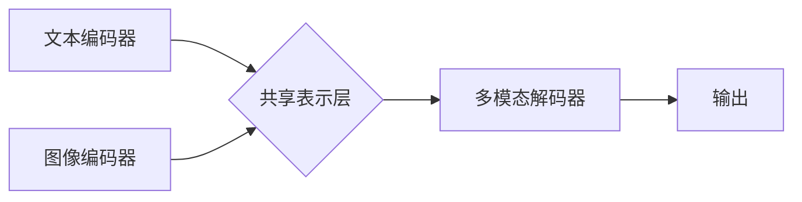

> 多模态大模型，GPT技术，自然语言处理，计算机视觉，深度学习，Transformer，文本生成，图像生成

## 1. 背景介绍

近年来，人工智能（AI）技术取得了飞速发展，其中大模型在自然语言处理（NLP）、计算机视觉（CV）等领域展现出强大的应用潜力。多模态大模型作为一种融合文本、图像、音频等多种模态信息的智能模型，成为AI领域的研究热点。

传统的单模态大模型只能处理单一类型的数据，例如只能处理文本或图像。而多模态大模型能够跨模态学习，理解和生成不同类型的数据，从而实现更智能、更全面的应用。例如，一个多模态大模型可以理解图像中的文本信息，生成与图像相关的文本描述；也可以根据文本指令生成相应的图像。

## 2. 核心概念与联系

多模态大模型的核心概念是融合不同模态数据，学习跨模态的表示和关系。

**2.1 多模态数据**

多模态数据是指包含多种不同类型信息的集合，例如文本、图像、音频、视频等。

**2.2 跨模态学习**

跨模态学习是指学习不同模态数据之间的关系和映射，从而实现跨模态的理解和生成。

**2.3 多模态表示**

多模态表示是指将不同模态数据映射到一个统一的表示空间，以便进行跨模态的交互和操作。

**2.4 多模态模型架构**

多模态模型通常由多个子模型组成，每个子模型负责处理一种特定的模态数据。这些子模型通过共享的表示层或注意力机制进行交互，学习跨模态的表示和关系。



## 3. 核心算法原理 & 具体操作步骤

### 3.1  算法原理概述

多模态大模型的训练主要基于深度学习算法，例如Transformer网络。Transformer网络通过自注意力机制学习序列数据的长程依赖关系，能够有效地处理文本和图像等序列数据。

### 3.2  算法步骤详解

1. **数据预处理:** 将多模态数据进行预处理，例如文本分词、图像裁剪、音频降噪等。
2. **模态编码:** 使用不同的编码器对每个模态数据进行编码，例如使用BERT模型对文本进行编码，使用ResNet模型对图像进行编码。
3. **跨模态交互:** 使用共享表示层或注意力机制将不同模态的编码结果进行交互，学习跨模态的表示。
4. **多模态解码:** 使用解码器将多模态表示转换为最终输出，例如生成文本描述、图像分类等。
5. **模型训练:** 使用交叉熵损失函数对模型进行训练，优化模型参数。

### 3.3  算法优缺点

**优点:**

* 能够处理多种模态数据，学习更丰富的语义信息。
* 跨模态学习能力强，能够理解和生成不同类型的数据。
* 应用场景广泛，例如图像字幕生成、文本到图像合成、多模态问答等。

**缺点:**

* 数据集规模大，训练成本高。
* 模型复杂度高，推理速度慢。
* 跨模态学习仍然存在挑战，例如模态间语义对齐问题。

### 3.4  算法应用领域

多模态大模型在以下领域具有广泛的应用前景：

* **计算机视觉:** 图像字幕生成、文本到图像合成、图像检索、目标检测等。
* **自然语言处理:** 多模态问答、情感分析、文本摘要等。
* **人机交互:** 语音助手、虚拟助手、增强现实等。
* **医疗保健:** 病理图像分析、疾病诊断、药物研发等。

## 4. 数学模型和公式 & 详细讲解 & 举例说明

### 4.1  数学模型构建

多模态大模型的数学模型通常基于深度学习框架，例如TensorFlow或PyTorch。模型结构通常由多个层组成，例如编码器、解码器、注意力机制等。

### 4.2  公式推导过程

多模态大模型的训练目标通常是最大化似然函数，即预测真实数据的概率。

$$
\mathcal{L} = -\sum_{i=1}^{N} \log p(y_i | x_i)
$$

其中，$\mathcal{L}$ 是损失函数，$N$ 是样本数量，$x_i$ 是输入数据，$y_i$ 是真实标签。

### 4.3  案例分析与讲解

例如，在图像字幕生成任务中，多模态大模型需要学习图像和文本之间的关系，并生成与图像相关的文本描述。

假设图像特征为$v_i$，文本特征为$w_j$，则模型可以学习图像和文本之间的相似度：

$$
s_{ij} = \text{sim}(v_i, w_j)
$$

其中，$\text{sim}$ 是相似度函数，例如余弦相似度。

然后，模型可以根据相似度生成文本描述：

$$
p(y_i | x_i) = \sum_{j=1}^{M} s_{ij} p(w_j)
$$

其中，$M$ 是文本词汇表大小，$p(w_j)$ 是词汇的概率分布。

## 5. 项目实践：代码实例和详细解释说明

### 5.1  开发环境搭建

使用Python语言开发多模态大模型，需要安装以下库：

* TensorFlow或PyTorch
* OpenCV
* PIL

### 5.2  源代码详细实现

以下是一个简单的图像字幕生成代码示例，使用TensorFlow框架实现：

```python
import tensorflow as tf

# 定义图像编码器模型
image_encoder = tf.keras.Sequential([
    tf.keras.layers.Conv2D(32, (3, 3), activation='relu'),
    tf.keras.layers.MaxPooling2D((2, 2)),
    tf.keras.layers.Conv2D(64, (3, 3), activation='relu'),
    tf.keras.layers.MaxPooling2D((2, 2)),
    tf.keras.layers.Flatten(),
    tf.keras.layers.Dense(128, activation='relu')
])

# 定义文本解码器模型
text_decoder = tf.keras.Sequential([
    tf.keras.layers.Embedding(vocab_size, embedding_dim),
    tf.keras.layers.LSTM(128),
    tf.keras.layers.Dense(vocab_size, activation='softmax')
])

# 定义多模态模型
model = tf.keras.Model(inputs=[image_input, text_input], outputs=text_output)

# 训练模型
model.compile(optimizer='adam', loss='sparse_categorical_crossentropy', metrics=['accuracy'])
model.fit(train_data, epochs=10)

```

### 5.3  代码解读与分析

代码示例展示了多模态大模型的基本结构和训练流程。

* 图像编码器和文本解码器分别负责处理图像和文本数据。
* 多模态模型将图像和文本编码结果进行融合，生成文本描述。
* 模型使用交叉熵损失函数进行训练，优化模型参数。

### 5.4  运行结果展示

训练完成后，可以将模型应用于新的图像数据，生成相应的文本描述。

## 6. 实际应用场景

### 6.1  图像字幕生成

多模态大模型可以自动生成图像的文本描述，用于辅助视障人士理解图像内容，或者用于图像搜索和检索。

### 6.2  文本到图像合成

多模态大模型可以根据文本指令生成相应的图像，例如根据文本描述生成人物画像，或者根据故事内容生成场景图像。

### 6.3  多模态问答

多模态大模型可以理解文本和图像中的信息，并回答与之相关的问答问题，例如根据图像和文本回答关于场景描述的问题。

### 6.4  未来应用展望

多模态大模型在未来将有更广泛的应用场景，例如：

* **虚拟现实和增强现实:** 创建更沉浸式的虚拟体验，例如根据用户动作生成相应的虚拟场景。
* **教育和培训:** 提供更生动的学习体验，例如通过图像和视频讲解知识点。
* **医疗保健:** 辅助医生诊断疾病，例如根据病理图像生成诊断报告。

## 7. 工具和资源推荐

### 7.1  学习资源推荐

* **书籍:**
    * 《深度学习》
    * 《自然语言处理》
    * 《计算机视觉》
* **在线课程:**
    * Coursera
    * edX
    * Udacity

### 7.2  开发工具推荐

* **TensorFlow:** 开源深度学习框架
* **PyTorch:** 开源深度学习框架
* **OpenCV:** 图像处理库
* **PIL:** 图像处理库

### 7.3  相关论文推荐

* **BERT:** Devlin et al. (2018)
* **GPT:** Radford et al. (2019)
* **Vision Transformer (ViT):** Dosovitskiy et al. (2020)

## 8. 总结：未来发展趋势与挑战

### 8.1  研究成果总结

多模态大模型在图像字幕生成、文本到图像合成、多模态问答等领域取得了显著成果，展现出强大的应用潜力。

### 8.2  未来发展趋势

* **模型规模和能力提升:** 未来多模态大模型将拥有更大的规模和更强的能力，能够处理更复杂的多模态数据。
* **跨模态理解和生成能力增强:** 未来多模态大模型将更加深入地理解和生成不同模态数据之间的关系，实现更智能的跨模态交互。
* **应用场景拓展:** 多模态大模型将应用于更多领域，例如虚拟现实、增强现实、教育、医疗保健等。

### 8.3  面临的挑战

* **数据获取和标注:** 多模态数据的获取和标注成本高，需要开发更有效的标注方法。
* **模型训练和推理效率:** 多模态大模型的训练和推理效率仍然较低，需要开发更有效的算法和硬件加速技术。
* **伦理和安全问题:** 多模态大模型的应用可能带来伦理和安全问题，例如数据隐私、算法偏见等，需要制定相应的规范和政策。

### 8.4  研究展望

未来，多模态大模型的研究将继续深入，探索更有效的模型架构、训练方法和应用场景，为人工智能的智能化发展做出更大的贡献。

## 9. 附录：常见问题与解答

### 9.1  多模态大模型与单模态大模型的区别？

多模态大模型能够处理多种模态数据，学习跨模态的表示和关系，而单模态大模型只能处理单一类型的数据。

### 9.2  多模态大模型的训练数据有哪些？

多模态大模型的训练数据通常包含文本、图像、音频等多种模态数据，例如ImageNet、Flickr30k、COCO等数据集。

### 9.3  多模态大模型的应用场景有哪些？

多模态大模型的应用场景广泛，例如图像字幕生成、文本到图像合成、多模态问答、虚拟现实、增强现实等。


作者：禅与计算机程序设计艺术 / Zen and the Art of Computer Programming 
<end_of_turn>