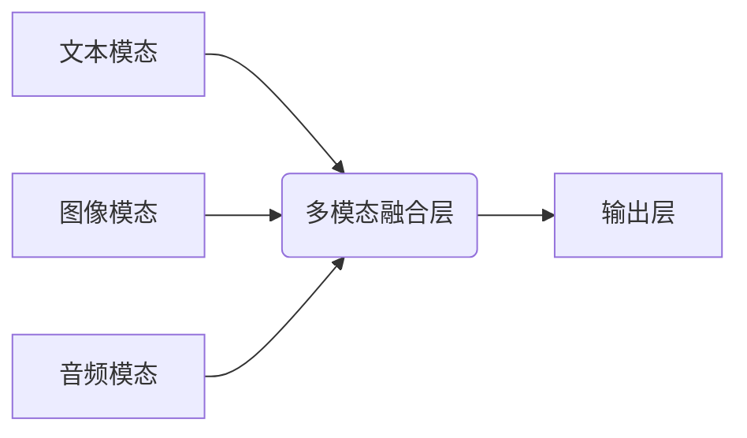

> 多模态大模型、自然语言处理、计算机视觉、音频处理、多模态融合、Transformer、BERT、GPT、DALL-E、Stable Diffusion

## 1. 背景介绍

近年来，人工智能（AI）技术取得了飞速发展，其中大模型在自然语言处理（NLP）、计算机视觉（CV）等领域展现出强大的能力。然而，现实世界的信息往往是多模态的，例如文本、图像、音频、视频等多种形式的混合。单模态模型难以捕捉多模态信息之间的复杂关系，因此，多模态大模型应运而生。

多模态大模型是指能够处理多种模态数据并进行理解、生成和推理的强大AI模型。它融合了不同模态的知识和信息，从而能够更好地理解和生成人类语言、图像、音频等复杂信息。

## 2. 核心概念与联系

多模态大模型的核心概念包括：

* **模态:** 指不同形式的信息表示，例如文本、图像、音频、视频等。
* **多模态融合:** 指将不同模态的数据进行有效地结合，提取其潜在的关联性和语义信息。
* **跨模态学习:** 指模型能够在不同模态之间进行知识迁移和泛化，例如利用文本信息理解图像内容，或利用图像信息生成文本描述。

**多模态大模型架构**



## 3. 核心算法原理 & 具体操作步骤

### 3.1  算法原理概述

多模态大模型的训练主要基于深度学习算法，其中Transformer模型及其变体在多模态学习中取得了显著成果。Transformer模型利用自注意力机制，能够捕捉不同模态数据之间的长距离依赖关系，并进行有效的融合。

### 3.2  算法步骤详解

1. **数据预处理:** 将不同模态的数据进行预处理，例如文本分词、图像裁剪、音频降噪等。
2. **特征提取:** 使用预训练的模型或专门设计的网络结构，从不同模态数据中提取特征表示。
3. **多模态融合:** 将不同模态的特征进行融合，可以使用注意力机制、拼接操作、交叉注意力等方法。
4. **模型训练:** 使用交叉熵损失函数等损失函数，对多模态大模型进行训练，使其能够准确地理解和生成多模态数据。
5. **模型评估:** 使用标准数据集和指标，评估多模态大模型的性能，例如准确率、召回率、F1-score等。

### 3.3  算法优缺点

**优点:**

* 能够处理多种模态数据，捕捉复杂的多模态关系。
* 性能优于单模态模型，在多模态任务中表现更出色。
* 可进行跨模态学习，提升模型的泛化能力。

**缺点:**

* 训练数据量大，计算资源需求高。
* 模型复杂度高，训练和推理时间长。
* 跨模态融合方法尚待完善，存在一定的挑战。

### 3.4  算法应用领域

多模态大模型在多个领域具有广泛的应用前景，例如：

* **图像字幕生成:** 将图像转换为文本描述。
* **视频理解:** 理解视频内容，例如动作识别、事件检测等。
* **文本到图像生成:** 根据文本描述生成图像。
* **多模态问答:** 回答基于文本、图像、音频等多模态数据的问答。
* **医疗诊断:** 利用医学图像和病历信息进行诊断。

## 4. 数学模型和公式 & 详细讲解 & 举例说明

### 4.1  数学模型构建

多模态大模型通常采用 Transformer 模型架构，其核心是自注意力机制。

**自注意力机制**

自注意力机制能够捕捉序列中不同元素之间的依赖关系，并赋予每个元素不同的权重。其计算公式如下：

$$
Attention(Q, K, V) = softmax(\frac{QK^T}{\sqrt{d_k}})V
$$

其中：

* $Q$：查询矩阵
* $K$：键矩阵
* $V$：值矩阵
* $d_k$：键向量的维度
* $softmax$：softmax 函数

### 4.2  公式推导过程

自注意力机制的计算过程可以分为以下步骤：

1. 计算查询矩阵 $Q$、键矩阵 $K$ 和值矩阵 $V$。
2. 计算 $QK^T$ 的每个元素，并进行归一化。
3. 应用 softmax 函数，得到每个元素的权重。
4. 将权重与值矩阵 $V$ 进行加权求和，得到最终的输出。

### 4.3  案例分析与讲解

例如，在图像字幕生成任务中，可以将图像特征作为查询矩阵 $Q$，文本特征作为键矩阵 $K$，文本词嵌入作为值矩阵 $V$。通过自注意力机制，模型可以学习到图像和文本之间的关系，并生成准确的字幕。

## 5. 项目实践：代码实例和详细解释说明

### 5.1  开发环境搭建

* Python 3.7+
* PyTorch 1.7+
* CUDA 10.2+

### 5.2  源代码详细实现

```python
import torch
import torch.nn as nn

class MultiModalFusionLayer(nn.Module):
    def __init__(self, text_dim, image_dim):
        super(MultiModalFusionLayer, self).__init__()
        self.text_embedding = nn.Linear(text_dim, 512)
        self.image_embedding = nn.Linear(image_dim, 512)
        self.attention = nn.MultiheadAttention(512, 8)

    def forward(self, text_features, image_features):
        text_features = self.text_embedding(text_features)
        image_features = self.image_embedding(image_features)
        
        # Concatenate text and image features
        combined_features = torch.cat((text_features, image_features), dim=1)
        
        # Apply multi-head attention
        output, _ = self.attention(combined_features, combined_features, combined_features)
        
        return output
```

### 5.3  代码解读与分析

* `MultiModalFusionLayer` 类定义了一个多模态融合层。
* `text_embedding` 和 `image_embedding` 是用于将文本和图像特征映射到相同的维度空间的线性层。
* `attention` 是一个多头注意力机制，用于学习文本和图像之间的关系。
* `forward` 方法将文本和图像特征作为输入，并返回融合后的特征。

### 5.4  运行结果展示

运行上述代码，可以将文本和图像特征进行融合，并得到融合后的特征向量。

## 6. 实际应用场景

### 6.1  图像字幕生成

多模态大模型可以将图像转换为文本描述，例如将一张图片描述为“一只金毛犬在公园里玩耍”。

### 6.2  视频理解

多模态大模型可以理解视频内容，例如识别视频中的动作、事件和人物。

### 6.3  文本到图像生成

多模态大模型可以根据文本描述生成图像，例如根据文本“一只戴着眼镜的猫”生成一张相应的图像。

### 6.4  未来应用展望

多模态大模型在未来将有更广泛的应用，例如：

* **增强现实 (AR) 和虚拟现实 (VR):** 提供更沉浸式的体验，例如在 AR 应用中，可以根据用户的语音指令生成虚拟物体。
* **个性化教育:** 根据学生的学习风格和需求，提供个性化的学习内容和辅导。
* **医疗诊断:** 利用多模态数据，提高医疗诊断的准确性和效率。

## 7. 工具和资源推荐

### 7.1  学习资源推荐

* **论文:**
    * “BERT: Pre-training of Deep Bidirectional Transformers for Language Understanding”
    * “GPT-3: Language Models are Few-Shot Learners”
    * “DALL-E: Creating Images from Text”
* **博客:**
    * The Illustrated Transformer
    * Jay Alammar’s Blog

### 7.2  开发工具推荐

* **PyTorch:** 深度学习框架
* **TensorFlow:** 深度学习框架
* **Hugging Face Transformers:** 预训练模型库

### 7.3  相关论文推荐

* **多模态学习:**
    * “Multimodal Learning with Deep Neural Networks”
    * “A Survey on Multimodal Learning”
* **Transformer模型:**
    * “Attention Is All You Need”
    * “BERT: Pre-training of Deep Bidirectional Transformers for Language Understanding”

## 8. 总结：未来发展趋势与挑战

### 8.1  研究成果总结

近年来，多模态大模型取得了显著进展，在图像字幕生成、视频理解、文本到图像生成等任务中取得了优异的性能。

### 8.2  未来发展趋势

* **模型规模和能力的提升:** 未来将会有更大规模、更强大的多模态大模型出现。
* **跨模态知识迁移:** 研究如何更好地进行跨模态知识迁移，提升模型的泛化能力。
* **多模态数据生成:** 研究如何生成高质量的多模态数据，以支持模型的训练和发展。

### 8.3  面临的挑战

* **数据标注成本高:** 多模态数据的标注成本较高，需要开发更有效的标注方法。
* **模型训练复杂度高:** 多模态大模型的训练复杂度高，需要更强大的计算资源。
* **伦理和安全问题:** 多模态大模型的应用可能带来伦理和安全问题，需要进行深入研究和探讨。

### 8.4  研究展望

未来，多模态大模型将继续朝着更强大、更智能的方向发展，并在更多领域发挥重要作用。

## 9. 附录：常见问题与解答

* **Q: 多模态大模型与单模态模型相比有什么优势？**

* **A:** 多模态大模型能够处理多种模态数据，捕捉复杂的多模态关系，性能优于单模态模型。

* **Q: 如何训练多模态大模型？**

* **A:** 多模态大模型的训练主要基于深度学习算法，例如 Transformer 模型。需要使用大量的多模态数据进行训练。

* **Q: 多模态大模型有哪些应用场景？**

* **A:** 多模态大模型在图像字幕生成、视频理解、文本到图像生成等多个领域具有广泛的应用前景。


作者：禅与计算机程序设计艺术 / Zen and the Art of Computer Programming 
<end_of_turn>