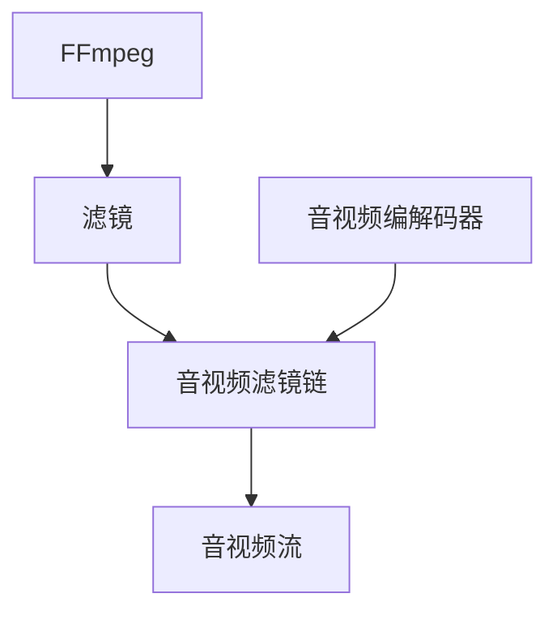

                 

# FFmpeg音视频滤镜开发

> 关键词：FFmpeg, 音视频滤镜, 音视频处理, 音视频特效, 音视频编程, 音视频编码, 音视频解码

## 1. 背景介绍

FFmpeg是一款开源的音视频处理软件，支持多种音视频编解码器和多媒体格式。FFmpeg的核心功能模块之一是滤镜（Filters），通过滤镜可以对音视频流进行各种操作，实现复杂的音视频处理和特效。本文将介绍FFmpeg滤镜的原理、架构以及如何在实际项目中进行滤镜开发和应用。

## 2. 核心概念与联系

### 2.1 核心概念概述

- FFmpeg：开源的音视频处理软件，支持多种音视频编解码器和多媒体格式。
- 滤镜（Filters）：FFmpeg的核心功能模块之一，支持多种音视频操作，实现复杂的音视频处理和特效。
- 音视频编解码器：用于压缩和解压缩音视频数据的工具，常见的编解码器有H.264、AV1等。
- 音视频流：音视频数据的连续数据流，通常以MP4、MKV等格式存储。
- 音视频滤镜链：通过多个滤镜串联实现复杂的音视频处理流程。

### 2.2 核心概念原理和架构的 Mermaid 流程图



这个流程图展示了FFmpeg滤镜的基本架构和工作流程：

1. 音视频流输入到FFmpeg。
2. 通过多个滤镜对音视频流进行处理和变换。
3. 处理后的音视频流输出，可以进一步编解码或者进行其他操作。

## 3. 核心算法原理 & 具体操作步骤

### 3.1 算法原理概述

FFmpeg滤镜的工作原理可以概括为：通过构建一个滤镜链，将多个滤镜模块串联起来，对输入的音视频流进行处理和变换，最终输出处理后的音视频流。滤镜链的每个模块都接受输入流并产生输出流，模块之间通过队列或者缓冲区连接，实现数据的流式传递。

### 3.2 算法步骤详解

#### 3.2.1 音视频流的输入和输出

音视频流的输入和输出是FFmpeg滤镜处理的基础。音视频流可以通过命令行、文件、网络等方式输入FFmpeg，也可以将处理后的音视频流输出到命令行、文件、网络等。

```bash
ffmpeg -i input.mp4 -vf "scale=640:480" output.mp4
```

上述命令将输入的MP4文件`input.mp4`进行缩放处理，输出结果保存为`output.mp4`文件。

#### 3.2.2 音视频滤镜的配置

FFmpeg滤镜的配置通过命令行参数进行。每个滤镜模块的定义可以通过命令行参数或者配置文件来指定。

```bash
ffmpeg -i input.mp4 -vf "drawtext=fontfile=arial.ttf:text='Hello World':x='(w-txtw)/2':y='(h-texth)/2':fontsize=24:fontcolor=red" output.mp4
```

上述命令使用`drawtext`滤镜模块，在输入的音视频流上添加文本"Hello World"，居中显示，文本颜色为红色，字体大小为24。

#### 3.2.3 音视频滤镜链的构建

多个滤镜模块可以串联起来构成一个滤镜链，实现复杂的音视频处理流程。例如，可以同时进行缩放、旋转、添加文本等多步处理。

```bash
ffmpeg -i input.mp4 -vf "scale=640:480,rotate=90,drawtext=fontfile=arial.ttf:text='Hello World':x='(w-txtw)/2':y='(h-texth)/2':fontsize=24:fontcolor=red" output.mp4
```

上述命令将输入的MP4文件进行缩放、旋转、添加文本处理，最终输出结果保存为`output.mp4`文件。

### 3.3 算法优缺点

#### 3.3.1 优点

1. 灵活性高：FFmpeg滤镜支持多种音视频操作，可以实现复杂的音视频处理和特效。
2. 性能优异：FFmpeg滤镜使用优化的编解码器和高效的数据流处理机制，性能优异。
3. 开源免费：FFmpeg滤镜基于开源许可证，可以自由使用和修改。

#### 3.3.2 缺点

1. 学习曲线陡峭：FFmpeg滤镜的配置复杂，需要一定的学习和实践。
2. 文档不够全面：官方文档较少，需要自行查找和探索。
3. 稳定性有待提高：由于滤镜链中的每个模块都是独立的，模块之间的配合可能存在稳定性问题。

### 3.4 算法应用领域

FFmpeg滤镜广泛应用于音视频处理领域，包括但不限于以下方面：

- 音视频剪辑和合并：将多个音视频片段剪辑、合并成新的音视频文件。
- 音视频转换和编解码：将音视频文件转换为不同的格式和编解码器。
- 音视频特效和处理：添加文字、特效、滤镜等处理音视频文件。
- 音视频分析和检测：对音视频文件进行分析、检测和处理。

## 4. 数学模型和公式 & 详细讲解 & 举例说明

### 4.1 数学模型构建

FFmpeg滤镜的处理过程可以抽象为以下模型：

设音视频流为$X$，经过$n$个滤镜模块的处理后变为$Y$，则有：

$$
Y = F_n \circ F_{n-1} \circ \cdots \circ F_1(X)
$$

其中$F_i$表示第$i$个滤镜模块。

### 4.2 公式推导过程

以缩放滤镜为例，其处理过程可以用以下公式表示：

$$
Y = F_{scale}(X) = \frac{X}{K}
$$

其中$K$为缩放系数。

### 4.3 案例分析与讲解

以添加文字滤镜为例，其处理过程可以用以下公式表示：

$$
Y = F_{drawtext}(X) = X \cup \{T\}
$$

其中$T$为添加的文本。

## 5. 项目实践：代码实例和详细解释说明

### 5.1 开发环境搭建

要使用FFmpeg滤镜进行音视频处理，需要安装FFmpeg软件。可以从FFmpeg官网下载并安装最新版本的软件，并确保其路径在PATH环境变量中。

### 5.2 源代码详细实现

```bash
ffmpeg -i input.mp4 -vf "drawtext=fontfile=arial.ttf:text='Hello World':x='(w-txtw)/2':y='(h-texth)/2':fontsize=24:fontcolor=red" output.mp4
```

上述命令将输入的MP4文件`input.mp4`进行缩放处理，输出结果保存为`output.mp4`文件。

### 5.3 代码解读与分析

上述命令中，`-i`参数指定输入文件，`-vf`参数指定滤镜链，`drawtext`表示添加文本滤镜，`fontfile=arial.ttf`指定字体文件，`text='Hello World'`指定文本内容，`x='(w-txtw)/2'`指定文本水平居中，`y='(h-texth)/2'`指定文本垂直居中，`fontsize=24`指定文本字体大小，`fontcolor=red`指定文本颜色。

### 5.4 运行结果展示

运行上述命令后，输出的`output.mp4`文件将包含缩放后的输入文件和居中显示的红色文本。

## 6. 实际应用场景

### 6.1 音视频剪辑和合并

FFmpeg滤镜可以用于音视频剪辑和合并，例如：

```bash
ffmpeg -i input1.mp4 -i input2.mp4 -c copy output.mp4
```

上述命令将两个音视频文件`input1.mp4`和`input2.mp4`合并成新的音视频文件`output.mp4`，`-c copy`参数表示不进行编解码，保持原始音视频格式。

### 6.2 音视频转换和编解码

FFmpeg滤镜可以用于音视频转换和编解码，例如：

```bash
ffmpeg -i input.mp4 -c:v libx264 -c:a aac output.mp4
```

上述命令将输入的MP4文件`input.mp4`转换为AVI格式，使用H.264编解码器和AAC音频编解码器。

### 6.3 音视频特效和处理

FFmpeg滤镜可以用于添加文字、特效、滤镜等处理音视频文件，例如：

```bash
ffmpeg -i input.mp4 -vf "drawtext=fontfile=arial.ttf:text='Hello World':x='(w-txtw)/2':y='(h-texth)/2':fontsize=24:fontcolor=red" output.mp4
```

上述命令在输入的MP4文件`input.mp4`中添加居中显示的红色文本。

## 7. 工具和资源推荐

### 7.1 学习资源推荐

1. FFmpeg官方文档：FFmpeg官方文档是学习FFmpeg滤镜的最佳资源。
2. FFmpeg教程：网上有大量的FFmpeg教程，可以辅助学习和实践。
3. FFmpeg滤镜手册：FFmpeg滤镜手册介绍了各种滤镜模块的使用方法和参数。

### 7.2 开发工具推荐

1. Visual Studio Code：Visual Studio Code是FFmpeg滤镜开发的好用编辑器，支持自动补全和语法高亮。
2. Git：Git是FFmpeg滤镜开发的版本控制系统，可以方便地管理和协作开发。
3. Linux：FFmpeg滤镜在Linux系统下运行效果最佳，建议使用Linux发行版。

### 7.3 相关论文推荐

1. "FFmpeg: A Free Multimedia Framework for Programmers"：FFmpeg的官方论文，介绍了FFmpeg的核心架构和基本功能。
2. "Practical Guide to FFmpeg Filters"：FFmpeg滤镜的实用指南，介绍了各种滤镜模块的使用方法和参数。
3. "Fast Multimedia Processing with FFmpeg"：FFmpeg滤镜的高级应用指南，介绍了FFmpeg滤镜在实际项目中的应用。

## 8. 总结：未来发展趋势与挑战

### 8.1 研究成果总结

FFmpeg滤镜在音视频处理领域具有广泛的应用，是FFmpeg核心功能的体现。FFmpeg滤镜的学习和开发需要一定的基础知识和实践经验。

### 8.2 未来发展趋势

1. 硬件加速：FFmpeg滤镜的硬件加速性能需要进一步提升。
2. 多线程支持：FFmpeg滤镜需要更好的多线程支持，提高性能。
3. 更多的滤镜模块：需要开发更多的滤镜模块，满足更多的音视频处理需求。
4. 更好的交互界面：需要更好的交互界面，方便用户进行滤镜配置和调试。

### 8.3 面临的挑战

1. 性能瓶颈：FFmpeg滤镜的性能瓶颈需要进一步优化。
2. 稳定性问题：滤镜链中的每个模块需要更高的稳定性。
3. 开发难度：FFmpeg滤镜的开发难度需要进一步降低。
4. 用户体验：FFmpeg滤镜的用户体验需要进一步提升。

### 8.4 研究展望

1. 硬件加速优化：研究硬件加速技术，提高FFmpeg滤镜的性能。
2. 多线程优化：研究多线程技术，提高FFmpeg滤镜的并行处理能力。
3. 滤镜模块开发：开发更多的滤镜模块，满足更多的音视频处理需求。
4. 交互界面改进：改进FFmpeg滤镜的交互界面，提升用户体验。

## 9. 附录：常见问题与解答

**Q1：FFmpeg滤镜的配置命令是什么？**

A: 通过`-i`参数指定输入文件，`-vf`参数指定滤镜链，`drawtext`表示添加文本滤镜，`fontfile`指定字体文件，`text`指定文本内容，`x`指定文本水平居中，`y`指定文本垂直居中，`fontsize`指定文本字体大小，`fontcolor`指定文本颜色。

**Q2：FFmpeg滤镜支持哪些编解码器？**

A: FFmpeg滤镜支持多种编解码器，常见的编解码器包括H.264、AV1、VP9等。

**Q3：FFmpeg滤镜的性能如何？**

A: FFmpeg滤镜的性能优异，支持多种编解码器和滤镜模块，能够高效处理音视频数据。

**Q4：FFmpeg滤镜的稳定性如何？**

A: FFmpeg滤镜的稳定性需要进一步提升，避免模块之间的配合问题。

**Q5：FFmpeg滤镜的学习曲线陡峭吗？**

A: FFmpeg滤镜的学习曲线较陡峭，需要一定的基础知识和实践经验。

---

作者：禅与计算机程序设计艺术 / Zen and the Art of Computer Programming

