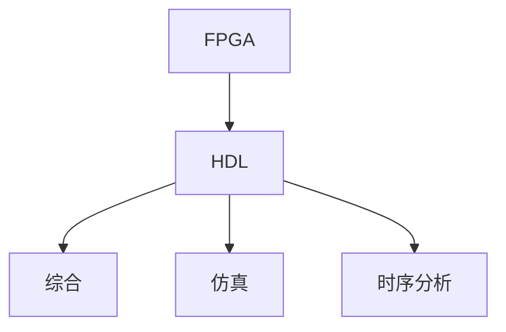

                 

# FPGA编程：硬件描述语言和逻辑设计

> 关键词：FPGA, 硬件描述语言, 逻辑设计, 综合, 仿真, 时序分析

## 1. 背景介绍

### 1.1 问题由来
随着集成电路设计和制造技术的飞速发展，FPGA(Field Programmable Gate Array，现场可编程门阵列)作为一种高性能、灵活性极高的硬件平台，日益受到电子设计工程师的青睐。FPGA不仅能够实现各种复杂数字逻辑功能，还支持并行计算、数据流处理等特殊应用，广泛应用于通信、医疗、国防、汽车电子等领域。然而，传统的硬件设计流程中，FPGA设计的效率和可复用性往往难以保证，设计周期和成本也成为主要瓶颈。为了提高FPGA设计的自动化水平，硬件描述语言应运而生。硬件描述语言（HDL, Hardware Description Language）能够将复杂的硬件逻辑功能以软件方式表达，并通过工具自动转换成FPGA硬件电路，极大提高了设计效率和质量。

### 1.2 问题核心关键点
硬件描述语言基于高级抽象，能够支持从门级、寄存器级到行为级等多种设计层次，支持并行计算、时序逻辑、数字信号处理等复杂功能，为工程师提供了更灵活、更高效的设计手段。然而，硬件描述语言学习曲线较陡，需要一定的硬件背景和逻辑思维能力。本博客将从硬件描述语言的原理和实践出发，介绍常见的HDL语言（如Verilog和VHDL），以及FPGA设计的核心流程，包括综合、仿真、时序分析等，帮助读者全面理解FPGA编程的逻辑设计和实现过程。

### 1.3 问题研究意义
掌握硬件描述语言和FPGA设计流程，不仅能够大幅提高设计效率和质量，还能显著降低开发成本和风险，加速产品上市。本博客旨在为电子设计工程师提供系统性的知识框架，帮助读者构建强大的FPGA硬件设计能力，迎接更复杂、更高效的电子系统挑战。

## 2. 核心概念与联系

### 2.1 核心概念概述

为了更好地理解FPGA设计和硬件描述语言，首先需要介绍一些核心概念：

- **FPGA**：现场可编程门阵列，一种可重新配置的集成电路，能够根据需要进行编程和重构。
- **硬件描述语言(HDL)**：一种用于描述硬件电路结构、逻辑功能和时序关系的高级语言。
- **综合(Synthesis)**：将HDL描述的逻辑功能自动转换成FPGA硬件电路的过程。
- **仿真(Simulation)**：通过软件模拟硬件电路的行为，验证设计是否符合要求的过程。
- **时序分析**：分析电路中的时序关系，确保信号正确同步，避免时序违规。

这些概念之间的关系可以通过以下Mermaid流程图来展示：



这个流程图展示了FPGA设计的核心步骤：首先通过硬件描述语言对硬件逻辑进行描述，然后通过综合器将其转换为FPGA硬件电路，接着通过仿真器进行功能验证，最后进行时序分析确保电路性能可靠。

## 3. 核心算法原理 & 具体操作步骤

### 3.1 算法原理概述

FPGA设计的核心算法原理基于硬件描述语言的高级抽象。具体而言，硬件描述语言通过特定的语法和语义，表达出复杂的逻辑功能、时序关系和硬件结构。综合器则将HDL描述的功能转换为具体的硬件电路，完成逻辑映射和资源分配。仿真器通过软件模拟硬件行为，验证设计的正确性和性能。时序分析工具则通过时序约束和检查，确保信号的同步性和时序合规性。

### 3.2 算法步骤详解

FPGA设计的核心算法步骤包括：

**Step 1: 硬件需求分析**
- 确定FPGA需要实现的功能和性能要求。
- 分析数据流、控制逻辑、存储器需求等关键点。
- 确定FPGA的资源需求和功耗限制。

**Step 2: 硬件设计描述**
- 根据需求，选择合适的HDL语言（如Verilog或VHDL）。
- 设计出逻辑功能模块，并进行模块划分。
- 定义寄存器和信号接口，建立模块之间的通信。

**Step 3: 综合**
- 使用综合工具（如Synopsys Design Compiler），将HDL代码转换为FPGA硬件电路。
- 优化电路结构，提高资源利用率。
- 生成综合报告，检查综合过程中出现的问题。

**Step 4: 仿真**
- 使用仿真工具（如ModelSim或Questa），对综合后的设计进行功能仿真。
- 检查功能是否符合设计要求，逻辑是否正确。
- 分析仿真报告，排除逻辑错误和边界问题。

**Step 5: 时序分析**
- 使用时序分析工具（如PrimeTime或UltraScale Design Advisor），对综合后的设计进行时序分析。
- 检查关键路径的时序违规，确保电路性能稳定。
- 优化时序，解决时序问题，如加设时钟异步模块或使用异步设计。

**Step 6: 布线和调试**
- 使用FPGA布局和布线工具（如Starflow或TimeQuest），将综合和时序分析后的设计布局到FPGA芯片上。
- 进行硬件调试，解决布线冲突和布线延时问题。
- 生成FPGA布局和布线报告，检查布线质量和效率。

**Step 7: 验证和测试**
- 在目标FPGA芯片上加载测试程序，进行功能测试和性能测试。
- 验证硬件逻辑的正确性和性能指标。
- 进行故障注入测试，检查硬件设计的鲁棒性和可靠性。

### 3.3 算法优缺点

基于硬件描述语言和FPGA设计的方法具有以下优点：

1. **灵活性高**：硬件描述语言支持从门级到行为级的多种抽象层次，能够实现复杂的逻辑功能和时序关系。
2. **自动化程度高**：综合、仿真、时序分析等工具大大提高了设计的自动化程度，减少了手动调试的时间和成本。
3. **可复用性高**：通过模块化设计，可以复用已有的硬件模块，加速新设计开发。
4. **优化能力强**：综合工具能够自动进行电路优化，提高资源利用率和性能。

然而，该方法也存在一些缺点：

1. **学习曲线陡峭**：硬件描述语言的语法和语义较为复杂，需要一定的硬件背景和逻辑思维能力。
2. **开发周期长**：设计和验证过程较为繁琐，尤其是在大规模设计时，开发周期较长。
3. **资源消耗大**：FPGA硬件电路的复杂度较高，对硬件资源和功耗有较高要求。

### 3.4 算法应用领域

硬件描述语言和FPGA设计广泛应用于各种复杂的数字逻辑系统设计中，包括但不限于以下领域：

- **数字通信**：如调制解调器、网络路由器、光纤通信设备等。
- **医疗设备**：如心电图机、影像诊断设备、手术机器人等。
- **航空航天**：如卫星控制、导航系统、雷达设备等。
- **自动驾驶**：如传感器数据处理、决策逻辑控制、路径规划等。
- **工业控制**：如自动化生产线、机器人、PLC等。

FPGA设计在上述领域的应用，展示了其在复杂系统中的强大适应能力和灵活性。随着FPGA技术的不断发展和HDL语言的标准化，FPGA设计的应用范围将更加广泛，涉及更多前沿技术领域。

## 4. 数学模型和公式 & 详细讲解 & 举例说明

### 4.1 数学模型构建

在FPGA设计中，数学模型的构建通常围绕逻辑功能和时序关系展开。以下是一些基本的数学模型和公式：

- **逻辑函数模型**：
  - 与门逻辑： $f(A, B) = \begin{cases} 1 & A = 1 \land B = 1 \\ 0 & \text{otherwise} \end{cases}$
  - 或门逻辑： $f(A, B) = \begin{cases} 1 & A = 1 \lor B = 1 \\ 0 & \text{otherwise} \end{cases}$
  - 异或门逻辑： $f(A, B) = \begin{cases} 1 & A \neq B \\ 0 & A = B \end{cases}$
- **时序逻辑模型**：
  - D触发器模型： $Q_n = D \land \bar{C} + Q_{n-1} \land C$
  - 时序逻辑状态转换： $Q_n = F(Q_{n-1}, R_n)$

### 4.2 公式推导过程

以D触发器为例，推导其时序逻辑模型：

1. 定义触发器状态转换规则：
  - 当时钟上升沿到来时，如果D=1且C=0，则Q变为1；
  - 否则，Q保持不变。

2. 用逻辑表达式表示状态转换：
  - 时钟上升沿到来时，D为输入，C为使能信号，Q为输出。
  - 当C=0时，D=1，Q=1；
  - 当C=1时，无论D为何值，Q保持不变。

3. 将时序逻辑表达式转换为HDL代码：
  - 在Verilog中，可以使用always块实现时序逻辑：
    ```verilog
    always @(posedge clk)
        if (reset == 0)
            Q <= D;
        else if (reset == 1)
            Q <= Q;
    ```
  - 在VHDL中，可以使用process块实现时序逻辑：
    ```vhdl
    process(clk, reset, D)
        if reset = '0' then
            Q <= D;
        elsif rising_edge(clk) then
            Q <= Q;
        end if;
    end process;
    ```

### 4.3 案例分析与讲解

以一个简单的数字计数器为例，分析其硬件描述和综合过程：

**设计要求**：实现一个4位的计数器，具有加1和减1功能，使用Verilog HDL描述并综合到FPGA芯片上。

**HDL代码实现**：
```verilog
module counter (
    input clk,
    input rst,
    input up,
    input dn,
    output [3:0] count
);

reg [3:0] cnt;

always @(posedge clk) begin
    if (rst) begin
        cnt <= 4'b0000;
    end else begin
        if (up) begin
            cnt <= cnt + 1;
        end else if (dn) begin
            cnt <= cnt - 1;
        end else begin
            cnt <= cnt;
        end
    end
end

assign count = cnt;

endmodule
```

**综合步骤**：
1. 使用综合工具（如Synopsys Design Compiler），将上述Verilog代码转换为FPGA硬件电路。
2. 优化电路结构，提高资源利用率。
3. 生成综合报告，检查综合过程中出现的问题。
4. 将综合后的电路布局到FPGA芯片上，进行布线调试和性能测试。

**综合结果**：
- 综合工具将HDL代码转换成具体的FPGA硬件电路，包括计数器、逻辑门、存储器等。
- 优化后的电路结构，占用了FPGA芯片的资源，并满足时序要求。

**仿真和时序分析**：
1. 使用仿真工具（如ModelSim）对综合后的设计进行功能仿真，验证计数器的加1和减1功能是否正确。
2. 使用时序分析工具（如PrimeTime）对设计进行时序分析，检查关键路径的时序违规，确保电路性能稳定。

## 5. 项目实践：代码实例和详细解释说明

### 5.1 开发环境搭建

在进行FPGA设计前，首先需要搭建开发环境：

1. 安装Xilinx Vivado设计套件：下载并运行Xilinx Vivado安装文件，配置开发环境。
2. 安装FPGA开发工具：安装Vivado HDL编辑器、综合器、模拟器、时序分析器等工具。
3. 准备硬件描述语言：选择合适的HDL语言（如Verilog或VHDL），并准备好设计文件和库文件。

### 5.2 源代码详细实现

下面以一个简单的FPGA计数器为例，展示硬件描述语言和综合的实现过程：

**Verilog代码实现**：
```verilog
module counter (
    input clk,
    input rst,
    input up,
    input dn,
    output [3:0] count
);

reg [3:0] cnt;

always @(posedge clk) begin
    if (rst) begin
        cnt <= 4'b0000;
    end else begin
        if (up) begin
            cnt <= cnt + 1;
        end else if (dn) begin
            cnt <= cnt - 1;
        end else begin
            cnt <= cnt;
        end
    end
end

assign count = cnt;

endmodule
```

**综合和布局布线**：
1. 在Vivado HDL编辑器中打开设计文件，进行语法检查和错误修正。
2. 使用综合器将设计文件转换为FPGA硬件电路。
3. 在综合结果中，查看电路资源占用情况，进行资源优化。
4. 使用布局布线工具（如Starflow）进行电路布局和布线，生成FPGA布局和布线报告。

### 5.3 代码解读与分析

**代码解读**：
- `module`语句定义模块名称和输入输出端口。
- `reg`语句定义寄存器，存储计数器状态。
- `always`块实现时序逻辑，在时钟上升沿执行计数器状态转换。
- `assign`语句定义输出端口，将计数器状态输出到外部。

**代码分析**：
- 计数器模块具有加1和减1功能，由时钟信号、复位信号、上计数信号和下计数信号控制。
- 寄存器`cnt`存储计数器状态，每次时钟上升沿根据输入信号更新。
- 输出端口`count`将计数器状态输出到外部，用于显示计数结果。

**综合优化**：
- 综合工具自动将HDL代码转换为FPGA硬件电路，并进行资源分配和优化。
- 优化后的电路结构，资源占用情况和时序性能等指标需要通过综合报告进行评估。
- 在优化过程中，需要考虑电路功耗、资源利用率和时序约束等关键因素，进行反复调整。

**布线和调试**：
- 布局布线工具自动将综合后的电路布局到FPGA芯片上，并进行布线优化。
- 布线调试过程中，需要检查布线冲突和布线延时问题，确保电路性能稳定。
- 生成布线报告，提供详细的布线信息，用于后续优化和调试。

**仿真和时序分析**：
- 使用仿真工具进行功能仿真，验证设计是否符合设计要求，逻辑是否正确。
- 使用时序分析工具进行时序分析，检查关键路径的时序违规，确保电路性能稳定。
- 根据时序分析报告，调整设计中可能存在的问题，确保时序合规性。

## 6. 实际应用场景

### 6.1 数字通信

在数字通信系统中，FPGA设计可以应用于调制解调器、网络路由器、光纤通信设备等。例如，在调制解调器中，FPGA可以实现数字信号处理、错误校正和通信协议处理等功能，提升通信系统的稳定性和可靠性。

**应用实例**：
- 数字信号调制解调：使用FPGA实现各种调制算法，如QPSK、PSK等，实现数字信号的调制和解调。
- 信道编码和解码：使用FPGA实现Turbo编码、Reed-Solomon编码等信道编码算法，提高通信系统的抗干扰能力。
- 通信协议处理：使用FPGA实现各种通信协议，如TCP/IP协议、以太网协议等，实现数据包处理和传输。

**设计流程**：
- 需求分析：确定数字通信系统的功能需求和性能要求。
- 硬件设计：使用HDL语言描述数字信号处理和通信协议处理逻辑。
- 综合和布线：将HDL代码转换为FPGA硬件电路，并进行综合、布线和时序优化。
- 仿真和测试：对设计进行功能仿真和性能测试，验证设计正确性。

### 6.2 医疗设备

在医疗设备中，FPGA设计可以应用于心电图机、影像诊断设备、手术机器人等。例如，在心电图机中，FPGA可以实现心电信号的采集、处理和分析，提供实时的心电监测和诊断功能。

**应用实例**：
- 心电信号采集和处理：使用FPGA实现心电信号的采样、滤波和FFT变换，提供实时的心电图显示和分析功能。
- 影像诊断处理：使用FPGA实现医学影像的显示和处理，提供多模态医学影像的融合和分析功能。
- 手术机器人控制：使用FPGA实现手术机器人的运动控制和力反馈，提供高精度、高可靠性的手术操作。

**设计流程**：
- 需求分析：确定医疗设备的功能需求和性能要求。
- 硬件设计：使用HDL语言描述心电信号处理、影像诊断处理和手术机器人控制逻辑。
- 综合和布线：将HDL代码转换为FPGA硬件电路，并进行综合、布线和时序优化。
- 仿真和测试：对设计进行功能仿真和性能测试，验证设计正确性。

### 6.3 航空航天

在航空航天领域，FPGA设计可以应用于卫星控制、导航系统、雷达设备等。例如，在卫星控制系统中，FPGA可以实现卫星姿态控制、轨道计算和通信协议处理等功能，确保卫星的稳定运行。

**应用实例**：
- 卫星姿态控制：使用FPGA实现卫星的姿态控制算法，如姿态控制、轨道计算等。
- 通信协议处理：使用FPGA实现卫星与地面站之间的通信协议处理，确保通信的可靠性和实时性。
- 导航系统处理：使用FPGA实现卫星导航系统的信号处理和定位算法，确保卫星的准确导航。

**设计流程**：
- 需求分析：确定航空航天系统的功能需求和性能要求。
- 硬件设计：使用HDL语言描述卫星姿态控制、通信协议处理和导航系统处理的逻辑。
- 综合和布线：将HDL代码转换为FPGA硬件电路，并进行综合、布线和时序优化。
- 仿真和测试：对设计进行功能仿真和性能测试，验证设计正确性。

### 6.4 未来应用展望

随着FPGA技术的不断发展和HDL语言的标准化，FPGA设计的应用范围将更加广泛，涉及更多前沿技术领域。以下是FPGA设计未来的一些发展趋势：

1. **大规模集成系统**：FPGA可以集成大规模数字逻辑系统，实现复杂的计算和通信功能。未来，随着FPGA芯片的集成度不断提高，可以设计出更加高效、灵活的系统。
2. **人工智能与FPGA融合**：FPGA可以与人工智能算法结合，实现高效的并行计算和数据流处理。未来，FPGA将更多地应用于深度学习和计算机视觉等领域，加速AI技术的落地应用。
3. **系统级设计**：FPGA设计将从传统的功能性设计向系统级设计转变，涵盖整个系统的功能、性能和功耗优化。未来，FPGA设计将更加注重系统整体性能，实现高效、低功耗的设计方案。
4. **自动化设计流程**：FPGA设计将更多地利用自动化工具，减少手动调试和优化的时间。未来，自动化的FPGA设计流程将大大提高设计效率和质量。
5. **跨领域应用**：FPGA设计将更多地应用于各个行业，如工业控制、智能家居、医疗设备等，推动各行业的数字化转型和智能化升级。

## 7. 工具和资源推荐

### 7.1 学习资源推荐

为了帮助读者系统掌握FPGA设计和硬件描述语言，以下是一些优质的学习资源：

1. **《FPGA设计速成教程》**：介绍FPGA基础、设计流程、常用工具和语言等知识，适合初学者快速入门。
2. **《SystemVerilog实战》**：介绍SystemVerilog语言和设计流程，适合进行系统级设计和测试。
3. **《Verilog设计综合》**：介绍Verilog语言和综合工具，适合进行数字逻辑设计和优化。
4. **《Xilinx Zynq 7000 SoC实战》**：介绍Xilinx Zynq 7000 SoC的设计流程和应用，适合进行SoC设计。
5. **《FPGA数字系统设计》**：介绍FPGA硬件设计、验证和测试，适合全面掌握FPGA设计流程。

### 7.2 开发工具推荐

以下是几款用于FPGA设计和验证的常用工具：

1. **Xilinx Vivado**：Xilinx公司的FPGA设计套件，集成了综合、仿真、布线和验证工具，适合大规模复杂设计。
2. **Synopsys Design Compiler**：Synopsys公司的综合工具，支持多种HDL语言，能够自动生成优化后的硬件电路。
3. **ModelSim**：Synopsys公司的仿真工具，支持多种HDL语言，支持系统级仿真和时序分析。
4. **PrimeTime**：Xilinx公司的时序分析工具，支持多种HDL语言，能够进行详细时序分析和优化。
5. **Starflow**：Xilinx公司的布局布线工具，支持FPGA布局和布线，生成优化后的硬件电路。

### 7.3 相关论文推荐

以下是一些FPGA设计和硬件描述语言的经典论文，推荐阅读：

1. **《FPGA-based Network-on-Chip Architecture》**：介绍FPGA在NoC架构中的应用，提高系统性能和灵活性。
2. **《FPGA Acceleration of Machine Learning》**：介绍FPGA在深度学习和计算机视觉中的应用，加速AI算法的计算。
3. **《System-Level Design with SystemVerilog》**：介绍SystemVerilog语言和系统级设计的流程和方法，提高设计效率和质量。
4. **《FPGA-Based Virtual Development Platform for SoC Design》**：介绍基于FPGA的SoC虚拟开发平台，提高SoC设计的效率和灵活性。
5. **《High-Level Synthesis for FPGA Design》**：介绍高层次综合工具和设计方法，提高FPGA设计的自动化程度。

## 8. 总结：未来发展趋势与挑战

### 8.1 总结

本文从硬件描述语言和FPGA设计的原理和实践出发，全面介绍了FPGA编程的逻辑设计和实现过程。从硬件需求分析到设计描述、综合、仿真、时序分析等关键步骤，本文提供了系统性的知识框架，帮助读者构建强大的FPGA硬件设计能力。通过本文的学习，读者可以掌握FPGA设计的核心流程和关键技术，应对更复杂、更高效的电子系统挑战。

### 8.2 未来发展趋势

展望未来，FPGA设计和硬件描述语言的发展趋势包括：

1. **自动化水平提升**：随着自动化工具的不断发展，FPGA设计的自动化水平将不断提升，减少手动调试和优化的时间。
2. **跨领域应用扩展**：FPGA设计将更多地应用于各个行业，如智能家居、工业控制、医疗设备等，推动各行业的数字化转型和智能化升级。
3. **系统级设计普及**：FPGA设计将从传统的功能性设计向系统级设计转变，涵盖整个系统的功能、性能和功耗优化。
4. **高性能计算加速**：FPGA将更多地应用于高性能计算领域，如深度学习、大数据处理等，提升计算效率和性能。
5. **跨学科融合**：FPGA设计将更多地与人工智能、计算机视觉等领域结合，推动各领域的创新和发展。

### 8.3 面临的挑战

尽管FPGA设计和硬件描述语言在不断发展，但仍面临以下挑战：

1. **复杂性增加**：随着设计规模的扩大和功能需求的增加，FPGA设计变得越来越复杂，设计周期和成本不断增加。
2. **资源消耗大**：FPGA硬件电路的复杂度较高，对硬件资源和功耗有较高要求，设计过程中需要优化资源使用。
3. **学习曲线陡峭**：硬件描述语言和设计流程较为复杂，需要较高的硬件背景和逻辑思维能力，门槛较高。
4. **仿真和验证难度大**：FPGA设计涉及复杂的数字逻辑和时序关系，仿真和验证难度较大，需要多次迭代优化。
5. **工具和生态系统不够成熟**：虽然FPGA设计工具和生态系统不断完善，但仍然存在工具不足和生态系统不完善等问题，限制了设计效率和质量。

### 8.4 研究展望

未来，FPGA设计和硬件描述语言需要从以下几个方面进行研究：

1. **自动化工具的开发**：开发更高效、更智能的自动化工具，减少手动调试和优化的时间，提高设计效率和质量。
2. **高性能计算优化**：优化FPGA设计中的计算性能和数据流处理能力，加速高性能计算任务的执行。
3. **跨学科融合技术**：推动FPGA设计与人工智能、计算机视觉等领域的深度融合，实现跨学科的协同创新。
4. **大规模系统设计**：探索大规模系统设计的方法和工具，提升系统整体性能和可扩展性。
5. **新材料和芯片技术的探索**：探索新材料和芯片技术，提高FPGA芯片的集成度和性能，推动FPGA设计的发展。

## 9. 附录：常见问题与解答

**Q1：FPGA设计和硬件描述语言学习难度大吗？**

A: FPGA设计和硬件描述语言的学习曲线较陡峭，需要一定的硬件背景和逻辑思维能力。然而，通过系统的学习和实践，可以逐步掌握设计流程和关键技术，逐步提高设计能力。

**Q2：FPGA设计的开发周期长吗？**

A: FPGA设计的开发周期较长，尤其是在大规模设计时。然而，随着自动化工具的不断完善，设计效率和质量也在不断提升。合理利用自动化工具，可以大大缩短设计周期。

**Q3：FPGA设计资源消耗大吗？**

A: FPGA硬件电路的复杂度较高，对硬件资源和功耗有较高要求。然而，通过综合工具的优化，可以有效控制资源消耗，提升FPGA设计的效率和性能。

**Q4：FPGA设计中的仿真和验证难度大吗？**

A: FPGA设计涉及复杂的数字逻辑和时序关系，仿真和验证难度较大。然而，通过自动化工具和仿真优化技术，可以大大降低仿真和验证的难度，提高设计效率和质量。

**Q5：FPGA设计的未来发展方向是什么？**

A: FPGA设计的未来发展方向包括自动化水平提升、跨领域应用扩展、系统级设计普及、高性能计算加速和跨学科融合技术。这些方向将推动FPGA设计在各个行业的应用，加速数字化转型和智能化升级。

---

作者：禅与计算机程序设计艺术 / Zen and the Art of Computer Programming

