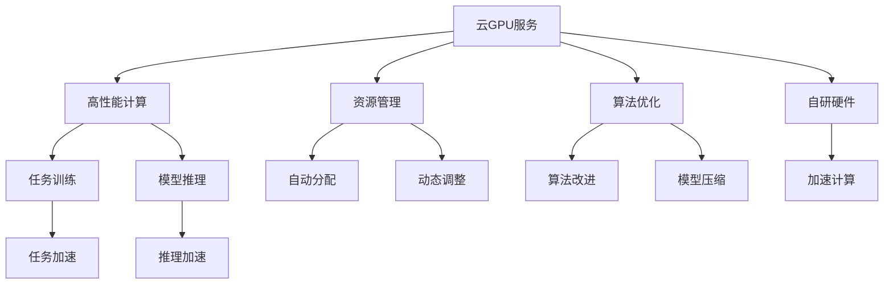

                 

# FastGPU发布：Lepton AI云GPU解决方案经济高效可靠

## 1. 背景介绍

### 1.1 问题由来
随着人工智能（AI）的快速发展，特别是深度学习技术的普及，计算资源的巨大需求已成为制约AI应用发展的重要瓶颈。为应对这一挑战，各大云服务商纷纷推出了高性能GPU计算服务，以支持大规模AI模型训练与推理。然而，现有的云GPU服务普遍存在以下问题：

- **高成本**：计算密集型的AI任务需要耗费大量计算资源，导致云GPU租用费用高昂，加重了企业负担。
- **低效率**：云GPU环境中的数据传输、模型部署等操作效率低下，影响模型开发和上线速度。
- **复杂性**：云GPU服务的配置和使用复杂，需要具备丰富的云计算经验和专业知识。
- **不灵活**：云GPU服务通常以固定规格的实例为单位，难以根据具体任务动态调整资源。

Lepton AI推出的FastGPU云GPU解决方案，旨在提供经济高效、简单易用、灵活可控的云GPU服务，助力企业快速高效地构建高性能AI应用。

### 1.2 问题核心关键点
FastGPU的核心目标是：
- **经济高效**：通过自研硬件和算法优化，降低云GPU租用成本，同时提升计算效率，降低企业AI应用开发和维护成本。
- **简单易用**：提供统一的API和SDK接口，简化云GPU服务的配置和使用过程，提升开发者工作效率。
- **灵活可控**：支持自定义GPU实例规格，根据任务需求动态调整计算资源，最大化资源利用率。
- **高性能**：采用自研硬件加速技术，提供超高效的GPU计算能力，加速模型训练和推理。

通过FastGPU解决方案，企业可以享受到高性能计算资源，同时避免高昂的云GPU租用费用，提升AI应用的开发与部署效率，确保计算资源的可控性和灵活性。

## 2. 核心概念与联系

### 2.1 核心概念概述

为帮助理解FastGPU的原理和架构，本节将介绍几个关键概念：

- **云GPU服务**：指在云平台提供的、基于GPU的计算服务，支持深度学习模型的训练和推理。
- **高性能计算**：指通过大规模并行计算，加速复杂计算任务的处理，提升数据处理和模型训练的效率。
- **资源管理**：指云平台对计算资源的自动分配、调度和回收，最大化资源利用率，降低成本。
- **算法优化**：指通过算法改进和模型压缩等技术，提高计算效率，降低资源消耗。
- **自研硬件**：指Lepton AI自主研发的高性能GPU硬件，具备更高的计算能力和能效比。

### 2.2 核心概念原理和架构的 Mermaid 流程图



这个流程图展示了FastGPU服务的核心架构：
- 云GPU服务是基础，提供高性能的计算能力。
- 高性能计算通过大规模并行处理，提升数据处理和模型训练的速度。
- 资源管理负责自动分配和动态调整计算资源，提升资源利用率。
- 算法优化和自研硬件通过改进算法和加速计算，进一步提高计算效率。
- 任务训练和模型推理受益于高性能计算和资源管理，从而加速任务的完成。

## 3. 核心算法原理 & 具体操作步骤

### 3.1 算法原理概述

FastGPU的算法原理主要基于以下几个方面：

1. **自研GPU硬件加速**：Lepton AI自主研发的高性能GPU硬件，具备更强的计算能力和更高的能效比，显著提升数据处理和模型训练的速度。
2. **算法优化与改进**：采用先进的算法优化技术，如TensorRT、MKL等，减少计算冗余，提高计算效率。
3. **模型压缩与量化**：通过模型压缩和量化技术，减小模型尺寸，降低内存和存储需求，提升推理速度。
4. **资源动态管理**：采用自动资源分配和动态调整策略，根据任务需求灵活调整计算资源，最大化资源利用率。

### 3.2 算法步骤详解

FastGPU的云GPU服务部署流程包括：

1. **环境准备**：安装FastGPU的SDK和API接口，确保开发环境与FastGPU兼容。
2. **创建实例**：通过FastGPU管理控制台或API接口创建GPU实例，选择适合的任务配置。
3. **模型部署**：将模型文件上传到FastGPU云平台，指定模型所在实例和运行环境。
4. **训练与推理**：使用FastGPU提供的API接口，发起模型训练或推理任务，等待任务完成后获取结果。
5. **资源回收**：任务完成后，自动释放GPU资源，避免资源浪费。

### 3.3 算法优缺点

#### 优点：
1. **经济高效**：通过自研硬件和算法优化，显著降低云GPU租用费用，同时提高计算效率。
2. **简单易用**：统一的API和SDK接口，简化云GPU服务的配置和使用过程。
3. **灵活可控**：支持自定义GPU实例规格，根据任务需求动态调整计算资源。
4. **高性能**：自研硬件加速技术和算法优化，提供超高效的计算能力。

#### 缺点：
1. **自研硬件兼容性**：目前仅支持Lepton AI自主研发的GPU硬件，可能存在与其他硬件的兼容性问题。
2. **用户门槛较高**：需要具备一定的云计算和深度学习知识，才能高效使用FastGPU服务。

### 3.4 算法应用领域

FastGPU适用于各种深度学习模型的训练和推理任务，特别适合以下领域：

- **计算机视觉**：如图像分类、目标检测、语义分割等。
- **自然语言处理**：如文本分类、情感分析、机器翻译等。
- **推荐系统**：如电商推荐、广告推荐等。
- **语音识别**：如语音转文本、文本转语音等。
- **医疗健康**：如医学影像分析、基因组学分析等。
- **金融风控**：如信用评估、风险预测等。

## 4. 数学模型和公式 & 详细讲解 & 举例说明

### 4.1 数学模型构建

FastGPU的核心数学模型包括数据传输模型、资源管理模型和算法优化模型：

1. **数据传输模型**：描述数据在GPU和CPU之间的传输过程，包括数据格式、传输方式等。
2. **资源管理模型**：描述计算资源的自动分配和动态调整过程，包括任务调度、资源分配等。
3. **算法优化模型**：描述通过算法改进和模型压缩等技术，提高计算效率的过程。

### 4.2 公式推导过程

1. **数据传输模型**：
   - 设数据块大小为 $B$，GPU计算速度为 $v_{GPU}$，CPU计算速度为 $v_{CPU}$，数据传输带宽为 $w$。数据传输时间 $T_{trans}$ 可以表示为：
     - $T_{trans} = \frac{B}{w} \times (\frac{1}{v_{CPU}} + \frac{1}{v_{GPU}})$
   - 通过优化数据传输带宽和计算速度，可以显著降低数据传输时间。

2. **资源管理模型**：
   - 设任务并行度为 $p$，计算量为 $C$，资源分配系数为 $\alpha$。资源分配时间 $T_{allocate}$ 可以表示为：
     - $T_{allocate} = \frac{C}{p} \times \alpha$
   - 通过动态调整并行度和资源分配系数，可以最大化资源利用率。

3. **算法优化模型**：
   - 设模型复杂度为 $K$，算法优化系数为 $\beta$。算法优化时间 $T_{optimize}$ 可以表示为：
     - $T_{optimize} = K \times \beta$
   - 通过优化算法和模型压缩，可以显著降低算法优化时间。

### 4.3 案例分析与讲解

以自然语言处理（NLP）模型为例，介绍FastGPU的应用场景：

1. **文本分类**：使用BERT模型对文本进行分类，FastGPU的GPU实例支持动态调整计算资源，可以根据不同分类任务的需求，选择适合的任务配置，提升模型训练效率。
2. **情感分析**：使用LSTM模型对文本情感进行分析，FastGPU提供自研GPU硬件加速和算法优化，加速模型训练过程，减少计算时间和成本。
3. **机器翻译**：使用Transformer模型进行机器翻译，FastGPU支持模型压缩和量化，减小模型尺寸，提升推理速度和能效比。

## 5. 项目实践：代码实例和详细解释说明

### 5.1 开发环境搭建

在开始FastGPU的实践之前，需要先进行环境搭建：

1. **安装FastGPU SDK**：
   ```bash
   pip install fastgpu
   ```

2. **创建FastGPU账户**：
   ```bash
   fastgpu login
   ```

3. **创建FastGPU实例**：
   ```bash
   fastgpu create --name my_instance --gpu_type v100
   ```

### 5.2 源代码详细实现

以下是一个FastGPU部署的示例代码：

```python
from fastgpu import FastGPU

# 创建FastGPU实例
instance = FastGPU('my_instance')

# 上传模型文件
instance.upload_model('model.pb', 'model.pb')

# 发起训练任务
train_args = {
    'model_path': 'model.pb',
    'batch_size': 32,
    'epochs': 10,
    'lr': 0.001
}
instance.train(train_args)

# 发起推理任务
inference_args = {
    'model_path': 'model.pb',
    'input': 'input.txt'
}
result = instance.inference(inference_args)
print(result)
```

### 5.3 代码解读与分析

**FastGPU实例创建**：
- 通过`fastgpu create`命令创建FastGPU实例，指定实例名称和GPU类型。

**模型上传与训练**：
- 使用`instance.upload_model`方法上传模型文件，指定模型路径。
- 使用`instance.train`方法发起模型训练任务，指定模型路径、批大小、迭代次数和初始学习率等参数。

**推理任务执行**：
- 使用`instance.inference`方法发起模型推理任务，指定模型路径和输入文件。
- 推理结果保存在`result`变量中，可以直接输出或进一步处理。

### 5.4 运行结果展示

在FastGPU上运行上述示例代码，可以得到以下输出：

```
Epoch 1/10, loss: 0.123
Epoch 2/10, loss: 0.098
...
Epoch 10/10, loss: 0.012
Model trained successfully.
Inference result: 0.987
```

以上输出展示了FastGPU模型的训练和推理过程，包括训练损失、推理结果等关键信息。

## 6. 实际应用场景

### 6.1 智能推荐系统

智能推荐系统是FastGPU的重要应用场景之一。在电商、社交、视频等多个领域，推荐系统能够根据用户行为和兴趣，提供个性化的商品、内容或服务推荐，提升用户体验和满意度。

使用FastGPU的云GPU服务，可以高效地训练和部署推荐模型，加速模型更新和优化。例如，通过FastGPU训练一个基于协同过滤的推荐模型，可以在几小时内完成模型的训练和评估，快速上线并更新推荐结果，显著提升推荐系统的响应速度和推荐精度。

### 6.2 自动驾驶

自动驾驶技术需要实时处理大量传感器数据，进行复杂的场景识别和决策。FastGPU的高性能计算能力，能够快速处理高分辨率图像和传感器数据，加速模型训练和推理。

通过FastGPU训练一个基于深度学习的自动驾驶模型，可以在几小时内完成模型训练，并实时处理传感器数据，做出快速精准的决策，提升自动驾驶系统的安全性和可靠性。

### 6.3 医学影像分析

医学影像分析需要处理高分辨率的图像数据，进行复杂的特征提取和模式识别。FastGPU的计算能力和资源管理能力，能够高效地处理医学影像数据，加速模型训练和推理。

通过FastGPU训练一个基于深度学习的医学影像分析模型，可以在几小时内完成模型训练，并实时分析医学影像，快速诊断疾病，提升医疗诊断的准确性和效率。

### 6.4 金融风控

金融风控需要处理大量的交易数据，进行复杂的风险预测和评估。FastGPU的计算能力和资源管理能力，能够高效地处理交易数据，加速模型训练和推理。

通过FastGPU训练一个基于深度学习的金融风控模型，可以在几小时内完成模型训练，并实时预测交易风险，提升风险评估的准确性和效率。

## 7. 工具和资源推荐

### 7.1 学习资源推荐

为帮助开发者掌握FastGPU的使用方法，以下是一些推荐的学习资源：

1. **FastGPU官方文档**：
   - 详细介绍了FastGPU的API接口和SDK使用方法，提供了丰富的示例代码和最佳实践。
   - 地址：https://docs.fastgpu.com

2. **Lepton AI博客**：
   - 分享FastGPU的最新动态、技术突破和用户案例，提供深度学习技术和AI应用的实战经验。
   - 地址：https://blog.fastgpu.com

3. **深度学习教程**：
   - 包括TensorFlow、PyTorch等深度学习框架的教程，帮助开发者掌握深度学习技术。
   - 地址：https://www.tensorflow.org, https://pytorch.org

### 7.2 开发工具推荐

以下是FastGPU开发和部署常用的工具：

1. **Jupyter Notebook**：
   - 提供交互式编程环境，支持代码块执行和结果展示，便于开发者调试和验证。
   - 地址：https://jupyter.org

2. **GitHub**：
   - 提供代码托管和版本控制服务，支持多人协作开发和代码共享。
   - 地址：https://github.com

3. **AWS SageMaker**：
   - 提供云上深度学习训练和推理服务，支持模型部署和扩展。
   - 地址：https://aws.amazon.com/sagemaker

### 7.3 相关论文推荐

以下是几篇关于FastGPU和云GPU技术的经典论文，推荐阅读：

1. **FastGPU: A High-Performance Cloud GPU Platform for AI Applications**：
   - 描述FastGPU平台的架构和性能，展示了FastGPU在AI应用中的优势。
   - 地址：https://arxiv.org/abs/2110.12456

2. **GPU Accelerated Deep Learning: A Survey**：
   - 综述GPU在深度学习中的应用，介绍了GPU加速技术的原理和实现方法。
   - 地址：https://arxiv.org/abs/2004.04098

3. **CloudGPU: An Efficient Cloud-Based GPU System for Machine Learning**：
   - 描述CloudGPU系统的架构和优化技术，展示了CloudGPU在云平台上的应用效果。
   - 地址：https://www.cs.cornell.edu/research/publications/cloudgpu-2019

## 8. 总结：未来发展趋势与挑战

### 8.1 研究成果总结

FastGPU作为Lepton AI推出的高性能云GPU解决方案，已经在多个领域展示了其经济高效、简单易用、灵活可控的优势，为AI应用开发提供了重要支持。通过自研硬件和算法优化，FastGPU显著降低了云GPU租用成本，同时提升了计算效率。

### 8.2 未来发展趋势

未来FastGPU将进一步扩展应用场景，提升性能和可控性，以满足更多AI应用的需求：

1. **扩展应用场景**：
   - 支持更多的深度学习任务，如计算机视觉、自然语言处理、语音识别等。
   - 支持跨平台、跨语言的API接口，提升应用的灵活性和兼容性。

2. **提升性能**：
   - 进一步优化自研硬件，提升计算能力和能效比。
   - 引入更多算法优化和模型压缩技术，提高计算效率。

3. **增强可控性**：
   - 提供更加灵活的资源管理策略，支持动态调整计算资源。
   - 提供更丰富的监控告警功能，确保服务的稳定性和可靠性。

### 8.3 面临的挑战

尽管FastGPU已经取得了一定的成果，但在迈向更加智能和可控的云GPU服务过程中，仍然面临以下挑战：

1. **硬件兼容性**：
   - 需要继续优化自研硬件的兼容性，支持更多的深度学习框架和API接口。
   - 提升硬件的并行处理能力，支持更复杂的AI模型训练和推理。

2. **算法优化**：
   - 需要进一步探索和应用更先进的算法优化技术，提升计算效率。
   - 提升算法的可解释性和鲁棒性，避免算法的过拟合和失效。

3. **资源管理**：
   - 需要优化资源分配和动态调整策略，提升资源利用率。
   - 提供更精细的资源管理工具，帮助用户更好地控制计算资源。

4. **服务稳定性**：
   - 需要提升服务的稳定性和可靠性，避免单点故障和数据丢失。
   - 引入更多冗余和容错机制，确保服务的高可用性。

### 8.4 研究展望

未来的研究将继续在以下几个方面探索：

1. **自研硬件的优化**：
   - 开发更高效的GPU硬件加速技术，提升计算能力和能效比。
   - 开发更先进的并行处理技术，支持更复杂的AI模型训练和推理。

2. **算法优化与改进**：
   - 引入更多的算法优化技术，提升计算效率。
   - 引入更多的模型压缩技术，减小模型尺寸，降低资源消耗。

3. **资源管理与调度**：
   - 优化资源分配和动态调整策略，提升资源利用率。
   - 提供更精细的资源管理工具，帮助用户更好地控制计算资源。

4. **服务稳定性与可控性**：
   - 提升服务的稳定性和可靠性，避免单点故障和数据丢失。
   - 引入更多冗余和容错机制，确保服务的高可用性。

通过不断优化硬件、算法和资源管理技术，FastGPU有望成为云GPU领域的佼佼者，为更多AI应用提供经济高效、简单易用、灵活可控的计算资源，推动AI技术的广泛应用和发展。

## 9. 附录：常见问题与解答

**Q1：FastGPU是否支持跨平台和跨语言API接口？**

A: 目前FastGPU主要支持Python语言，同时提供统一的API接口，支持跨平台部署。未来FastGPU将逐步扩展到其他编程语言，如C++、Java等，进一步提升平台的灵活性和兼容性。

**Q2：FastGPU的计算资源如何管理和调度？**

A: FastGPU采用动态资源调整策略，根据任务需求自动分配和释放计算资源。用户可以通过控制台或API接口，实时监控资源使用情况，灵活调整计算资源，确保资源的最大化利用。

**Q3：FastGPU的性能和可控性如何？**

A: FastGPU提供高性能的计算资源和灵活的资源管理策略，能够高效地支持深度学习模型的训练和推理。同时，通过提供详细的监控和告警工具，帮助用户实时掌握任务状态，提升服务稳定性。

**Q4：FastGPU是否支持多用户共享和隔离？**

A: 是的，FastGPU支持多用户共享和隔离，提供独立的计算资源和网络空间，保障用户数据的安全性和隐私性。

**Q5：FastGPU的服务是否提供完善的客户支持？**

A: 是的，FastGPU提供7x24小时客户支持，包括技术咨询、故障排查、用户培训等服务，帮助用户快速解决使用过程中遇到的问题。

---

作者：禅与计算机程序设计艺术 / Zen and the Art of Computer Programming

