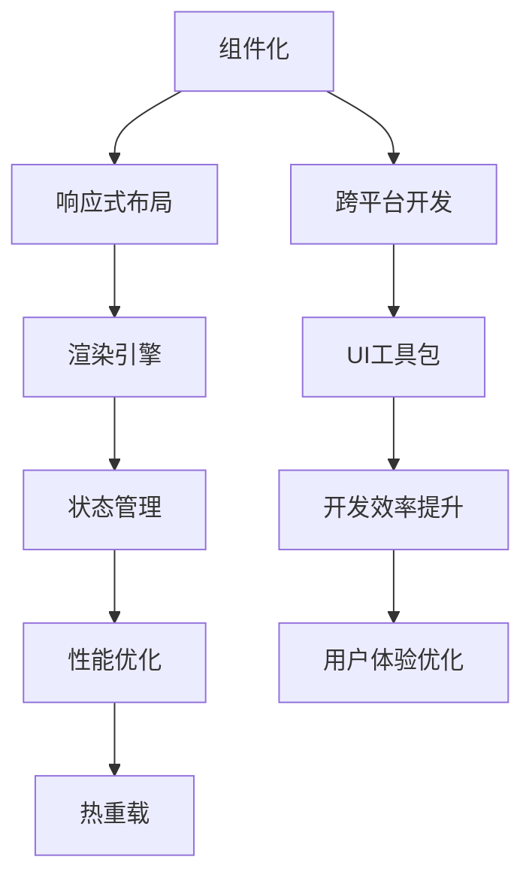

                 

# Flutter：Google的UI工具包 for 移动开发

> 关键词：Flutter, 移动开发, UI工具包, 跨平台开发, 响应式布局, 热重载

## 1. 背景介绍

### 1.1 问题由来

随着智能手机和平板电脑的普及，移动应用开发成为技术创业和传统行业数字化转型的重要引擎。然而，传统的移动开发模式存在诸多问题：

- **开发成本高**：针对iOS和Android两大平台，需要分别开发和维护两套代码，大大增加了开发和维护成本。
- **更新迭代慢**：每次更新都需要对两个平台进行重新编译和测试，降低了开发效率。
- **用户体验差异**：iOS和Android平台在UI、性能、安全性等方面存在差异，导致用户体验不一致。
- **开发者门槛高**：需要掌握不同平台的原生开发工具和语言（如Swift、Kotlin），学习曲线陡峭。

为了解决这些问题，Google于2015年推出了Flutter框架，旨在提供一套跨平台的UI工具包，通过一套代码即可构建高质量的移动应用，大幅提升开发效率和用户体验。

### 1.2 问题核心关键点

Flutter框架的核心理念是**“一次编写，随处运行”**，通过一套基于组件化的开发框架，实现跨平台UI开发的无缝切换。其主要特点包括：

- **跨平台开发**：支持iOS、Android和Web平台，代码共享，开发效率高。
- **响应式布局**：通过widget树和布局机制，实现灵活、自适应的UI布局。
- **热重载**：实时预览和调试，加速开发迭代。
- **高性能**：使用Skia图形库进行渲染，支持GPU加速，性能接近原生应用。

## 2. 核心概念与联系

### 2.1 核心概念概述

Flutter框架的核心概念包括以下几个方面：

- **组件化**：Flutter采用组件化开发，通过widget树组织UI布局，实现高度可复用和可维护的代码。
- **布局系统**：Flutter使用Dart语言，结合Material和Cupertino设计风格，提供丰富、自适应的布局机制。
- **渲染引擎**：Flutter内置Skia渲染引擎，支持GPU加速，提供高质量的图形渲染效果。
- **状态管理**：通过Provider和Bloc等状态管理工具，管理应用状态，提高代码的可维护性。
- **性能优化**：通过缓存机制、异步加载、延迟渲染等手段，优化应用性能，提升用户体验。
- **热重载**：实时预览和调试，加速开发迭代。

这些核心概念之间相互关联，共同构成了Flutter框架的完整体系，实现了高效、灵活、稳定和可维护的移动应用开发。

### 2.2 核心概念原理和架构的 Mermaid 流程图



该流程图展示了Flutter框架的核心概念及其相互关系：

1. **组件化**：构建灵活的widget树，实现UI布局的复用和组件化开发。
2. **响应式布局**：通过Dart语言和布局机制，实现自适应、响应式的UI布局。
3. **渲染引擎**：使用Skia图形库进行高质量渲染，支持GPU加速。
4. **状态管理**：通过Provider和Bloc等工具，管理应用状态，提升代码可维护性。
5. **性能优化**：通过缓存、异步加载等手段，优化应用性能。
6. **热重载**：实现实时预览和调试，加速开发迭代。

这些核心概念相辅相成，共同支持Flutter框架的跨平台UI开发。

## 3. 核心算法原理 & 具体操作步骤

### 3.1 算法原理概述

Flutter框架的开发原理基于组件化、布局系统和渲染引擎，其核心算法可以概括为以下几个步骤：

1. **组件化开发**：通过widget树组织UI布局，实现组件化开发，提高代码复用性和可维护性。
2. **响应式布局**：通过Dart语言和布局机制，实现灵活、自适应的UI布局。
3. **渲染引擎**：使用Skia渲染引擎，结合GPU加速，实现高性能的图形渲染。
4. **状态管理**：通过Provider和Bloc等工具，管理应用状态，提高代码可维护性。
5. **性能优化**：通过缓存、异步加载等手段，优化应用性能。
6. **热重载**：实现实时预览和调试，加速开发迭代。

### 3.2 算法步骤详解

Flutter的开发步骤如下：

1. **环境配置**：安装Dart、Flutter SDK和IDE（如Android Studio或Visual Studio Code），创建新项目。
2. **UI设计**：使用Flutter Designer或Adobe XD进行UI设计，生成UI元素。
3. **代码实现**：编写Dart代码，实现UI元素，构建widget树。
4. **渲染优化**：通过缓存机制、异步加载、延迟渲染等手段，优化应用性能。
5. **状态管理**：使用Provider或Bloc等工具，管理应用状态，保证数据的一致性。
6. **测试与部署**：通过热重载功能实时预览和调试，测试应用。部署到目标平台。

### 3.3 算法优缺点

Flutter框架的优点包括：

- **跨平台开发**：通过一套代码实现iOS、Android和Web平台的应用开发，降低了开发和维护成本。
- **组件化开发**：提高代码复用性和可维护性，减少代码冗余。
- **响应式布局**：实现灵活、自适应的UI布局，适应不同设备的屏幕大小和方向。
- **高性能**：使用Skia渲染引擎和GPU加速，实现高性能的图形渲染。
- **热重载**：实现实时预览和调试，加速开发迭代。

Flutter框架的缺点包括：

- **学习曲线陡峭**：Dart语言和组件化开发方式需要一定的学习成本。
- **调试复杂**：跨平台代码调试相对原生代码复杂，需要理解不同平台的差异。
- **性能瓶颈**：在处理复杂交互和大量数据时，性能可能不如原生应用。

### 3.4 算法应用领域

Flutter框架在以下几个领域有着广泛的应用：

- **电商应用**：通过一套代码实现iOS和Android应用，大幅降低开发成本。
- **社交媒体**：构建灵活、自适应的UI布局，提升用户体验。
- **游戏开发**：实现高性能的图形渲染和流畅的交互效果。
- **企业应用**：构建跨平台的企业级应用，支持远程协作和数据同步。
- **教育应用**：开发互动、自适应的教育应用，提升学习效果。
- **智能家居**：实现跨平台的智能设备控制，提升用户体验。

## 4. 数学模型和公式 & 详细讲解 & 举例说明

### 4.1 数学模型构建

Flutter框架的数学模型主要涉及以下几个方面：

1. **渲染矩阵**：用于计算UI元素的布局和位置，支持不同设备的自适应。
2. **几何变换**：支持旋转、缩放、平移等几何变换，实现复杂的UI效果。
3. **缓存机制**：通过缓存渲染结果，优化性能。
4. **异步加载**：通过异步加载数据和资源，提升应用响应速度。
5. **延迟渲染**：通过延迟渲染UI元素，提升渲染效率。

### 4.2 公式推导过程

以下是Flutter渲染矩阵的推导过程：

1. **基本单位矩阵**：
   $$
   I = \begin{bmatrix}
   1 & 0 & 0 \\
   0 & 1 & 0 \\
   0 & 0 & 1
   \end{bmatrix}
   $$

2. **平移矩阵**：将元素沿着x轴、y轴、z轴平移，公式如下：
   $$
   T_x = \begin{bmatrix}
   1 & 0 & 0 & t_x \\
   0 & 1 & 0 & t_y \\
   0 & 0 & 1 & t_z \\
   0 & 0 & 0 & 1
   \end{bmatrix}
   $$
   $$
   T_y = \begin{bmatrix}
   1 & 0 & 0 & 0 \\
   0 & 1 & 0 & t_y \\
   0 & 0 & 1 & t_z \\
   0 & 0 & 0 & 1
   \end{bmatrix}
   $$
   $$
   T_z = \begin{bmatrix}
   1 & 0 & 0 & 0 \\
   0 & 1 & 0 & 0 \\
   0 & 0 & 1 & t_z \\
   0 & 0 & 0 & 1
   \end{bmatrix}
   $$

3. **旋转矩阵**：支持绕x轴、y轴、z轴旋转，公式如下：
   $$
   R_x(\theta) = \begin{bmatrix}
   1 & 0 & 0 & 0 \\
   0 & \cos\theta & -\sin\theta & 0 \\
   0 & \sin\theta & \cos\theta & 0 \\
   0 & 0 & 0 & 1
   \end{bmatrix}
   $$
   $$
   R_y(\theta) = \begin{bmatrix}
   \cos\theta & 0 & \sin\theta & 0 \\
   0 & 1 & 0 & 0 \\
   -\sin\theta & 0 & \cos\theta & 0 \\
   0 & 0 & 0 & 1
   \end{bmatrix}
   $$
   $$
   R_z(\theta) = \begin{bmatrix}
   \cos\theta & -\sin\theta & 0 & 0 \\
   \sin\theta & \cos\theta & 0 & 0 \\
   0 & 0 & 1 & 0 \\
   0 & 0 & 0 & 1
   \end{bmatrix}
   $$

4. **缩放矩阵**：支持沿x轴、y轴、z轴缩放，公式如下：
   $$
   S_x = \begin{bmatrix}
   s_x & 0 & 0 & 0 \\
   0 & s_y & 0 & 0 \\
   0 & 0 & s_z & 0 \\
   0 & 0 & 0 & 1
   \end{bmatrix}
   $$

### 4.3 案例分析与讲解

以一个简单的动画效果为例，展示Flutter的渲染矩阵如何实现：

1. **初始状态**：
   $$
   M = I
   $$

2. **平移**：
   $$
   M = T_x \cdot M
   $$

3. **旋转**：
   $$
   M = R_y(\theta) \cdot M
   $$

4. **缩放**：
   $$
   M = S_x \cdot S_y \cdot S_z \cdot M
   $$

最终得到的渲染矩阵可以表示为：
$$
M = T_x \cdot R_y(\theta) \cdot S_x \cdot S_y \cdot S_z
$$

这样，通过组合平移、旋转、缩放等基本变换，Flutter可以实现复杂的UI效果和动画效果。

## 5. 项目实践：代码实例和详细解释说明

### 5.1 开发环境搭建

Flutter开发环境搭建步骤如下：

1. **安装Dart和Flutter SDK**：
   ```bash
   curl -sL https://flutter.dev/docs/get-started/install | sh
   ```

2. **创建新项目**：
   ```bash
   flutter create my_app
   ```

3. **运行项目**：
   ```bash
   flutter run
   ```

### 5.2 源代码详细实现

以下是一个简单的Flutter应用示例，展示如何在UI上添加一个按钮并进行点击事件处理：

```dart
import 'package:flutter/material.dart';

void main() {
  runApp(MyApp());
}

class MyApp extends StatelessWidget {
  @override
  Widget build(BuildContext context) {
    return MaterialApp(
      title: 'Flutter App',
      theme: ThemeData(
        primaryColor: Colors.blue,
      ),
      home: MyHomePage(),
    );
  }
}

class MyHomePage extends StatefulWidget {
  @override
  _MyHomePageState createState() => _MyHomePageState();
}

class _MyHomePageState extends State<MyHomePage> {
  final buttonTextController = TextEditingController();

  @override
  Widget build(BuildContext context) {
    return Scaffold(
      appBar: AppBar(
        title: Text('Flutter App'),
      ),
      body: Center(
        child: Column(
          mainAxisAlignment: MainAxisAlignment.center,
          children: <Widget>[
            Text('Welcome to Flutter'),
            ElevatedButton(
              onPressed: () {
                print('Button clicked');
              },
              child: Text(buttonTextController.text),
            ),
          ],
        ),
      ),
    );
  }
}
```

### 5.3 代码解读与分析

Flutter框架的核心代码由以下几个部分组成：

1. **Dart语言**：Flutter框架使用Dart语言，提供了强大的面向对象编程特性和丰富的标准库。

2. **widget树**：Flutter框架采用widget树进行UI布局，通过组合不同的widget，实现复杂的UI结构。

3. **Material设计**：Flutter框架提供了Material和Cupertino设计风格，支持UI组件和布局的自定义。

4. **状态管理**：通过Provider和Bloc等工具，管理应用状态，提升代码可维护性。

5. **动画效果**：使用动画特效库，支持复杂的动画效果和过渡效果。

6. **性能优化**：通过缓存机制、异步加载等手段，优化应用性能，提升用户体验。

### 5.4 运行结果展示

运行上述代码，可以看到一个简单的Flutter应用，包含一个按钮和一段文本。当点击按钮时，会在控制台输出“Button clicked”。

## 6. 实际应用场景

### 6.1 电商应用

电商应用是Flutter框架的重要应用场景之一。通过Flutter框架，电商平台可以实现一套代码同时支持iOS和Android应用，大幅降低开发和维护成本。同时，通过响应式布局和性能优化，提升用户体验，实现流畅的交互效果。

### 6.2 社交媒体

社交媒体应用通过Flutter框架，可以实现灵活、自适应的UI布局，支持不同的平台和设备。通过热重载和状态管理，可以高效开发和维护跨平台的社交媒体应用，提升用户体验。

### 6.3 游戏开发

游戏开发是Flutter框架的另一个重要应用场景。通过Flutter框架，可以实现高性能的图形渲染和流畅的交互效果，支持跨平台的开发和部署。同时，通过组件化和状态管理，提升代码的可维护性和可扩展性。

### 6.4 未来应用展望

未来，Flutter框架将在更多领域得到广泛应用，如智能家居、企业应用、教育应用等。通过跨平台的开发能力，Flutter框架可以助力各行各业实现数字化转型，提升应用性能和用户体验。

## 7. 工具和资源推荐

### 7.1 学习资源推荐

为了帮助开发者系统掌握Flutter框架的开发技巧，这里推荐一些优质的学习资源：

1. **Flutter官网**：提供了完整的Flutter框架文档和教程，涵盖从基础到高级的各种知识点。

2. **Flutter官方博客**：定期发布最新的Flutter框架更新和技术文章，帮助开发者了解最新的技术进展。

3. **Udacity课程**：Flutter for iOS and Android课程，由Google官方提供，涵盖从基础到高级的Flutter开发技能。

4. **Coursera课程**：Flutter for Beginners课程，由Flutter专家提供，适合初学者入门学习。

5. **Flutter社区**：Flutter官方社区和中文社区，提供丰富的学习资源和技术支持。

### 7.2 开发工具推荐

Flutter框架的开发工具如下：

1. **Android Studio**：Android平台的IDE，支持Flutter开发和调试。

2. **Xcode**：iOS平台的IDE，支持Flutter开发和调试。

3. **Visual Studio Code**：支持Flutter开发和调试，提供丰富的插件和扩展。

4. **Flutter Designer**：UI设计工具，支持Flutter应用的UI设计。

5. **Flutter DevTools**：调试工具，支持热重载、性能监控等功能。

### 7.3 相关论文推荐

以下是几篇关于Flutter框架的论文，推荐阅读：

1. **Flutter: Building Cross-Platform Mobile Apps in 2019**：介绍Flutter框架的开发原理和特点，适合入门学习。

2. **Flutter for Android**：介绍Flutter框架在Android平台上的实现和优化，适合Android开发者。

3. **Flutter for iOS**：介绍Flutter框架在iOS平台上的实现和优化，适合iOS开发者。

4. **Performance Optimization in Flutter**：介绍Flutter框架的性能优化技巧，适合中高级开发者。

## 8. 总结：未来发展趋势与挑战

### 8.1 研究成果总结

Flutter框架自发布以来，已经成为跨平台移动开发的重要工具，得到了广泛的应用和认可。其主要研究成果包括：

- **跨平台开发**：通过一套代码实现iOS和Android应用，大幅降低开发和维护成本。
- **响应式布局**：实现灵活、自适应的UI布局，提升用户体验。
- **性能优化**：通过缓存机制、异步加载等手段，优化应用性能，提升用户体验。
- **热重载**：实现实时预览和调试，加速开发迭代。

### 8.2 未来发展趋势

Flutter框架的未来发展趋势包括：

1. **增强组件化开发**：通过更丰富的组件库和自定义组件，提升开发效率和代码可维护性。
2. **优化性能**：通过更高效的渲染引擎和渲染优化手段，提升应用性能。
3. **扩展支持平台**：支持更多平台和设备，提升应用覆盖面。
4. **增强热重载**：实现更流畅的实时预览和调试，加速开发迭代。
5. **增强安全性**：提升应用的安全性和稳定性，避免安全漏洞和性能瓶颈。

### 8.3 面临的挑战

Flutter框架在发展过程中也面临一些挑战：

1. **学习曲线陡峭**：Dart语言和组件化开发方式需要一定的学习成本。
2. **调试复杂**：跨平台代码调试相对原生代码复杂，需要理解不同平台的差异。
3. **性能瓶颈**：在处理复杂交互和大量数据时，性能可能不如原生应用。
4. **社区生态不足**：社区生态相对原生平台较为薄弱，需要更多的开发者支持和贡献。
5. **应用兼容性**：跨平台应用可能存在兼容性问题，需要更多的优化和适配。

### 8.4 研究展望

未来的研究需要在以下几个方面寻求新的突破：

1. **增强组件库**：通过更丰富的组件库和自定义组件，提升开发效率和代码可维护性。
2. **优化性能**：通过更高效的渲染引擎和渲染优化手段，提升应用性能。
3. **扩展支持平台**：支持更多平台和设备，提升应用覆盖面。
4. **增强热重载**：实现更流畅的实时预览和调试，加速开发迭代。
5. **增强安全性**：提升应用的安全性和稳定性，避免安全漏洞和性能瓶颈。

## 9. 附录：常见问题与解答

**Q1: Flutter的跨平台开发如何实现？**

A: Flutter框架通过一套组件化的开发方式，实现跨平台的UI开发。通过widget树组织UI布局，实现组件化开发，提高代码复用性和可维护性。通过热重载功能，实现实时预览和调试，加速开发迭代。

**Q2: Flutter的热重载有何优势？**

A: Flutter的热重载功能实现实时预览和调试，可以大幅提高开发效率。在开发过程中，开发者可以实时看到代码更改后的效果，避免手动刷新应用的繁琐过程。同时，热重载可以显著提升应用的测试效率，降低开发和维护成本。

**Q3: Flutter的性能优化有哪些手段？**

A: Flutter框架通过缓存机制、异步加载、延迟渲染等手段，优化应用性能。缓存机制可以缓存渲染结果，避免重复计算，提升性能。异步加载可以异步加载数据和资源，提升应用响应速度。延迟渲染可以延迟渲染UI元素，提升渲染效率。

**Q4: Flutter框架的组件化开发有何优势？**

A: Flutter框架采用组件化开发，通过widget树组织UI布局，实现组件化开发，提高代码复用性和可维护性。通过组件化开发，可以大幅降低开发和维护成本，提升开发效率和代码质量。同时，组件化开发还可以提升代码的可扩展性和可维护性，实现更灵活、自适应的UI布局。

**Q5: Flutter框架的热重载功能如何实现？**

A: Flutter框架的热重载功能实现实时预览和调试，可以大幅提高开发效率。在开发过程中，开发者可以实时看到代码更改后的效果，避免手动刷新应用的繁琐过程。同时，热重载可以显著提升应用的测试效率，降低开发和维护成本。热重载功能通过Flutter DevTools实现，开发者可以使用DevTools实时预览和调试应用。

---

作者：禅与计算机程序设计艺术 / Zen and the Art of Computer Programming

