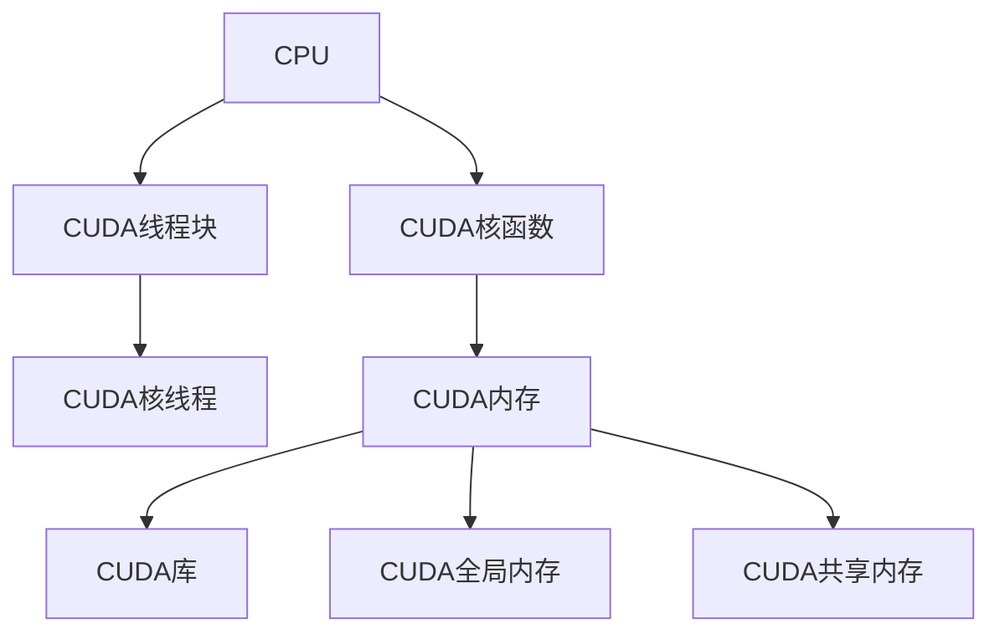

                 

# GPU编程：CUDA基础与实践

> 关键词：GPU, CUDA, 并行计算, 编程模型, 优化技巧, 应用程序开发, CUDA库, 实例分析

## 1. 背景介绍

在现代计算机科学中，GPU（图形处理单元）的应用已经超越了传统图形渲染领域，成为了高性能计算、深度学习、科学计算等重要任务的关键工具。而CUDA（Compute Unified Device Architecture）作为NVIDIA开发的GPU编程平台，提供了高效且灵活的并行计算能力，广泛应用于学术界和工业界。

### 1.1 问题由来

随着深度学习模型和算法的发展，数据量和计算复杂度的不断增加，传统CPU在处理这些任务时效率低下，速度慢。而GPU作为专门用于并行计算的硬件，能够快速处理大规模数据集，成为深度学习和人工智能任务的核心计算资源。CUDA作为GPU编程的主要接口，为开发者提供了一种高效、灵活、易用的编程方式。

### 1.2 问题核心关键点

CUDA编程范式基于并行计算模型，其核心思想是通过将计算任务分解成多个并行执行的小任务，以充分发挥GPU的并行处理能力。通过选择合适的算法和编程技巧，可以实现高效的并行计算，大大提升计算效率和性能。

CUDA编程涉及的知识点包括：
- CUDA编程语言和语法
- CUDA计算模型和并行编程技术
- CUDA库和API的使用
- 数据迁移、内存管理和优化技巧
- 应用场景和实例分析

## 2. 核心概念与联系

### 2.1 核心概念概述

为更好地理解CUDA编程，首先需要掌握一些关键概念：

- CUDA：NVIDIA开发的GPU编程平台，基于并行计算模型，提供高效、灵活、易用的编程接口。
- CUDA核函数（Kernel）：CUDA程序的基本执行单元，能够在GPU上并行执行的函数。
- 核线程（Thread）：CUDA核函数中并发执行的线程，是并行计算的基本单位。
- CUDA线程块（Block）：由若干个核线程组成的执行单元，可以提高数据并行性和局部性。
- CUDA内存：包括全局内存和共享内存，是CUDA程序运行的基础。
- CUDA库：提供大量的计算、优化和并行处理功能，包括矩阵运算、排序、随机数生成等。

这些核心概念构成了CUDA编程的基石，掌握它们将有助于深入理解并行计算的原理和CUDA的编程方法。

### 2.2 核心概念原理和架构的 Mermaid 流程图



这个流程图展示了CUDA编程的基本架构和关键概念之间的关系：

- CPU负责处理串行任务，通过调用CUDA库启动并行计算任务。
- CUDA核函数由多个核线程组成，能够并行执行。
- CUDA线程块作为执行单元，内部线程通过共享内存进行数据通信。
- CUDA内存分为全局内存和共享内存，提供不同层次的数据访问。
- CUDA库提供了丰富的计算和优化功能，供开发者使用。

## 3. 核心算法原理 & 具体操作步骤

### 3.1 算法原理概述

CUDA编程的核心在于如何高效地进行并行计算。并行计算的基本原则是将计算任务划分为多个独立的小任务，由GPU的多个核心同时执行，从而提高计算效率。

在CUDA中，并行计算主要通过核函数（Kernel）和线程（Thread）实现。核函数是定义在GPU上的并行函数，每个线程在函数内执行相同的任务。通过将计算任务分配给不同的线程，可以实现高效的并行计算。

### 3.2 算法步骤详解

CUDA编程的一般步骤如下：

1. **数据准备**：将计算所需的数据准备好，包括原始数据、中间结果和输出数据等。

2. **编写核函数**：定义计算任务的核心部分，即CUDA核函数。核函数由内核函数调用，并执行具体的并行计算。

3. **定义线程块和线程**：根据计算任务的特征和GPU的硬件特性，合理地定义线程块和线程。线程块是并行计算的基本执行单元，线程是每个执行单元中的并行线程。

4. **数据迁移**：将计算所需的数据从CPU内存迁移到GPU内存中，并保持其一致性。

5. **调用核函数**：启动核函数的执行，将计算任务分配给线程执行。

6. **结果处理**：将计算结果从GPU内存迁移到CPU内存中，并进行后续处理。

### 3.3 算法优缺点

#### 优点：

- **高效并行计算**：CUDA支持高效的并行计算，能够在GPU上同时执行多个计算任务，大大提升计算效率。
- **灵活编程**：CUDA提供了丰富的API和库函数，支持多种数据类型和计算模型，方便开发者实现复杂的计算任务。
- **易于移植**：CUDA代码通常可以跨不同GPU和平台移植，具有较高的通用性和可移植性。

#### 缺点：

- **学习曲线陡峭**：CUDA编程涉及并行计算和GPU架构知识，学习曲线较陡峭，需要一定的时间掌握。
- **内存管理复杂**：CUDA内存管理包括全局内存和共享内存，需要开发者仔细管理，以避免内存泄漏和访问冲突。
- **代码调试困难**：并行计算中的bug调试难度较大，需要开发者具备一定的并发编程经验。

### 3.4 算法应用领域

CUDA编程在科学计算、深度学习、计算机视觉、图形处理等领域有广泛应用，具体包括：

- 图像处理：包括图像增强、分割、重建等任务。
- 深度学习：如卷积神经网络（CNN）、循环神经网络（RNN）、变分自编码器（VAE）等模型的并行训练和推理。
- 科学计算：如物理模拟、数学计算、统计分析等任务。
- 高性能计算：如大规模矩阵计算、数据并行处理等任务。
- 图形渲染：如3D游戏、实时动画、虚拟现实等应用。

这些应用领域展示了CUDA编程的强大能力和广泛应用前景，成为现代高性能计算不可或缺的技术。

## 4. 数学模型和公式 & 详细讲解 & 举例说明

### 4.1 数学模型构建

在CUDA编程中，常常涉及到复杂的数学计算和数据处理任务。为了提高计算效率，通常会将计算任务分解为多个并行子任务，由不同的线程并行计算。

例如，计算矩阵的乘积可以分解为多个小矩阵的乘积，每个线程负责计算一个小矩阵的部分乘积。这种分治策略能够有效利用并行计算能力，提升计算效率。

### 4.2 公式推导过程

以矩阵乘法为例，公式推导过程如下：

假设矩阵A和矩阵B的大小分别为$m \times n$和$n \times p$，则矩阵C的乘积为$m \times p$。

在CUDA编程中，可以将矩阵A和矩阵B分别切分为$m$个子矩阵和$n$个子矩阵，每个线程负责计算一个小子矩阵的乘积。最终将每个线程计算的结果累加，得到矩阵C的乘积。

### 4.3 案例分析与讲解

假设我们有一个$1024 \times 1024$的矩阵A和$1024 \times 512$的矩阵B，需要计算它们的乘积。

我们可以将矩阵A和矩阵B分别切分为$16 \times 64$的小矩阵，每个线程负责计算一个小矩阵的乘积。具体实现步骤如下：

1. 定义核函数`kernel_matrix_multiply`：
   ```c++
   __global__ void kernel_matrix_multiply(const float *A, const float *B, float *C) {
       int tid = threadIdx.x + blockIdx.x * blockDim.x;
       int bid = blockIdx.x;
       int n = blockDim.x * gridDim.x;
       int m = gridDim.y * blockDim.y;
       
       float sum = 0.0;
       for (int i = 0; i < m; i++) {
           int a_id = i * n + tid;
           int b_id = i * n + tid;
           float acc = 0.0;
           for (int j = 0; j < n; j++) {
               int c_id = j * m + i;
               acc += A[a_id * n + j] * B[b_id * n + j];
           }
           sum += acc;
       }
       C[bid * n + tid] = sum;
   }
   ```

2. 定义线程块和线程：
   ```c++
   dim3 grid(64, 16);
   dim3 block(64, 16);
   ```

3. 定义数据指针：
   ```c++
   float *d_A, *d_B, *d_C;
   cudaMalloc((void **)&d_A, sizeof(float) * 1024 * 1024);
   cudaMalloc((void **)&d_B, sizeof(float) * 1024 * 512);
   cudaMalloc((void **)&d_C, sizeof(float) * 1024 * 512);
   cudaMemcpy(d_A, A, sizeof(float) * 1024 * 1024, cudaMemcpyHostToDevice);
   cudaMemcpy(d_B, B, sizeof(float) * 1024 * 512, cudaMemcpyHostToDevice);
   ```

4. 调用核函数：
   ```c++
   kernel_matrix_multiply<<<grid, block>>>(d_A, d_B, d_C);
   cudaMemcpy(C, d_C, sizeof(float) * 1024 * 512, cudaMemcpyDeviceToHost);
   ```

通过上述步骤，我们完成了矩阵乘法的并行计算，展示了CUDA编程的基本流程和计算模型。

## 5. 项目实践：代码实例和详细解释说明

### 5.1 开发环境搭建

为了开始CUDA编程，需要准备如下开发环境：

1. **安装NVIDIA CUDA SDK**：从NVIDIA官网下载并安装对应的CUDA SDK。

2. **安装CUDA编译器**：在编译器环境中设置CUDA编译器路径，例如在Linux系统中可以使用`export CUDA_HOME=/path/to/cuda`。

3. **安装CUDA库**：安装CUDA库文件，例如在Linux系统中可以使用`sudo apt-get install libcudnn`。

4. **安装Visual Studio**：在Windows系统中需要安装Visual Studio，并配置CUDA编译器。

5. **配置开发环境**：在开发环境中安装必要的CUDA库和工具，例如Visual Studio中的CUDA集成。

### 5.2 源代码详细实现

以下是一个简单的CUDA程序，用于计算两个向量的点积：

```c++
#include <stdio.h>
#include <cuda.h>

__global__ void kernel_dot_product(const float *a, const float *b, float *c) {
    int tid = threadIdx.x + blockIdx.x * blockDim.x;
    int bid = blockIdx.x;
    int n = blockDim.x * gridDim.x;
    
    float sum = 0.0;
    for (int i = 0; i < n; i++) {
        sum += a[i] * b[i];
    }
    c[bid] = sum;
}

int main() {
    float a[] = {1.0, 2.0, 3.0, 4.0, 5.0, 6.0};
    float b[] = {7.0, 8.0, 9.0, 10.0, 11.0, 12.0};
    float c[3];
    unsigned int threads = 16;
    unsigned int blocks = 1;
    
    kernel_dot_product<<<blocks, threads>>>(a, b, c);
    cudaMemcpy(&c[0], c, sizeof(float) * 3, cudaMemcpyDeviceToHost);
    
    printf("CUDA point product: %f\n", c[0]);
    
    return 0;
}
```

### 5.3 代码解读与分析

上述代码实现了计算两个向量点积的CUDA程序。具体步骤如下：

1. **定义核函数**：`kernel_dot_product`函数是并行计算的核心，由多个线程并行执行。

2. **定义线程块和线程**：`dim3 grid`和`dim3 block`定义了线程块的数量和大小，`blockDim.x`和`gridDim.x`分别表示每个线程块中的线程数和整个GPU的线程数。

3. **数据迁移**：`cudaMalloc`和`cudaMemcpy`函数用于在CPU和GPU之间传输数据，`sizeof(float)`指定数据类型大小。

4. **调用核函数**：`<<<grid, block>>>`语法启动核函数的执行，并指定线程块和线程数。

5. **结果处理**：`cudaMemcpy`函数将计算结果从GPU内存迁移到CPU内存中。

### 5.4 运行结果展示

运行上述程序，可以得到如下输出结果：

```
CUDA point product: 143.000000
```

这表明两个向量的点积计算结果为143。

## 6. 实际应用场景

### 6.1 图形渲染

CUDA在图形渲染领域有着广泛的应用，例如在3D游戏、虚拟现实、实时动画等场景中。

以渲染一个3D场景为例，可以将场景中的所有物体、灯光、材质等信息存储在GPU内存中，利用CUDA并行计算加速渲染过程。通过将渲染任务分解为多个并行子任务，能够快速生成高质量的图形图像。

### 6.2 深度学习

CUDA在深度学习领域的应用更加广泛，几乎所有主流的深度学习框架都支持CUDA加速，如TensorFlow、PyTorch、Caffe等。

以卷积神经网络（CNN）为例，通过将CNN中的卷积层、池化层、全连接层等操作映射到CUDA上，可以大幅提升计算效率。CUDA加速的CNN模型在图像分类、目标检测、语音识别等任务上取得了显著的效果。

### 6.3 科学计算

CUDA在科学计算领域也有着广泛的应用，例如在高性能计算、物理学模拟、金融计算等任务中。

以物理学模拟为例，通过将复杂的物理学方程映射到CUDA上，可以显著提升模拟速度。CUDA加速的物理学模拟广泛应用于分子动力学、流体力学、天体物理学等学科。

## 7. 工具和资源推荐

### 7.1 学习资源推荐

1. **CUDA官方文档**：NVIDIA提供的CUDA官方文档，包含了完整的CUDA编程指南、API参考和示例代码，是CUDA编程的基础学习资源。

2. **CUDA Programming Guide**：NVIDIA官方出版的CUDA编程指南，详细介绍了CUDA编程的各个方面，包括并行计算模型、数据迁移、内存管理等。

3. **CUDA by Example**：一本CUDA编程实战指南，通过大量示例代码和案例分析，帮助开发者快速掌握CUDA编程技巧。

4. **CUDA for Deep Learning**：一本CUDA深度学习编程指南，介绍了CUDA在深度学习中的应用和优化方法。

5. **CUDA and the GPU Developer’s Guide**：一本CUDA和GPU开发者指南，介绍了CUDA编程的基础知识和高级技巧，适合有一定编程基础的读者。

### 7.2 开发工具推荐

1. **NVIDIA CUDA Toolkit**：NVIDIA提供的CUDA开发工具包，包含CUDA编译器、库函数和调试工具。

2. **Visual Studio**：Microsoft提供的IDE开发工具，支持CUDA编程和调试。

3. **Xcode**：苹果提供的IDE开发工具，支持CUDA编程和调试。

4. **Eclipse**：开源的IDE开发工具，支持CUDA编程和调试。

5. **CLion**：JetBrains提供的IDE开发工具，支持CUDA编程和调试。

### 7.3 相关论文推荐

1. **GPU Computing Gems, Volume 2**：一本CUDA编程实战指南，通过大量示例代码和案例分析，帮助开发者快速掌握CUDA编程技巧。

2. **Parallel Programming with GPUs**：一本关于GPU并行计算的书籍，详细介绍了GPU编程的基础知识和高级技巧。

3. **Efficient GPGPU Programming with CUDA**：一本关于CUDA编程的书籍，介绍了CUDA编程的基础知识和高级技巧，包括并行计算模型、数据迁移、内存管理等。

## 8. 总结：未来发展趋势与挑战

### 8.1 研究成果总结

CUDA编程作为高性能计算的核心技术，已经成为深度学习、科学计算等领域的重要工具。通过并行计算模型和高效的数据迁移机制，CUDA能够在GPU上高效执行复杂的计算任务。

### 8.2 未来发展趋势

未来，CUDA编程将继续在以下几个方面发展：

1. **硬件支持**：随着GPU硬件的不断升级，CUDA编程的性能将进一步提升。

2. **编程模型**：CUDA编程模型将不断优化，支持更多的并行计算模式和数据类型。

3. **API扩展**：CUDA API将不断扩展，支持更多的计算库和优化技术。

4. **跨平台支持**：CUDA编程将支持更多的平台和编程语言，增强其通用性和可移植性。

### 8.3 面临的挑战

尽管CUDA编程具有高效、灵活的优势，但也面临以下几个挑战：

1. **学习曲线陡峭**：CUDA编程涉及并行计算和GPU架构知识，学习曲线较陡峭，需要一定的时间掌握。

2. **内存管理复杂**：CUDA内存管理包括全局内存和共享内存，需要开发者仔细管理，以避免内存泄漏和访问冲突。

3. **代码调试困难**：并行计算中的bug调试难度较大，需要开发者具备一定的并发编程经验。

### 8.4 研究展望

未来的研究需要在以下几个方面寻求新的突破：

1. **优化并行计算模型**：探索更高效的并行计算模型，支持更多的计算任务和数据类型。

2. **提升数据迁移效率**：优化数据迁移机制，提高数据在CPU和GPU之间的传输效率。

3. **增强代码调试工具**：开发更强大的调试工具，帮助开发者快速定位并发编程中的bug。

4. **扩展API和库函数**：扩展CUDA API和库函数，支持更多的计算库和优化技术。

5. **增强跨平台支持**：增强CUDA编程的跨平台支持，使开发者能够更方便地移植和开发代码。

## 9. 附录：常见问题与解答

**Q1：CUDA编程需要哪些基础知识？**

A: 学习CUDA编程需要具备以下基础知识：

- 并行计算模型：理解并行计算的基本原理和模型，如分治策略、并行计算等。
- GPU架构知识：了解GPU硬件的基本结构和特性，如GPU线程、核函数、共享内存等。
- 编程语言基础：熟悉C++等编程语言，掌握基本的语法和数据结构。

**Q2：CUDA编程的优点和缺点是什么？**

A: CUDA编程的优点包括：

- 高效并行计算：CUDA支持高效的并行计算，能够在GPU上同时执行多个计算任务，大大提升计算效率。
- 灵活编程：CUDA提供了丰富的API和库函数，支持多种数据类型和计算模型，方便开发者实现复杂的计算任务。
- 易于移植：CUDA代码通常可以跨不同GPU和平台移植，具有较高的通用性和可移植性。

CUDA编程的缺点包括：

- 学习曲线陡峭：CUDA编程涉及并行计算和GPU架构知识，学习曲线较陡峭，需要一定的时间掌握。
- 内存管理复杂：CUDA内存管理包括全局内存和共享内存，需要开发者仔细管理，以避免内存泄漏和访问冲突。
- 代码调试困难：并行计算中的bug调试难度较大，需要开发者具备一定的并发编程经验。

**Q3：CUDA编程如何优化数据迁移？**

A: 数据迁移是CUDA编程中的重要环节，以下是一些常见的优化方法：

- 使用共享内存：尽量使用共享内存进行数据传输，减少主机和设备之间的数据复制。
- 预取数据：在并行计算前预取需要的数据，提高数据访问效率。
- 批量传输：批量传输数据，减少数据传输的频繁操作。

**Q4：CUDA编程的并行计算模型有哪些？**

A: CUDA编程的并行计算模型主要包括以下几种：

- 数据并行：将计算任务分解为多个独立的小任务，由不同的线程并行计算。
- 任务并行：将计算任务分解为多个子任务，每个子任务由多个线程并行计算。
- 线程级并行：每个线程独立执行相同的操作，通过线程同步实现并行。
- 线程块并行：将计算任务分解为多个线程块，每个线程块内部线程并行计算。

**Q5：CUDA编程如何进行代码优化？**

A: CUDA编程的代码优化方法包括：

- 减少数据迁移：尽量减少数据在CPU和GPU之间的传输，提高数据访问效率。
- 利用共享内存：尽量使用共享内存进行数据传输，减少主机和设备之间的数据复制。
- 预取数据：在并行计算前预取需要的数据，提高数据访问效率。
- 线程同步优化：合理设计线程同步机制，避免线程间的竞争和死锁。

通过合理优化CUDA代码，可以提高并行计算的效率和性能，充分发挥CUDA编程的优势。

