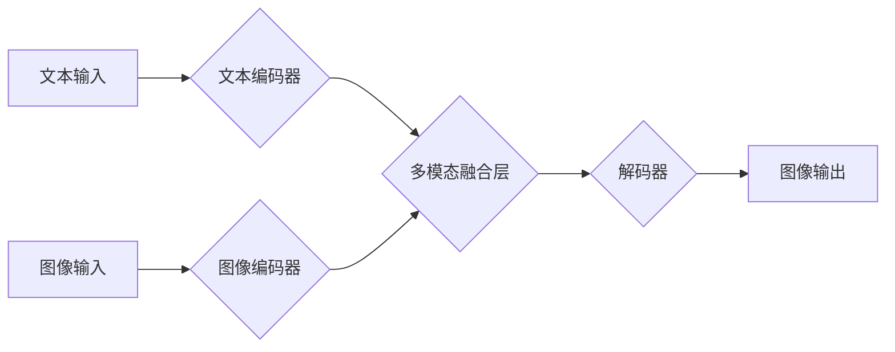

> 多模态大模型，智能试穿，计算机视觉，自然语言处理，深度学习，Transformer，图像生成，文本生成

## 1. 背景介绍

近年来，人工智能技术取得了飞速发展，特别是深度学习的兴起，为多模态大模型的构建提供了强大的技术支撑。多模态大模型是指能够处理多种模态数据（如文本、图像、音频、视频等）并进行跨模态理解和生成的大型语言模型。

智能试穿作为一种新兴的应用场景，充分体现了多模态大模型的价值。它利用计算机视觉技术对用户进行人体建模，并结合自然语言处理技术理解用户的试穿需求，最终生成虚拟试穿效果，为用户提供个性化的购物体验。

## 2. 核心概念与联系

多模态大模型的核心在于融合不同模态数据，实现跨模态的理解和生成。

**2.1 多模态数据融合**

多模态数据融合是指将来自不同模态的数据进行有效整合，提取其潜在的关联性和语义信息。常用的融合方法包括：

* **特征级融合:** 将不同模态的数据分别提取特征，然后将特征进行拼接或融合，形成新的特征向量。
* **表示级融合:** 将不同模态的数据分别表示为向量，然后将向量进行加权求和或其他融合操作，形成新的表示。
* **决策级融合:** 将不同模态的数据分别输入到不同的模型中，然后将模型的输出进行融合，形成最终的决策结果。

**2.2 跨模态理解与生成**

跨模态理解是指理解不同模态数据之间的关系和语义，例如从图像中理解文本描述，或从文本中生成图像。跨模态生成是指根据不同模态数据生成新的数据，例如根据文本描述生成图像，或根据图像生成文本。

**2.3 架构图**



## 3. 核心算法原理 & 具体操作步骤

### 3.1  算法原理概述

多模态大模型的训练通常采用自监督学习的方式，通过预训练模型在大量多模态数据上学习特征表示，并通过微调的方式将其应用于具体的应用场景。

常用的预训练任务包括：

* **图像分类:** 将图像分类为不同的类别。
* **文本分类:** 将文本分类为不同的类别。
* **图像字幕生成:** 将图像描述为文本。
* **文本到图像生成:** 根据文本描述生成图像。

### 3.2  算法步骤详解

1. **数据预处理:** 将多模态数据进行清洗、格式化和预处理，例如对图像进行裁剪、缩放和增强，对文本进行分词和词向量化。
2. **模型构建:** 根据具体的应用场景选择合适的模型架构，例如Transformer、CNN、RNN等。
3. **模型训练:** 使用预训练模型或从头训练模型，并使用交叉熵损失函数进行优化。
4. **模型评估:** 使用测试集评估模型的性能，例如准确率、召回率、F1-score等。
5. **模型部署:** 将训练好的模型部署到生产环境中，并进行线上监控和维护。

### 3.3  算法优缺点

**优点:**

* 能够处理多种模态数据，实现跨模态理解和生成。
* 能够学习到更丰富的语义信息，提高模型的性能。
* 能够应用于多种场景，例如智能试穿、图像字幕生成、文本到图像生成等。

**缺点:**

* 训练成本高，需要大量的计算资源和数据。
* 模型复杂度高，难以理解和调试。
* 存在数据偏差和公平性问题。

### 3.4  算法应用领域

多模态大模型在多个领域都有广泛的应用，例如：

* **计算机视觉:** 图像识别、物体检测、图像分割、图像生成等。
* **自然语言处理:** 文本分类、情感分析、机器翻译、文本摘要等。
* **语音识别:** 语音转文本、语音合成等。
* **多媒体分析:** 视频理解、音频识别等。

## 4. 数学模型和公式 & 详细讲解 & 举例说明

### 4.1  数学模型构建

多模态大模型的数学模型通常基于深度学习框架，例如TensorFlow或PyTorch。模型的结构通常由多个层组成，例如卷积层、全连接层、注意力层等。

### 4.2  公式推导过程

多模态大模型的训练过程通常使用反向传播算法进行优化。反向传播算法的核心是计算模型输出与真实值的误差，并根据误差反向传播更新模型参数。

**损失函数:**

$$
L = \sum_{i=1}^{N} \mathcal{L}(y_i, \hat{y}_i)
$$

其中：

* $L$ 是损失函数
* $N$ 是样本数量
* $\mathcal{L}$ 是单个样本的损失函数
* $y_i$ 是真实值
* $\hat{y}_i$ 是模型预测值

**梯度下降:**

$$
\theta = \theta - \alpha \nabla L(\theta)
$$

其中：

* $\theta$ 是模型参数
* $\alpha$ 是学习率
* $\nabla L(\theta)$ 是损失函数对模型参数的梯度

### 4.3  案例分析与讲解

例如，在图像字幕生成任务中，模型的输入是图像，输出是文本描述。损失函数可以是交叉熵损失函数，用于衡量模型预测的文本与真实文本之间的差异。

## 5. 项目实践：代码实例和详细解释说明

### 5.1  开发环境搭建

* Python 3.7+
* TensorFlow 2.0+
* PyTorch 1.0+
* CUDA 10.0+

### 5.2  源代码详细实现

```python
# 导入必要的库
import tensorflow as tf

# 定义模型架构
class MultiModalModel(tf.keras.Model):
    def __init__(self):
        super(MultiModalModel, self).__init__()
        # 定义图像编码器
        self.image_encoder = tf.keras.Sequential([
            tf.keras.layers.Conv2D(32, (3, 3), activation='relu'),
            tf.keras.layers.MaxPooling2D((2, 2)),
            tf.keras.layers.Conv2D(64, (3, 3), activation='relu'),
            tf.keras.layers.MaxPooling2D((2, 2)),
            tf.keras.layers.Flatten()
        ])
        # 定义文本编码器
        self.text_encoder = tf.keras.Sequential([
            tf.keras.layers.Embedding(vocab_size, embedding_dim),
            tf.keras.layers.LSTM(128)
        ])
        # 定义多模态融合层
        self.fusion_layer = tf.keras.layers.Concatenate()
        # 定义解码器
        self.decoder = tf.keras.Sequential([
            tf.keras.layers.Dense(vocab_size, activation='softmax')
        ])

    def call(self, images, texts):
        # 对图像进行编码
        image_features = self.image_encoder(images)
        # 对文本进行编码
        text_features = self.text_encoder(texts)
        # 将图像和文本特征进行融合
        fused_features = self.fusion_layer([image_features, text_features])
        # 使用解码器生成文本
        outputs = self.decoder(fused_features)
        return outputs

# 实例化模型
model = MultiModalModel()

# 编译模型
model.compile(optimizer='adam', loss='sparse_categorical_crossentropy', metrics=['accuracy'])

# 训练模型
model.fit(images, texts, epochs=10)
```

### 5.3  代码解读与分析

* 代码首先定义了多模态模型的架构，包括图像编码器、文本编码器、多模态融合层和解码器。
* 然后，代码实例化模型，并使用Adam优化器、交叉熵损失函数和准确率作为评估指标进行编译。
* 最后，代码使用训练数据训练模型，并设置训练轮数为10。

### 5.4  运行结果展示

训练完成后，可以将模型应用于新的图像和文本数据，生成相应的文本描述。

## 6. 实际应用场景

### 6.1 智能试穿

智能试穿系统利用多模态大模型，可以根据用户的体型和喜好，生成虚拟试穿效果，帮助用户选择合适的服装。

### 6.2 个性化推荐

多模态大模型可以分析用户的画像信息，包括用户的购买历史、浏览记录、喜好等，并根据用户的需求推荐个性化的商品。

### 6.3 内容创作

多模态大模型可以辅助内容创作，例如根据文本描述生成图像，或根据图像生成文本。

### 6.4 未来应用展望

多模态大模型在未来将有更广泛的应用，例如：

* **虚拟现实和增强现实:** 在虚拟现实和增强现实场景中，多模态大模型可以帮助用户更好地理解和交互。
* **医疗保健:** 多模态大模型可以辅助医生诊断疾病，并提供个性化的治疗方案。
* **教育:** 多模态大模型可以提供更生动的学习体验，并帮助学生更好地理解知识。

## 7. 工具和资源推荐

### 7.1  学习资源推荐

* **书籍:**
    * 《深度学习》
    * 《自然语言处理》
    * 《计算机视觉》
* **在线课程:**
    * Coursera
    * edX
    * Udacity

### 7.2  开发工具推荐

* **TensorFlow:** https://www.tensorflow.org/
* **PyTorch:** https://pytorch.org/
* **HuggingFace:** https://huggingface.co/

### 7.3  相关论文推荐

* **BERT:** https://arxiv.org/abs/1810.04805
* **GPT-3:** https://openai.com/blog/gpt-3/
* **DALL-E:** https://openai.com/blog/dall-e/

## 8. 总结：未来发展趋势与挑战

### 8.1  研究成果总结

多模态大模型在近年来取得了显著的进展，在图像识别、文本生成、语音识别等领域取得了优异的性能。

### 8.2  未来发展趋势

* **模型规模和能力的提升:** 未来多模态大模型的规模和能力将进一步提升，能够处理更复杂的任务。
* **跨模态理解和生成的增强:** 未来多模态大模型将更加擅长跨模态理解和生成，能够更好地理解和生成多模态数据。
* **应用场景的拓展:** 未来多模态大模型将应用于更多领域，例如医疗保健、教育、娱乐等。

### 8.3  面临的挑战

* **数据获取和标注:** 多模态数据的获取和标注成本较高，这限制了多模态大模型的训练和应用。
* **模型训练和推理效率:** 多模态大模型的训练和推理效率较低，这限制了其在实际应用中的部署。
* **公平性和可解释性:** 多模态大模型存在数据偏差和公平性问题，其决策过程也难以解释，这需要进一步研究和解决。

### 8.4  研究展望

未来，多模态大模型的研究将继续深入，解决上述挑战，并推动多模态大模型在更多领域得到应用。

## 9. 附录：常见问题与解答

**Q1: 多模态大模型的训练需要哪些数据？**

**A1:** 多模态大模型的训练需要多种模态数据，例如图像、文本、音频、视频等。

**Q2: 多模态