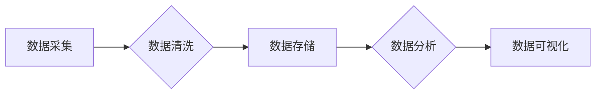

> 大数据架构,分布式存储,数据处理,流式计算,数据仓库,Hadoop,Spark,Kafka,Flink,数据模型,数据分析

## 1. 背景介绍

随着互联网和移动互联网的蓬勃发展，海量数据正在以指数级增长。如何高效地存储、处理和分析这些数据成为了当今社会面临的重大挑战。大数据架构应运而生，它提供了一种处理海量数据的有效解决方案。

大数据架构的核心是分布式存储和处理，它将数据分散存储在多个节点上，并利用并行计算技术进行数据处理。这种架构能够有效地应对海量数据的存储和处理需求，并提高数据处理效率。

## 2. 核心概念与联系

大数据架构的核心概念包括：

* **分布式存储**: 将数据分散存储在多个节点上，提高数据存储的可靠性和扩展性。
* **分布式计算**: 利用并行计算技术，将数据处理任务分解成多个子任务，并分别在不同的节点上进行处理，提高数据处理效率。
* **数据流处理**: 实时处理流式数据，例如传感器数据、社交媒体数据等，及时获取数据洞察。
* **数据仓库**: 将来自不同来源的数据整合到一个集中式存储库中，方便进行数据分析和报表生成。

**Mermaid 流程图:**



## 3. 核心算法原理 & 具体操作步骤

### 3.1  算法原理概述

大数据架构中常用的算法包括：

* **MapReduce**: 分布式计算框架，将数据处理任务分解成多个Map和Reduce任务，并分别在不同的节点上进行处理。
* **Spark**: 通用大数据处理框架，支持批处理、流式处理和机器学习等多种计算模式。
* **Kafka**: 流式数据处理平台，用于收集、存储和传输流式数据。
* **Flink**: 流式数据处理框架，支持实时数据处理和窗口操作。

### 3.2  算法步骤详解

**MapReduce 算法步骤:**

1. **数据分片**: 将数据划分为多个数据块，每个数据块分配到不同的节点上进行处理。
2. **Map 操作**: 对每个数据块进行处理，将数据转换为键值对。
3. **数据聚合**: 将所有节点上的键值对进行聚合，将相同键的值合并在一起。
4. **Reduce 操作**: 对聚合后的键值对进行处理，生成最终结果。

### 3.3  算法优缺点

**MapReduce 算法优点:**

* 分布式处理，能够有效地处理海量数据。
* 简单易用，易于开发和部署。

**MapReduce 算法缺点:**

* 数据处理速度相对较慢，不适合实时数据处理。
* 数据处理模式相对单一，难以处理复杂的数据处理任务。

### 3.4  算法应用领域

MapReduce 算法广泛应用于：

* 数据清洗和预处理
* 数据聚合和统计分析
* 文本挖掘和信息检索
* 图数据分析

## 4. 数学模型和公式 & 详细讲解 & 举例说明

### 4.1  数学模型构建

大数据架构中的数据处理过程可以抽象为一个数学模型，其中数据量、处理速度、资源消耗等因素都可量化表示。

**数据量**: $D = \sum_{i=1}^{n} d_i$

其中，$D$ 表示数据总量，$n$ 表示数据块数量，$d_i$ 表示每个数据块的大小。

**处理速度**: $S = \frac{D}{T}$

其中，$S$ 表示处理速度，$T$ 表示处理时间。

**资源消耗**: $R = \alpha D + \beta T$

其中，$R$ 表示资源消耗，$\alpha$ 和 $\beta$ 为常数，分别表示数据量和处理时间对资源消耗的影响。

### 4.2  公式推导过程

通过上述数学模型，我们可以推导出以下公式：

* 处理时间: $T = \frac{D}{S}$
* 资源消耗: $R = \alpha D + \beta \frac{D}{S}$

### 4.3  案例分析与讲解

假设我们有一个数据量为 100GB 的数据，需要在 1小时内处理完毕。如果处理速度为 10GB/分钟，则处理时间为 10小时。

如果资源消耗与数据量和处理时间成正比，则资源消耗为：

$R = \alpha \cdot 100GB + \beta \cdot 10hours$

通过调整 $\alpha$ 和 $\beta$ 的值，我们可以优化资源消耗。

## 5. 项目实践：代码实例和详细解释说明

### 5.1  开发环境搭建

本项目使用 Java 语言开发，并使用 Apache Spark 框架进行数据处理。

开发环境搭建步骤如下：

1. 安装 Java JDK
2. 安装 Apache Spark
3. 配置 Spark 环境变量

### 5.2  源代码详细实现

```java
import org.apache.spark.SparkConf;
import org.apache.spark.SparkContext;
import org.apache.spark.api.java.JavaRDD;
import org.apache.spark.api.java.JavaSparkContext;

public class WordCount {

    public static void main(String[] args) {
        // 创建 SparkConf 配置对象
        SparkConf conf = new SparkConf().setAppName("WordCount").setMaster("local");
        // 创建 SparkContext 上下文对象
        JavaSparkContext sc = new JavaSparkContext(conf);

        // 读取文本文件
        JavaRDD<String> lines = sc.textFile("input.txt");

        // 将文本文件中的每一行分割成单词
        JavaRDD<String> words = lines.flatMap(line -> java.util.Arrays.asList(line.split(" ")).iterator());

        // 对单词进行计数
        JavaPairRDD<String, Integer> wordCounts = words.mapToPair(word -> new Tuple2<>(word, 1)).reduceByKey((a, b) -> a + b);

        // 打印结果
        wordCounts.foreach(println);

        // 关闭 SparkContext
        sc.stop();
    }
}
```

### 5.3  代码解读与分析

* `SparkConf` 对象用于配置 Spark 应用的运行环境。
* `SparkContext` 对象是 Spark 应用的入口点，用于创建 RDD 和执行 Spark 操作。
* `textFile()` 方法用于读取文本文件。
* `flatMap()` 方法用于将每个元素转换为多个元素。
* `mapToPair()` 方法用于将每个元素转换为键值对。
* `reduceByKey()` 方法用于对相同键的值进行聚合。
* `foreach()` 方法用于迭代输出结果。

### 5.4  运行结果展示

运行上述代码后，将输出每个单词出现的次数。

## 6. 实际应用场景

大数据架构在各个领域都有广泛的应用场景，例如：

* **电商**: 分析用户行为，推荐商品，优化营销策略。
* **金融**: 风险管理，欺诈检测，客户画像。
* **医疗**: 疾病诊断，药物研发，健康管理。
* **交通**: 交通流量预测，路况监测，智能导航。

### 6.4  未来应用展望

随着人工智能、机器学习等技术的不断发展，大数据架构将更加智能化、自动化，并应用于更多领域。

## 7. 工具和资源推荐

### 7.1  学习资源推荐

* **书籍**:
    * 《大数据架构设计与实践》
    * 《Spark权威指南》
    * 《Kafka权威指南》
* **在线课程**:
    * Coursera: Big Data
    * edX: Data Science
    * Udemy: Hadoop and Spark

### 7.2  开发工具推荐

* **Hadoop**: 分布式存储和处理框架
* **Spark**: 通用大数据处理框架
* **Kafka**: 流式数据处理平台
* **Flink**: 流式数据处理框架

### 7.3  相关论文推荐

* **MapReduce**:
    * Dean, J., & Ghemawat, S. (2004). MapReduce: Simplified data processing on large clusters.
* **Spark**:
    * Zaharia, M., et al. (2010). Spark: Cluster computing with working sets.
* **Kafka**:
    * Neumeier, J., et al. (2011). Kafka: A distributed streaming platform.

## 8. 总结：未来发展趋势与挑战

### 8.1  研究成果总结

大数据架构的发展取得了显著成果，为海量数据存储、处理和分析提供了有效解决方案。

### 8.2  未来发展趋势

* **更智能化**: 利用人工智能和机器学习技术，实现大数据架构的自动化和智能化。
* **更实时化**: 支持更实时的数据处理，满足实时数据分析的需求。
* **更安全**: 加强数据安全保护，防止数据泄露和攻击。

### 8.3  面临的挑战

* **数据规模和复杂度**: 海量数据的存储和处理仍然是一个挑战。
* **数据质量**: 数据质量问题会影响数据分析结果的准确性。
* **人才短缺**: 大数据架构领域人才短缺是一个普遍问题。

### 8.4  研究展望

未来，大数据架构的研究将继续深入，探索更先进的算法、架构和技术，以应对海量数据带来的挑战，并为社会发展提供更多支持。

## 9. 附录：常见问题与解答

**常见问题**:

* **大数据架构有哪些类型？**
* **如何选择合适的分布式存储系统？**
* **如何优化大数据处理性能？**

**解答**:

* 大数据架构类型包括：批处理架构、流式处理架构、混合架构等。
* 选择分布式存储系统时，需要考虑数据量、访问频率、数据一致性等因素。
* 优化大数据处理性能的方法包括：数据分区、数据压缩、缓存机制等。


作者：禅与计算机程序设计艺术 / Zen and the Art of Computer Programming 
<end_of_turn>