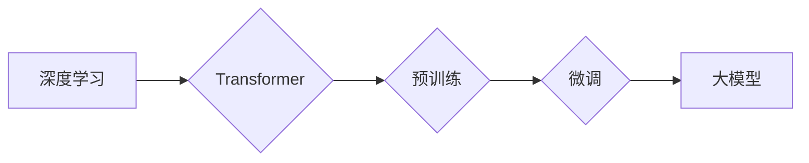

> 大模型、深度学习、Transformer、自然语言处理、计算机视觉、生成式模型、商业应用

## 1. 背景介绍

近年来，人工智能（AI）领域取得了令人瞩目的进展，其中大模型（Large Language Models，LLMs）作为其重要组成部分，展现出强大的学习和推理能力，在自然语言处理（NLP）、计算机视觉（CV）等领域取得了突破性成果。

大模型是指参数规模庞大、训练数据海量的人工智能模型。与传统机器学习模型相比，大模型拥有更强的泛化能力和表达能力，能够处理更复杂的任务，并生成更逼真的输出结果。

大模型的兴起，得益于以下几个关键因素：

* **计算能力的提升:**  近年来，GPU和TPU等高性能计算设备的不断发展，为大模型的训练提供了强大的计算支撑。
* **数据量的爆炸式增长:**  互联网的普及和数字化转型，使得海量数据资源得以积累，为大模型的训练提供了充足的数据支撑。
* **算法的创新:**  Transformer等新型神经网络架构的出现，有效提升了大模型的训练效率和性能。

## 2. 核心概念与联系

大模型的核心概念包括：

* **深度学习:**  大模型基于深度神经网络，通过多层神经元网络结构，学习数据中的复杂特征和模式。
* **Transformer:**  Transformer是一种新型的神经网络架构，通过自注意力机制，能够有效捕捉文本序列中的长距离依赖关系，成为大模型训练的基石。
* **预训练:**  大模型通常采用预训练的方式进行训练，先在大量文本数据上进行预训练，学习通用语言表示，然后在特定任务上进行微调。
* **参数量:**  大模型的参数量通常非常庞大，例如GPT-3拥有1750亿个参数，BERT拥有3.4亿个参数。

**Mermaid 流程图:**



## 3. 核心算法原理 & 具体操作步骤

### 3.1  算法原理概述

大模型的核心算法原理是深度学习，特别是Transformer架构。Transformer通过自注意力机制，能够有效捕捉文本序列中的长距离依赖关系，从而实现更准确的语言理解和生成。

### 3.2  算法步骤详解

大模型的训练过程通常包括以下步骤：

1. **数据预处理:**  收集和清洗训练数据，将其转换为模型可识别的格式。
2. **模型构建:**  根据预定的模型架构，构建深度神经网络模型。
3. **模型训练:**  使用训练数据，通过反向传播算法，调整模型参数，使模型输出与真实值尽可能接近。
4. **模型评估:**  使用测试数据，评估模型的性能，例如准确率、召回率等。
5. **模型部署:**  将训练好的模型部署到实际应用场景中。

### 3.3  算法优缺点

**优点:**

* **强大的泛化能力:**  大模型能够学习到数据中的通用特征，从而在未见过的任务上表现出色。
* **优秀的表达能力:**  大模型拥有庞大的参数量，能够表达更复杂的语言结构和语义关系。
* **多任务学习:**  大模型可以同时学习多个任务，提高资源利用率。

**缺点:**

* **训练成本高:**  大模型的训练需要大量的计算资源和时间。
* **数据依赖性强:**  大模型的性能取决于训练数据的质量和数量。
* **可解释性差:**  大模型的决策过程复杂，难以解释其背后的逻辑。

### 3.4  算法应用领域

大模型在以下领域具有广泛的应用前景：

* **自然语言处理:**  文本生成、机器翻译、问答系统、情感分析等。
* **计算机视觉:**  图像识别、物体检测、图像生成等。
* **语音识别:**  语音转文本、语音合成等。
* **代码生成:**  自动生成代码、代码修复等。

## 4. 数学模型和公式 & 详细讲解 & 举例说明

### 4.1  数学模型构建

大模型的数学模型通常基于深度神经网络，其核心是多层感知机（MLP）和自注意力机制。

* **多层感知机 (MLP):**  MLP由多个全连接层组成，每个层都有多个神经元，通过权重和激活函数进行计算。

* **自注意力机制 (Self-Attention):**  自注意力机制能够捕捉文本序列中的长距离依赖关系，其核心是计算每个词与其他词之间的注意力权重，并根据权重进行加权求和。

### 4.2  公式推导过程

**自注意力机制的公式推导过程如下:**

1. **计算词嵌入:**  将每个词转换为向量表示，称为词嵌入。

2. **计算查询 (Query)、键 (Key) 和值 (Value):**  对每个词嵌入进行线性变换，得到查询、键和值向量。

3. **计算注意力权重:**  计算查询向量与键向量的点积，并通过softmax函数归一化得到注意力权重。

4. **加权求和:**  根据注意力权重，对值向量进行加权求和，得到每个词的上下文表示。

**公式:**

* 词嵌入:  $x_i$
* 查询向量:  $q_i = W_q x_i$
* 键向量:  $k_i = W_k x_i$
* 值向量:  $v_i = W_v x_i$
* 注意力权重:  $a_{ij} = \frac{exp(q_i \cdot k_j)}{\sum_{l} exp(q_i \cdot k_l)}$
* 上下文表示:  $c_i = \sum_{j} a_{ij} v_j$

### 4.3  案例分析与讲解

例如，在机器翻译任务中，大模型可以利用自注意力机制，捕捉源语言句子中每个词与目标语言句子的对应关系，从而实现更准确的翻译。

## 5. 项目实践：代码实例和详细解释说明

### 5.1  开发环境搭建

大模型的开发环境通常需要安装深度学习框架（如TensorFlow、PyTorch）和必要的库（如NumPy、pandas）。

### 5.2  源代码详细实现

以下是一个使用PyTorch实现简单自注意力机制的代码示例：

```python
import torch
import torch.nn as nn

class SelfAttention(nn.Module):
    def __init__(self, embed_dim, num_heads):
        super(SelfAttention, self).__init__()
        self.embed_dim = embed_dim
        self.num_heads = num_heads
        self.head_dim = embed_dim // num_heads

        self.query = nn.Linear(embed_dim, embed_dim)
        self.key = nn.Linear(embed_dim, embed_dim)
        self.value = nn.Linear(embed_dim, embed_dim)
        self.fc_out = nn.Linear(embed_dim, embed_dim)

    def forward(self, x):
        batch_size, seq_len, embed_dim = x.size()

        # Linear projections
        q = self.query(x).view(batch_size, seq_len, self.num_heads, self.head_dim).transpose(1, 2)
        k = self.key(x).view(batch_size, seq_len, self.num_heads, self.head_dim).transpose(1, 2)
        v = self.value(x).view(batch_size, seq_len, self.num_heads, self.head_dim).transpose(1, 2)

        # Scaled dot-product attention
        scores = torch.matmul(q, k.transpose(-2, -1)) / torch.sqrt(torch.tensor(self.head_dim, dtype=torch.float))
        attn = nn.functional.softmax(scores, dim=-1)
        context = torch.matmul(attn, v)

        # Concatenate heads and project
        context = context.transpose(1, 2).contiguous().view(batch_size, seq_len, embed_dim)
        output = self.fc_out(context)

        return output
```

### 5.3  代码解读与分析

该代码实现了一个简单的自注意力机制，其核心步骤包括：

1. 将输入向量进行线性变换，得到查询、键和值向量。
2. 计算查询向量与键向量的点积，并通过softmax函数归一化得到注意力权重。
3. 根据注意力权重，对值向量进行加权求和，得到每个词的上下文表示。
4. 将多个头的上下文表示拼接起来，并进行线性变换，得到最终的输出。

### 5.4  运行结果展示

运行该代码，可以得到每个词的上下文表示，并将其用于后续的自然语言处理任务。

## 6. 实际应用场景

### 6.1  自然语言处理

大模型在自然语言处理领域取得了突破性进展，例如：

* **文本生成:**  GPT-3能够生成高质量的文本，例如文章、故事、诗歌等。
* **机器翻译:**  BERT能够实现更准确的机器翻译，例如英语到中文的翻译。
* **问答系统:**  大模型能够理解自然语言问题，并给出准确的答案。

### 6.2  计算机视觉

大模型也应用于计算机视觉领域，例如：

* **图像识别:**  大模型能够识别图像中的物体，例如人、动物、车辆等。
* **物体检测:**  大模型能够定位图像中的物体，并识别其类别。
* **图像生成:**  大模型能够生成逼真的图像，例如风景、人物等。

### 6.3  语音识别

大模型在语音识别领域也取得了进展，例如：

* **语音转文本:**  大模型能够将语音转换为文本，例如语音助手、会议记录等。
* **语音合成:**  大模型能够将文本转换为语音，例如语音播报、虚拟助手等。

### 6.4  未来应用展望

大模型的应用前景广阔，未来可能在以下领域得到更广泛的应用：

* **个性化教育:**  根据学生的学习情况，提供个性化的学习内容和辅导。
* **医疗诊断:**  辅助医生进行疾病诊断，提高诊断准确率。
* **科学研究:**  加速科学研究，例如药物研发、材料科学等。

## 7. 工具和资源推荐

### 7.1  学习资源推荐

* **书籍:**
    * 《深度学习》
    * 《自然语言处理》
    * 《Transformer模型》
* **在线课程:**
    * Coursera: 深度学习
    * edX: 自然语言处理
    * fast.ai: 深度学习

### 7.2  开发工具推荐

* **深度学习框架:**
    * TensorFlow
    * PyTorch
    * Keras
* **编程语言:**
    * Python
    * C++

### 7.3  相关论文推荐

* 《Attention Is All You Need》
* 《BERT: Pre-training of Deep Bidirectional Transformers for Language Understanding》
* 《GPT-3: Language Models are Few-Shot Learners》

## 8. 总结：未来发展趋势与挑战

### 8.1  研究成果总结

近年来，大模型在人工智能领域取得了显著进展，展现出强大的学习和推理能力，在自然语言处理、计算机视觉等领域取得了突破性成果。

### 8.2  未来发展趋势

大模型的未来发展趋势包括：

* **模型规模的进一步扩大:**  随着计算能力的提升，大模型的规模将继续扩大，从而提升其性能。
* **模型架构的创新:**  新的模型架构将不断涌现，例如混合模型、联邦学习等，提升模型的效率和鲁棒性。
* **多模态学习:**  大模型将融合多模态数据，例如文本、图像、音频等，实现更全面的理解和生成。

### 8.3  