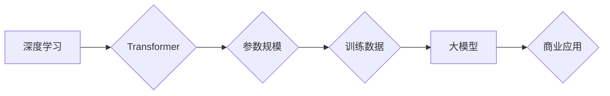

> 大模型、人工智能、深度学习、Transformer、商业模式、应用场景、未来趋势

## 1. 背景介绍

人工智能（AI）技术近年来取得了飞速发展，其中大模型作为AI领域的重要突破，正在深刻地改变着我们生活和工作方式。大模型是指参数规模庞大、训练数据海量的人工智能模型，其强大的学习能力和泛化能力使其能够在自然语言处理、计算机视觉、语音识别等多个领域取得突破性进展。

随着大模型技术的不断成熟，其商业价值也日益凸显。大模型可以被应用于各种商业场景，例如：

* **个性化推荐:** 大模型可以分析用户的行为数据和偏好，提供更精准的商品推荐，提升用户体验和转化率。
* **智能客服:** 大模型可以理解用户的自然语言，提供快速、高效的客户服务，降低人工成本。
* **内容创作:** 大模型可以生成高质量的文本、图像、音频等内容，帮助企业进行内容营销和品牌建设。
* **数据分析:** 大模型可以分析海量数据，挖掘隐藏的商业价值，帮助企业做出更明智的决策。

## 2. 核心概念与联系

大模型的核心概念包括：

* **深度学习:** 大模型的训练基于深度学习算法，通过多层神经网络学习数据特征，实现复杂的模式识别和预测。
* **Transformer:** Transformer是一种新型的神经网络架构，其自注意力机制能够有效捕捉文本序列中的长距离依赖关系，为大模型的训练和应用提供了强大的支持。
* **参数规模:** 大模型的参数规模通常在数十亿甚至数千亿级别，庞大的参数量使得模型能够学习更复杂的知识和模式。
* **训练数据:** 大模型的训练需要海量的数据，数据质量和规模直接影响模型的性能。

**Mermaid 流程图:**



## 3. 核心算法原理 & 具体操作步骤

### 3.1  算法原理概述

大模型的训练主要基于深度学习算法，其中Transformer架构是目前主流的模型结构。Transformer模型的核心是自注意力机制，它能够有效捕捉文本序列中的长距离依赖关系，提升模型的理解和生成能力。

### 3.2  算法步骤详解

大模型的训练过程可以概括为以下步骤：

1. **数据预处理:** 将原始数据进行清洗、格式化和编码，使其能够被模型理解。
2. **模型构建:** 根据预设的架构，搭建Transformer模型，并初始化模型参数。
3. **模型训练:** 使用训练数据，通过反向传播算法，更新模型参数，使其能够更好地拟合数据。
4. **模型评估:** 使用验证数据评估模型的性能，并根据评估结果调整训练参数。
5. **模型部署:** 将训练好的模型部署到实际应用场景中，用于进行预测或生成任务。

### 3.3  算法优缺点

**优点:**

* **强大的学习能力:** 大模型能够学习海量数据中的复杂模式，实现更精准的预测和生成。
* **泛化能力强:** 大模型在不同领域和任务上都表现出较强的泛化能力。
* **可迁移性高:** 大模型可以迁移到不同的应用场景，降低开发成本。

**缺点:**

* **训练成本高:** 大模型的训练需要大量的计算资源和时间。
* **数据依赖性强:** 大模型的性能直接取决于训练数据的质量和规模。
* **可解释性差:** 大模型的决策过程较为复杂，难以解释其背后的逻辑。

### 3.4  算法应用领域

大模型在以下领域具有广泛的应用前景：

* **自然语言处理:** 文本分类、情感分析、机器翻译、对话系统等。
* **计算机视觉:** 图像识别、物体检测、图像生成等。
* **语音识别:** 语音转文本、语音合成等。
* **推荐系统:** 商品推荐、内容推荐等。
* **医疗诊断:** 病症诊断、药物研发等。

## 4. 数学模型和公式 & 详细讲解 & 举例说明

### 4.1  数学模型构建

Transformer模型的核心是自注意力机制，其数学模型可以表示为：

$$
Attention(Q, K, V) = \frac{exp(Q \cdot K^T / \sqrt{d_k})}{exp(Q \cdot K^T / \sqrt{d_k})} \cdot V
$$

其中：

* $Q$：查询矩阵
* $K$：键矩阵
* $V$：值矩阵
* $d_k$：键向量的维度

### 4.2  公式推导过程

自注意力机制通过计算查询向量与键向量的点积，并将其归一化，得到注意力权重。注意力权重用于加权求和值向量，从而得到最终的输出。

### 4.3  案例分析与讲解

假设我们有一个句子“我爱学习编程”，其词向量表示为：

* 我：[0.1, 0.2, 0.3]
* 爱：[0.4, 0.5, 0.6]
* 学习：[0.7, 0.8, 0.9]
* 编程：[1.0, 1.1, 1.2]

当我们计算“学习”词的注意力权重时，会将“学习”词的词向量作为查询向量，其他词的词向量作为键向量。通过计算点积和归一化，得到每个词对“学习”词的注意力权重，然后将这些权重与对应的值向量进行加权求和，得到最终的输出。

## 5. 项目实践：代码实例和详细解释说明

### 5.1  开发环境搭建

* Python 3.7+
* TensorFlow 2.0+
* PyTorch 1.0+

### 5.2  源代码详细实现

```python
import tensorflow as tf

# 定义Transformer模型
class Transformer(tf.keras.Model):
    def __init__(self, vocab_size, embedding_dim, num_heads, num_layers):
        super(Transformer, self).__init__()
        self.embedding = tf.keras.layers.Embedding(vocab_size, embedding_dim)
        self.transformer_layers = tf.keras.layers.StackedRNNCells([
            tf.keras.layers.MultiHeadAttention(num_heads=num_heads, key_dim=embedding_dim)
            for _ in range(num_layers)
        ])

    def call(self, inputs):
        embeddings = self.embedding(inputs)
        outputs = self.transformer_layers(embeddings)
        return outputs

# 实例化模型
model = Transformer(vocab_size=10000, embedding_dim=128, num_heads=8, num_layers=6)

# 训练模型
model.compile(optimizer='adam', loss='mse')
model.fit(x_train, y_train, epochs=10)
```

### 5.3  代码解读与分析

* 模型定义: Transformer模型由嵌入层、多头注意力层和堆叠的RNN单元组成。
* 嵌入层: 将词索引转换为词向量。
* 多头注意力层: 捕捉文本序列中的长距离依赖关系。
* 堆叠的RNN单元: 进一步处理注意力输出，提升模型的表达能力。
* 模型训练: 使用Adam优化器和均方误差损失函数训练模型。

### 5.4  运行结果展示

训练完成后，可以将模型应用于文本生成、机器翻译等任务，并评估模型的性能。

## 6. 实际应用场景

### 6.1  个性化推荐

大模型可以分析用户的行为数据和偏好，提供更精准的商品推荐，提升用户体验和转化率。例如，电商平台可以利用大模型构建个性化推荐系统，推荐用户可能感兴趣的商品。

### 6.2  智能客服

大模型可以理解用户的自然语言，提供快速、高效的客户服务，降低人工成本。例如，客服机器人可以利用大模型处理用户的常见问题，释放人工客服的精力。

### 6.3  内容创作

大模型可以生成高质量的文本、图像、音频等内容，帮助企业进行内容营销和品牌建设。例如，营销公司可以利用大模型生成吸引用户的广告文案和创意内容。

### 6.4  未来应用展望

大模型的应用场景还在不断扩展，未来将应用于更多领域，例如：

* **医疗诊断:** 大模型可以辅助医生进行病症诊断，提高诊断准确率。
* **教育教学:** 大模型可以个性化定制学习内容，提升学生的学习效率。
* **科学研究:** 大模型可以帮助科学家分析海量数据，加速科研成果的产生。

## 7. 工具和资源推荐

### 7.1  学习资源推荐

* **书籍:**
    * 《深度学习》
    * 《Transformer模型详解》
* **在线课程:**
    * Coursera: 深度学习
    * Udacity: 自然语言处理
* **博客:**
    * The Gradient
    * Towards Data Science

### 7.2  开发工具推荐

* **TensorFlow:** 开源深度学习框架
* **PyTorch:** 开源深度学习框架
* **Hugging Face:** 大模型库和工具平台

### 7.3  相关论文推荐

* 《Attention Is All You Need》
* 《BERT: Pre-training of Deep Bidirectional Transformers for Language Understanding》
* 《GPT-3: Language Models are Few-Shot Learners》

## 8. 总结：未来发展趋势与挑战

### 8.1  研究成果总结

大模型技术取得了显著进展，在自然语言处理、计算机视觉等领域取得了突破性成果。大模型的应用场景也越来越广泛，正在深刻地改变着我们的生活和工作方式。

### 8.2  未来发展趋势

* **模型规模继续扩大:** 未来大模型的规模将继续扩大，参数量将达到万亿甚至千亿级别。
* **模型架构更加复杂:** 未来大模型的架构将更加复杂，融合多种不同的模型结构，提升模型的性能和泛化能力。
* **多模态学习:** 未来大模型将能够处理多种模态的数据，例如文本、图像、音频等，实现跨模态的理解和生成。

### 8.3  面临的挑战

* **训练成本高:** 大模型的训练需要大量的计算资源和时间，成本较高。
* **数据安全和隐私:** 大模型的训练需要海量数据，如何保证数据安全和隐私是一个重要的挑战。
* **可解释性差:** 大模型的决策过程较为复杂，难以解释其背后的逻辑，这可能会导致模型的应用受到限制。

### 8.4  研究展望

未来研究将集中在以下几个方面:

* **降低训练成本:** 研究更有效的训练算法和硬件架构，降低大模型的训练成本。
* **提高模型可解释性:** 研究更易于理解的大模型架构和解释方法，提升模型的可解释性。
* **探索新的应用场景:** 探索大模型在更多领域的应用，例如医疗、教育、科学研究等。

## 9. 附录：常见问题与解答

**Q1: 大模型的训练需要多少数据？**

A1: 大模型的训练需要海量数据，通常需要数十亿甚至数千亿个数据点。

**Q2: 大模型的训练需要多少计算资源？**

A2: 大模型的训练需要大量的计算资源，通常需要数百甚至数千个GPU。

**Q3: 如何评估大模型的性能？**

A3: 大模型的性能可以根据具体的应用场景进行评估，例如，对于文本生成任务，可以评估模型生成的文本的流畅度、准确性和相关性。

**作者：禅与计算机程序设计艺术 / Zen and the Art of Computer Programming**


<end_of_turn>