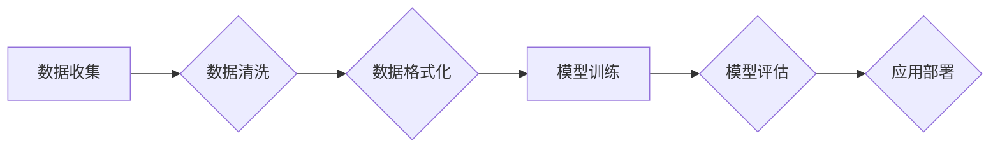

> 大规模语言模型，深度学习，Transformer，自然语言处理，数据预处理，模型训练，应用场景

## 1. 背景介绍

近年来，深度学习技术取得了飞速发展，特别是大规模语言模型（Large Language Models，LLMs）的出现，为自然语言处理（Natural Language Processing，NLP）领域带来了革命性的变革。LLMs 拥有庞大的参数量和海量文本数据训练，能够理解和生成人类语言，展现出强大的文本生成、翻译、问答、摘要等能力。

然而，LLMs 的训练和应用也面临着诸多挑战，其中数据质量和规模是关键因素。高质量、大规模的数据是 LLMs 训练和优化的基础，直接影响模型的性能和泛化能力。本文将深入探讨大规模语言模型从理论到实践的各个方面，重点关注专业数据在 LLMs 训练和应用中的作用。

## 2. 核心概念与联系

**2.1 大规模语言模型 (LLMs)**

LLMs 是指参数量超过数十亿甚至千亿的深度学习模型，通过学习海量文本数据，能够理解和生成人类语言。常见的 LLMs 包括 GPT-3、BERT、LaMDA 等。

**2.2 深度学习 (Deep Learning)**

深度学习是机器学习的一种，利用多层神经网络模拟人类大脑的学习过程。深度学习模型能够从数据中自动提取特征，并进行复杂的模式识别和预测。

**2.3 自然语言处理 (NLP)**

NLP 是计算机科学的一个分支，致力于使计算机能够理解、处理和生成人类语言。NLP 涉及多种任务，例如文本分类、情感分析、机器翻译、问答系统等。

**2.4 专业数据**

专业数据是指特定领域或应用场景下收集和整理的专业知识和信息。例如，医学领域的数据、法律领域的数据、金融领域的数据等。

**2.5 数据预处理**

数据预处理是指对原始数据进行清洗、转换和格式化，使其能够被模型有效地学习和使用。

**2.6 模型训练**

模型训练是指利用训练数据，调整模型参数，使其能够准确地完成指定任务的过程。

**2.7 模型评估**

模型评估是指使用测试数据，评估模型的性能和泛化能力的过程。

**2.8 应用场景**

LLMs 在各个领域都有广泛的应用场景，例如：

* **文本生成:** 自动写作、创意写作、代码生成
* **机器翻译:** 跨语言文本翻译
* **问答系统:** 提供准确的答案和信息
* **情感分析:** 分析文本的情感倾向
* **聊天机器人:** 与用户进行自然语言对话

**2.9 Mermaid 流程图**



## 3. 核心算法原理 & 具体操作步骤

**3.1 算法原理概述**

大规模语言模型的核心算法是基于 Transformer 架构的深度神经网络。Transformer 模型利用自注意力机制，能够捕捉文本序列中长距离依赖关系，从而实现更准确的语言理解和生成。

**3.2 算法步骤详解**

1. **数据预处理:** 将原始文本数据进行清洗、格式化和编码，使其能够被模型理解。
2. **模型训练:** 利用训练数据，通过反向传播算法，调整模型参数，使其能够准确地预测下一个词。
3. **模型评估:** 使用测试数据，评估模型的性能，例如困惑度、BLEU 等指标。
4. **模型部署:** 将训练好的模型部署到实际应用场景中，例如聊天机器人、文本生成工具等。

**3.3 算法优缺点**

**优点:**

* 能够捕捉长距离依赖关系，提高文本理解和生成能力。
* 训练效率高，能够训练出参数量巨大的模型。

**缺点:**

* 计算资源需求高，训练成本较高。
* 对数据质量要求较高，训练数据需要足够大且高质量。

**3.4 算法应用领域**

* 自然语言理解
* 机器翻译
* 文本生成
* 聊天机器人
* 代码生成

## 4. 数学模型和公式 & 详细讲解 & 举例说明

**4.1 数学模型构建**

LLMs 通常采用 Transformer 架构，其核心是自注意力机制。自注意力机制能够计算每个词与其他词之间的相关性，从而捕捉文本序列中的长距离依赖关系。

**4.2 公式推导过程**

自注意力机制的计算公式如下：

$$
Attention(Q, K, V) = softmax(\frac{QK^T}{\sqrt{d_k}})V
$$

其中：

* $Q$：查询矩阵
* $K$：键矩阵
* $V$：值矩阵
* $d_k$：键向量的维度
* $softmax$：softmax 函数

**4.3 案例分析与讲解**

假设我们有一个句子 "The cat sat on the mat"，其词向量表示为：

* The: [0.1, 0.2, 0.3]
* cat: [0.4, 0.5, 0.6]
* sat: [0.7, 0.8, 0.9]
* on: [0.2, 0.3, 0.4]
* the: [0.1, 0.2, 0.3]
* mat: [0.5, 0.6, 0.7]

利用自注意力机制，我们可以计算每个词与其他词之间的相关性，例如，"cat" 与 "sat" 之间的相关性较高，因为它们在语义上紧密相关。

## 5. 项目实践：代码实例和详细解释说明

**5.1 开发环境搭建**

* Python 3.7+
* PyTorch 或 TensorFlow
* CUDA 和 cuDNN

**5.2 源代码详细实现**

```python
import torch
import torch.nn as nn

class Transformer(nn.Module):
    def __init__(self, vocab_size, embedding_dim, num_heads, num_layers):
        super(Transformer, self).__init__()
        self.embedding = nn.Embedding(vocab_size, embedding_dim)
        self.transformer_layers = nn.ModuleList([
            nn.TransformerEncoderLayer(embedding_dim, num_heads)
            for _ in range(num_layers)
        ])
        self.linear = nn.Linear(embedding_dim, vocab_size)

    def forward(self, x):
        x = self.embedding(x)
        for layer in self.transformer_layers:
            x = layer(x)
        x = self.linear(x)
        return x
```

**5.3 代码解读与分析**

* `Transformer` 类定义了 Transformer 模型的结构。
* `embedding` 层将词索引转换为词向量。
* `transformer_layers` 是一个列表，包含多个 Transformer Encoder Layer。
* `linear` 层将输出向量映射到词汇表大小。

**5.4 运行结果展示**

训练好的 Transformer 模型可以用于各种 NLP 任务，例如文本生成、机器翻译等。

## 6. 实际应用场景

**6.1 文本生成**

LLMs 可以用于自动生成各种文本，例如文章、故事、诗歌等。

**6.2 机器翻译**

LLMs 可以用于将文本从一种语言翻译成另一种语言。

**6.3 问答系统**

LLMs 可以用于构建问答系统，能够回答用户提出的问题。

**6.4 情感分析**

LLMs 可以用于分析文本的情感倾向，例如判断文本是积极的、消极的还是中性的。

**6.5 聊天机器人**

LLMs 可以用于构建聊天机器人，能够与用户进行自然语言对话。

**6.6 未来应用展望**

LLMs 的应用场景还在不断扩展，未来可能会应用于更多领域，例如：

* 教育：个性化学习、智能辅导
* 医疗：疾病诊断、医疗记录分析
* 法律：法律文本分析、合同审查
* 金融：风险评估、欺诈检测

## 7. 工具和资源推荐

**7.1 学习资源推荐**

* **书籍:**
    * 《深度学习》
    * 《自然语言处理》
* **在线课程:**
    * Coursera: 深度学习
    * Udacity: 自然语言处理
* **博客:**
    * The Gradient
    * Towards Data Science

**7.2 开发工具推荐**

* **框架:**
    * PyTorch
    * TensorFlow
* **库:**
    * Hugging Face Transformers
    * NLTK
* **平台:**
    * Google Colab
    * Paperspace Gradient

**7.3 相关论文推荐**

* Attention Is All You Need
* BERT: Pre-training of Deep Bidirectional Transformers for Language Understanding
* GPT-3: Language Models are Few-Shot Learners

## 8. 总结：未来发展趋势与挑战

**8.1 研究成果总结**

近年来，大规模语言模型取得了显著进展，在各种 NLP 任务中展现出强大的能力。

**8.2 未来发展趋势**

* 模型规模进一步扩大
* 训练数据质量和多样性提升
* 模型训练效率和可解释性增强
* 应用场景更加广泛

**8.3 面临的挑战**

* 数据安全和隐私保护
* 模型偏见和公平性
* 计算资源需求高
* 模型可解释性和安全性

**8.4 研究展望**

未来研究将重点关注解决上述挑战，开发更安全、更可靠、更可解释的大规模语言模型，并将其应用于更多领域，为人类社会带来更多福祉。

## 9. 附录：常见问题与解答

**9.1 如何选择合适的 LLMs？**

选择合适的 LLMs 需要根据具体的应用场景和需求进行考虑，例如模型规模、参数量、训练数据、性能指标等。

**9.2 如何进行 LLMs 的训练和评估？**

LLMs 的训练和评估需要专业的技术知识和经验，通常需要使用高性能计算平台和专门的工具。

**9.3 LLMs 的应用有哪些伦理问题？**

LLMs 的应用可能带来一些伦理问题，例如数据隐私、模型偏见、信息操纵等，需要引起重视并制定相应的规范和制度。


作者：禅与计算机程序设计艺术 / Zen and the Art of Computer Programming 
<end_of_turn>