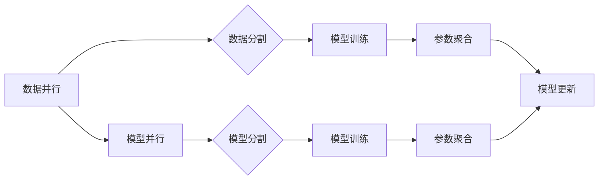

> 大规模语言模型，分布式训练，并行策略，深度学习，模型规模，效率优化

## 1. 背景介绍

近年来，深度学习技术取得了飞速发展，大规模语言模型（Large Language Models，LLMs）作为其重要分支，在自然语言处理领域展现出强大的能力，例如文本生成、翻译、问答等。这些模型通常拥有数十亿甚至数千亿的参数，需要海量数据和强大的计算资源进行训练。然而，单机训练难以满足大规模模型的需求，分布式训练成为主流趋势。

分布式训练是指将模型参数和数据分布到多个计算节点上，并行训练模型，从而缩短训练时间和降低成本。然而，分布式训练也面临着诸多挑战，例如数据并行、模型并行、通信开销等。

## 2. 核心概念与联系

### 2.1 数据并行

数据并行是指将训练数据分割到不同的计算节点上，每个节点训练一个模型副本，并最终将模型参数进行聚合。

### 2.2 模型并行

模型并行是指将模型参数分割到不同的计算节点上，每个节点训练模型的一部分，并最终将模型参数进行聚合。

### 2.3 通信开销

通信开销是指模型参数和梯度在不同计算节点之间传输所消耗的时间和资源。

**Mermaid 流程图**



## 3. 核心算法原理 & 具体操作步骤

### 3.1 算法原理概述

分布式训练的核心算法是**参数服务器**和**异步更新**。参数服务器负责存储模型参数，并接收来自各个计算节点的梯度更新。异步更新是指每个计算节点独立地更新模型参数，并异步地将更新发送到参数服务器。

### 3.2 算法步骤详解

1. 将模型参数和训练数据分布到不同的计算节点上。
2. 每个计算节点根据本地数据训练模型，并计算梯度。
3. 每个计算节点将梯度发送到参数服务器。
4. 参数服务器将所有节点的梯度进行聚合，并更新模型参数。
5. 更新后的模型参数被广播到所有计算节点。
6. 重复步骤2-5，直到模型训练完成。

### 3.3 算法优缺点

**优点:**

* 能够有效利用多台机器的计算资源，加速模型训练。
* 降低了单个节点的内存压力，支持训练更大规模的模型。

**缺点:**

* 通信开销较高，可能会影响训练效率。
* 需要复杂的分布式系统架构和管理。

### 3.4 算法应用领域

分布式训练广泛应用于各种深度学习任务，例如：

* 自然语言处理：训练大型语言模型、机器翻译模型等。
* computer vision：训练图像识别模型、目标检测模型等。
* speech recognition：训练语音识别模型等。

## 4. 数学模型和公式 & 详细讲解 & 举例说明

### 4.1 数学模型构建

假设模型参数为$\theta$, 训练数据为$\{x_i, y_i\}_{i=1}^{N}$, 损失函数为$L(\theta, x_i, y_i)$. 

分布式训练的目标是找到最优参数$\theta$，使得损失函数最小化：

$$\theta^* = \arg \min_{\theta} \frac{1}{N} \sum_{i=1}^{N} L(\theta, x_i, y_i)$$

### 4.2 公式推导过程

使用梯度下降算法更新模型参数：

$$\theta = \theta - \eta \nabla_{\theta} L(\theta, x_i, y_i)$$

其中，$\eta$为学习率，$\nabla_{\theta} L(\theta, x_i, y_i)$为损失函数关于参数$\theta$的梯度。

在分布式训练中，每个计算节点计算本地数据上的梯度，并将其发送到参数服务器。参数服务器将所有节点的梯度进行聚合，并更新全局模型参数。

### 4.3 案例分析与讲解

假设我们有一个包含1000个样本的数据集，将其分布到4个计算节点上，每个节点训练250个样本。

每个节点计算本地数据上的梯度，并将其发送到参数服务器。参数服务器将所有节点的梯度进行平均，并更新全局模型参数。

这种方式可以有效利用4个计算节点的计算资源，加速模型训练。

## 5. 项目实践：代码实例和详细解释说明

### 5.1 开发环境搭建

* 操作系统：Linux
* Python版本：3.7+
* 深度学习框架：PyTorch

### 5.2 源代码详细实现

```python
import torch
import torch.nn as nn
import torch.distributed as dist

# 定义模型
class MyModel(nn.Module):
    # ...

# 初始化分布式训练环境
dist.init_process_group(backend='nccl')

# 获取当前进程ID
rank = dist.get_rank()

# 实例化模型
model = MyModel()

# 将模型参数分布到各个进程
model.to(rank)

# 定义优化器
optimizer = torch.optim.Adam(model.parameters())

# 训练循环
for epoch in range(num_epochs):
    # 每个进程训练本地数据
    # ...

    # 将梯度发送到参数服务器
    dist.all_reduce(optimizer.grad)

    # 更新模型参数
    optimizer.step()

# 保存模型
torch.save(model.state_dict(), 'model.pth')
```

### 5.3 代码解读与分析

* `torch.distributed.init_process_group()`：初始化分布式训练环境。
* `dist.get_rank()`：获取当前进程ID。
* `model.to(rank)`：将模型参数分布到各个进程。
* `dist.all_reduce()`：将所有进程的梯度进行聚合。
* `torch.save()`：保存训练后的模型参数。

### 5.4 运行结果展示

运行上述代码，可以将模型训练任务分布到多个计算节点上，并观察训练速度和资源利用率的提升。

## 6. 实际应用场景

### 6.1 自然语言处理

* 训练大型语言模型，例如GPT-3、BERT等，用于文本生成、翻译、问答等任务。
* 训练机器翻译模型，例如Google Translate，用于将文本从一种语言翻译成另一种语言。

### 6.2 computer vision

* 训练图像识别模型，例如ImageNet，用于识别图像中的物体。
* 训练目标检测模型，例如YOLO，用于检测图像中的多个物体。

### 6.3 speech recognition

* 训练语音识别模型，例如Google Speech Recognition，用于将语音转换为文本。

### 6.4 未来应用展望

随着计算资源的不断发展，分布式训练技术将应用于更多领域，例如：

* 药物研发：训练模型预测药物的活性。
* 金融预测：训练模型预测股票价格、风险等。
* 个性化推荐：训练模型推荐个性化商品、服务等。

## 7. 工具和资源推荐

### 7.1 学习资源推荐

* 深度学习框架文档：PyTorch、TensorFlow等
* 分布式训练教程：
    * https://pytorch.org/tutorials/intermediate/distrib_data_parallel_tutorial.html
    * https://www.tensorflow.org/guide/distributed_training

### 7.2 开发工具推荐

* 容器化工具：Docker、Kubernetes
* 分布式计算框架：Spark、Ray

### 7.3 相关论文推荐

* Dean, J., Corrado, G. S., Monga, R., Chen, K., Devin, M., Le, Q. V., ... & Ng, A. Y. (2012). Large scale distributed deep networks. In Advances in neural information processing systems (pp. 1223-1231).
* Abadi, M., Agarwal, A., Barham, P., Brevdo, E., Chen, Z., Citro, C., ... & Zheng, Z. (2016). TensorFlow: Large-scale machine learning on heterogeneous systems. Software available from tensorflow.org.

## 8. 总结：未来发展趋势与挑战

### 8.1 研究成果总结

分布式训练技术取得了显著进展，能够有效训练大规模模型，并应用于各种深度学习任务。

### 8.2 未来发展趋势

* 模型并行策略的优化：探索更有效的模型并行策略，例如混合并行、模型剪枝等。
* 通信优化技术：开发更有效的通信优化技术，例如数据压缩、模型蒸馏等。
* 异构计算资源利用：利用GPU、CPU、FPGA等异构计算资源，提高训练效率。

### 8.3 面临的挑战

* 通信开销：分布式训练中通信开销仍然是一个挑战，需要进一步优化。
* 模型训练稳定性：分布式训练模型的训练稳定性需要进一步提高。
* 系统复杂性：分布式训练系统复杂度高，需要更完善的管理和监控机制。

### 8.4 研究展望

未来研究将继续探索更有效的分布式训练策略，降低通信开销，提高模型训练稳定性和效率，推动大规模模型的进一步发展。

## 9. 附录：常见问题与解答

### 9.1 如何选择合适的分布式训练框架？

选择合适的分布式训练框架需要考虑以下因素：

* 深度学习框架兼容性
* 支持的硬件平台
* 框架易用性和社区支持

### 9.2 如何优化分布式训练的通信开销？

可以采用以下方法优化分布式训练的通信开销：

* 数据压缩
* 模型蒸馏
* 异步更新

### 9.3 如何解决分布式训练模型的训练稳定性问题？

可以采用以下方法解决分布式训练模型的训练稳定性问题：

* 使用同步更新策略
* 使用模型平均策略
* 使用梯度裁剪技术


作者：禅与计算机程序设计艺术 / Zen and the Art of Computer Programming 
<end_of_turn>