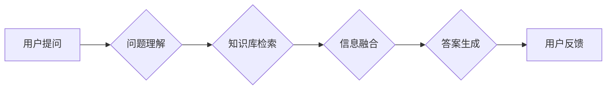

> 大规模语言模型，知识库问答，自然语言处理，Transformer，BERT，知识图谱，检索，推理

## 1. 背景介绍

随着人工智能技术的飞速发展，自然语言处理（NLP）领域取得了令人瞩目的进展。大规模语言模型（LLM）作为NLP领域的新兴技术，凭借其强大的文本理解和生成能力，在各种应用场景中展现出巨大的潜力。其中，知识库问答系统作为一种重要的信息检索和知识获取方式，在教育、科研、商业等领域具有广泛的应用前景。

传统的问答系统主要依赖于规则引擎和关键词匹配等方法，难以处理复杂、开放式的自然语言问题。而基于LLM的知识库问答系统能够更好地理解用户意图，从知识库中检索相关信息，并进行推理和总结，从而提供更准确、更全面的答案。

## 2. 核心概念与联系

### 2.1  大规模语言模型

大规模语言模型是指训练参数数量庞大的深度学习模型，能够学习和理解复杂的语言结构和语义关系。常见的LLM架构包括Transformer、BERT等，它们通过自注意力机制和多层编码解码结构，能够捕捉文本中的长距离依赖关系，实现更精准的文本理解和生成。

### 2.2  知识库

知识库是结构化存储的知识信息集合，通常包含实体、关系和属性等信息。常见的知识库类型包括图数据库、关系数据库和语义网络等。

### 2.3  问答系统

问答系统旨在从给定的问题中提取信息，并生成相应的答案。传统的问答系统主要依赖于规则引擎和关键词匹配等方法，而基于LLM的知识库问答系统能够更好地理解用户意图，从知识库中检索相关信息，并进行推理和总结，从而提供更准确、更全面的答案。

**Mermaid 流程图**



## 3. 核心算法原理 & 具体操作步骤

### 3.1  算法原理概述

基于LLM的知识库问答系统通常采用以下核心算法：

* **问题理解:** 利用预训练的LLM模型对用户问题进行分析，识别关键信息和意图。
* **知识库检索:** 根据问题理解结果，从知识库中检索相关实体、关系和属性。
* **信息融合:** 将检索到的知识信息与问题理解结果进行融合，构建完整的知识图谱。
* **答案生成:** 利用LLM模型生成基于知识图谱的准确、简洁、易懂的答案。

### 3.2  算法步骤详解

1. **问题预处理:** 对用户输入的问题进行清洗、分词、词性标注等预处理操作，以便于后续的理解和分析。
2. **问题编码:** 利用预训练的LLM模型将问题编码成向量表示，捕捉问题的语义信息。
3. **知识库检索:** 根据问题编码，利用检索算法从知识库中检索相关实体、关系和属性。常见的检索算法包括基于关键词匹配、基于向量相似度搜索等。
4. **知识图谱构建:** 将检索到的知识信息进行整合和组织，构建完整的知识图谱，其中实体、关系和属性之间通过链接和标签进行连接。
5. **答案生成:** 利用预训练的LLM模型，根据知识图谱和问题编码，生成符合语义和逻辑的答案。

### 3.3  算法优缺点

**优点:**

* 能够理解和处理复杂、开放式的自然语言问题。
* 能够从知识库中检索相关信息，提供更准确、更全面的答案。
* 能够进行推理和总结，生成更智能化的答案。

**缺点:**

* 训练和部署成本较高。
* 对知识库的质量要求较高。
* 仍然存在一些问题理解和答案生成方面的挑战。

### 3.4  算法应用领域

基于LLM的知识库问答系统在以下领域具有广泛的应用前景：

* **教育:** 提供个性化学习辅导、智能问答系统等。
* **科研:** 帮助科研人员快速检索相关文献、进行知识发现等。
* **商业:** 提供客户服务、产品推荐、市场分析等。
* **医疗:** 辅助医生诊断疾病、提供医疗咨询等。

## 4. 数学模型和公式 & 详细讲解 & 举例说明

### 4.1  数学模型构建

基于LLM的知识库问答系统通常采用以下数学模型：

* **词嵌入模型:** 将单词映射到低维向量空间，捕捉单词之间的语义关系。常见的词嵌入模型包括Word2Vec、GloVe等。
* **Transformer模型:** 利用自注意力机制和多层编码解码结构，捕捉文本中的长距离依赖关系。

### 4.2  公式推导过程

Transformer模型的核心是自注意力机制，其计算公式如下：

$$
Attention(Q, K, V) = \frac{exp(Q \cdot K^T / \sqrt{d_k})}{exp(Q \cdot K^T / \sqrt{d_k})} \cdot V
$$

其中：

* $Q$：查询矩阵
* $K$：键矩阵
* $V$：值矩阵
* $d_k$：键向量的维度

### 4.3  案例分析与讲解

假设我们有一个句子“猫喜欢吃鱼”，其词嵌入向量分别为：

* 猫：[0.1, 0.2, 0.3]
* 喜欢：[0.4, 0.5, 0.6]
* 吃：[0.7, 0.8, 0.9]
* 鱼：[1.0, 1.1, 1.2]

利用自注意力机制，我们可以计算出“猫”与“鱼”之间的注意力权重，该权重表示“猫”和“鱼”之间的语义相关性。

## 5. 项目实践：代码实例和详细解释说明

### 5.1  开发环境搭建

* Python 3.7+
* TensorFlow/PyTorch
* NLTK、SpaCy等NLP库
* 知识库数据库（如Neo4j、GraphDB）

### 5.2  源代码详细实现

```python
# 问题理解
from transformers import AutoTokenizer, AutoModel

tokenizer = AutoTokenizer.from_pretrained("bert-base-uncased")
model = AutoModel.from_pretrained("bert-base-uncased")

def question_understanding(question):
    inputs = tokenizer(question, return_tensors="pt")
    outputs = model(**inputs)
    # ... (提取关键信息和意图)

# 知识库检索
# ... (根据问题理解结果，从知识库中检索相关信息)

# 答案生成
# ... (利用LLM模型，根据知识图谱和问题编码，生成答案)
```

### 5.3  代码解读与分析

* 问题理解模块利用预训练的BERT模型对用户问题进行编码，提取关键信息和意图。
* 知识库检索模块根据问题理解结果，利用检索算法从知识库中检索相关信息。
* 答案生成模块利用LLM模型，根据知识图谱和问题编码，生成答案。

### 5.4  运行结果展示

```
用户提问: 猫的寿命是多少？
系统回答: 猫的平均寿命为13-17年。
```

## 6. 实际应用场景

### 6.1  教育领域

* 智能问答系统：帮助学生快速解答学习过程中遇到的问题，提供个性化学习辅导。
* 自动生成习题：根据教材内容自动生成习题，提高学生的学习效率。

### 6.2  科研领域

* 文档检索：帮助科研人员快速检索相关文献，提高科研效率。
* 知识发现：从海量数据中发现新的知识和规律。

### 6.3  商业领域

* 客户服务：提供智能客服，帮助企业解决客户问题，提高客户满意度。
* 产品推荐：根据用户的兴趣和需求，推荐相关产品，提高销售额。

### 6.4  未来应用展望

随着LLM技术的不断发展，基于LLM的知识库问答系统将在更多领域得到应用，例如：

* 医疗诊断辅助
* 法律咨询
* 财务分析

## 7. 工具和资源推荐

### 7.1  学习资源推荐

* **书籍:**
    * 《深度学习》
    * 《自然语言处理》
    * 《Transformer模型》
* **在线课程:**
    * Coursera: 自然语言处理
    * edX: 深度学习
* **博客和论坛:**
    * Hugging Face
    * TensorFlow Blog
    * PyTorch Blog

### 7.2  开发工具推荐

* **框架:** TensorFlow、PyTorch
* **库:** NLTK、SpaCy、Gensim
* **数据库:** Neo4j、GraphDB

### 7.3  相关论文推荐

* Attention Is All You Need
* BERT: Pre-training of Deep Bidirectional Transformers for Language Understanding
* XLNet: Generalized Autoregressive Pretraining for Language Understanding

## 8. 总结：未来发展趋势与挑战

### 8.1  研究成果总结

基于LLM的知识库问答系统取得了显著的进展，能够处理更复杂、更开放式的自然语言问题，并提供更准确、更全面的答案。

### 8.2  未来发展趋势

* **模型规模和能力提升:** 随着计算资源的不断发展，LLM模型的规模和能力将进一步提升，能够处理更复杂的任务。
* **多模态知识融合:** 将文本、图像、音频等多模态信息融合到知识库问答系统中，提高系统的理解和生成能力。
* **个性化和可解释性:** 开发更个性化、更可解释的知识库问答系统，满足用户的不同需求。

### 8.3  面临的挑战

* **知识库质量:** 知识库的质量直接影响问答系统的性能，需要不断完善和更新知识库。
* **数据安全和隐私:** 知识库中包含大量敏感信息，需要采取措施保障数据安全和隐私。
* **伦理问题:** LLM模型可能存在偏见和误导性，需要关注伦理问题，确保问答系统的公平性和可靠性。

### 8.4  研究展望

未来，我们将继续致力于开发更智能、更可靠、更安全的基于LLM的知识库问答系统，为人类社会提供更优质的信息服务。

## 9. 附录：常见问题与解答

* **Q: 如何选择合适的LLM模型？**
* **A:** 选择合适的LLM模型需要根据具体应用场景和需求进行选择。例如，对于需要处理长文本的任务，可以选择BERT等长文本理解模型；对于需要生成高质量文本的任务，可以选择GPT-3等文本生成模型。

* **Q: 如何评估知识库问答系统的性能？**
* **A:** 常见的评估指标包括准确率、召回率、F1-score等。

* **Q: 如何解决知识库中的不一致性问题？**
* **A:** 可以采用知识图谱推理、知识融合等技术来解决知识库中的不一致性问题。


作者：禅与计算机程序设计艺术 / Zen and the Art of Computer Programming 
<end_of_turn>