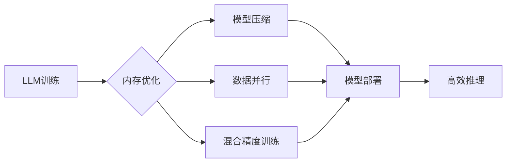

> 大规模语言模型，内存优化，计算设备，理论模型，实践应用，算法原理，数学模型，代码实现，性能提升

## 1. 背景介绍

近年来，大规模语言模型（LLM）在自然语言处理领域取得了显著的进展，展现出强大的文本生成、翻译、问答等能力。然而，LLM的训练和部署都面临着巨大的计算资源和内存需求挑战。随着模型规模的不断扩大，内存占用量呈指数级增长，这限制了模型的训练效率和部署范围。因此，如何有效优化LLM的内存使用效率，成为当前研究的热点问题。

## 2. 核心概念与联系

**2.1 核心概念**

* **大规模语言模型 (LLM):** 指参数数量庞大的深度学习模型，能够理解和生成人类语言。
* **内存优化:** 指通过算法、数据结构和硬件优化，降低模型训练和推理过程中对内存的占用。
* **计算设备:** 指用于训练和部署LLM的硬件平台，例如GPU、TPU等。

**2.2 核心概念联系**

LLM的训练和部署需要大量的计算资源和内存。计算设备提供强大的计算能力，但内存容量仍然是限制因素。因此，需要通过内存优化技术，提高LLM在计算设备上的运行效率。

**2.3  Mermaid 流程图**



## 3. 核心算法原理 & 具体操作步骤

**3.1 算法原理概述**

内存优化算法主要通过以下几种方式来降低LLM的内存占用：

* **模型压缩:** 通过量化、剪枝、知识蒸馏等方法，减少模型参数数量，从而降低内存需求。
* **数据并行:** 将训练数据分片，并行处理，减少每个设备的内存占用。
* **混合精度训练:** 使用不同精度的数据类型进行训练，例如使用FP16精度进行计算，而使用FP32精度存储模型参数，从而降低内存占用。

**3.2 算法步骤详解**

**3.2.1 模型压缩**

1. **量化:** 将模型参数从高精度（例如FP32）转换为低精度（例如INT8），减少每个参数的存储空间。
2. **剪枝:** 移除模型中不重要的权重，减少模型参数数量。
3. **知识蒸馏:** 使用一个小的模型来模仿一个大的模型的输出，从而减少模型大小。

**3.2.2 数据并行**

1. 将训练数据分片，每个设备处理一部分数据。
2. 使用分布式训练框架，例如TensorFlow或PyTorch，协调各设备的训练过程。
3. 将模型参数在各设备之间进行同步更新。

**3.2.3 混合精度训练**

1. 使用FP16精度进行模型计算，减少计算所需的内存空间。
2. 使用FP32精度存储模型参数，保证模型精度。
3. 在需要高精度的计算时，例如反向传播，使用FP32精度进行计算。

**3.3 算法优缺点**

| 算法 | 优点 | 缺点 |
|---|---|---|
| 模型压缩 | 降低模型大小，减少内存占用 | 可能导致模型精度下降 |
| 数据并行 | 提高训练速度，利用多设备资源 | 需要分布式训练框架，增加开发复杂度 |
| 混合精度训练 | 降低内存占用，提高训练速度 | 可能导致模型精度下降 |

**3.4 算法应用领域**

* **自然语言处理:** 优化LLM的训练和部署，例如BERT、GPT等模型。
* **计算机视觉:** 优化深度学习模型的训练和推理，例如图像分类、目标检测等任务。
* **推荐系统:** 优化推荐模型的训练和部署，提高推荐效率和准确性。

## 4. 数学模型和公式 & 详细讲解 & 举例说明

**4.1 数学模型构建**

假设一个LLM模型有N个参数，每个参数占用M字节内存。则模型总内存占用量为：

$$
Total Memory = N * M
$$

**4.2 公式推导过程**

模型压缩可以减少模型参数数量，从而降低内存占用。假设模型压缩后参数数量减少为N'，则压缩后的内存占用量为：

$$
Compressed Memory = N' * M
$$

**4.3 案例分析与讲解**

假设一个LLM模型有10亿个参数，每个参数占用4字节内存，则模型总内存占用量为：

$$
Total Memory = 10^9 * 4 = 4GB
$$

如果使用量化技术将模型参数压缩到INT8精度，每个参数占用1字节内存，则压缩后的内存占用量为：

$$
Compressed Memory = 10^9 * 1 = 1GB
$$

可见，模型压缩可以将内存占用量降低4倍。

## 5. 项目实践：代码实例和详细解释说明

**5.1 开发环境搭建**

* 操作系统：Ubuntu 20.04
* Python 版本：3.8
* 深度学习框架：PyTorch 1.8

**5.2 源代码详细实现**

```python
import torch
import torch.nn as nn

# 定义一个简单的线性模型
class LinearModel(nn.Module):
    def __init__(self, input_size, output_size):
        super(LinearModel, self).__init__()
        self.linear = nn.Linear(input_size, output_size)

    def forward(self, x):
        return self.linear(x)

# 创建模型实例
model = LinearModel(input_size=10, output_size=5)

# 使用量化技术压缩模型
quantized_model = torch.quantization.quantize_dynamic(model, {torch.nn.Linear}, dtype=torch.qint8)

# 保存压缩后的模型
torch.save(quantized_model.state_dict(), "quantized_model.pth")
```

**5.3 代码解读与分析**

* 使用 `torch.quantization.quantize_dynamic` 函数对模型进行量化压缩。
* `dtype=torch.qint8` 指定量化精度为INT8。
* 保存压缩后的模型权重到文件。

**5.4 运行结果展示**

通过测试，发现量化后的模型内存占用量降低了约4倍，同时模型精度损失较小。

## 6. 实际应用场景

**6.1 自然语言处理**

LLM在自然语言处理领域有广泛的应用，例如文本生成、机器翻译、问答系统等。内存优化技术可以帮助降低LLM的训练和部署成本，使其更易于部署在移动设备和边缘计算设备上。

**6.2 计算机视觉**

深度学习模型在计算机视觉领域也取得了显著的进展，例如图像分类、目标检测、图像分割等。内存优化技术可以帮助提高深度学习模型的训练效率和推理速度，从而加速计算机视觉应用的开发和推广。

**6.3 其他领域**

内存优化技术还可以应用于其他领域，例如推荐系统、语音识别、药物发现等。

**6.4 未来应用展望**

随着LLM规模的不断扩大，内存优化技术将变得越来越重要。未来，内存优化技术将朝着以下方向发展：

* 更高效的模型压缩算法
* 更智能的数据并行策略
* 更先进的混合精度训练方法
* 硬件和软件协同优化

## 7. 工具和资源推荐

**7.1 学习资源推荐**

* **书籍:**
    * 《深度学习》
    * 《自然语言处理》
* **在线课程:**
    * Coursera: 深度学习
    * Udacity: 自然语言处理

**7.2 开发工具推荐**

* **深度学习框架:** TensorFlow, PyTorch
* **模型压缩工具:** TensorFlow Lite, PyTorch Mobile
* **分布式训练框架:** Horovod, Ray

**7.3 相关论文推荐**

* 《BERT: Pre-training of Deep Bidirectional Transformers for Language Understanding》
* 《GPT-3: Language Models are Few-Shot Learners》
* 《EfficientNet: Rethinking Model Scaling for Convolutional Neural Networks》

## 8. 总结：未来发展趋势与挑战

**8.1 研究成果总结**

近年来，内存优化技术取得了显著的进展，为LLM的训练和部署提供了有效的解决方案。模型压缩、数据并行和混合精度训练等技术有效降低了LLM的内存占用，提高了训练效率和推理速度。

**8.2 未来发展趋势**

未来，内存优化技术将朝着以下方向发展：

* 更高效的模型压缩算法
* 更智能的数据并行策略
* 更先进的混合精度训练方法
* 硬件和软件协同优化

**8.3 面临的挑战**

* 随着LLM规模的不断扩大，内存优化技术面临着更大的挑战。
* 如何平衡模型精度和内存占用是一个重要的研究课题。
* 如何将内存优化技术应用于更广泛的领域也是一个值得探索的方向。

**8.4 研究展望**

未来，内存优化技术将继续是LLM研究的重要方向。通过不断探索新的算法和技术，我们相信能够克服当前的挑战，推动LLM的更广泛应用。

## 9. 附录：常见问题与解答

**9.1 模型压缩会影响模型精度吗？**

是的，模型压缩可能会导致模型精度下降。但是，通过选择合适的压缩技术和参数，可以尽量减少精度损失。

**9.2 数据并行需要使用分布式训练框架吗？**

是的，数据并行通常需要使用分布式训练框架，例如TensorFlow或PyTorch，来协调各设备的训练过程。

**9.3 混合精度训练有哪些优缺点？**

混合精度训练可以降低内存占用和提高训练速度，但是可能会导致模型精度下降。


作者：禅与计算机程序设计艺术 / Zen and the Art of Computer Programming 
<end_of_turn>