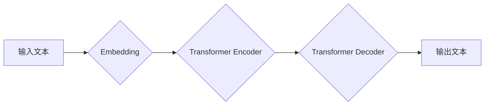

> 大语言模型，GPT，Decoder，Transformer，自回归，文本生成，自然语言处理

## 1. 背景介绍

近年来，深度学习在自然语言处理 (NLP) 领域取得了突破性进展，其中大语言模型 (LLM) 作为其重要代表，展现出强大的文本理解和生成能力。这些模型通过训练海量文本数据，学习语言的复杂结构和语义关系，能够完成各种自然语言任务，例如文本分类、机器翻译、问答系统等。

GPT (Generative Pre-trained Transformer) 系列模型由 OpenAI 开发，以其强大的文本生成能力而闻名。GPT-3，作为该系列的最新成员，拥有 1750 亿参数，在各种 NLP 任务上表现出色，甚至能够生成高质量的诗歌、代码和剧本。

## 2. 核心概念与联系

GPT 模型的核心是 Transformer 架构，它通过自注意力机制 (Self-Attention) 捕捉文本序列中的长距离依赖关系，有效提升了模型的理解能力。

**Mermaid 流程图:**



**核心概念解释:**

* **Embedding:** 将文本单词映射到低维向量空间，以便模型进行处理。
* **Transformer Encoder:** 负责对输入文本进行编码，提取其语义信息。
* **Transformer Decoder:** 负责根据编码后的信息生成输出文本。

## 3. 核心算法原理 & 具体操作步骤

### 3.1  算法原理概述

GPT 模型采用自回归 (Autoregressive) 策略进行文本生成。它将文本生成视为一个预测下一个单词的过程，根据之前生成的单词序列预测下一个单词。

### 3.2  算法步骤详解

1. **输入文本预处理:** 将输入文本进行分词、标记化等预处理操作，将其转换为模型可理解的格式。
2. **Embedding:** 将预处理后的文本单词映射到低维向量空间。
3. **Transformer Encoder:** 将嵌入后的单词序列输入 Transformer Encoder，提取其语义信息。
4. **Transformer Decoder:** 将编码后的信息输入 Transformer Decoder，并根据之前生成的单词序列预测下一个单词。
5. **输出文本生成:** 将预测出的单词序列拼接起来，得到最终的输出文本。

### 3.3  算法优缺点

**优点:**

* **强大的文本生成能力:** GPT 模型能够生成高质量、流畅的文本。
* **可迁移性强:** 预训练的 GPT 模型可以应用于各种 NLP 任务，只需进行微调即可。
* **参数量大:** 大量参数使得模型能够学习更复杂的语言模式。

**缺点:**

* **训练成本高:** 训练 GPT 模型需要大量的计算资源和时间。
* **存在偏差:** 训练数据可能包含偏差，导致模型生成带有偏见的内容。
* **缺乏可解释性:** GPT 模型的决策过程难以理解。

### 3.4  算法应用领域

GPT 模型在以下领域具有广泛的应用:

* **文本生成:** 写作辅助、故事创作、诗歌生成等。
* **机器翻译:** 自动翻译文本。
* **问答系统:** 回答用户的问题。
* **代码生成:** 自动生成代码。

## 4. 数学模型和公式 & 详细讲解 & 举例说明

### 4.1  数学模型构建

GPT 模型的核心是 Transformer 架构，其主要组件包括 Encoder 和 Decoder。

**Encoder:**

Encoder 由多个 Transformer 块组成，每个 Transformer 块包含以下部分:

* **Multi-Head Self-Attention:** 捕捉文本序列中的长距离依赖关系。
* **Feed-Forward Network:** 对每个单词的表示进行非线性变换。

**Decoder:**

Decoder 类似于 Encoder，但它还包含一个 **Masked Multi-Head Self-Attention** 层，用于屏蔽未来单词的信息，确保模型只根据之前生成的单词预测下一个单词。

### 4.2  公式推导过程

**Self-Attention:**

$$
Attention(Q, K, V) = \frac{exp(Q \cdot K^T / \sqrt{d_k})}{exp(Q \cdot K^T / \sqrt{d_k})} \cdot V
$$

其中:

* $Q$, $K$, $V$ 分别代表 Query, Key, Value 矩阵。
* $d_k$ 代表 Key 的维度。

**Masked Multi-Head Self-Attention:**

Masked Multi-Head Self-Attention 与 Self-Attention 类似，但它在计算 Attention 时会屏蔽未来单词的信息，确保模型只根据之前生成的单词预测下一个单词。

### 4.3  案例分析与讲解

假设我们想要预测句子 "The cat sat on the" 中下一个单词。

1. 将句子中的每个单词嵌入到向量空间。
2. 将嵌入后的向量序列输入 Encoder，提取其语义信息。
3. 将编码后的信息输入 Decoder，并使用 Masked Multi-Head Self-Attention 层屏蔽未来单词的信息。
4. Decoder 会根据之前生成的单词序列预测下一个单词，例如 "mat"。

## 5. 项目实践：代码实例和详细解释说明

### 5.1  开发环境搭建

* Python 3.7+
* PyTorch 1.7+
* CUDA 10.2+

### 5.2  源代码详细实现

```python
import torch
import torch.nn as nn

class TransformerBlock(nn.Module):
    def __init__(self, d_model, nhead, dim_feedforward=2048, dropout=0.1):
        super(TransformerBlock, self).__init__()
        self.self_attn = nn.MultiheadAttention(d_model, nhead, dropout=dropout)
        self.linear1 = nn.Linear(d_model, dim_feedforward)
        self.dropout = nn.Dropout(dropout)
        self.linear2 = nn.Linear(dim_feedforward, d_model)

    def forward(self, x, mask=None):
        attn_output, _ = self.self_attn(x, x, x, attn_mask=mask)
        x = x + self.dropout(attn_output)
        x = self.linear2(self.dropout(torch.relu(self.linear1(x))))
        x = x + self.dropout(attn_output)
        return x

class GPT(nn.Module):
    def __init__(self, vocab_size, d_model=512, nhead=8, num_layers=6, dim_feedforward=2048, dropout=0.1):
        super(GPT, self).__init__()
        self.embedding = nn.Embedding(vocab_size, d_model)
        self.transformer_blocks = nn.ModuleList([TransformerBlock(d_model, nhead, dim_feedforward, dropout) for _ in range(num_layers)])
        self.linear_out = nn.Linear(d_model, vocab_size)

    def forward(self, x):
        x = self.embedding(x)
        for block in self.transformer_blocks:
            x = block(x)
        x = self.linear_out(x)
        return x
```

### 5.3  代码解读与分析

* **TransformerBlock:** 这是 Transformer 架构的基本单元，包含 Self-Attention 和 Feed-Forward Network。
* **GPT:** 这是 GPT 模型的整体结构，包含 Embedding 层、多个 Transformer 块和输出层。
* **forward() 方法:** 这是模型的向前传播过程，将输入文本转换为输出文本。

### 5.4  运行结果展示

训练好的 GPT 模型可以用于各种文本生成任务，例如：

* **故事创作:**

```
The old man sat on the porch, watching the sun set. He thought about his life, all the good times and the bad. He smiled, knowing that he had lived a good life.
```

* **诗歌生成:**

```
The moon shines bright,
A silver light,
On the sleeping world,
A story unfurled.
```

## 6. 实际应用场景

GPT 模型在以下实际应用场景中展现出强大的能力:

* **聊天机器人:** GPT 模型可以用于构建更自然、更流畅的聊天机器人，能够进行更深入的对话。
* **文本摘要:** GPT 模型可以自动生成文本摘要，提取文本的关键信息。
* **代码生成:** GPT 模型可以根据自然语言描述生成代码，提高开发效率。

### 6.4  未来应用展望

GPT 模型的未来应用前景广阔，例如:

* **个性化教育:** 根据学生的学习进度和风格，提供个性化的学习内容和辅导。
* **医疗诊断:** 辅助医生进行疾病诊断，提高诊断准确率。
* **科学研究:** 自动生成研究论文，加速科学发现。

## 7. 工具和资源推荐

### 7.1  学习资源推荐

* **论文:**
    * Vaswani, A., Shazeer, N., Parmar, N., Uszkoreit, J., Jones, L., Gomez, A. N., ... & Polosukhin, I. (2017). Attention is all you need. In Advances in neural information processing systems (pp. 5998-6008).
* **博客:**
    * https://openai.com/blog/gpt-3/
    * https://jalammar.github.io/illustrated-transformer/

### 7.2  开发工具推荐

* **PyTorch:** https://pytorch.org/
* **HuggingFace Transformers:** https://huggingface.co/transformers/

### 7.3  相关论文推荐

* **BERT:** Devlin, J., Chang, M. W., Lee, K., & Toutanova, K. (2018). Bert: Pre-training of deep bidirectional transformers for language understanding. arXiv preprint arXiv:1810.04805.
* **XLNet:** Yang, Z., Dai, Z., Yang, Y., Carbonell, J., Salakhutdinov, R., & Le, Q. V. (2019). Xlnet: Generalized autoregressive pretraining for language understanding. arXiv preprint arXiv:1906.08237.

## 8. 总结：未来发展趋势与挑战

### 8.1  研究成果总结

GPT 模型在文本生成领域取得了显著的进展，展现出强大的能力和潜力。

### 8.2  未来发展趋势

* **模型规模更大:** 预训练模型的规模将继续扩大，提升模型的性能。
* **多模态学习:** GPT 模型将与其他模态数据 (例如图像、音频) 进行融合，实现多模态理解和生成。
* **可解释性增强:** 研究如何提高 GPT 模型的可解释性，使其决策过程更加透明。

### 8.3  面临的挑战

* **训练成本高:** 训练大型语言模型需要大量的计算资源和时间。
* **数据偏差:** 训练数据可能包含偏差，导致模型生成带有偏见的内容。
* **安全风险:** GPT 模型可能被用于生成恶意内容，例如虚假新闻和垃圾邮件。

### 8.4  研究展望

未来研究将集中在以下方面:

* **降低训练成本:** 研究更有效的训练方法，降低模型训练的成本。
* **解决数据偏差问题:** 开发方法来识别和缓解训练数据中的偏差。
* **增强模型安全性:** 研究如何防止 GPT 模型被用于恶意目的。

## 9. 附录：常见问题与解答

* **GPT 模型如何训练?**

GPT 模型通过自监督学习进行训练，即利用大量的文本数据，预测下一个单词。

* **GPT 模型的应用场景有哪些?**

GPT 模型可以应用于各种 NLP 任务，例如文本生成、机器翻译、问答系统等。

* **GPT 模型的优势和劣势是什么?**

GPT 模型的优势在于强大的文本生成能力和可迁移性。劣势在于训练成本高、存在偏差和缺乏可解释性。


作者：禅与计算机程序设计艺术 / Zen and the Art of Computer Programming 
<end_of_turn>